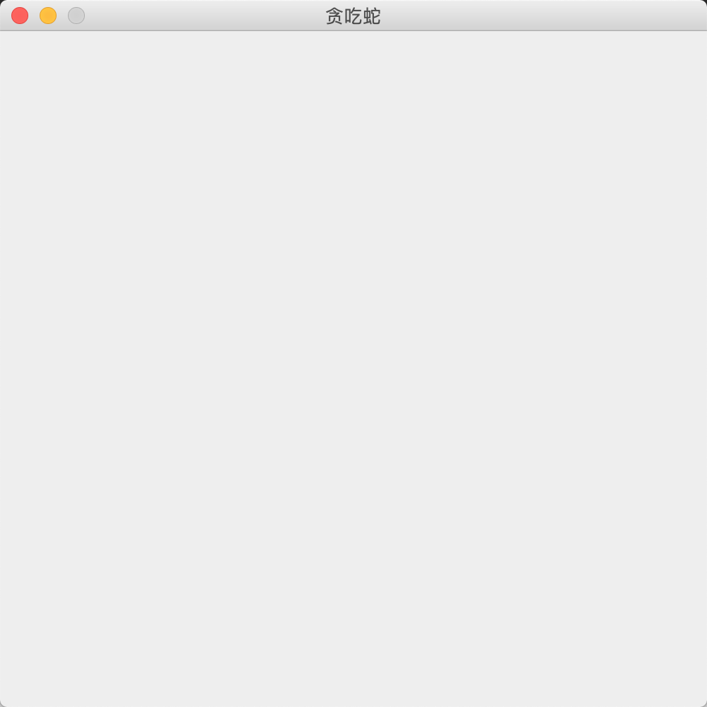
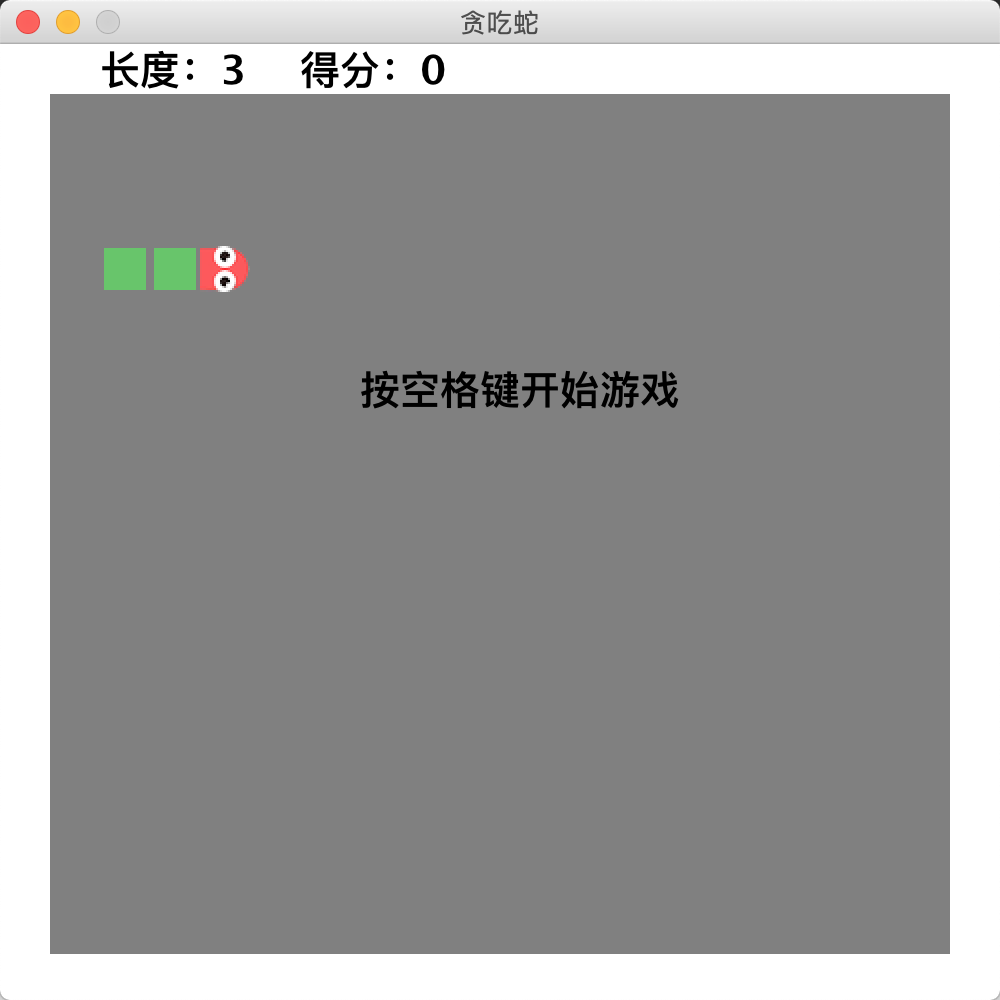
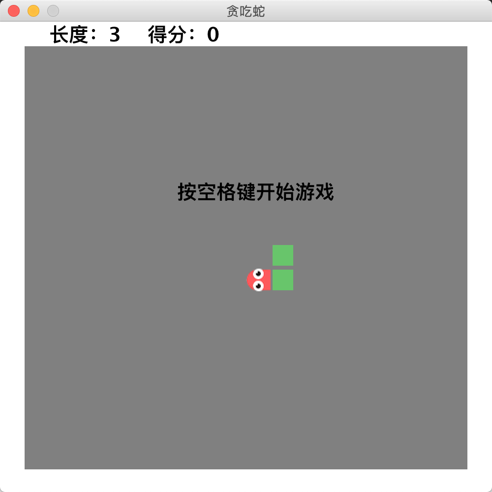
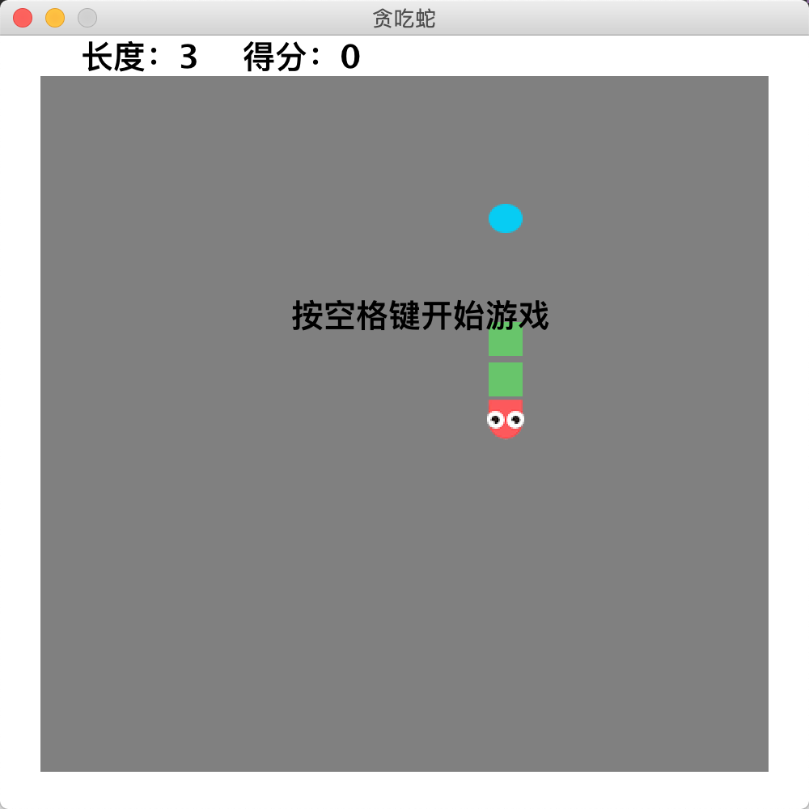
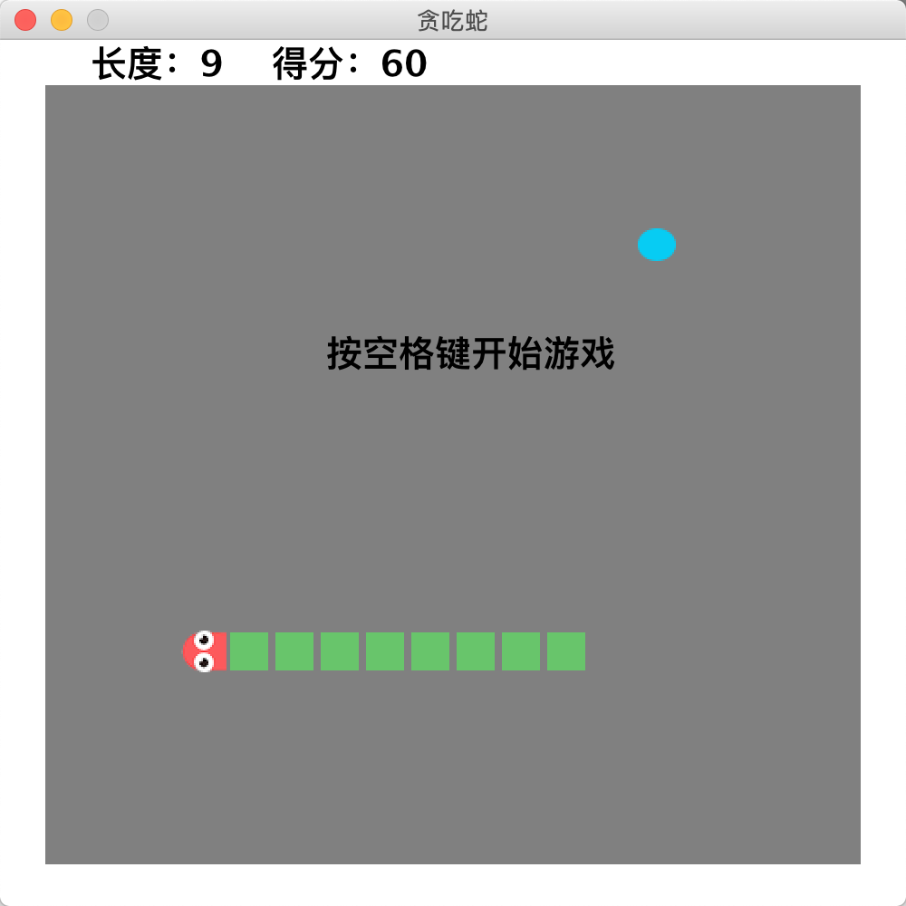

# 贪吃蛇

author：尚硅谷

***

## 1、写一个界面

创建一个500*500大小的游戏界面，这里使用JFrame类实现，窗口设置居中。实现代码如下：

```java
package com.snake;
import javax.swing.*;

/**
 * 创建游戏窗口，在窗口中添加一个游戏面板
 */
public class StartGame {
    public static void main(String[] args){
        //建立游戏窗口
        //标题
        JFrame frame = new JFrame("贪吃蛇小游戏");
        //窗体大小
        frame.setSize(500,500);
        //窗口显示屏幕中间
        frame.setLocationRelativeTo(null);
        //固定窗口大小
        frame.setResizable(false);
        //设置窗体关闭事件
        frame.setDefaultCloseOperation(JFrame.EXIT_ON_CLOSE);
        //设置窗体可见
        frame.setVisible(true);
    }
}

```

运行效果如下图所示



## 2、创建贪吃蛇行进方向枚举类型

贪吃蛇总共包含四个方向，分别是上下左右，使用U，D，L，R表示，代码如下所示

```java
package com.snake;

public enum Dir {
    /**
     * L:向左
     * U:向上
     * R:向右
     * D:向下
     */
    L, U, R, D
}
```

## 3、加载静态资源

游戏需要加载贪吃蛇的蛇头和蛇身，用不同的图片表示，蛇头又需要四个方向的蛇头，故总共需要五张图片如下所示

蛇头向上


蛇头向下


蛇头向左


蛇头向右


蛇身


通过URL类代表了一个统一的定位符，getResource表示获取Java文件，使用位于javax.swing包中的ImageIcon类，可以根据image绘制icon

静态资源加载如下所示

```java
package com.snake;

import javax.swing.*;
import java.net.URL;

/**
 * 连接静态资源文件夹
 */
public class Data {
    //URL类代表了一个统一的定位符，getResource表示获取Java文件
    //ImageIcon位于javax.swing包中，可以根据image绘制icon
    //贪吃蛇头部
    public static URL upUrl = Data.class.getResource("/statics/up.png");
    public static ImageIcon up = new ImageIcon(upUrl);
    public static URL downUrl = Data.class.getResource("/statics/down.png");
    public static ImageIcon down = new ImageIcon(downUrl);
    public static URL leftUrl = Data.class.getResource("/statics/left.png");
    public static ImageIcon left = new ImageIcon(leftUrl);
    public static URL rightUrl = Data.class.getResource("/statics/right.png");
    public static ImageIcon right = new ImageIcon(rightUrl);
    //贪吃蛇的身体
    public static URL bodyUrl = Data.class.getResource("/statics/body.png");
    public static ImageIcon body = new ImageIcon(bodyUrl);
    //food
    public static URL foodUrl = Data.class.getResource("/statics/food.png");
    public static ImageIcon food = new ImageIcon(foodUrl);
}
```

## 4、创建食物类

食物要随机生成，包含食物也需要一张图片来表示食物，图片如下


```java
public class Food {
    //所在的位置
    public static int X;
    public static int Y;
}
```


## 4、画蛇

### 4.1 创建游戏面板类

创建SnakePanel类，继承JPanel类，用于实现游戏面板，实现KeyListener, ActionListener两个接口，KeyListener用于接收键盘事件（击键）的侦听器接口，ActionListener用于接收操作事件的侦听器接口


#### （1）定义需要的变量

```java
	package com.snake;

import javax.swing.*;
import java.awt.*;
import java.awt.event.ActionEvent;
import java.awt.event.ActionListener;
import java.awt.event.KeyEvent;
import java.awt.event.KeyListener;

public class GamePanel extends JPanel implements KeyListener, ActionListener {
    /**
     * 用数组元素的移动来表示贪吃蛇的移动，这里也可以使用链表来实现，
     * 因为每个位置需要横坐标和纵坐标来表示，定义两个数组，但是也限制了贪吃蛇的最大长度
     */
    public static int[]snakeX = new int[100];
    public static int[]snakeY = new int[100];
    //贪吃蛇的长度
    public static int length;
    //食物的纵横坐标
    int foodX;
    int foodY;
    //贪吃蛇头的方向
    Dir directory;
    int score;//积分
     //Timer定时器
     Timer timer = new Timer(200,this);
    /**
     * 游戏是否开始
     */
    boolean isStart;
    /**
     * 表示游戏是否失败
     */
    boolean isFail;
    @Override
    public void actionPerformed(ActionEvent e) {
    }
    @Override
    public void keyTyped(KeyEvent e) {
    }
    @Override
    public void keyPressed(KeyEvent e) { 
    }
    @Override
    public void keyReleased(KeyEvent e) {
    }
}

```

#### （2）游戏初始化

游戏初始化方法定义为init()方法，设置初始舍身长度为3，其中蛇头是1，蛇身长度为2。蛇头的初始位置是[100，100]，第一个蛇身的初始位置是[100,75]，第二个蛇身的位置是[100，50]。这样我们也规定了每个蛇身之间的距离就是25。初始化蛇头的方向是向右，初始化不开始游戏，初始化游戏没有失败，分数初始化为0。代码如下所示。

```java
 //初始化小蛇的位置
    private void init(){
        //初始化蛇身长度为3，每个蛇身之间的距离是25
        length = 3;
        //蛇头的位置是[100,100]
        snakeX[0] = 100;
        snakeY[0] = 100;
        //第一个蛇身的位置是[75,100]
        snakeX[1] = 75;
        snakeY[1] = 100;
        //第二个蛇身的位置是【50，100】
        snakeX[2] = 50;
        snakeY[2] = 100;
        //初始化蛇头方向向右
        directory = Dir.R;
        //初始化不开始游戏
        isStart = false;
        //初始化游戏没有失败
        isFail = false;
        //分数初始化为0
        score = 0;
    }
```

#### （3）绘制游戏面板paintComponent方法重写

这个方法需要手动去重写。paintComponent()是swing的一个方法，相当于图形版的main()方法，是会自执行的。如果一个class中有构造函数，则执行顺序是先执行构造函数，再执行这个方法，所以在整个类当中找不到主动调用paintComponent方法的地方。

```java
 @Override
    protected void paintComponent(Graphics graphics) {
        super.paintComponent(graphics);
        //设置背景板为白色
        this.setBackground(Color.white);
        //绘制游戏区域
        graphics.setColor(Color.GRAY);
        //x:表示距离Jframe边框的横向距离，y表示距离Jframe边框的纵向距离开始绘制宽为450，高为430的内部框，也就是说游戏面板大小为450*430
        graphics.fillRect(25,25,450,430);
        //画贪吃蛇的头部
        if (directory==Dir.R){
            Data.right.paintIcon(this,graphics, snakeX[0], snakeY[0]);
        }else if (directory==Dir.L){
            Data.left.paintIcon(this,graphics, snakeX[0], snakeY[0]);
        }
        if (directory==Dir.U){
            Data.up.paintIcon(this,graphics, snakeX[0], snakeY[0]);
        }else if (directory==Dir.D){
            Data.down.paintIcon(this,graphics, snakeX[0], snakeY[0]);
        }

        //画身体
        for (int i = 1; i< length; i++){
            Data.body.paintIcon(this,graphics, snakeX[i], snakeY[i]);
        }
        //绘制积分栏
        graphics.setColor(Color.BLACK);
        graphics.setFont(new Font("幼圆",Font.BOLD,20));
        graphics.drawString("长度："+ length,50,20);
        graphics.drawString("得分："+score,150,20);
        //游戏开始提醒
        if (isStart == false){
            graphics.setColor(Color.black);
            graphics.setFont(new Font("幼圆",Font.BOLD,20));
            graphics.drawString("按空格键开始游戏",180,180);
        }
        //失败判断
        if (isFail){
            graphics.setColor(Color.RED);
            graphics.setFont(new Font("幼圆",Font.BOLD,20));
            graphics.drawString("游戏失败，按空格键重新开始",180,180);
        }
    }
```

#### （4）编写构造方法，如下所示

```java
 //构造函数
    public SnakePanel() {
    		//执行初始化
        init();
    }
```

在界面StartGame类中的main方法中加入下面的代码，表示在frame面板中加入游戏面板

```java
 //添加游戏内容
frame.add(new SnakePanel());
```

整体代码如下所示

```java
public static void main(String[] args){
        //建立游戏窗口
        //标题
        JFrame frame = new JFrame("贪吃蛇");
        //窗体大小
        frame.setSize(500,500);
        //窗口显示屏幕中间
        frame.setLocationRelativeTo(null);
        //固定窗口大小
        frame.setResizable(false);
        //设置窗体关闭事件
        frame.setDefaultCloseOperation(JFrame.EXIT_ON_CLOSE);
        //添加游戏内容
				frame.add(new SnakePanel());
        //设置窗体可见
        frame.setVisible(true);
    }
```

执行结果如下所示



#### （5）重写keyPressed方法

该方法会监听键盘的响应而执行。在keyPressed方法中的逻辑是，如果键盘点击空格键，那么可以暂停游戏，也可以开始游戏。点击向上的方向键，表示蛇头向上转向，其他同理

代码如下所示

```java
    @Override
    public void keyPressed(KeyEvent e) {
        //获取按下的按键
        int keyCode = e.getKeyCode();
        switch (keyCode){
            case KeyEvent.VK_SPACE:
                //按键为空格，如果游戏失败，重新开始游戏，否则暂停游戏
                if (isFail){
                    isFail = false;
                    //重新开始游戏
                    init();
                }else {
                    isStart = !isStart;
                }
                repaint();
                break;
            case KeyEvent.VK_LEFT:
                //当按键为左的时候，只要前进方向不是右，即可转向
                if (directory!=Dir.R){
                    directory = Dir.L;
                }
                break;
            case KeyEvent.VK_RIGHT:
                // 当按键为"右"的时候，只要前进方向不是"左",就可以转向
                if (directory!=Dir.L){
                    directory = Dir.R;
                }
                break;
            case KeyEvent.VK_UP:
                // 当按键为"上"，只要前进方向不是"下"，就可以转向
                if (directory!=Dir.D){
                    directory = Dir.U;
                }
                break;
            case KeyEvent.VK_DOWN:
                //当按键为"下"的时候，只要前进方向不是"上",就可以转向
                if (directory!=Dir.U){
                    directory = Dir.D;
                }
                break;
        }
    }
```

重写完上面的方法之后，小蛇并不会移动，因为还没有重写小蛇移动的逻辑，需要重写actionPerformed方法

#### （5）重写actionPerformed方法

actionPerformed()方法及paintComponent()方法都是在事件分派Swing线程中被调用，该方法也会自动调用，不需要手动调用

该方法的中的逻辑

1. 首先判断游戏状态，如果游戏开始并且没有失败，则移动小蛇

2. 移动小蛇只需要只需要将数组中的元素向后移动一位即可，蛇头元素坐标针对方向的不同做不同的运算，比如向右移动，则蛇头横坐标加25，纵坐标不变
3. 移动蛇头的时候要注意边界处理，比如横坐标超过了游戏面板规定的450，则直接游戏按失败处理
4. 如果蛇头的下一个坐标和蛇身某一个坐标重合，则按失败处理

```java
@Override
    public void actionPerformed(ActionEvent e) {
        //判断游戏状态
        if(isStart&&!isFail) {
            //吃食物
            if (snakeX[0] == foodX && snakeY[0] == foodY) {
                length++;
                score += 10;
                Food.getFood(snakeX,snakeY);
                foodX = Food.X;
                foodY = Food.Y;
            }
            //小蛇移动，只需要将数组中的元素向后移动一位即可
            for (int i = length - 1; i > 0; i--) {
                snakeX[i] = snakeX[i - 1];
                snakeY[i] = snakeY[i - 1];
            }
            //移动头部
            if (directory == Dir.R) {
                snakeX[0] += 25;
                //判断边界
                if (snakeX[0] > 450) {
                    isFail = true;
                }
            } else if (directory == Dir.L) {
                snakeX[0] -= 25;
                //判断边界
                if (snakeX[0] < 25) {
                    isFail = true;
                }
            } else if (directory == Dir.U) {
                snakeY[0] -= 25;
                //判断边界
                if (snakeY[0] < 25) {
                    isFail = true;
                }
            } else if (directory == Dir.D) {
                snakeY[0] += 25;
                //判断边界
                if (snakeY[0] > 430) {
                    isFail = true;
                }
            }
            //死亡判定
            for (int i = 1; i < length; i++) {
                if (snakeX[0] == snakeX[i] && snakeY[0] == snakeY[i]) {
                    isFail = true;
                }
            }
            repaint();
        }
        timer.start();
    }
```

在构造方法中需要获取游戏面板焦点，代码如下所示

```java
public GamePanel() {
        init();
        this.setFocusable(true);
        this.addKeyListener(this);
    }
```

此时可以根据方向键来控制小蛇的移动方向了，如下所示



#### （6）小蛇吃食物

食物需要自动随机生成，而且食物不能与小蛇所在的坐标重合，在食物类中获取食物坐标的代码如下所示

```java
		private static Random  random = new Random();
    public static void getFood(int[] snakeX,int[] snakeY ) {
        X = 25+25*random.nextInt(17);
        Y = 25+25*random.nextInt(16);
        for (int i = 0;i<SnakePanel.length;i++){
            if (snakeX[i]==X && snakeY[i]==Y){
                X = 25+25*random.nextInt(17);
                Y = 25+25*random.nextInt(16);
                //为了避免再次随机生成的位置和蛇身重合，将i重设为0，重新判断
                i = 0;
            }
        }
    }
```

在初始化小蛇的时候初始化食物的坐标，添加如下代码

```java
Food.getFood(snakeX,snakeY);
foodX = Food.X;
foodY = Food.Y;
```

整体代码如下所示

```java
private void init(){
        length = 3;
        snakeX[0] = 100;
        snakeY[0] = 100;
        snakeX[1] = 75;
        snakeY[1] = 100;
        snakeX[2] = 50;
        snakeY[2] = 100;
        directory = Dir.R;
        Food.getFood(snakeX,snakeY);
        foodX = Food.X;
        foodY = Food.Y;
        isStart = false;
        isFail = false;
        timer.start();
    }
```

在paintComponent方法中添加绘制食物的方法

```java
//画食物
Data.food.paintIcon(this,graphics,foodX,foodY);
```

运行结果如下



但是小蛇经过的时候并没有吃食物，而是直接穿过去了，下面添加小蛇吃食物的逻辑，重写actionPerformed方法

逻辑如下，当蛇头的坐标和食物的坐标重合的时候，蛇身长度加1，分数加10，再次重新获取新的食物的坐标

```java
//吃食物
if (snakeX[0] == foodX && snakeY[0] == foodY) {
     length++;
     score += 10;
     Food.getFood(snakeX,snakeY);
     foodX = Food.X;
     foodY = Food.Y;
   }
```

整体运行结果如下

