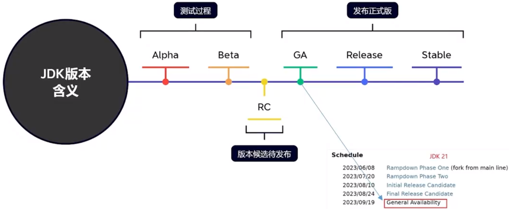
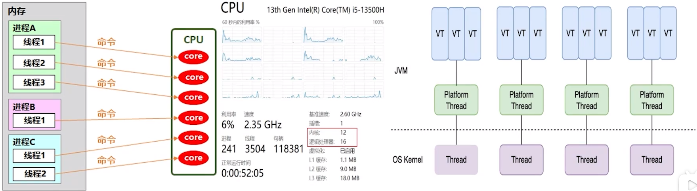
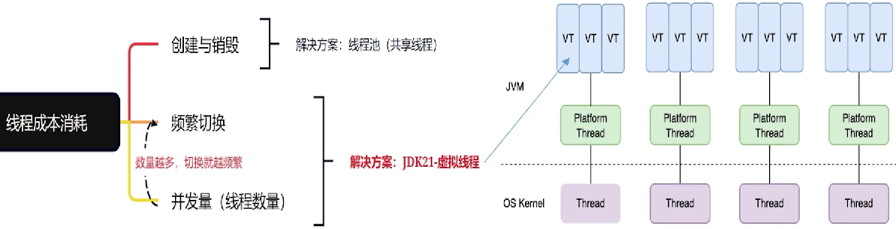
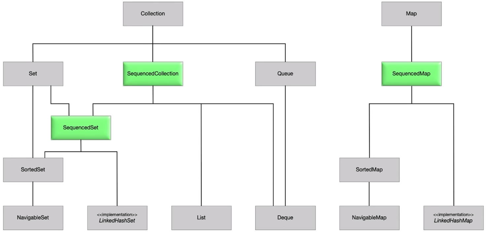

## JDK各种版本含义



## JDK21新功能

### 1. Virtual Threads（虚拟线程）
提供了一种更高效、更轻量级的线程模型。


价值和优点：


代码层面兼容性极好，基本和原来的线程池是一样的。
```java
try (var executor = Executors.newVirtualThreadPerTaskExecutor()) {
    IntStream.range(0, 10_000).forEach(i -> {
        executor.submit(() -> {
            Thread.sleep(Duration.ofSeconds(1));
            return i;
        });
    });
} // executor.close() is called implicitly, and waits
```

### 2. Sequenced Collections（有序集合）
“生活只能倒着理解；但它必须向前生活。”——克尔凯郭尔

Java的集合框架缺少表示具有已定义顺序的元素序列。它也缺少一个适用于此类集合的统一操作集。这些一直是问题和抱怨的反复来源。

| -             | First element                   | Last element              |
| ------------- | ------------------------------- | ------------------------- |
| List          | list.get(0)                     | list.get(list.size() - 1) |
| Deque         | deque.getFirst()                | deque.getLast()           |
| SortedSet     | sortedSet.first()               | sortedSet.last()          |
| LinkedHashSet | linkedHashSet.iterator().next() | //missing                 |

```java
interface SequencedCollection<E> extends Collection<E> {
    // new method
    SequencedCollection<E> reversed();
    // methods promoted from Deque
    void addFirst(E e);
    void addLast(E e);
    E getFirst();
    E getLast();
    E removeFirst();
    E removeLast();
}
```



### 3. Deprecate the Windows 32-bit x86 Port for Removal
弃用 要删除的32位Windows

### 4. Prepare to Disallow the Dynamic Loading of Agents
- 将代理动态加载到正在运行的JVM中时发出警告。这些警告旨在让用户为将来的版本做好准备，该版本默认情况下不允许动态加载代理，以提高默认情况下的完整性。

- 动态加载代理允许开发人员在运行时修改和监视Java应用程序的行为。虽然这对于调试和性能分析等方面非常有用，但也存在潜在的安全风险。恶意代码可能会利用动态加载代理的功能来执行恶意操作，例如窃取敏感信息、篡改数据等。因此，为了加强Java应用程序的安全性，限制动态加载代理的使用是很有必要的。

### 5. Generational ZGC
- 通过扩展ZGC垃圾回收器来提高应用程序性能，区分年轻代和年老代分开垃圾回收。对于通过高频率的垃圾回收可以迅速释放JVM内存。从而提升性能。
- 为什么ZGC出了5年了才有分代收集？
  因为ZGC分代实现起来麻烦，所以先实现了一个比较简单可用的版本”。
  然后时隔5年才弄出了分代GC。5年啊，所以呢这个算法可想而知是多么复杂。

### 6. Pattern Matching for switch
Pattern Matching对比写法例子：
```java
// Prior to Java 21
static String formatter(Object obj){
    String formatted = "unknown";
    if (obj instanceof Integer i) {
        formatted = String.format("int %d", i);
    } else if (obj instanceof Long l) {
        formatted = String.format("long %d", l);
    } else if (obj instanceof Double d) {
        formatted = String.format("double %f", d);
    } else if (obj instanceof String s) {
        formatted = String.format("String %s", s);
    }
    return formatted;
}
```

```java
// As of Java 21
static String formatterPatternSwitch(Object obj){
    return switch (obj) {
        case Integer i -> String.format("int %d", i);
        case Long l -> String.format("long %d", l);
        case Double d -> String.format("double %f", d);
        case String s -> String.format("String %s", s);
        default -> obj.toString();
    };
}
```

```java
// Prior to Java 21
static void testFooBarOld(String s){
    if (s==null){
        System.out.println("Oops!");
        return;
    }
    switch (s){
        case "Foo", "Bar" -> System.out.println("Great");
        default -> System.out.println("Ok");
    }
}
```

```java
// As of Java 21
static void testFooBarNew(String s){
    switch (s){
        case null -> System.out.println("Oops!");
        case "Foo", "Bar" -> System.out.println("Great");
        default -> System.out.println("Ok");
    }
}
```

### 7. Record Patterns
Record Patterns的实现原理主要涉及两个方面：
- 记录类型
  记录类型是一种新的类声明形式，通过record关键字来定义。

- 模式匹配
  模式匹配是指根据给定的模式来匹配某个对象，并执行相应的操作。在Record Patterns中，我们可以使用instance of关键字和模式变量来进行模式匹配。具体地说，当我们使用Record Patterns进行模式匹配时，编译器会自动为记录类型生成一个模式匹配方法。这个方法接受一个对象作为参数并根据给定的模式进行匹配。如果匹配成功，则将字段值绑定到相应的模式变量中，从而可以在后续代码中使用。

Record类型使用例子：
```java
record Person(String name, int age) {}

public class Main {
    public static void main(String[] args) {
        Person p = new Person("Alice", 25);
        if (p instanceof Person person) {
            System.out.println(person.name());
            System.out.println(person.age());
        }
    }
}
```

Record Patterns:类型对比写法例子：
```java
// As of Java 16
record Point(int x, int y) {}

static void printSum(Object obj){
    if (obj instanceof Point p){
        int x = p.x();
        int y = p.y();
        System.out.println(x + y);
    }
}
```

```java
// As of Java 21
static void printSum(Object obj){
    if (obj instanceof Point(int x, int y)){
        System.out.println(x + y);
    }
}
```

### 8. Key Encapsulation Mechanism API
KEM(Key Encapsulation Mechanism)通常用于非对称密码学中的密钥交换过程，以安全地生成和交换共享密钥。
```java
// Receiver side
var kpg = KeyPairGenerator.getInstance("x25519");
var kp = kpg.generateKeyPair();

// Sender side
var kem1 = KEM.getInstance("DHKEM");
var sender = kem1.newEncapsulator(kp.getPublic());
var encapsulated = sender.encapsulate();
var k1 = encapsulated.key();

// Receiver side
var kem2 = KEM.getInstance("DHKEM");
var receiver = kem2.newDecapsulator(kp.getPrivate());
var k2 = receiver.decapsulate(encapsulated.encapsulation());

assert Arrays.equals(k1.getEncoded(), k2.getEncoded());
```

