# 第01章_Java语言概述

讲师：尚硅谷-宋红康（江湖人称：康师傅）

官网：[http://www.atguigu.com](http://www.atguigu.com/)

***

## 1. Java知识脉络图

### 1.1 Java基础全程脉络图

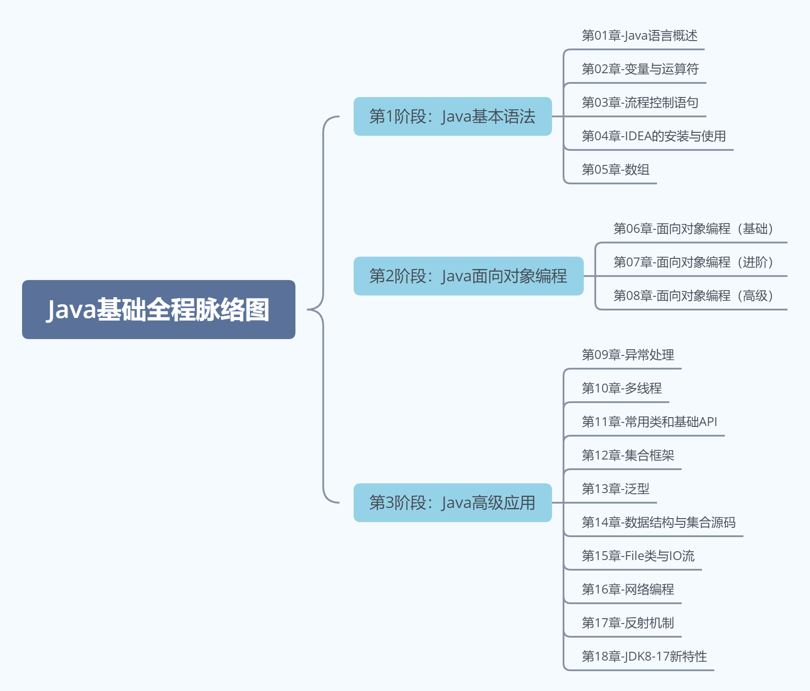

### 1.2 本章专题与脉络

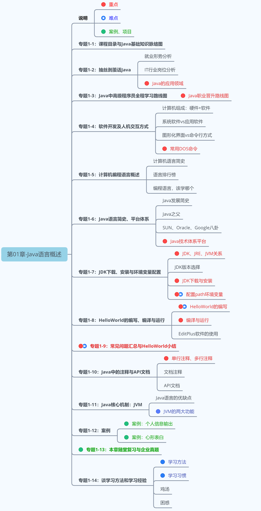

## 2. 抽丝剥茧话Java

### 2.1 当前大学生就业形势

- `麦可思研究院`发布了《**2022年中国大学生就业报告**》，针对2021届毕业生收入较高的本科专业排行榜：

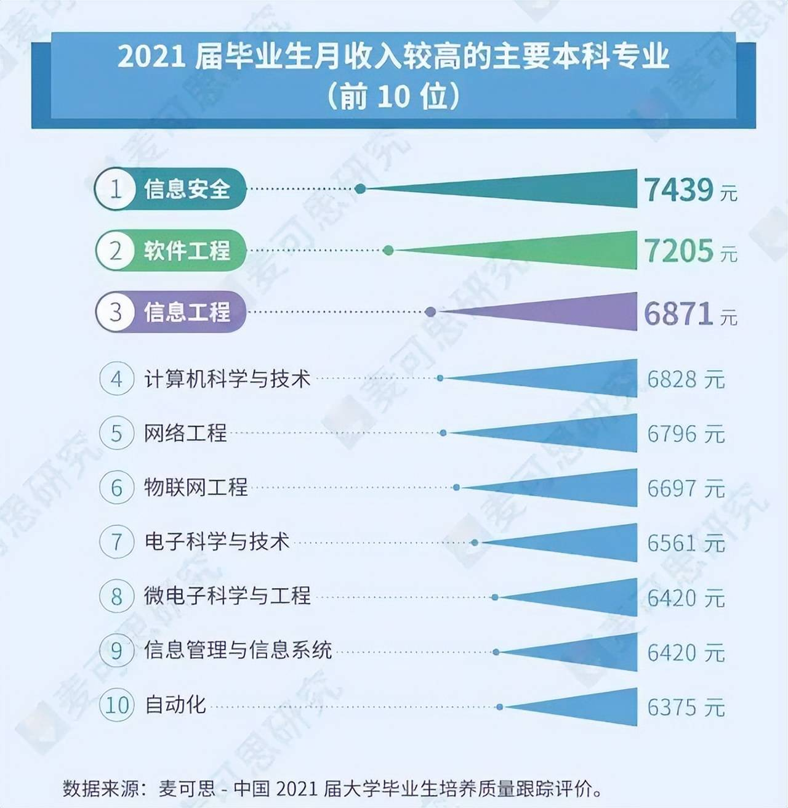

- `麦可思研究院`发布过《**2021年中国大学生就业报告**》，应届本科毕业生就业数量较大的前十位行业类的就业质量：

  

- 报告还对毕业三年后的2017届毕业生所在十大行业进行了统计：

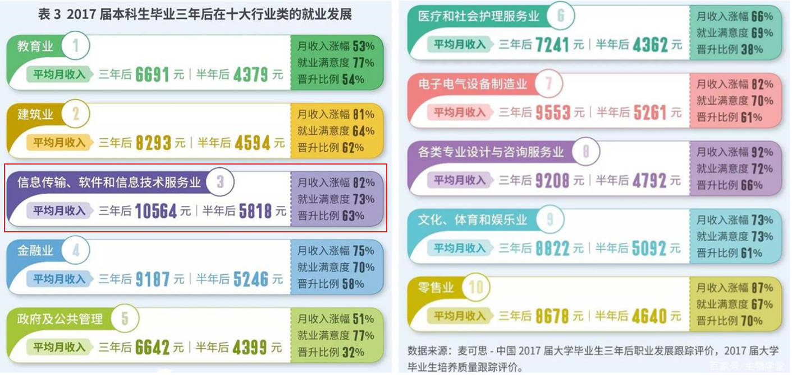

- 从国家统计局发布的2021年全国平均工资来看，不管在城镇非私营单位还是私营单位，`IT业均为最高`。

### 2.2 IT互联网是否依旧靠谱

过去不能代表未来！互联网是否依旧靠谱？！


> 2014 年至 2018 年间，我国网民规模从 6.49 亿增长为 8.29 亿，增幅为 `27.5%`。同一时间段，全国移动互联网接入的流量却从 20.6EB 增长到了 711.1EB，增幅达 `3352%`（获取和处理的信息量大幅增加）。 
>
> 随着 5G 技术进一步拓宽移动互联网的速度和容量，`产业互联网`将在消费型流量的基础上创造生产型流量，根据报告的预测，至 2024 年，全国移动互联网的接入流量将达到 127663.8EB， `流量规模达到2018年的179.5倍`。
>
> 当下，5G、物联网、人工智能、产业互联网都是国家政策大方向，需要大量`能与机器对话`的中高端人才。

### 2.3 IT行业岗位分析

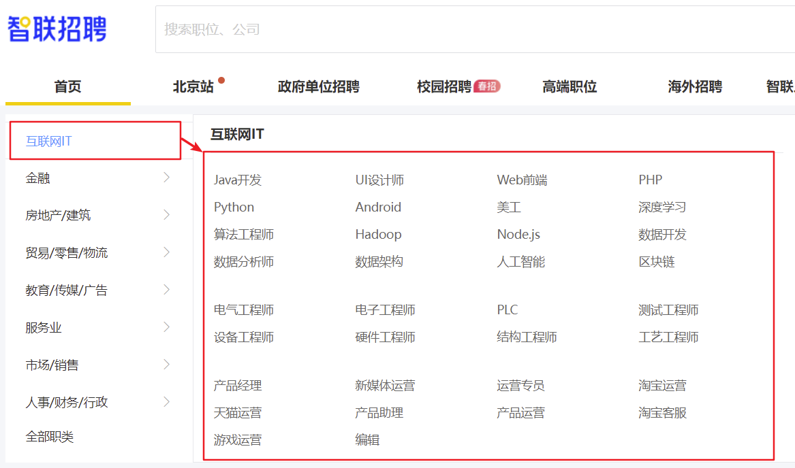

**软件开发，是进入互联网IT圈最好的选择之一！**

- 起始薪资高
- 工作环境好
- 涨薪幅度高
- 行业更公平

### 2.4 软件开发之Java开发


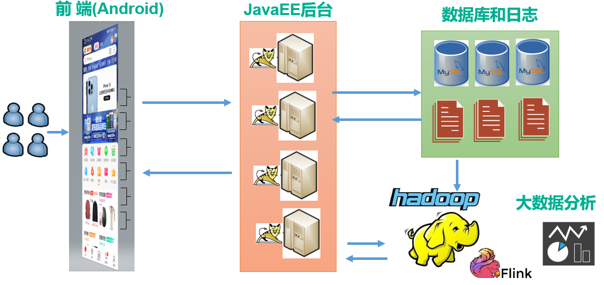

- **移动应用领域（集成Android平台）**：Java在Android端是主要开发的语言，占有重要的地位。

  

  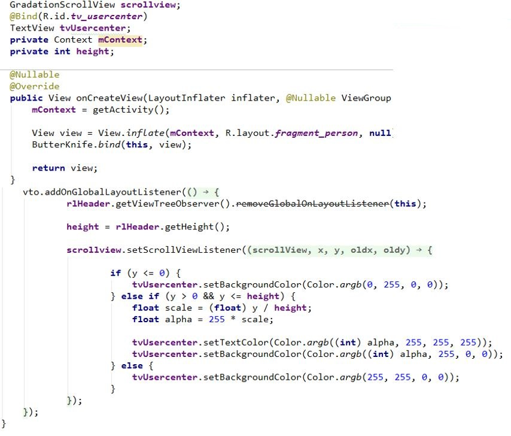

- **企业级应用领域（JavaEE后台）**：用来开发企业级的应用程序，大型网站如淘宝、京东、12306，以及各大物流、银行、金融、社交、医疗、交通、各种OA系统等都是用JavaEE技术开发的。

  

- **大数据分析、人工智能领域**：流行的大数据框架，如Hadoop、Flink都是用Java编写的。Spark使用Scala编写，但可以用Java开发应用。

  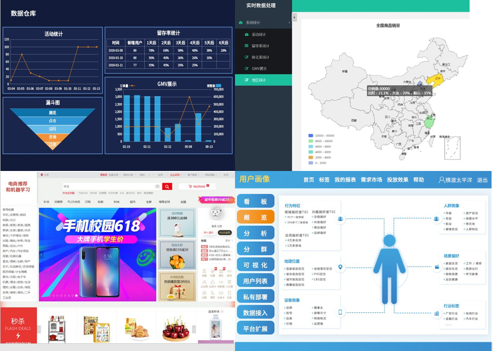

  

  > Eversoft公司在提到2022年Java发展趋势时写道：
  >
  > `Java 是用于开发大数据项目的最主流的语言`。我们可以轻松地预测它也将在之后继续`主导大数据`！
  
- **游戏领域、桌面应用、嵌入式领域：**很多大型游戏的后台、桌面应用等也是Java开发的。

### 2.5 到底多少人在用Java

> 2020年，根据 IDC 的报告“Java Turns 25”显示，超过 `900 万`名开发人员（全球专职开发人员中的 `69%`）在使用 Java——比其他任何语言都多。该报告指出，大多数企业业务服务都依靠 Java 来实现。
>
> ... Java 一直是开发人员中最流行的编程语言，被誉为“`宇宙第一语言`”。

> 我想告诉大家：
>
> “市场的需求比较大，市场的供给比较大”
>
> “如果你在Java领域里持续积累5-7年以上，那么你至少会成为这个行业的一个专家！”

### 2.6 八卦一下程序员

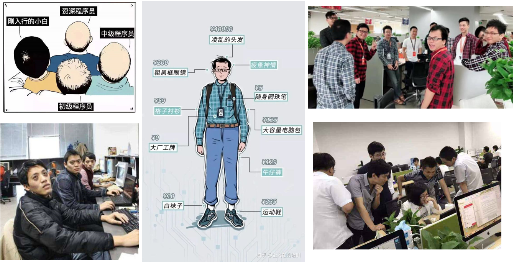

还可以是：


### 2.7 Java系列课程体系

- 见02_学习路线图之《Java中高级程序员全程学习路线图.xmind》

### 2.8 Java职业晋升路线图

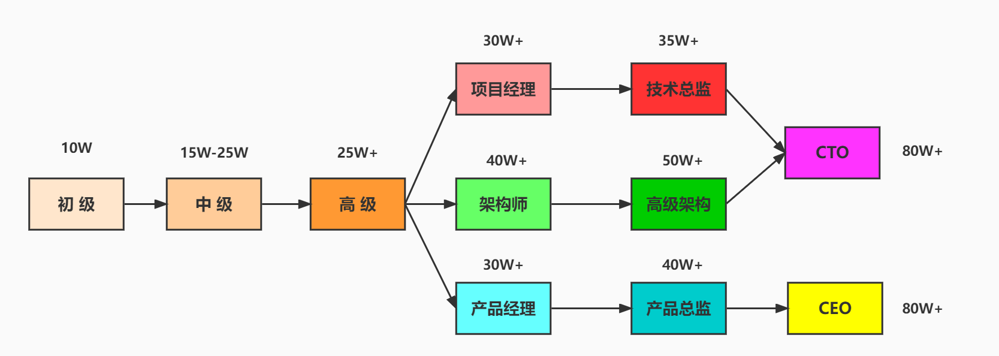

薪资数据统计来源：拉勾网

## 3. 计算机的硬件与软件

### 3.1 计算机组成：硬件+软件

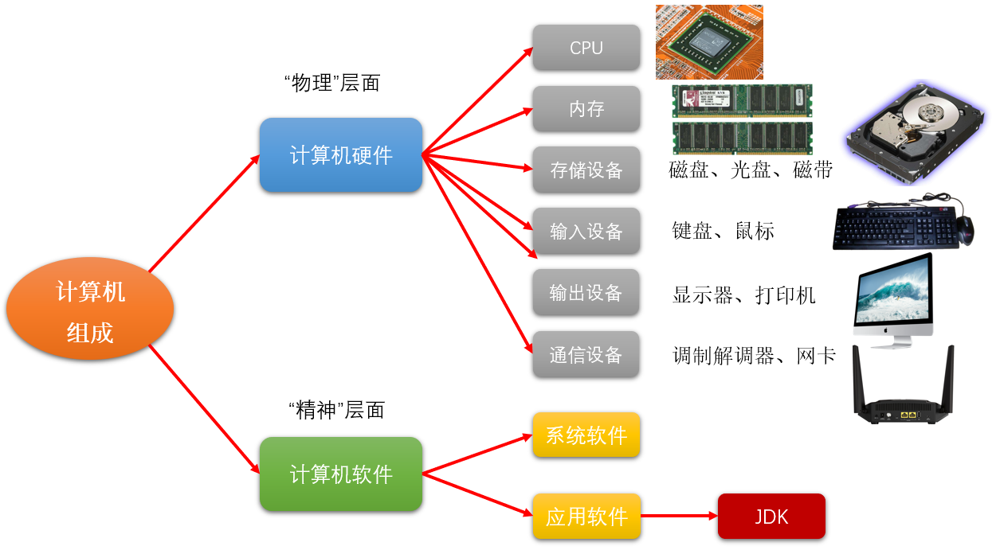

### 3.2 CPU、内存与硬盘

- **CPU（Central Processing Unit，中央处理器）**
  - 人靠大脑思考，电脑靠CPU来运算、控制。

- **硬盘（Hard Disk Drive）**
  - 计算机最主要的存储设备，容量大，断电数据不丢失。
  - 正常分类：`机械硬盘（HDD）`、`固态硬盘（SSD）`以及`混合硬盘（SSHD）`
  - 固态硬盘在开机速度和程序加载速度远远高于机械硬盘，缺点就是贵，所有无法完全取代机械硬盘。
- **内存（Memory）**
  - 负责硬盘上的数据与CPU之间数据交换处理
  - 具体的：保存从硬盘读取的数据，提供给CPU使用；保存CPU的一些临时执行结果，以便CPU下次使用或保存到硬盘。
  - 断电后数据丢失。

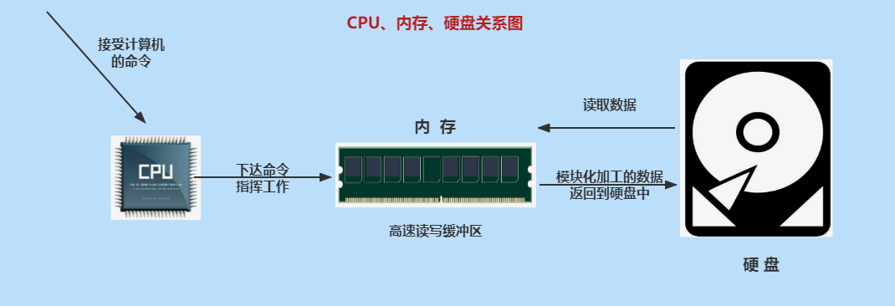

### 3.3 输入设备：键盘输入

- 熟悉指法

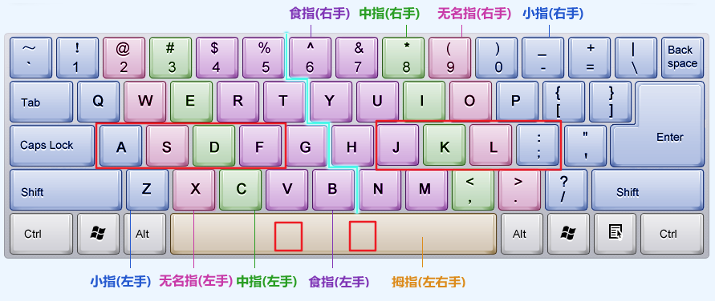

不熟悉键盘的小伙伴，可以“`金山打字通`”走起了。坚决杜绝`二指禅`！！


## 4. 软件相关介绍

### 4.1 什么是软件

软件，即一系列按照`特定顺序组织`的计算机`数据`和`指令`的集合。有**系统软件**和**应用软件**之分。

> Pascal之父Nicklaus Wirth： “Programs = Data Structures + Algorithms”

系统软件：


应用软件：

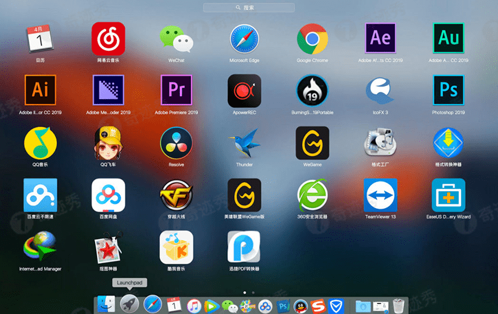

### 4.2 人机交互方式

- **图形化界面**（Graphical User Interface，GUI），这种方式简单直观，使用者易于接受，容易上手操作。

- **命令行方式**（Command Line Interface，CLI），需要在控制台输入特定的`指令`，让计算机完成一些操作。需要记忆一些指令，较为麻烦。

  

### 4.3 常用的DOS命令

DOS（Disk Operating System，磁盘操作系统）是Microsoft公司在Windows之前推出的一个操作系统，是单用户、单任务（即只能执行一个任务）的操作系统。现在被Windows系统取代。

对于Java初学者，学习一些DOS命令，会非常有帮助。

**进入DOS操作窗口：**

- 按下Windows+R键盘，打开运行窗口，输入cmd回车，进入到DOS的操作窗口。

  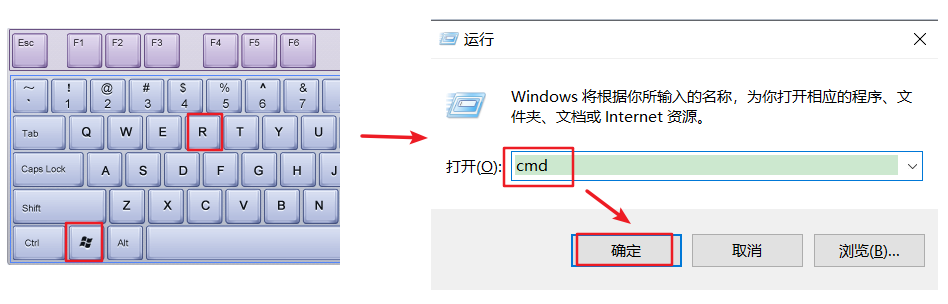

**常用指令：**

- `操作1：进入和回退`

| 操作                | 说明                                |
| ------------------- | ----------------------------------- |
| 盘符名称:           | 盘符切换。E:回车，表示切换到E盘。   |
| dir                 | 列出当前目录下的文件以及文件夹      |
| cd 目录             | 进入指定单级目录。                  |
| cd 目录1\目录2\\... | 进入指定多级目录。cd atguigu\JavaSE |
| cd ..               | 回退到上一级目录。                  |
| cd \ 或 cd /        | 回退到盘符目录。                    |

- `操作2：增、删`

| 操作          | 说明                                               |
| ------------- | -------------------------------------------------- |
| md 文件目录名 | 创建指定的文件目录。                               |
| rd 文件目录名 | 删除指定的文件目录（如文件目录内有数据，删除失败） |

- `操作3：其它`

| 操作              | 说明                 |
| ----------------- | -------------------- |
| cls               | 清屏。               |
| exit              | 退出命令提示符窗口。 |
| ←  →              | 移动光标             |
| ↑  ↓              | 调阅历史操作命令     |
| Delete和Backspace | 删除字符             |

## 5. 计算机编程语言

### 5.1 计算机语言是什么

- **语言**：是人与人之间用于沟通的一种方式。例如：中国人与中国人用普通话沟通。而中国人要和英国人交流，可以使用英语或普通话。

- **计算机编程语言**，就是人与计算机交流的方式。人们可以使用`编程语言`对计算机下达`命令`，让计算机完成人们需要的功能。
- 计算机语言有很多种。如：C 、C++、Java、Go、JavaScript、Python，Scala等。

> 体会：语言 = 语法 + 逻辑

### 5.2 计算机语言简史

* **第一代：机器语言（相当于人类的石器时代）**

  * 1946年2月14日，世界上第一台计算机`ENAC`诞生，使用的是最原始的`穿孔卡片`。这种卡片上使用的是用`二进制代码`表示的语言，与人类语言差别极大，这种语言就称为`机器语言`。比如一段典型的机器码：

    ```
    1.	0000,0000,000000010000 代表 LOAD A, 16
    2.	0000,0001,000000000001 代表 LOAD B, 1
    3.	0001,0001,000000010000 代表 STORE B, 16
    ```

  * 这种语言本质上是计算机能识别的唯一语言，人类很难理解。可以大胆想象"`此时的程序员99.9%都是异类！`"

    

* **第二代：汇编语言（相当于人类的青铜&铁器时代）**

  * 使用英文缩写的`助记符`来表示基本的操作，这些助记符构成了汇编语言的基础。比如：`LOAD`、`MOVE`等，使人更容易使用。因此，汇编语言也称为`符号语言`。

  * 优点：能编写`高效率`的程序

  * 缺点：汇编语言是`面向机器的`，不同计算机机型特点不同，因此会有不同的汇编语言，彼此之间`不能通用`。程序不易移植，较难调试。

    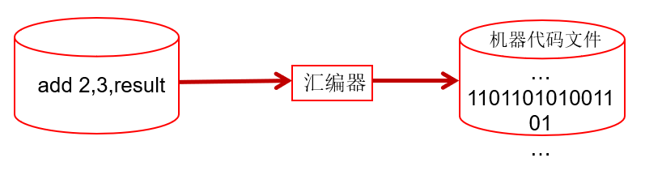

  * 比起机器语言，汇编大大进步了，是机器语言向更高级的语言进化的`桥梁`。目前仍然应用于工业电子编程领域、软件的加密解密、计算机病毒分析等。

* **第三代：高级语言（相当于人类的信息时代）**

  * 高级语言发展于20世纪50年代中叶到70年代，是一种`接近于人们使用习惯`的程序设计语言。它允许程序员使用`接近日常英语`的指令来编写程序，程序中的符号和算式也与`日常用的数学式子`差不多，接近于自然语言和数学语言，容易为人们掌握。比如：

    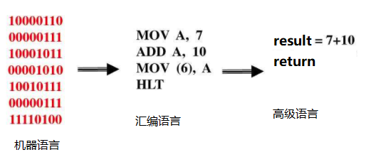

  * 高级语言`独立于机器`，有一定的通用性；计算机不能直接识别和执行用高级语言编写的程序，需要使用编译器或者解释器，`转换为机器语言`才能被识别和执行。

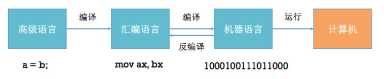

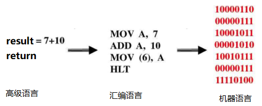

此外，高级语言按照程序设计方法的不同，又分为：`面向过程的语言`、`面向对象的语言`。

- C、Pascal、Fortran面向过程的语言
- C++面向过程/面向对象
- Java跨平台的纯面向对象的语言
- C#、Python、JavaScript、Scala…

> 目前以及可预见的将来，计算机语言仍然处于“第三代高级语言”阶段。但是不管是什么语言，最后都要向机器语言靠近，因为CPU只认识0和1。
>

### 5.3 计算机语言排行榜

TIOBE （https://www.tiobe.com/tiobe-index/）是一个流行编程语言排行，每月更新。排名权重基于世界范围内 工程师数量，Google、Bing、Yahoo! 、Wikipedia、Amazon、Youtube和百度这些主流的搜索引擎，也将作为排名权重的参考指标。

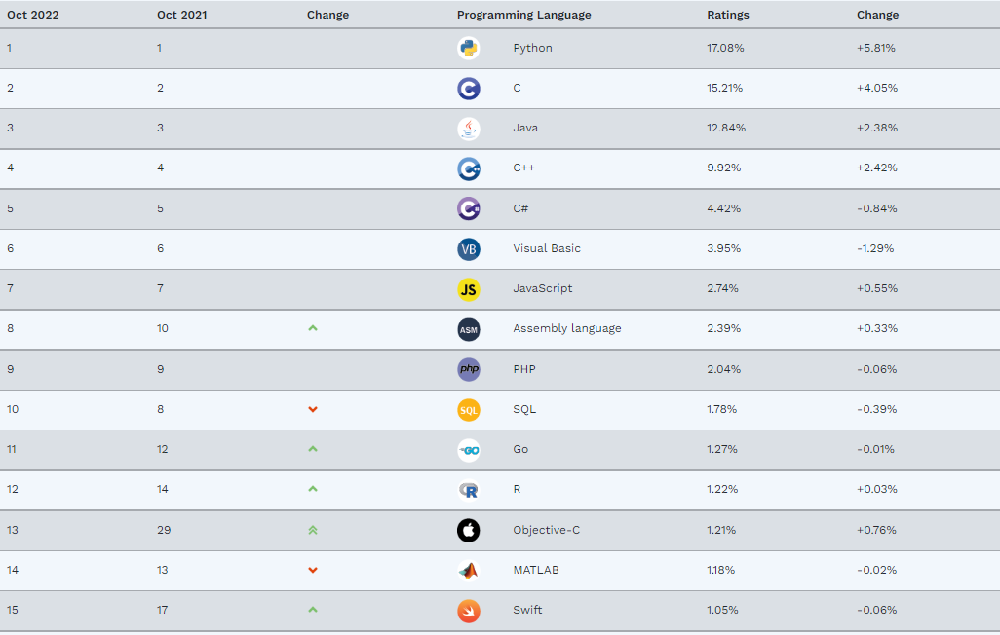

计算机语言走势

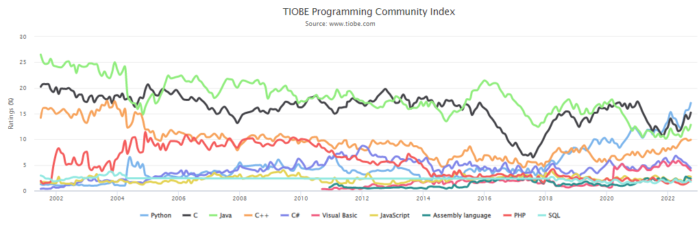

### 5.4 编程语言，该学哪个？

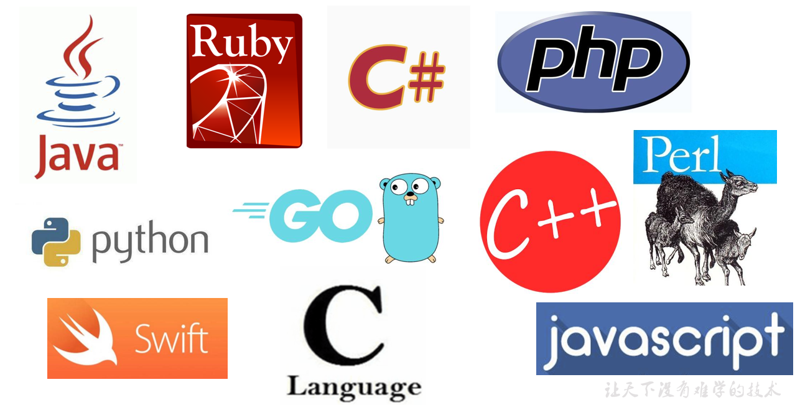

网传的编程语言鄙视链：

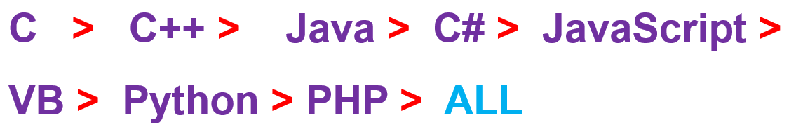

- C语言：万物之源

> - 诞生于`1972年`，由AT&T公司旗下`贝尔实验室`创建完成，用于构建Unix操作系统。
>
> - 偏向计算机底层操作（操作系统、网络、硬件驱动等）。
> - 优势：几乎所有现代编程语言都脱胎于C
> - 劣势：相当陡的学习曲线；不支持面向对象编程

- C++语言：难学的语言

> - 诞生于1983年，作为C语言的增强方案、`升级版本`。C++是C语言的超集，C语言的大部分知识也适用于C++。
> - 用途：windows 或 MacOS UI、office全家桶、主流的浏览器、Oracle、MySQL、著名的游戏引擎（如星际争霸、魔兽世界）等
> - 优势：很多公司都用 C++ 开发核心架构，如 Google、腾讯、百度、阿里云等；面向对象性
> - 劣势：体系极为庞大，这是世界目前来说`最复杂`也是`最难`的编程语言。

- C#语言：背靠大树的语言

> - 诞生于`2000年`，一款强大而灵活的编程语言。靠着`微软`这棵大树，是多年来windows平台的一门主流编程语言。
> - 用途：windows桌面应用开发、Windows Azure、游戏开发

- PHP语言：最好的语言？

> - 诞生于1994年，一款`服务器端脚本语言`。最初表示个人主页（Personal Home Page）
> - PHP语法和C类似，有很多的模板和框架，简单易懂，也许你可以在短短几天做出web app。它主要用于web端，快速建站网络开发
> - 劣势：学习门槛太低；其代码运行速度低于大部分编程语言党争对手

- Python：易学的语言

> - 诞生于1991年，一种面向对象的语言，虽然运行效率不高，但是`开发效率非常高`。
> - Python被称为`胶水语言`，哪里都可以用。

- JavaScript语言：前端为王

> - 诞生于1995年，网景公司开发完成。
> - JavaScript是JavaScript 是目前`所有主流浏览器`上唯一支持的脚本语言。在前端开发中，占有不可替代的地位。

- Java语言：需求旺盛

> - 创建于1995年，Java是一种面向对象、基于类的编程语言。
>- Java可能是目前`运用最广的项目语言`。代码稳定性超过 C 和 C++，生产力远超 C 和 C++。有 JVM 在，可以轻松地跨平台。
> - 具有强大的开源开发工具，大量的开源共享库。
> - Java拥有世界上`数量最多`的程序员，最不缺人。

- Go语言：夹缝中生存

> - Go 语言现在很受关注，它是取代 C 和 C++ 的另一门有潜力的语言。
>   - C 语言太原始了，C++ 太复杂了，Java 太高级了，所以 Go 语言就在这个夹缝中出现了。
> - Go语言已成为`云计算领域`事实上的标准语言，尤其是在 Docker/Kubernetes 等项目中。
> - Go 语言语法特别简单，你有了 C 和 C++ 的基础，学习 Go 的学习成本基本为零。
> - Go社区从Java社区移植了各种优秀的框架或库。

总结：

- 程序设计语言有很多种，每种语言都是为了实现某个特定的目的而发明的。
- **没有“最好”的语言**，只有在特定场景下相对来说，最适合的语言而已。
- 如果你掌握了一种编程语言，也会更容易上手其它的编程语言。关键是学习如何使用`程序设计方法`来解决问题。这也是本套课程的主旨。
- `Talk is cheap，Show me the code`。

## 6. Java语言概述

### 6.1 Java概述

- 是`SUN`(Stanford University Network，斯坦福大学网络公司 ) `1995年`推出的一门高级编程语言。

- 是一种面向Internet的编程语言。Java一开始富有吸引力是因为Java程序可以在`Web浏览器`中运行。这些Java程序被称为`Java小程序`（applet），内嵌在HTML代码中。

- 伴随着互联网的迅猛发展，以及Java技术在web方面的不断成熟，已经成为Web应用程序的首选开发语言。

### 6.2 Java语言简史

**起步阶段：**

1991年，Sun公司的工程师小组想要设计一种语言，应用在`电视机`、`电话`、`闹钟`、`烤面包机`等家用电器的控制和通信。由于这些设备的`处理能力`和`内存`都很有限，并且不同的厂商会选择不同的中央处理器(CPU)，因此这种语言的关键是`代码短小`、`紧凑`且`与平台无关`（即不能与任何特定的体系结构捆绑在一起）。

Gosling团队率先创造了这个语言，并命名为“`Oak`"（起名的原因是因为他非常喜欢自己办公室外的橡树)。后因智能化家电的市场需求没有预期的高，Sun公司放弃了该项计划。

随着20世纪90年代互联网的发展，Sun公司发现该语言在互联网上应用的前景，于是改造了Oak，于1995年5月以Java的名称正式发布。（Java是印度尼西亚`爪哇岛`的英文名称，因盛产咖啡而闻名。）

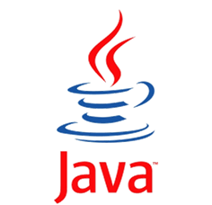

**发展阶段：**

|   发行版本    |    发行时间    |                             备注                             |
| :-----------: | :------------: | :----------------------------------------------------------: |
|   Java 1.0    |   1996.01.23   |             Sun公司发布了Java的第一个开发工具包              |
|   Java 1.1    |   1997.02.19   |        JavaOne会议召开，创当时全球同类会议规模之最。         |
|   Java 1.2    |   1998.12.08   |  Java拆分成：J2SE（标准版）、J2EE（企业版）、J2ME（小型版）  |
|   Java 1.3    |   2000.05.08   |                                                              |
|    Java1.4    |   2004.02.06   |                                                              |
| **Java 5.0**  | **2004.09.30** | **①版本号从1.4直接更新至5.0；②平台更名为JavaSE、JavaEE、JavaME** |
|   Java 6.0    |   2006.12.11   |               2009.04.20 Oracle宣布收购SUN公司               |
|               |   2009.04.20   |           Oracle公司收购SUN，交易价格`74亿`美元。            |
|   Java 7.0    |   2011.07.02   |                                                              |
| **Java 8.0**  | **2014.03.18** | **此版本是继Java 5.0以来变化最大的版本。是长期支持版本（LTS）** |
|   Java 9.0    |   2017.09.22   | ①此版本开始，**每半年更新一次**；②Java 9.0开始不再支持windows 32位系统 |
|   Java 10.0   |   2018.03.21   |                                                              |
| **Java 11.0** | **2018.09.25** |    **JDK安装包取消独立JRE安装包，是长期支持版本（LTS）**     |
|   Java 12.0   |   2019.03.19   |                                                              |
|      ...      |      ...       |                                                              |
| **Java17.0**  |  **2021.09**   |    **发布Java 17.0，版本号也称为21.9，是长期支持版本。**     |
|      ...      |      ...       |                                                              |
|   Java19.0    |    2022.09     |               发布Java19.0，版本号也称为22.9。               |

### 6.3 Java之父


- `詹姆斯·高斯林(James Gosling)`先生以“Java 技术之父”而闻名于世。他是Java 技术的创始人，他亲手设计了Java语言，并开发了Java编译器和Java虚拟机，使Java成为了世界上最流行的开发语言。
- James Gosling于1984 年加入Sun公司，并一直服务于Sun公司，直至2010年前后，Sun被Oracle并购而加入Oracle，担任客户端软件集团的首席技术官; 2010年4月从Oracle离职。

### 6.4 公司八卦

- **SUN 与 Oracle**

> SUN是一家`极具创新能力`的公司，2001年 “9.11”以前，SUN公司市值`超过1000亿`美元。 但是没能利用Java构建一个强有力、可变现的生态系统，没打好Java这张牌。此后，互联网泡沫破裂，硬件需求大幅减少，它的市值在一个月之内跌幅超过90%。**SUN公司的成长用了20年，而衰落只用了1年！**

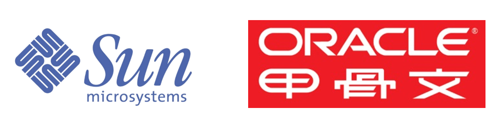

- **Oracle 与 Google**

> Google和Oracle的侵权事件：
>
> 2010 年 8 月，Oracle 起诉 Google 的 Android 系统侵权，要求赔偿 26 亿美元。
>
> - Oracle认为Google的代码中使用了Java的`37个API`，并且认为Google是故意为之，因为这样做的好处是可以让更多的Java程序员更容易接受Android的代码。
> - Oracle认为Android 中有`9行代码`直接抄袭了Java的实现。这9行牛气哄哄的代码都出自一人之手，他就是Java 大牛------`Joshua Bloch`。
>
> 2018 年 3 月，美国联邦巡回上诉法院裁决，谷歌侵犯了甲骨文的版权，支付高达`88亿美元`的赔偿金。
>
> 2021 年 4 月，美国最高法院给出了最终裁决：谷歌胜诉，其代码属于“合理使用”的范畴。为期十多年的软件行业“第一版权案”落幕。

```java
//Code In OpenJDK / Android ：
1. private static void rangeCheck(int arrayLen, int fromIndex, int toIndex) {
2.    if (fromIndex > toIndex)
3.        throw new IllegalArgumentException("fromIndex(" + fromIndex +
4.                   ") > toIndex(" + toIndex+")");
5.    if (fromIndex < 0)
6.        throw new ArrayIndexOutOfBoundsException(fromIndex);
7.    if (toIndex > arrayLen)
8.        throw new ArrayIndexOutOfBoundsException(toIndex);
9. }
```


### 6.5 Java技术体系平台

- **Java SE(Java Standard Edition)标准版**
  - 支持面向`桌面级应用`（如Windows下的应用程序）的Java平台，即定位个人计算机的应用开发。
  - 包括用户界面接口AWT及Swing，网络功能与国际化、图像处理能力以及输入输出支持等。
  - 此版本以前称为J2SE
- **Java EE(Java Enterprise Edition)企业版**
  - 为开发企业环境下的应用程序提供的一套解决方案，即定位`在服务器端的Web应用开发`。
  - JavaEE是JavaSE的扩展，增加了用于服务器开发的类库。如：Servlet能够延伸服务器的功能，通过请求-响应的模式来处理客户端的请求；JSP是一种可以将Java程序代码内嵌在网页内的技术。
  - 版本以前称为J2EE
- **Java ME(Java Micro Edition)小型版**
  - 支持Java程序运行在`移动终端（手机、机顶盒）上的平台`，即定位在消费性电子产品的应用开发
  - JavaME是JavaSE的内伸，精简了JavaSE 的核心类库，同时也提供自己的扩展类。增加了适合微小装置的类库：javax.microedition.io.*等。
  - 此版本以前称为J2ME

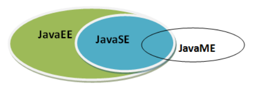

> 注意：
>
> Android开发不等同于Java ME的开发

## 7. Java开发环境搭建（掌握）

### 7.1 什么是JDK、JRE

- **JDK**  (`J`ava `D`evelopment `K`it)：是Java程序开发工具包，包含`JRE` 和开发人员使用的工具。
- **JRE ** (`J`ava `R`untime `E`nvironment) ：是Java程序的运行时环境，包含`JVM` 和运行时所需要的`核心类库`。

如下是Java 8.0 Platform：

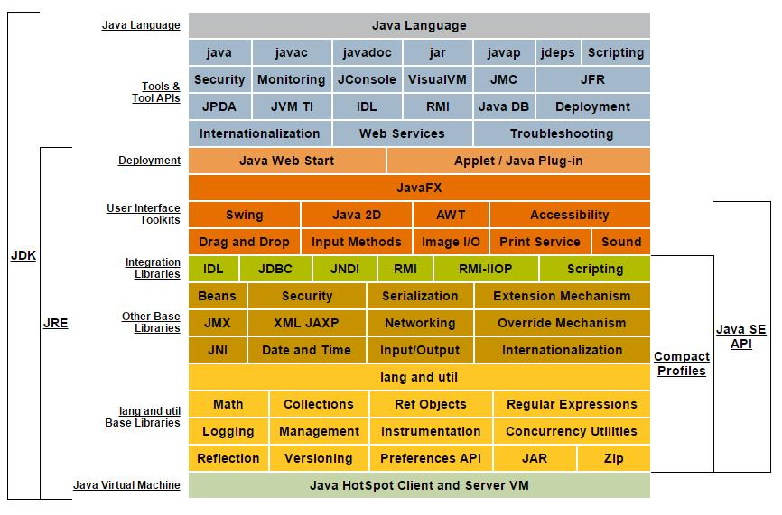

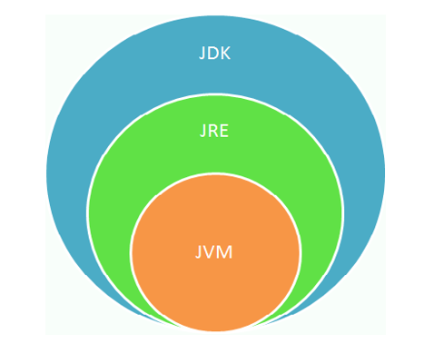

> 小结：
>
> JDK = JRE + 开发工具集（例如Javac编译工具等）
>
> JRE = JVM + Java SE标准类库

### 7.2 JDK版本选择

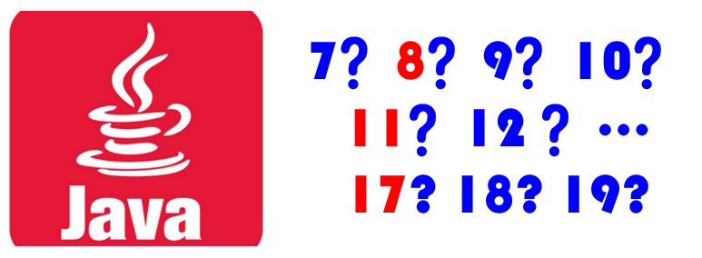

***


- 自Java 8版本发布以来，其后的每次更新，都会有小伙伴高呼：**Java8 YYDS！**
- 论坛的声音：“`你发任你发，我用Java 8！`”

**数据说话1：**

JRebel 于2022年4月前后发布了《2022 年Java生态系统状况报告》，报告中提到使用Java11 的占比最多，Java 8 紧随其后，如下图。而此前2020年的报告显示，Java8占比达到了`84.48%`。

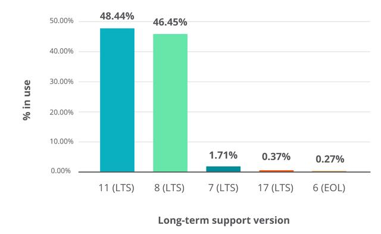

> 我的分析：
>
> G1是最受欢迎的GC算法。Java 11及更高版本的G1收集器是默认的GC，而Java 8中并不是。出于对G1的喜爱，很多开发者才会选择抛弃Java 8。

**数据说话2：**

此外，某美国软件开发商在对近千名专业的Java开发者调研后，发布的《2022年Java开发者生产力报告》称：八年前发布的Java 8依然是Java中应用最广泛的版本，占比 `37%`，其次是 Java 11，占比`29%` 。

**高斯林说话：**

***

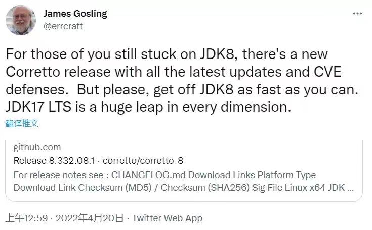

**Spring框架说话：**

在Java 17正式发布之前，Java开发框架Spring率先在官博宣布，Spring Framework 6和Spring Boot 3计划在2022年第四季度实现总体可用性的高端基线：

- Java 17+(来自 Spring Framework 5.3.x 线中的 Java 8-17)


- Jakarta EE 9+（来自Spring框架5.3.x 线中的 Java EE 7-8）

Spring 官方说明：`https://spring.io/blog/2022/01/20/spring-boot-3-0-0-m1-is-now-available`


> 意味着：springboot3.0 是需要用java17和spring6.0为基础建设。如果从企业选型最新springboot3.0作为架构来说，它搭配jdk17肯定是标配了。
>

### 7.3 JDK的下载

* 下载网址（Oracle公司官网）：www.oracle.com
* 下载步骤：如图所示，在官网底部选择Developers开发者


（1）在Developers页面中间的技术分类部分，选择`Java`，单击进入，如图所示：

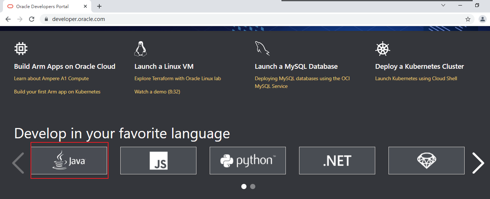

（2）这里展示的是最新Java版本，例如Java17。单击`Download Java`，然后选择具体的版本下载。

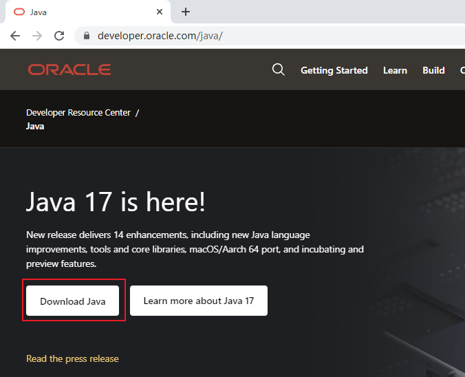

（3）选择Download Java按钮后

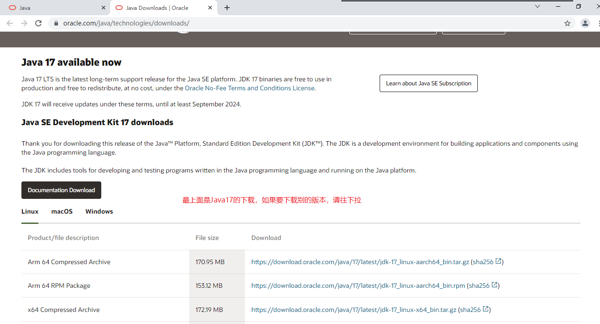

（4）如果想安装Java8 可以选择如下位置：

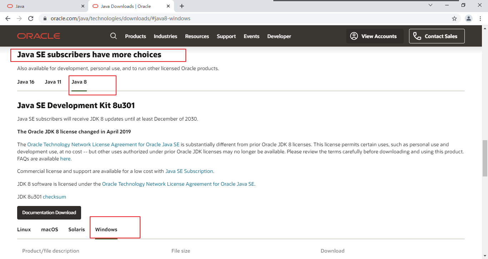

（5）选择Accept License Agreement，

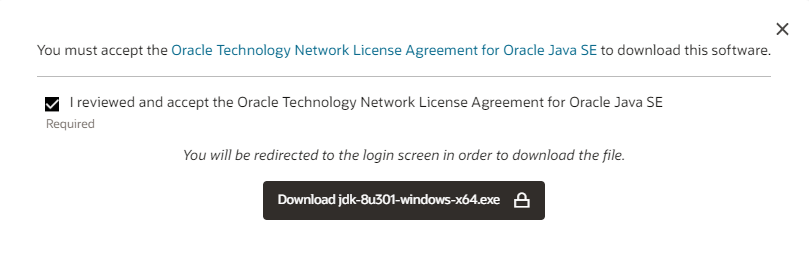

（6）注册或登录后下载：

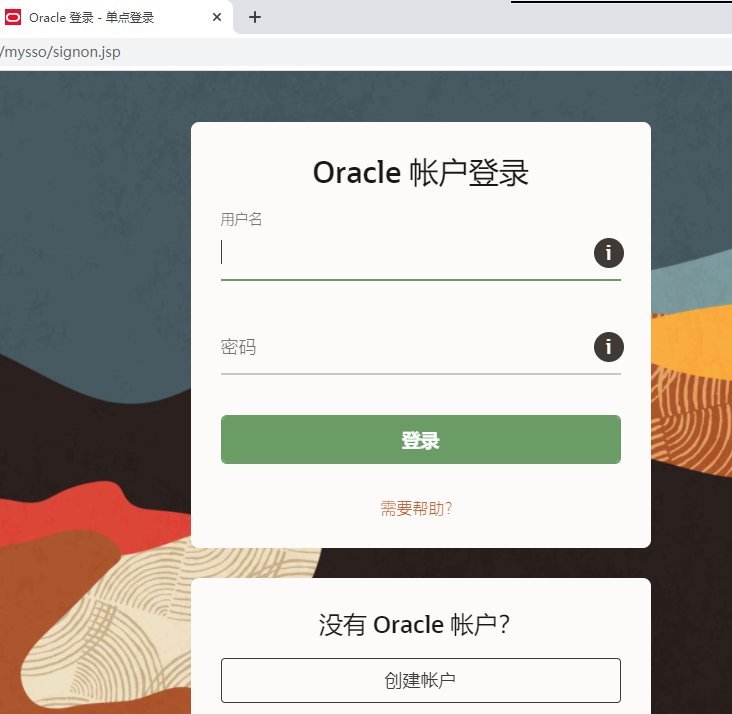

（7）如果需要安装其它版本，可以选择Java archive：

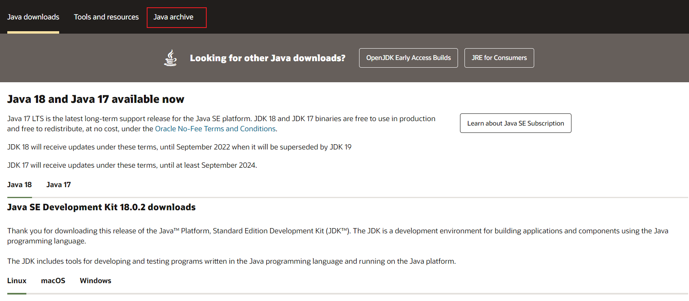

接着进行选择下载即可：

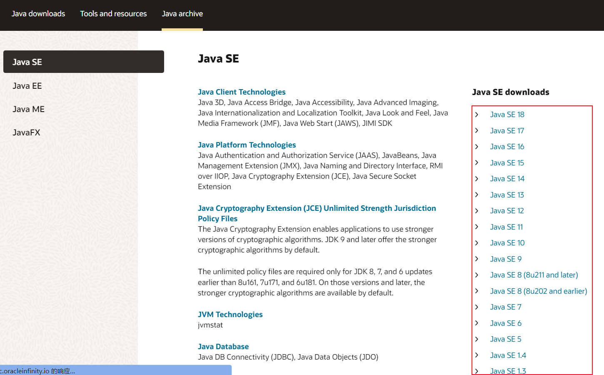

### 7.4 JDK的安装

- 安装说明
  - 傻瓜式安装，下一步即可。
  - **建议：安装路径不要有中文或者空格等特殊符号。**
  - **本套课程会同时安装JDK8 和 JDK17，并以JDK17为默认版本进行讲解。**

* 安装步骤：

（1）双击`jdk-17_windows-x64_bin.exe`文件，并单击下一步，如图所示：

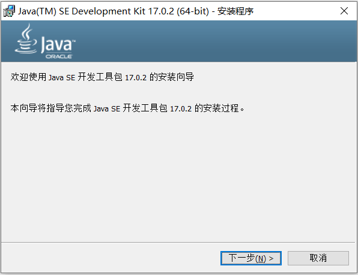

（2）修改安装路径，单击更改，如图所示：

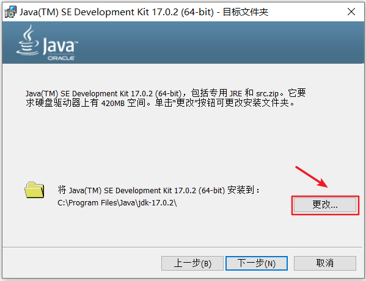

（3）将安装路径修改为`D:\develop_tools\jdk\jdk-17.0.2\`，并单击下一步，如图所示：

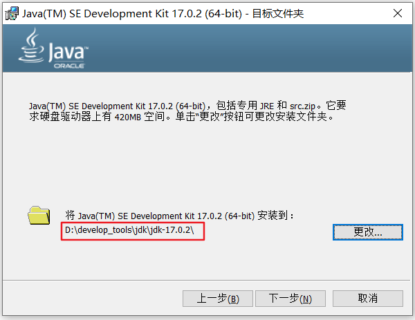

（4）稍后几秒，安装完成，如图所示：

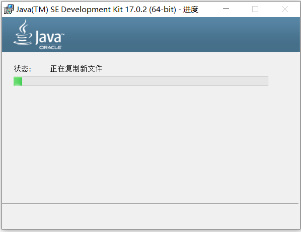

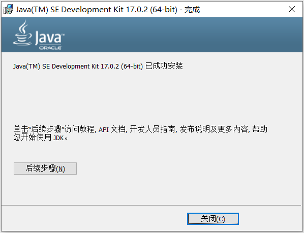

### 7.5 配置path环境变量

#### 7.5.1 理解path环境变量

**什么是path环境变量？**

答：window操作系统执行命令时，所要搜寻的路径。

**为什么配置path？**

答：希望在命令行使用javac.exe等工具时，任意目录下都可以找到这个工具所在的目录。

**以JDK为例演示**

我们在`C:\Users\songhk`目录下使用javac命令，结果如下：

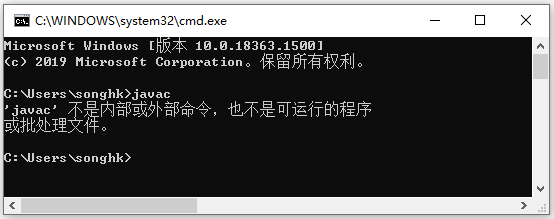

我们在JDK的安装目录的bin目录下使用javac命令，结果如下：

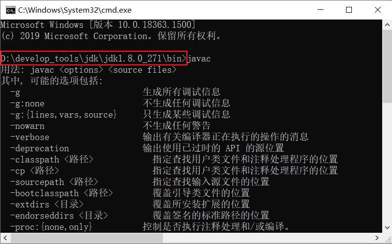

我们不可能每次使用java.exe，javac.exe等工具的时候都进入到JDK的安装目录下，太麻烦了。这时就需要配置path环境变量。

#### 7.5.2 JDK8配置方案1：只配置path

* 步骤：

（1）打开桌面上的计算机，进入后在左侧找到`此电脑`，单击鼠标`右键`，选择`属性`，如图所示：

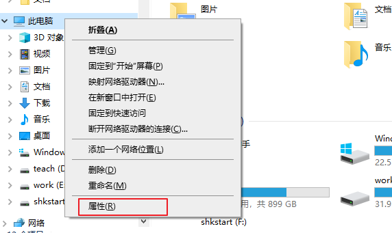

（2）选择`高级系统设置`，如图所示：


（3）在`高级`选项卡，单击`环境变量`，如图所示：

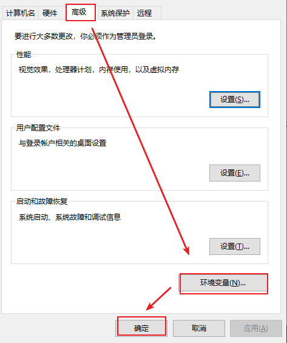

（4）在`系统变量`中，选中`Path` 环境变量，`双击`或者`点击编辑` ,如图所示：

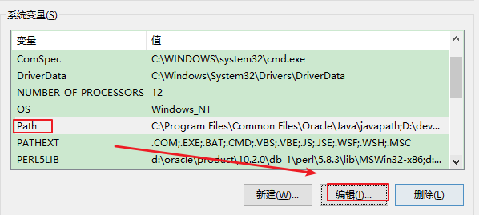

（5）点击`新建`，填入`D:\develop_tools\jdk\jdk1.8.0_271\bin`  ，并将此值`上移`到变量列表的首位。如图所示：

- 编辑模式1：

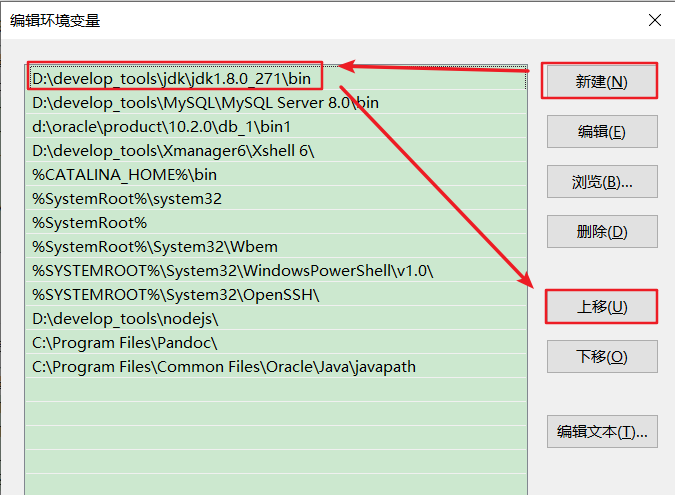

- 编辑模式2：（注意，结尾需要有英文模式下的;）

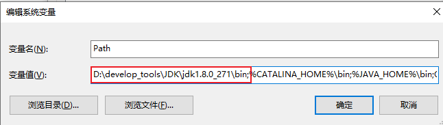

（6）环境变量配置完成，**重新开启**DOS命令行，在任意目录下输入`javac` 或`java`命令或`java -version`，运行成功。

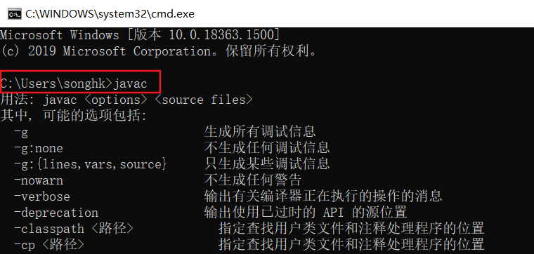

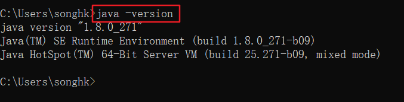


#### 7.5.3 JDK8配置方案2：配置JAVA_HOME+path（推荐）
* 步骤：

（1）打开桌面上的计算机，进入后在左侧找到`计算机`，单击鼠标`右键`，选择`属性`，如图所示：


（2）选择`高级系统设置`，如图所示：


（3）在`高级`选项卡，单击`环境变量`，如图所示：


（4）在`系统变量`中，单击`新建` ，创建新的环境变量，如图所示：


（5）变量名输入`JAVA_HOME`，变量值输入 `D:\develop_tools\jdk\jdk1.8.0_271` ，单击`确定`，如图所示：

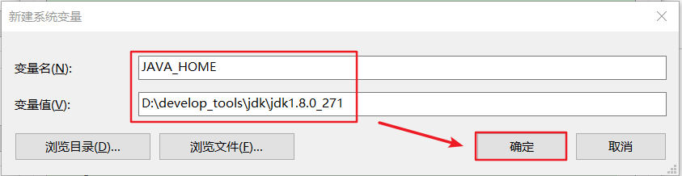

（6）选中`Path` 环境变量，`双击`或者`点击编辑` ，如图所示：


（7）在变量值的最前面，键入`%JAVA_HOME%\bin`。如图所示：

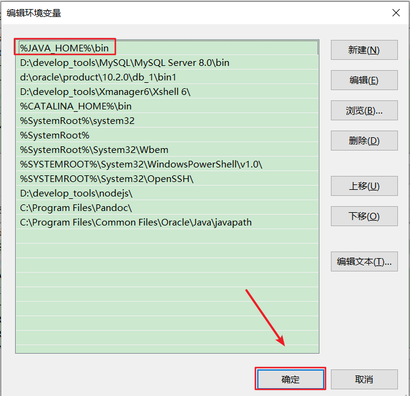

> 注意：强烈建议将%JAVA_HOME%\bin声明在path环境变量中所有变量的最前面！

（8）环境变量配置完成，**重启**DOS命令行，在任意目录下输入`javac` 或`java`命令或`java -version`，运行成功。


> 我想说：
>
> 有的书籍、论坛、视频上还提到配置classpath，用于指名class文件识别的路径。其实是没必要的，反而建议大家如果配置了classpath环境变量，要删除。对于初学者，反而不友好。

**小结如下：**

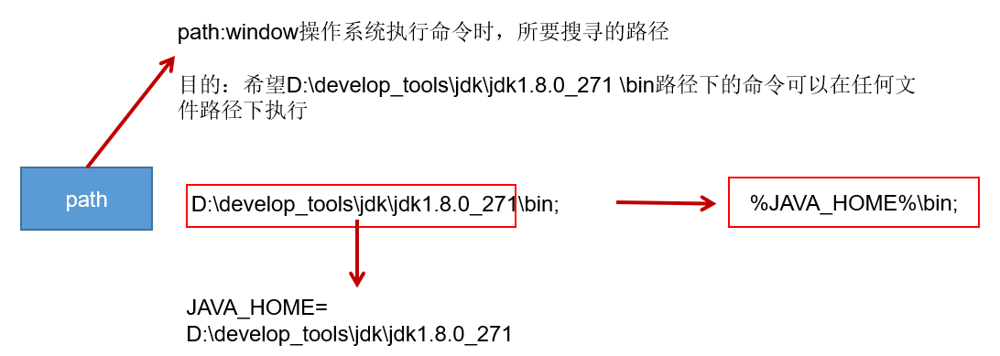

#### 7.5.4 JDK17配置方案：自动配置

不管大家有没有提前安装JDK8或其它版本JDK，在我们安装完JDK17之后，理应按JDK8的方式配置path环境变量。但是，我们发现在安装完JDK17以后，配置环境变量之前，执行CMD指令：

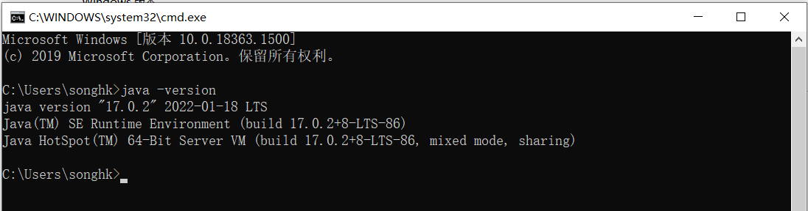

竟然成功了！而且是17.0.2版本。因为JDK17在安装之后，自动进行了环境变量的配置。如下：

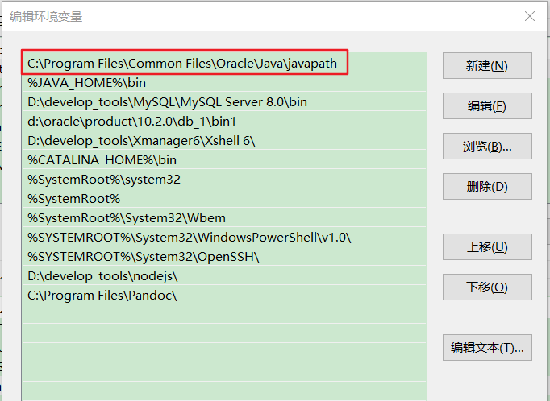

这里建议，将JDK17安装的路径，设置为JAVA_HOME，并将`%JAVA_HOME%\bin`上移到首位。

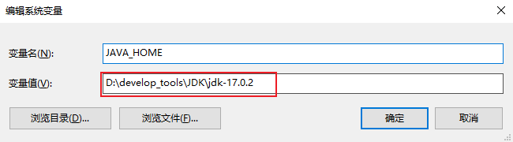

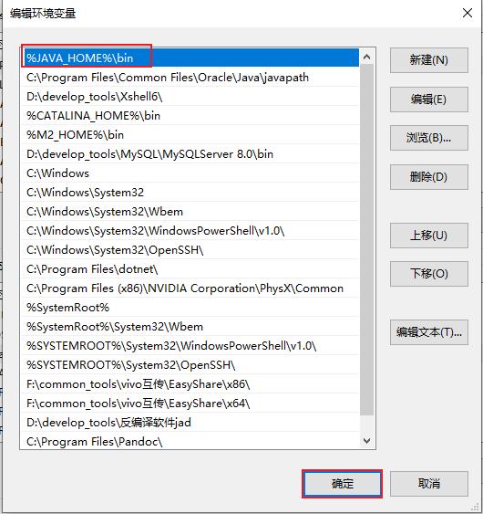

> 思考：如果你仍然希望在JDK8下开发Java程序？如何做呢？

## 8. 开发体验：HelloWorld（掌握）

JDK安装完毕，我们就可以开发第一个Java程序了，习惯性的称为：HelloWorld。

### 8.1 开发步骤

Java程序开发三步骤：**编写**、**编译**、**运行**。
- 将 Java 代码**编写**到扩展名为 .java 的源文件中
- 通过 javac.exe 命令对该 java 文件进行**编译**，生成一个或多个字节码文件
- 通过 java.exe 命令对生成的 class 文件进行**运行**

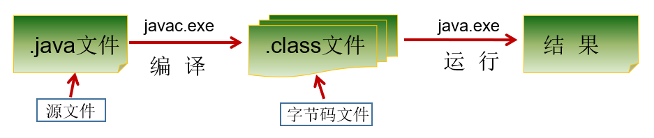

### 8.2 编写

（1）在`D:\JavaSE\chapter01` 目录下新建文本文件，完整的文件名修改为`HelloWorld.java`，其中文件名为`HelloWorld`，后缀名必须为`.java`。

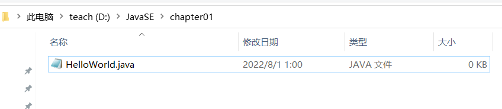

（2）用记事本或editplus等文本编辑器打开（虽然记事本也可以，但是没有关键字颜色标识，不利于初学者学习）

（3）在文件中输入如下代码，并且保存：

```java
class HelloChina {
  	public static void main(String[] args) {
    	System.out.println("HelloWorld!!");
  	}
}
```

- **友情提示1：每个字母和符号必须与示例代码一模一样，包括大小写在内。**

- 友情提示2：

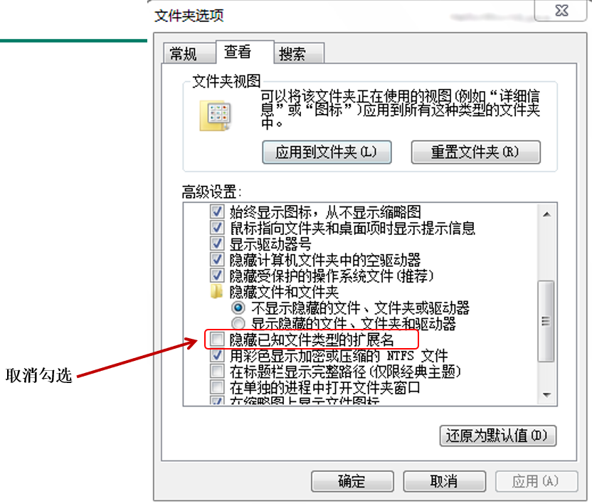

或

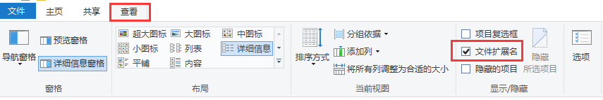

第一个`HelloWord` 源程序就编写完成了，但是这个文件是程序员编写的，JVM是看不懂的，也就不能运行，因此我们必须将编写好的`Java源文件` 编译成JVM可以看懂的`字节码文件` ，也就是`.class`文件。

### 8.3 编译

在DOS命令行中，进入`D:\JavaSE\chapter01`目录，使用`javac` 命令进行编译。

使用文件资源管理器打开`D:\JavaSE\chapter01`目录，然后在地址栏输入cmd。

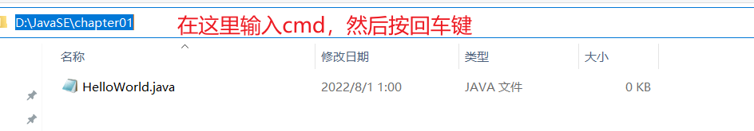

命令：

```java
javac Java源文件名.后缀名java
```

举例：

```
javac HelloWorld.java
```

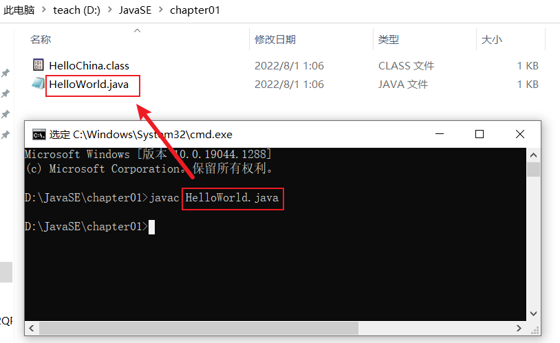

编译成功后，命令行没有任何提示。打开`D:\JavaSE\chapter01`目录，发现产生了一个新的文件 `HelloChina.class`，该文件就是编译后的文件，是Java的可运行文件，称为**字节码文件**，有了字节码文件，就可以运行程序了。 

### 8.4 运行

在DOS命令行中，在字节码文件目录下，使用`java` 命令进行运行。

命令：

```java
java 主类名字
```

主类是指包含main方法的类，main方法是Java程序的入口：

```java
public static void main(String[] args){
    
}
```

举例：

```
java HelloChina
```

> 错误演示：
>
> java HelloChina.class

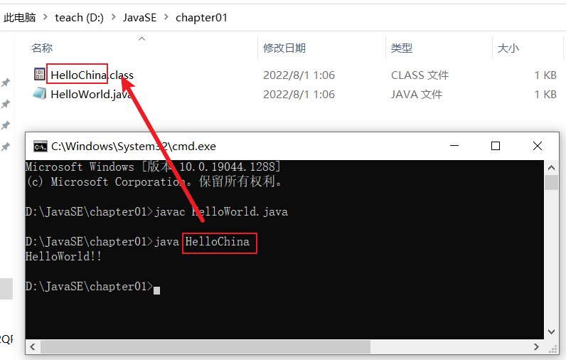

## 9. Java开发工具

### 9.1 都有哪些开发Java的工具

- 级别一：文本开发工具

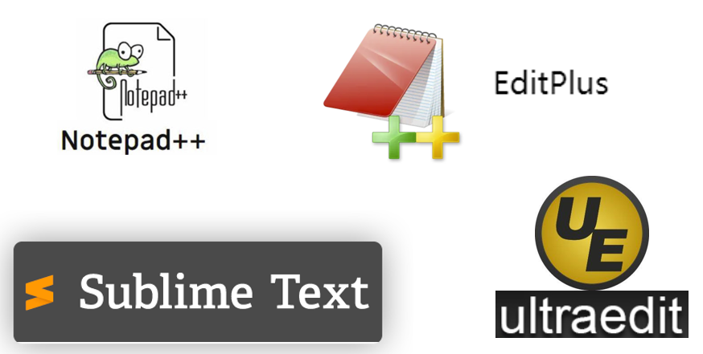

- 级别二：集成开发环境（Integrated Development Environment，IDE）

> 把代码编写，编译，执行，调试等多种功能综合到一起的开发工具。

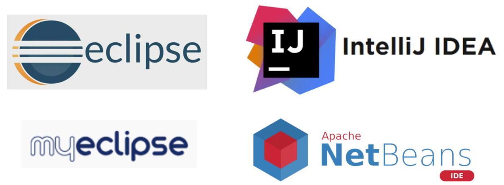

### 9.2 如何选择

前期我们先使用文本开发工具，培养`代码感`，利于公司笔、面试。

后期我们使用IDE，提供`更强大的功能支持`。

## 10. HelloWorld案例常见错误

### 10.1 拼写问题

* 	单词拼写问题
  * 正确：class		         错误：Class
  * 正确：String                    错误：string
  * 正确：System                  错误：system
  * 正确：main		         错误：mian
* 	Java语言是一门严格区分大小写的语言
* 	标点符号使用问题
  * 不能用中文符号，英文半角的标点符号（正确）
  * 括号问题，成对出现

### 10.2 编译、运行路径问题

举例1：

 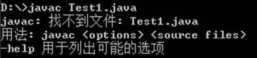

- 源文件名不存在或者写错
- 当前路径错误
- 后缀名隐藏问题

举例2：

 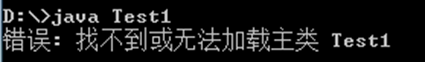

- 类文件名写错，尤其文件名与类名不一致时，要小心
- 类文件不在当前路径下，或者不在classpath指定路径下

### 10.3 语法问题

举例1：

 

声明为public的类应与文件名一致，否知编译失败。

举例2：

 

编译失败，注意错误出现的行数，再到源代码中指定位置改错

### 10.4 字符编码问题

当cmd命令行窗口的字符编码与.java源文件的字符编码不一致，如何解决？

 

解决方案一：

- 在Notepad++等编辑器中，修改源文件的字符编码：


- 在EditPlus中可以将Java源文件另存为ANSI编码方式（中文操作系统下即为GBK字符集）

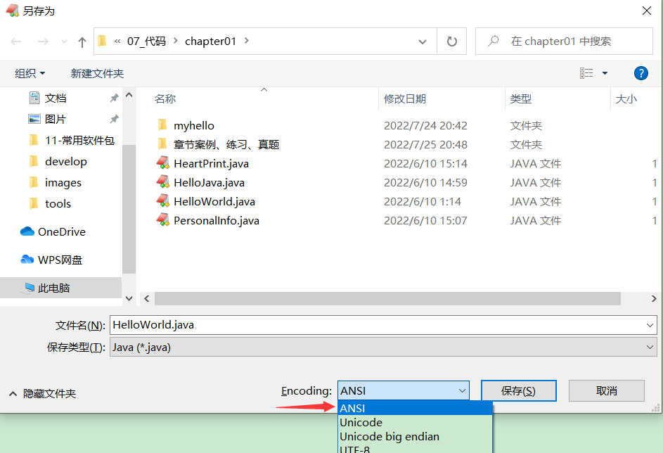

解决方案二：

	在使用javac命令式，可以指定源文件的字符编码

```cmd
javac -encoding utf-8 Review01.java
```

### 10.5 建议

- 注意缩进!
  - 一定要有缩进。缩进就像人得体的衣着一样！

  - 只要遇到{}就缩进，缩进的快捷键tab键。

- 必要的空格

  - 变量类型、变量、赋值符号、变量值之间填充相应空格，更美观。比如： int num = 10;

## 11. HelloWorld小结

### 11.1 Java程序的结构与格式

结构：

```java
类{
    方法{
        语句;
    }
}
```

格式：

（1）每一级缩进一个Tab键

（2）{}的左半部分在行尾，右半部分单独一行，与和它成对的"{"的行首对齐

### 11.2 Java程序的入口

Java程序的入口是main方法

```java
public static void main(String[] args){
    
}
```

### 11.3 两种常见的输出语句

- **换行输出语句**：输出内容，完毕后进行换行，格式如下：

  ```java
  System.out.println(输出内容);
  ```

- **直接输出语句**：输出内容，完毕后不做任何处理，格式如下

  ```java
  System.out.print(输出内容);
  ```

> 注意事项：
>
> ​	换行输出语句，括号内可以什么都不写，只做换行处理
>
> ​	直接输出语句，括号内什么都不写的话，编译报错

### 11.4 源文件名与类名

（1）源文件名是否必须与类名一致？public呢？

```java
如果这个类不是public，那么源文件名可以和类名不一致。但是不便于代码维护。

如果这个类是public，那么要求源文件名必须与类名一致。否则编译报错。

我们建议大家，不管是否是public，都与源文件名保持一致，而且一个源文件尽量只写一个类，目的是为了好维护。
```

（2）一个源文件中是否可以有多个类？public呢？

```java
一个源文件中可以有多个类，编译后会生成多个.class字节码文件。

但是一个源文件只能有一个public的类。
```

## 12. 注释(comment)


- 什么是注释？

  - 源文件中用于解释、说明程序的文字就是注释。

- 注释是一个程序员必须要具有的良好编程习惯。实际开发中，程序员可以先将自己的`思想`通过注释整理出来，再用`代码`去体现。

  > 程序员最讨厌两件事：
  >
  > 一件是自己写代码被要求加注释
  >
  > 另一件是接手别人代码，发现没有注释

- 不加注释的危害

  

- Java中的注释类型：

  - 单行注释

    ```
    //注释文字
    ```

  - 多行注释

    ```
    /* 
    注释文字1 
    注释文字2
    注释文字3
    */
    ```

  - 文档注释 (Java特有)

    ```
    /**
      @author  指定java程序的作者
      @version  指定源文件的版本
    */ 
    ```

- 注释的作用
  - 它提升了程序的可阅读性。（不加注释的危害性，见图。）
  - 调试程序的重要方法。

- **具体使用1：单行注释、多行注释**
  - 对于单行和多行注释，被注释的文字，不会不会出现在字节码文件中，进而不会被JVM（java虚拟机）解释执行。

  - 多行注释里面不允许有多行注释嵌套。

  - 一个段子

    ```java
    A：嘿 //是什么意思啊？
    B：嘿.
    A：呃 我问你//是什么意思？
    B：问吧.
    A：我刚才不是问了么？
    B：啊？
    A：你再看看记录...
    B：看完了.
    A：......所以//是啥？
    B：所以什么？
    A：你存心耍我呢吧？
    B：没有啊 你想问什么？
    ……
    不断循环之后，A一气之下和B绝交，自己苦学程序。
    N年之后，A终于修成正果，回想起B，又把聊天记录翻出来看，这时，他突然发现B没有耍他……
    而他自己也不知道当年他问B的究竟是什么问题……
    ```

- **具体使用2：文档注释（Java特有）**

  - 文档注释内容可以被JDK提供的工具 javadoc 所解析，生成一套以网页文件形式体现的该程序的说明文档。

  - 操作方式。比如：

    ```
    javadoc -d mydoc -author -version HelloWorld.java
    ```

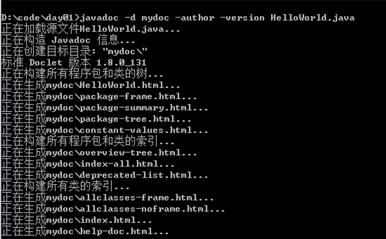

案例：

```java
//单行注释
/*
多行注释
*/
/**
文档注释演示。这是我的第一个Java程序！^_^
@author songhk
@version 1.0
*/
public class HelloWorld{
    
	/**
	Java程序的入口
	@param args main方法的命令参数
	*/
    public static void main(String[] args){
        System.out.println("hello");
    }
}
```

## 13. Java API文档

- API （Application Programming Interface，应用程序编程接口）是 Java 提供的基本编程接口。
- Java语言提供了大量的基础类，因此 Oracle 也为这些基础类提供了相应的说明文档，用于告诉开发者如何使用这些类，以及这些类里包含的方法。大多数Java书籍中的类的介绍都要参照它来完成，它是编程者经常查阅的资料。
- Java API文档，即为JDK使用说明书、帮助文档。类似于：

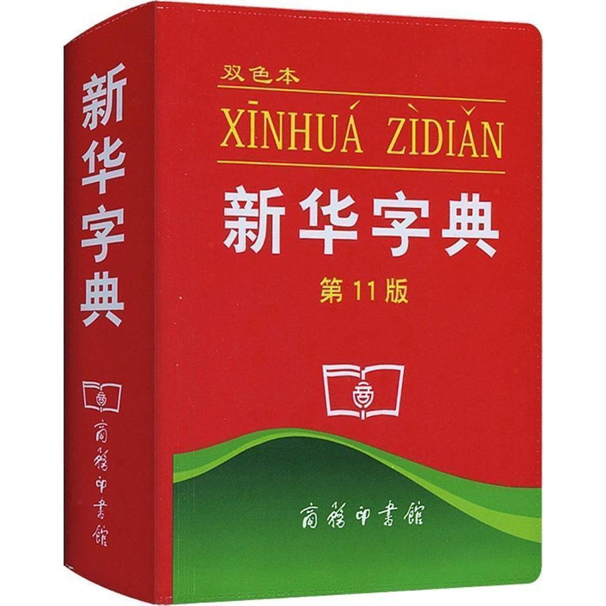

- 下载API文档：
  - 在线看：https://docs.oracle.com/en/java/javase/17/docs/api/index.html
  - 离线下载：https://www.oracle.com/java/technologies/javase-jdk17-doc-downloads.html

## 14. Java核心机制：JVM

### 14.1 Java语言的优缺点

Java确实是从C语言和C++语言继承了许多成份，甚至可以将Java看成是类C语言发展和衍生的产物。“青出于蓝，而胜于蓝”。

#### 14.1.1 优点

* **跨平台性：**这是Java的核心优势。Java在最初设计时就很注重移植和跨平台性。比如：Java的int永远都是32位。不像C++可能是16，32，可能是根据编译器厂商规定的变化。
* 通过Java语言编写的应用程序在不同的系统平台上都可以运行。“`Write once , Run Anywhere`”。
* 原理：只要在需要运行 java 应用程序的操作系统上，先安装一个Java虚拟机 (`J`VM ，Java `V`irtual `M`achine) 即可。由JVM来负责Java程序在该系统中的运行。


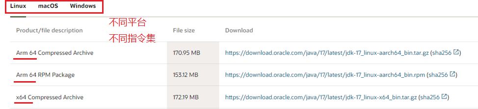

* **面向对象性：**

  面向对象是一种程序设计技术，非常`适合大型软件的设计和开发`。面向对象编程支持封装、继承、多态等特性，让程序更好达到`高内聚`，`低耦合`的标准。

* **健壮性：**吸收了C/C++语言的优点，但去掉了其影响程序健壮性的部分（如指针、内存的申请与释放等），提供了一个相对安全的内存管理和访问机制。

* **安全性高：**

  Java适合于网络/分布式环境，需要提供一个安全机制以防恶意代码的攻击。如：`安全防范机制`（ClassLoader类加载器），可以分配不同的命名空间以防替代本地的同名类、字节代码检查。

* **简单性：**

  Java就是C++语法的`简化版`，我们也可以将Java称之为“`C++--`”。比如：头文件，指针运算，结构，联合，操作符重载，虚基类等。

* **高性能：**

  - Java最初发展阶段，总是被人诟病“`性能低`”；客观上，高级语言运行效率总是低于低级语言的，这个无法避免。Java语言本身发展中通过虚拟机的优化提升了`几十倍运行效率`。比如，通过JIT(JUST IN TIME)即时编译技术提高运行效率。

  - `Java低性能的短腿，已经被完全解决了`。业界发展上，我们也看到很多C++应用转到Java开发，很多C++程序员转型为Java程序员。

#### 14.1.2 缺点

- `语法过于复杂、严谨`，对程序员的约束比较多，与python、php等相比入门较难。但是一旦学会了，就业岗位需求量大，而且`薪资待遇节节攀升`。
- 一般适用于大型网站开发，`整个架构会比较重`，对于初创公司开发和维护人员的成本比较高（即薪资高），选择用Java语言开发网站或应用系统的需要一定的经济实力。
- `并非适用于所有领域`。比如，Objective C、Swift在iOS设备上就有着无可取代的地位。浏览器中的处理几乎完全由JavaScript掌控。Windows程序通常都用C++或C#编写。Java在服务器端编程和跨平台客户端应用领域则很有优势。

### 14.2 JVM功能说明

**JVM**（`J`ava `V`irtual `M`achine ，Java虚拟机）：是一个虚拟的计算机，是Java程序的运行环境。JVM具有指令集并使用不同的存储区域，负责执行指令，管理数据、内存、寄存器。

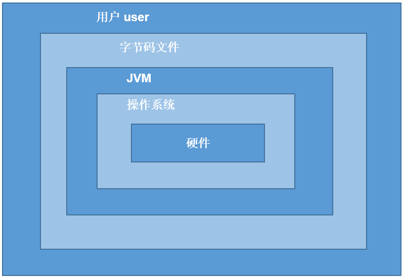

#### 14.2.1 功能1：实现Java程序的跨平台性

我们编写的Java代码，都运行在**JVM** 之上。正是因为有了JVM，才使得Java程序具备了跨平台性。

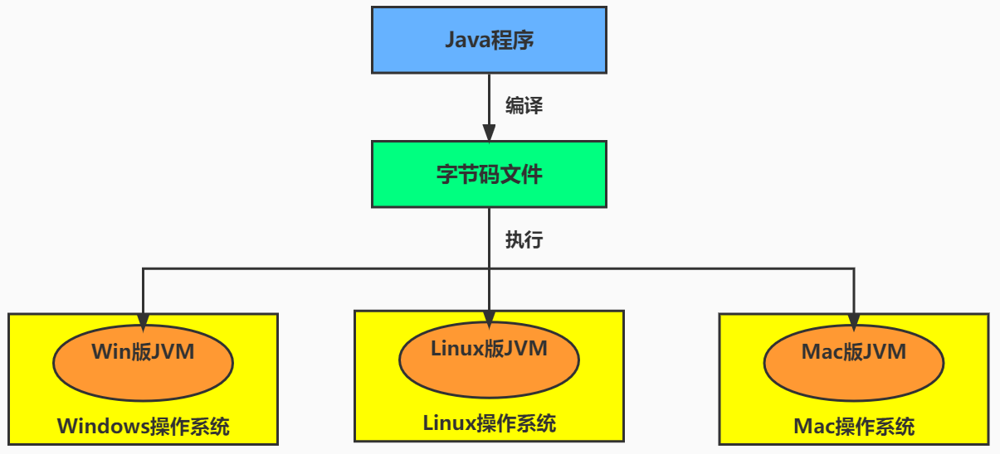

使用JVM前后对比：

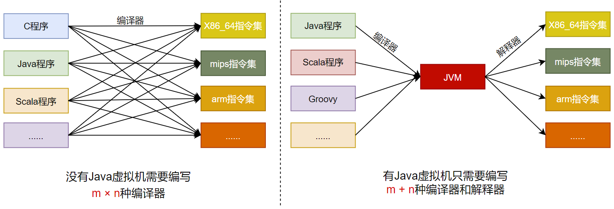

#### 14.2.2 功能2：自动内存管理(内存分配、内存回收)

- Java程序在运行过程中，涉及到运算的`数据的分配`、`存储`等都由JVM来完成
- Java消除了程序员回收无用内存空间的职责。提供了一种系统级线程跟踪存储空间的分配情况，在内存空间达到相应阈值时，检查并释放可被释放的存储器空间。
- GC的自动回收，提高了内存空间的利用效率，也提高了编程人员的效率，很大程度上`减少了`因为没有释放空间而导致的`内存泄漏`。

> 面试题：
>
> Java程序还会出现内存溢出和内存泄漏问题吗？  Yes!

## 15. 章节案例

**案例1：个人信息输出**

 

```java
class Exercise1{
	public static void main(String[] args){
		System.out.println("姓名：康师傅");
		System.out.println();//换行操作
		System.out.println("性别：男");
		System.out.println("家庭住址：北京程序员聚集地：回龙观");
	}
}
```

**案例2：输出：心形** 

结合\n(换行)，\t(制表符)，空格等在控制台打印出如下图所示的效果。

 

方式一：

```java
//方式一：
class Exercise2{
	public static void main(String[] args){
		System.out.print("\t");
		System.out.print("*");
		System.out.print("\t");
		System.out.print("\t");
		System.out.print("\t");
		System.out.print("\t");
		System.out.print("\t");
		System.out.print("\t");
		System.out.print("\t");
		
		System.out.println("*");

		
		System.out.print("*");
		System.out.print("\t");
		//System.out.print("\t");
		System.out.print("\t");
		System.out.print("\t");
		System.out.print("I love java");
		System.out.print("\t");
		System.out.print("\t");
		System.out.print("\t");
		System.out.print("\t");
		System.out.print("\t");
		System.out.println("*");

		
		System.out.print("\t");
		System.out.print("*");
		System.out.print("\t");
		System.out.print("\t");
		System.out.print("\t");
		System.out.print("\t");
		System.out.print("\t");
		System.out.print("\t");
		System.out.print("\t");
		
		System.out.println("*");

		
		System.out.print("\t");
		System.out.print("\t");
		System.out.print("*");
		System.out.print("\t");
		System.out.print("\t");
		System.out.print("\t");
		System.out.print("\t");
		System.out.print("\t");
		
		System.out.println("*");

		
		System.out.print("\t");
		System.out.print("\t");
		System.out.print("\t");
		System.out.print("*");
		System.out.print("\t");
		System.out.print("\t");
		System.out.print("\t");
		
		System.out.println("*");
		
		
		System.out.print("\t");
		System.out.print("\t");
		System.out.print("\t");
		System.out.print("\t");
		System.out.print("*");
		System.out.print("\t");
		
		System.out.println("*");

		
		System.out.print("\t");
		System.out.print("\t");
		System.out.print("\t");
		System.out.print("\t");
		System.out.print("    ");
		System.out.print("*");

	}

}
```

 

方式二：

```java
class Exercise3{
	public static void main(String[] args){
		
		System.out.print("\t"+"*"+"\t\t\t\t\t\t\t\t\t\t\t\t"+"*"+"\t"+"\n");
		System.out.print("*"+"\t\t"+"*"+"\t\t\t\t"+"I love Java"+"\t\t\t\t"+"*"+"\t\t\t"+"*"+"\n");
		System.out.print("\t"+"*"+"\t\t\t\t\t\t\t\t\t\t\t\t"+"*"+"\t"+"\n");
		System.out.print("\t\t"+"*"+"\t\t\t\t\t\t\t\t\t\t"+"*"+"\t\t"+"\n");
		System.out.print("\t\t\t"+"*"+"\t\t\t\t\t\t\t\t"+"*"+"\t"+"\n");
		System.out.print("\t\t\t\t"+"*"+"\t\t\t\t\t\t"+"*"+""+"\t"+"\n");
		System.out.print("\t\t\t\t\t"+"*"+"\t\t\t\t"+"*"+""+"\t\t"+"\n");
		System.out.print("\t\t\t\t\t\t"+"*"+"\t\t"+"*"+""+"\t\t"+"\n");
		System.out.print("\t\t\t\t\t\t\t"+"*"+"\n");


	}

}
```


