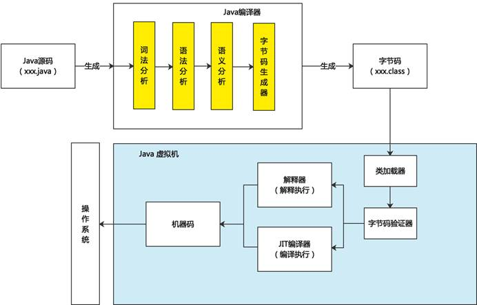

# 第01章：随堂复习与企业真题（Java语言概述）

***

## 一、随堂复习

### 1. Java基础全程的学习内容

```
第1阶段：Java基本语法
> Java概述、关键字、标识符、变量、运算符、流程控制（条件判断、选择结构、循环结构）、IDEA、数组

第2阶段：Java面向对象编程
> 类及类的内部成员
> 面向对象的三大特征
> 其它关键字的使用

第3阶段：Java语言的高级应用
> 异常处理、多线程、IO流、集合框架、反射、网络编程、新特性、其它常用的API等

```

神书：《Java核心技术》、《Effective Java》、《Java编程思想》

### 2. 软件开发相关内容

#### 2.1 计算机的构成

硬件 + 软件 

#### 2.2 软件

软件，即一系列按照`特定顺序组织`的计算机`数据`和`指令`的集合。有**系统软件**和**应用软件**之分。

- 系统软件，即操作系统，windows、Mac os 、linux、android、ios
- 应用软件，即os之上的应用程序。

#### 2.3 人机交互方式

- 图形化界面（GUI）
- 命令行交互方式（CLI）
  - 熟悉常用的dos命令：dir 、 cd 、cd.. 、 cd/  cd\ 、md、rd等

#### 2.4 计算机编程语言

- 语言的分代：
  - 第1代：机器语言
  - 第2代：汇编语言
  - 第3代：高级语言
    - 面向过程的语言：C
    - 面向对象的语言：C++、Java、C#、Python、Go、JavaScript

- **没有“最好”的语言**，只有在特定场景下相对来说，最适合的语言而已。

### 3. Java概述

#### 3.1 Java发展史

- 几个重要的版本：1996年，发布JDK1.0; 里程碑式的版本：JDK5.0、JDK8.0(2014年发布)

  ​                                JDK11（LTS）、JDK17（LTS）long term support

#### 3.2 Java 之父

詹姆斯·高斯林

### 3.3 Java具体的平台划分

J2SE --->JavaSE

J2EE ---->JavaEE

J2ME ---> JavaME

Java目前主要的应用场景：JavaEE后台开发、Android客户端的开发、大数据的开发

### 4. Java环境的搭建

- JDK、JRE、JVM三者之间的关系
- JDK的下载（官网）
- JDK的安装
  - 安装jdk8 和 jdk17
- 环境变量的配置（重要）

### 5. HelloWorld的编写和常见问题的解决（重点）

- 第1个程序

```java
class HelloChina{
	public static void main(String[] args){
		System.out.println("hello,world!!你好，中国！");
		System.out.print("hello,world!!你好，中国！");
		System.out.println("123abc");
		System.out.println(123 + 1);
	}
}
```

- 测试程序

```java
public class HelloJava{
	public static void main(String[] args){
		System.out.println("hello");
		System.out.println(10/0);
	}
}


class HelloShangHai{

}

class HelloBeijing{

}


```

- 小结

```

总结：
1. Java程序编写和执行的过程：
步骤1：编写。将Java代码编写在.java结尾的源文件中
步骤2：编译。针对于.java结尾的源文件进行编译操作。 格式：javac 源文件名.java
步骤3：运行。针对于编译后生成的字节码文件，进行解释运行。 格式： java 字节码文件名


2. 针对于步骤1的编写进行说明。

class HelloChina{
	public static void main(String[] args){
		System.out.println("hello,world!!你好，中国！");
	}
}

其中，
① class:关键字，表示"类"，后面跟着类名。
② main()方法的格式是固定的。务必记住！表示程序的入口
  public static void main(String[] args)  

如果非要有些变化的话，只能变化String[] args结构。可以写成：方式1：String args[]   方式2：String[] a

args:全程是arguments，简写成args

③ Java程序，是严格区分大小写的。

④ 从控制台输出数据的操作：
System.out.println() : 输出数据之后，会换行。
System.out.print() : 输出数据之后，不会换行。


⑤ 每一行执行语句必须以;结束。


3. 针对于步骤2的编译进行说明。

① 如果编译不通过。可以考虑的问题：
问题1：查看编译的文件名、文件路径是否书写错误
问题2：查看代码中是否存在语法问题。如果存在，就可能导致编译不通过。

② 编译以后，会生成1个或多个字节码文件。每一个字节码文件对应一个Java类，并且字节码文件名与类名相同。


4. 针对于步骤3运行进行说明。

① 我们是针对于字节码文件对应的Java类进行解释运行的。
要注意区分大小写！

② 如果运行不通过。可以考虑的问题：
问题1：查看解释运行的的类名、字节码文件路径是否书写错误
问题2：可能存在运行时异常。（放到第9章中具体讲解）


5. 一个源文件中可以声明多个类，但是最多只能有一个类使用public进行声明。
且要求声明为public的类的类名与源文件名相同。
```

### 6. 注释的使用

```java

/*
这是多行注释。

我们可以声明多行注释的信息！


1. Java中的注释的种类：
单行注释 、 多行注释 、 文档注释（Java特有）

2. 单行注释、多行注释的作用：
① 对程序中的代码进行解释说明
② 对程序进行调试

3. 注意：
① 单行注释和多行注释中声明的信息，不参与编译。换句话说，编译以后声明的字节码文件中不包含单行注释和
多行注释中的信息。
② 多行注释不能嵌套使用

4. 文档注释:
文档注释内容可以被JDK提供的工具 javadoc 所解析，生成一套以网页文件形式体现的该程序的说明文档。

*/
/**
这是我的第一个Java程序。很开森！^_^

@author shkstart
@version 1.0

*/
public class CommentTest{
	/**
	这是main()方法。格式是固定的。(文档注释)
	*/
	/*
	这是main()方法。格式是固定的。(多行注释)
	*/
	public static void main(String[] args){
		//这是输出语句
		System.out.println("hello,world!!");
		//System.out.println("hello,world!!")
	}
}
```

### 7. API文档

### 8. 练习

- 练习1

```java
class PersonalInfo{
	public static void main(String[] args) {
	    System.out.println("姓名：康师傅");
		System.out.println(); //换行的操作
		System.out.println("性别：男");
		System.out.println("家庭住址：北京程序员聚集地：回龙观");
	}
}

```


- 练习2

```java
class StarPrintTest {
	public static void main(String[] args) {
		System.out.println("*    *");
		System.out.println("*\t\t*");
		System.out.println("*\n\n*");
	}
}

```


## 二、企业真题

### 1.一个”.java”源文件中是否可以包括多个类？有什么限制(明*数据)

是！

一个源文件中可以声明多个类，但是最多只能有一个类使用public进行声明。
且要求声明为public的类的类名与源文件名相同。

### 2.Java 的优势（阿**巴）

- 跨平台型
- 安全性高
- 简单性
- 高性能
- 面向对象性
- 健壮性


### 3.常用的几个命令行操作都有哪些？(至少4个)（北京数字**）

略

### 4.Java 中是否存在内存溢出、内存泄漏？如何解决？举例说明（拼*多）

存在！

不能举例。

### 5. 如何看待Java是一门半编译半解释型的语言（携*）

