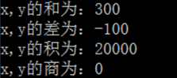
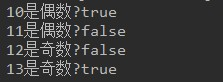

# 第02章_变量与运算符拓展练习

讲师：尚硅谷-宋红康

网址：www.atguigu.com

***

### 1、辨别标识符

- 是否符合规则，即编译是否报错？
- 是否符合规范？即是否够优雅

（1）以下标识符作为类名是否合适

```java
Test，a，test，ttt，class, public, int,尚硅谷，exercise8，Exercise8
```

```
编译报错：
	class, public, int,
编译不报错但不好：
	a，test，ttt，尚硅谷，exercise8，
合适的类名有：
	Test，Exercise8
```

（2）以下标识符作为变量名是否合适

```java
miles, Test, a++, --a, 4#R, $4, #44, apps, class, public, int, x, y, radius,尚硅谷,a1,1b,b0a
```

```java
编译报错：
	class, public, int，a++, --a, 4#R, #44,1b
编译不报错但不好：
    Test,a1,b0a，尚硅谷，$4
相对合适的变量名有：
   miles, radius，apps, x, y
```

### 2、数据类型转换简答

```java
//1、练习题：判断如下代码是否编译通过，如果能，结果是多少？
short s1 = 120;
short s2 = 8;
short s3 = s1 + s2;

//编译不通过，因为s1+s2自动提示为int类型

//2、练习题：判断如下代码是否编译通过，如果能，结果是多少？
short b1 = 120;
short b2 = 8;
byte b3 = (byte)(b1 + b2);

//编译通过，结果是-128

//3、练习题：判断如下代码是否编译通过，如果能，结果是多少？
char c1 = '0';
char c2 = '1';
char c3 = c1 + c2;

//编译不通过，因为c1+c2自动提示为int类型

//4、练习题：判断如下代码是否编译通过，如果能，结果是多少？
char c1 = '0';
char c2 = '1';
System.out.println(c1 + c2);

//编译通过，println方法可以接收各种数据类型的值，进行输出，结果是97

//5、练习题：判断如下代码是否编译通过，如果能，结果是多少？
int i = 4;
long j = 120;  //自动类型提升
double d = 34; //自动类型提升
float f = 1.2;

System.out.println(i + j + d + f);

//编译不通过，因为1.2默认是double类型，不能直接赋值给float的f，要么在1.2加F，要么加(float)1.2

//6、练习题：判断如下代码是否编译通过，如果能，结果是多少？
int a = 1;
int b = 2;
double result = a/b;
System.out.println(result);

//编译通过，结果是0.0，先计算a/b结果是0，然后提升double,0.0
```

### 3、判断如下代码的运行结果(难)

```java
public class Exer3{
	public static void main(String[] args){
		int i = 1;
		int j = i++;
		int k = i++ * ++j + ++i * j++;
		
		System.out.println("i = " + i);
		System.out.println("j = " + j);
		System.out.println("k = " + k);
	}
}
```

```java
public class Exer3{
	public static void main(String[] args){
		int i = 1;
		int j = i++;
		/*
		（1）先取i的值，放到操作数栈中
		（2）i自增，i=2
		（3）用操作数栈中1赋值给j

			j=1,i=2
		*/
		
		int k = i++ * ++j + ++i * j++;
		/*
		（1）i++ 
		先取i的值2，放到操作数栈中，紧接着i自增为3
		（2）++j
		j先自增为2，然后取j的值2放到操作数栈中，
		（3）算* ，取出操作数栈中2 和 2 相乘结果是4
		这个4重新放回操作数栈
		
		（4）++i
		i先自增为4，然后取i的值4放到操作数栈中，
		（5）j++
		先取j的值2到操作数栈中，紧接着j自增为3
		（6）算*，取出操作数栈中4 和 2 相乘结果是8
		这个8重新放回操作数栈
		
		（7）算+
		取出操作数栈中4 和 8 相加结果是12
		
		*/
		
		System.out.println("i = " + i);//4
		System.out.println("j = " + j);//3
		System.out.println("k = " + k);//12
	}
}
```

### 4、判断如下程序的运行结果

```java
//如下代码的计算结果是：
int i = 1;
i *= 0.2;  
i++;
System.out.println("i=" + i);//i=1
```

### 5、判断如下程序的运行结果

```java
//如下代码的运算结果是：
int i = 2;
i *= i++;

int j = 2;
j *= j+1; 

int k = 2;
k *= ++k;

System.out.println("i=" + i);//i=4
System.out.println("j=" + j);//i=6
System.out.println("k=" + k);//i=6
```

### 6、Java的基本数据类型有哪些？String是基本数据类型吗？

```
Java的基本数据类型有：byte,short,int,long,float,double,char,boolean

String不是基本数据类型
```

### 7、语法判断

float f=3.4;是否正确，表达式15/2*2的值是多少

```java
float f=3.4; //错误，因为3.4默认是double类型
System.out.println(15/2*2); //14，因为15/2结果是7
```

### 8、char型变量中是否可以存储一个汉字？

```
可以
```

### 9、说明基本数据类型变量之间自动类型提升的运算规则

```
> 容量小的类型自动转换为容量大的数据类型
> 有多种类型的数据混合运算时，系统首先自动将所有数据转换成容量最大的那种数据类型，然后再进行计算。
> byte,short,char之间不会相互转换，他们三者在计算时首先转换为int类型。 
> boolean类型不能与其它数据类型运算。
```

### 10、说明基本数据类型变量之间强制类型转换的使用规则和可能的问题

```
> 强制类型转换：自动类型转换的逆运算，需要使用强制类型转换符()

> 注意的问题：可能会造成精度的损失
```


### 11、按步骤编写代码，效果如图



- 开发提示：四则运算的符号

  ```java
  加: +
  减: -
  乘: *
  除: /
  ```

- 编写步骤：

  1. 定义类 Exercise11
  2. 定义 main方法
  3. 定义2个int类型变量x、y，x赋值为100，y赋值为200
  4. 定义新变量add，保存变量x，y的和并打印到控制台
  5. 定义新变量sub，保存变量x，y的差并打印到控制台
  6. 定义新变量mul，保存变量x，y的积并打印到控制台
  7. 定义新变量div，保存变量x，y的商并打印到控制台

```java
public class Exercise11 {

	public static void main(String[] args) {
		int x = 100;
        int y = 200;
        int add = x + y;
        int sub = x - y;
        int mul = x * y;
        int div = x / y;
        System.out.println("x,y的和为：" + add);
        System.out.println("x,y的差为：" + sub);
        System.out.println("x,y的积为：" + mul);
        System.out.println("x,y的商为：" + div);
	}

}
```

### 12、按步骤编写代码，效果如图


- 编写步骤：

1. 定义类 Exercise12
2. 定义 main方法
3. 定义两个byte类型变量b1,b2,并分别赋值为10和20.
4. 定义变量b3,保存b1和b2的和,并输出.
5. 定义两个short类型变量s1,s2,并分别赋值为1000和2000.
6. 定义short类型变量s3,保存s1和s2的和,并输出.
7. 定义一个char类型变量ch1赋值为'a',一个int类型变量i1赋值为30.
8. 定义变量ch3,保存c1和i1的差,并输出.

```java
public class Exercise12 {
	public static void main(String[] args) {
		byte b1 = 10;
		byte b2 = 20;
		byte b3 = (byte)(b1 + b2);
		System.out.println("byte类型的b1和b2的和为：");
		System.out.println(b3);
		
		short s1 = 1000;
		short s2 = 2000;
		short s3 = (short)(s1 + s2);
		System.out.println("short类型的s1和s2的和为：");
		System.out.println(s3);
		
		char c1 = 'a';
		int i1 = 30;
		int ch3 = c1 - i1;
		System.out.println("char类型的ch1和int类型的i1的差：");
		System.out.println(ch3);
	}
}
```

### 13、按步骤编写代码，效果如图



- 编写步骤：
  1. 定义类 Exercise13
  2. 定义 main方法
  3. 定义两个int类型变量a1和a2,分别赋值10,11,判断变量是否为偶数,拼接输出结果
  4. 定义两个int类型变量a3和a4,分别赋值12,13,判断变量是否为奇数,拼接输出结果

```java
public class Exercise13 {
	public static void main(String[] args) {
		int a1 = 10;
		int a2 = 11;
		int a3 = 12;
		int a4 = 13;
		System.out.println("10是偶数？" + (a1 % 2 == 0));
		System.out.println("11是偶数？" + (a2 % 2 == 0));
		System.out.println("12是奇数？" + (a3 % 2 != 0));
		System.out.println("13是奇数？" + (a4 % 2 != 0));
	}
}
```

### 14、桃园结义获取老大的年龄

历史中，刘关张桃园三结义大家非常熟悉了。现有三个童鞋，年龄如下：

刘小备：23岁

关小羽：22岁

张小飞：21岁

获取三人中最大的年龄

```java
/**
 * @author 尚硅谷-宋红康
 * @create 17:44
 */
public class Exercise14 {
    public static void main(String[] args) {
        int liuXiaoBei = 23;
        int guanXiaoYu = 22;
        int zhangXiaoFei = 21;

        int tempMax = (liuXiaoBei > guanXiaoYu)? liuXiaoBei : guanXiaoYu;
        int maxAge = (tempMax > zhangXiaoFei)? tempMax : zhangXiaoFei;
        System.out.println("三人中最大的年龄是：" + maxAge);
    }
}
```

### 15、将整数60手动转换为十六进制（难）

```java
/**
 * @author 尚硅谷-宋红康
 * @create 17:05
 */
public class Exercise15 {
    public static void main(String[] args) {

        int num = 60;
        int j1 = num & 15;
        String s1 = (j1 > 9) ? (char) (j1 - 10 + 'A') + "" : j1 + "";//取出了最低的4位对应的字符

        int j2 = (num >>> 4) & 15;
        String s2 = (j2 > 9) ? (char) (j2 - 10 + 'A') + "" : j2 + "";//取出了次最低的4位对应的字符

        System.out.println(s2 + s1);

    }
}
```

### 16、判断闰年

```
给定一个年份，判断是否是闰年。输出"xxx年(是/不是)闰年"。

闰年的判断标准是：
1）可以被4整除，但不可被100整除
 2）可以被400整除
```

```java
/**
 * @author 尚硅谷-宋红康
 * @create 12:49
 */
public class Exercise16 {
    public static void main(String[] args) {
        int year = 2018;
        boolean isLeapYear = (year % 4 == 0 && year % 100 != 0) || year % 400 == 0;
        System.out.println(year + (isLeapYear ? "是闰年" : "不是闰年"));
    }
}
```

