# 第03章_流程控制语句

讲师：尚硅谷-宋红康（江湖人称：康师傅）

官网：[http://www.atguigu.com](http://www.atguigu.com/)

***

## 本章专题与脉络


***

- 流程控制语句是用来控制程序中各`语句执行顺序`的语句，可以把语句组合成能`完成一定功能`的小逻辑模块。

- 程序设计中规定的`三种`流程结构，即：
  - **顺序结构**
    - 程序从上到下逐行地执行，中间没有任何判断和跳转。
  - **分支结构**
    - 根据条件，选择性地执行某段代码。
    - 有`if…else`和`switch-case`两种分支语句。
  - **循环结构**
    - 根据循环条件，重复性的执行某段代码。
    - 有`for`、`while`、`do-while`三种循环语句。
    - 补充：JDK5.0 提供了`foreach`循环，方便的遍历集合、数组元素。（第12章集合中讲解）
- 生活中、工业生产中流程控制举例

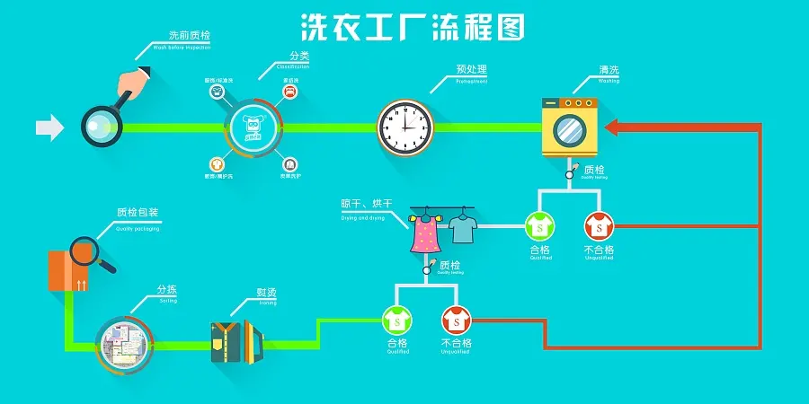

## 1. 顺序结构

顺序结构就是程序`从上到下逐行`地执行。表达式语句都是顺序执行的。并且上一行对某个变量的修改对下一行会产生影响。

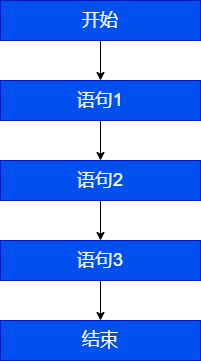

```java
public class StatementTest{
	public static void main(String[] args){
		int x = 1;
		int y = 2;
		System.out.println("x = " + x);		
        System.out.println("y = " + y);	
        //对x、y的值进行修改
        x++;
        y = 2 * x + y;
        x = x * 10;	
        System.out.println("x = " + x);
        System.out.println("y = " + y);
    }
}
```

Java中定义变量时采用合法的`前向引用`。如：

```java
public static void main(String[] args) {
	int num1 = 12;
	int num2 = num1 + 2;
}
```

错误形式：

```java
public static void main(String[] args) {
	int num2 = num1 + 2;
	int num1 = 12;
}
```

## 2. 分支语句

### 2.1 if-else条件判断结构

#### 2.1.1 基本语法

**结构1：单分支条件判断：if**

`格式：`

```java
if(条件表达式)｛
  	语句块;
｝
```

`说明：`条件表达式必须是布尔表达式（关系表达式或逻辑表达式）或 布尔变量。

`执行流程：`

1. 首先判断条件表达式看其结果是true还是false
2. 如果是true就执行语句块
3. 如果是false就不执行语句块

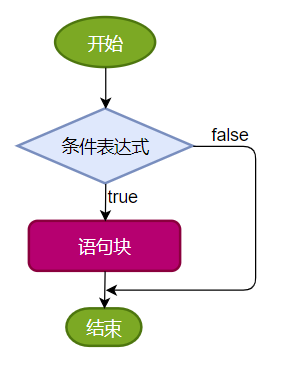

**结构2：双分支条件判断：if...else**

`格式：`

```java
if(条件表达式) { 
  	语句块1;
}else {
  	语句块2;
}
```

`执行流程：`

1. 首先判断条件表达式看其结果是true还是false
2. 如果是true就执行语句块1
3. 如果是false就执行语句块2

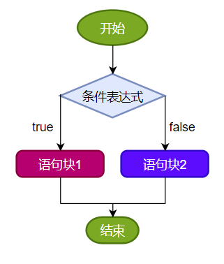

**结构3：多分支条件判断：if...else if...else**

`格式：`

```java
if (条件表达式1) {
  	语句块1;
} else if (条件表达式2) {
  	语句块2;
}
...
}else if (条件表达式n) {
 	语句块n;
} else {
  	语句块n+1;
}
```

`说明：`一旦条件表达式为true，则进入执行相应的语句块。执行完对应的语句块之后，就跳出当前结构。

`执行流程：`

1. 首先判断关系表达式1看其结果是true还是false
2. 如果是true就执行语句块1，然后结束当前多分支
3. 如果是false就继续判断关系表达式2看其结果是true还是false
4. 如果是true就执行语句块2，然后结束当前多分支
5. 如果是false就继续判断关系表达式…看其结果是true还是false

​    …

   n.  如果没有任何关系表达式为true，就执行语句块n+1，然后结束当前多分支。

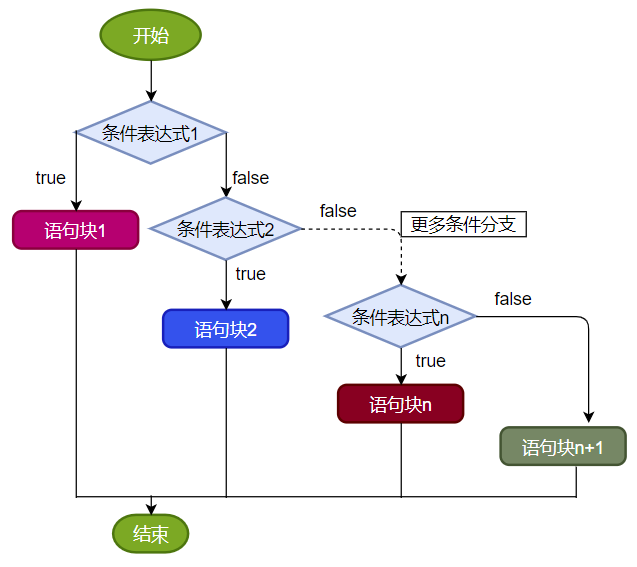

#### 2.1.2 应用举例

**案例1：**成年人心率的正常范围是每分钟60-100次。体检时，如果心率不在此范围内，则提示需要做进一步的检查。

```java
public class IfElseTest1 {
    public static void main(String[] args){
        int heartBeats = 89;

        if(heartBeats < 60 || heartBeats > 100){
            System.out.println("你需要做进一步的检查");
        }

        System.out.println("体检结束");
    }
}
```

**案例2：**定义一个整数，判定是偶数还是奇数    

```java
public class IfElseTest2 {
    public static void main(String[] args){
        int a = 10;

        if(a % 2 == 0) {
            System.out.println(a + "是偶数");
        } else{
            System.out.println(a + "是奇数");
        }
    }
}
```

**案例3：**

```
岳小鹏参加Java考试，他和父亲岳不群达成承诺：
如果：
成绩为100分时，奖励一辆跑车；
成绩为(80，99]时，奖励一辆山地自行车；
当成绩为[60,80]时，奖励环球影城一日游；
其它时，胖揍一顿。

说明：默认成绩是在[0,100]范围内
```

```java
public class IfElseTest3 {
    public static void main(String[] args) {

        int score = 67;//岳小鹏的期末成绩
        //写法一：默认成绩范围为[0,100]
        if(score == 100){
            System.out.println("奖励一辆跑车");
        }else if(score > 80 && score <= 99){    //错误的写法：}else if(80 < score <= 99){
            System.out.println("奖励一辆山地自行车");
        }else if(score >= 60 && score <= 80){
            System.out.println("奖励环球影城玩一日游");
        }
        //else{
        //	System.out.println("胖揍一顿");
        //}


        //写法二：
        // 默认成绩范围为[0,100]
        if(score == 100){
            System.out.println("奖励一辆跑车");
        }else if(score > 80){
            System.out.println("奖励一辆山地自行车");
        }else if(score >= 60){
            System.out.println("奖励环球影城玩一日游");
        }else{
            System.out.println("胖揍一顿");
        }
    }
}
```

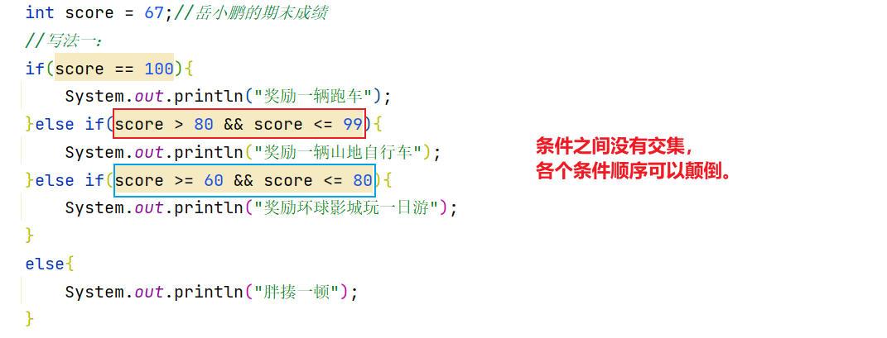

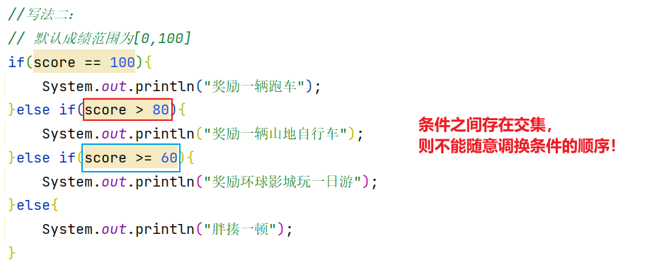

> 当条件表达式之间是“`互斥`”关系时（即彼此没有交集），条件判断语句及执行语句间顺序无所谓。
>
> 当条件表达式之间是“`包含`”关系时，“`小上大下 / 子上父下`”，否则范围小的条件表达式将不可能被执行。

#### 2.1.3 if...else嵌套

在 if 的语句块中，或者是在else语句块中，又包含了另外一个条件判断（可以是单分支、双分支、多分支），就构成了`嵌套结构`。

**执行的特点：**
（1）如果是嵌套在if语句块中的，只有当外部的if条件满足，才会去判断内部的条件
（2）如果是嵌套在else语句块中的，只有当外部的if条件不满足，进入else后，才会去判断内部的条件

**案例4：**由键盘输入三个整数分别存入变量num1、num2、num3，对它们进行排序(使用 if-else if-else)，并且从小到大输出。

```java
class IfElseTest4 {
	public static void main(String[] args) {
		
			//声明num1,num2,num3三个变量并赋值
			int num1 = 23,num2 = 32,num3 = 12;

			if(num1 >= num2){
				
				if(num3 >= num1)
					System.out.println(num2 + "-" + num1 + "-" + num3);
				else if(num3 <= num2)
					System.out.println(num3 + "-" + num2 + "-" + num1);
				else
					System.out.println(num2 + "-" + num3 + "-" + num1);
			}else{ //num1 < num2
				
				if(num3 >= num2){
					System.out.println(num1 + "-" + num2 + "-" + num3);
				}else if(num3 <= num1){
					System.out.println(num3 + "-" + num1 + "-" + num2);
				}else{
					System.out.println(num1 + "-" + num3 + "-" + num2);
				}
			}
	}
}
```

#### 2.1.4 其它说明

- 语句块只有一条执行语句时，一对`{}可以省略`，但建议保留
- 当if-else结构是“多选一”时，最后的`else是可选的`，根据需要可以省略

#### 2.1.5 练习

**练习1：**

```java
//1)对下列代码，若有输出，指出输出结果。
int x = 4;
int y = 1;
if (x > 2) {
       if (y > 2) 
            System.out.println(x + y);
       		System.out.println("atguigu");
} else
       System.out.println("x is " + x);


```

**练习2：**

```java
boolean b = true;
//如果写成if(b=false)能编译通过吗？如果能，结果是？
if(b == false) 	 //建议：if(!b)
	System.out.println("a");
else if(b)
	System.out.println("b");
else if(!b)
	System.out.println("c");
else
	System.out.println("d");
```

**练习3：**

定义两个整数，分别为small 和 big，如果第一个整数small大于第二个整数big，就交换。输出显示small和big变量的值。

```java
public class IfElseExer3 {
    public static void main(String[] args) {
        int small = 10;
        int big = 9;

        if (small > big) {
            int temp = small;
            small = big;
            big = temp;
        }
        System.out.println("small=" + small + ",big=" + big);
    }
}
```

**练习4：**小明参加期末Java考试，通过考试成绩，判断其Java等级，成绩范围[0,100]

- 90-100      优秀
- 80-89        好
- 70-79        良
- 60-69        及格
- 60以下    不及格

```java
import java.util.Scanner;
//写法一：
public class IfElseExer4 {
    public static void main(String[] args) {
        System.out.print("小明的期末Java成绩是：[0,100]");
        int score = 89;

        if (score < 0 || score > 100) {
            System.out.println("你的成绩是错误的");
        } else if (score >= 90 && score <= 100) {
            System.out.println("你的成绩属于优秀");
        } else if (score >= 80 && score < 90) {
            System.out.println("你的成绩属于好");
        } else if (score >= 70 && score < 80) {
            System.out.println("你的成绩属于良");
        } else if (score >= 60 && score < 70) {
            System.out.println("你的成绩属于及格");
        } else {
            System.out.println("你的成绩属于不及格");
        }
    }
}

```

```java
import java.util.Scanner;
//写法二：
public class IfElseExer4 {
    public static void main(String[] args) {
        System.out.print("小明的期末Java成绩是：[0,100]");
        int score = 89;

        if (score < 0 || score > 100) {
            System.out.println("你的成绩是错误的");
        } else if (score >= 90) {
            System.out.println("你的成绩属于优秀");
        } else if (score >= 80) {
            System.out.println("你的成绩属于好");
        } else if (score >= 70) {
            System.out.println("你的成绩属于良");
        } else if (score >= 60) {
            System.out.println("你的成绩属于及格");
        } else {
            System.out.println("你的成绩属于不及格");
        }

    }
}

```

**练习5：**

```
编写程序，声明2个int型变量并赋值。判断两数之和，如果大于等于50，打印“hello world!”
```

```java
public class IfElseExer5 {

    public static void main(String[] args) {
        int num1 = 12, num2 = 32;
        
        if (num1 + num2 >= 50) {
            System.out.println("hello world!");
        }
    }
}
```

**练习6：**

```
编写程序，声明2个double型变量并赋值。判断第一个数大于10.0，且第2个数小于20.0，打印两数之和。否则，打印两数的乘积。
```

```java
public class IfElseExer6 {

    public static void main(String[] args) {
        double d1 = 21.2,d2 = 12.3;
        
        if(d1 > 10.0 && d2 < 20.0){
            System.out.println("两数之和为：" + (d1 + d2));
        }else{
            System.out.println("两数乘积为：" + (d1 * d2));
        }
    }

}
```

**练习7：判断水的温度**

```
如果大于95℃，则打印“开水”；

如果大于70℃且小于等于95℃，则打印“热水”；

如果大于40℃且小于等于70℃，则打印“温水”；

如果小于等于40℃，则打印“凉水”。
```

```java
public class IfElseExer7 {

    public static void main(String[] args) {
        int waterTemperature = 85;
        
        if(waterTemperature > 95){
            System.out.println("开水");
        }else if(waterTemperature > 70 && waterTemperature <= 95){
            System.out.println("热水");
        }else if(waterTemperature > 40 && waterTemperature <= 70){
            System.out.println("温水");
        }else{
            System.out.println("凉水");
        }
    }

}
```

### 2.2 switch-case选择结构

#### 2.2.1 基本语法

**语法格式：**

```java
switch(表达式){
    case 常量值1:
        语句块1;
        //break;
    case 常量值2:
        语句块2;
        //break; 
    // ...
   [default:
        语句块n+1;
        break;
   ]
}
```

**执行流程图：**

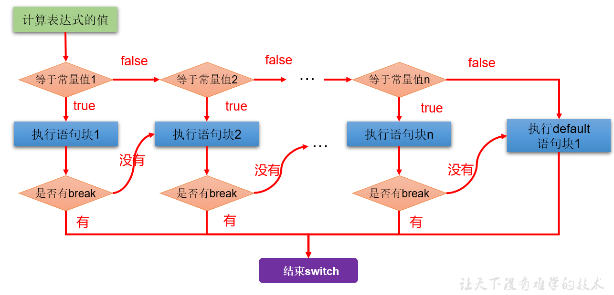

**执行过程：**

第1步：根据switch中表达式的值，依次匹配各个case。如果表达式的值等于某个case中的常量值，则执行对应case中的执行语句。

第2步：执行完此case的执行语句以后，
​              情况1：如果遇到break,则执行break并跳出当前的switch-case结构
​		        情况2：如果没有遇到break，则会继续执行当前case之后的其它case中的执行语句。--->case穿透
​		         ...
​		        直到遇到break关键字或执行完所有的case及default的执行语句，跳出当前的switch-case结构

**使用注意点：**

- switch(表达式)中表达式的值必须是下述几种类型之一：byte，short，char，int，枚举 (jdk 5.0)，String (jdk 7.0)；

- case子句中的值必须是常量，不能是变量名或不确定的表达式值或范围；

- 同一个switch语句，所有case子句中的常量值互不相同；

- break语句用来在执行完一个case分支后使程序跳出switch语句块；

  如果没有break，程序会顺序执行到switch结尾；

- default子句是可选的。同时，位置也是灵活的。当没有匹配的case时，执行default语句。

#### 2.2.2 应用举例

**案例1：**

```java
public class SwitchCaseTest1 {
    public static void main(String args[]) {
        int num = 1;
		switch(num){
			case 0:
				System.out.println("zero");
				break;
			case 1:
				System.out.println("one");
				break;
			case 2:
				System.out.println("two");
				break;
			case 3:
				System.out.println("three");
				break;
			default:
				System.out.println("other");
				//break;
		}
    }
}
```

**案例2：**

```java
public class SwitchCaseTest2 {
    public static void main(String args[]) {
        String season = "summer";
        switch (season) {
            case "spring":
                System.out.println("春暖花开");
                break;
            case "summer":
                System.out.println("夏日炎炎");
                break;
            case "autumn":
                System.out.println("秋高气爽");
                break;
            case "winter":
                System.out.println("冬雪皑皑");
                break;
            default:
                System.out.println("季节输入有误");
                break;
        }
    }
}
```

错误举例：

```java
int key = 10;
switch(key){
	case key > 0 :
        System.out.println("正数");
        break;
    case key < 0:
        System.out.println("负数");
        break;
    default:
        System.out.println("零");
        break;
}
```

**案例3：**使用switch-case实现：对学生成绩大于60分的，输出“合格”。低于60分的，输出“不合格”。

```java
class SwitchCaseTest3 {
	public static void main(String[] args) {
		
		int score = 67;
		/*
		写法1：极不推荐
		switch(score){
			case 0:
				System.out.println("不及格");
				break;
			case 1:
				System.out.println("不及格");
				break;
			//...

			case 60:
				System.out.println("及格");
				break;
			//...略...
		
		}
		*/

		//写法2：
		switch(score / 10){
			case 0:
			case 1:
			case 2:
			case 3:
			case 4:
			case 5:
				System.out.println("不及格");
				break;
			case 6:
			case 7:
			case 8:
			case 9:
			case 10:
				System.out.println("及格");
				break;
			default:
				System.out.println("输入的成绩有误");
				break;
		}

		//写法3：
		switch(score / 60){
			case 0:
				System.out.println("不及格");
				break;
			case 1:
				System.out.println("及格");
				break;
			default:
				System.out.println("输入的成绩有误");
				break;
		}
	}
}
```

#### 2.2.3 利用case的穿透性

在switch语句中，如果case的后面不写break，将出现穿透现象，也就是一旦匹配成功，不会在判断下一个case的值，直接向后运行，直到遇到break或者整个switch语句结束，执行终止。

**案例4：**编写程序：从键盘上输入2023年的“month”和“day”，要求通过程序输出输入的日期为2023年的第几天。

```java

import java.util.Scanner;

class SwitchCaseTest4 {
	public static void main(String[] args) {
		
		Scanner scan = new Scanner(System.in);

		System.out.println("请输入2023年的month:");
		int month = scan.nextInt();

		System.out.println("请输入2023年的day:");
		int day = scan.nextInt();

		//这里就不针对month和day进行合法性的判断了，以后可以使用正则表达式进行校验。

		int sumDays = 0;//记录总天数
		
		//写法1 ：不推荐（存在冗余的数据）
		/*
		switch(month){
			case 1:
				sumDays = day;
				break;
			case 2:
				sumDays = 31 + day;
				break;
			case 3:
				sumDays = 31 + 28 + day;
				break;
			//....
		
			case 12:
				//sumDays = 31 + 28 + ... + 30 + day;
				break;
		}
		*/

		//写法2：推荐
		switch(month){
			case 12:
				sumDays += 30;//这个30是代表11月份的满月天数
			case 11:
				sumDays += 31;//这个31是代表10月份的满月天数
			case 10:
				sumDays += 30;//这个30是代表9月份的满月天数
			case 9:
				sumDays += 31;//这个31是代表8月份的满月天数
			case 8:
				sumDays += 31;//这个31是代表7月份的满月天数
			case 7:
				sumDays += 30;//这个30是代表6月份的满月天数
			case 6:
				sumDays += 31;//这个31是代表5月份的满月天数
			case 5:
				sumDays += 30;//这个30是代表4月份的满月天数
			case 4:
				sumDays += 31;//这个31是代表3月份的满月天数
			case 3:
				sumDays += 28;//这个28是代表2月份的满月天数
			case 2:
				sumDays += 31;//这个31是代表1月份的满月天数
			case 1:
				sumDays += day;//这个day是代表当月的第几天
		}
		
		System.out.println(month + "月" + day + "日是2023年的第" + sumDays + "天");
        //关闭资源
		scan.close();
	}
}
```

**拓展：**

```
从键盘分别输入年、月、日，判断这一天是当年的第几天
 
注：判断一年是否是闰年的标准：
   1）可以被4整除，但不可被100整除
	  或
   2）可以被400整除
   
例如：1900，2200等能被4整除，但同时能被100整除，但不能被400整除，不是闰年
```

```java
import java.util.Scanner;

public class SwitchCaseTest04 {

    public static void main(String[] args) {

        Scanner scanner = new Scanner(System.in);
        System.out.print("请输入year:");
        int year = scanner.nextInt();

        System.out.print("请输入month:");
        int month = scanner.nextInt();

        System.out.print("请输入day:");
        int day = scanner.nextInt();

        //判断这一天是当年的第几天==>从1月1日开始，累加到xx月xx日这一天
        //(1)[1,month-1]个月满月天数
        //(2)单独考虑2月份是否是29天（依据是看year是否是闰年）
        //(3)第month个月的day天

        //声明一个变量days，用来存储总天数
        int sumDays = 0;

        //累加[1,month-1]个月满月天数
        switch (month) {
            case 12:
                //累加的1-11月
                sumDays += 30;//这个30是代表11月份的满月天数
                //这里没有break，继续往下走
            case 11:
                //累加的1-10月
                sumDays += 31;//这个31是代表10月的满月天数
                //这里没有break，继续往下走
            case 10:
                sumDays += 30;//9月
            case 9:
                sumDays += 31;//8月
            case 8:
                sumDays += 31;//7月
            case 7:
                sumDays += 30;//6月
            case 6:
                sumDays += 31;//5月
            case 5:
                sumDays += 30;//4月
            case 4:
                sumDays += 31;//3月
            case 3:
                sumDays += 28;//2月
                //在这里考虑是否可能是29天
                if (year % 4 == 0 && year % 100 != 0 || year % 400 == 0) {
                    sumDays++;//多加1天
                }
            case 2:
                sumDays += 31;//1月
            case 1:
                sumDays += day;//第month月的day天
        }

        //输出结果
        System.out.println(year + "年" + month + "月" + day + "日是这一年的第" + sumDays + "天");

        scanner.close();
    }
}
```

**案例5：**根据指定的月份输出对应季节

```java
import java.util.Scanner;

/*
 * 需求：指定一个月份，输出该月份对应的季节。一年有四季:
 * 		3,4,5	春季
 * 		6,7,8	夏季
 * 		9,10,11	秋季
 * 		12,1,2	冬季
 */
public class SwitchCaseTest5 {
    public static void main(String[] args) {
        Scanner input = new Scanner(System.in);
        System.out.print("请输入月份：");
        int month = input.nextInt();

        /*
		switch(month) {
            case 1:
                System.out.println("冬季");
                break;
            case 2:
                System.out.println("冬季");
                break;
            case 3:
                System.out.println("春季");
                break;
            case 4:
                System.out.println("春季");
                break;
            case 5:
                System.out.println("春季");
                break;
            case 6:
                System.out.println("夏季");
                break;
            case 7:
                System.out.println("夏季");
                break;
            case 8:
                System.out.println("夏季");
                break;
            case 9:
                System.out.println("秋季");
                break;
            case 10:
                System.out.println("秋季");
                break;
            case 11:
                System.out.println("秋季");
                break;
            case 12:
                System.out.println("冬季");
                break;
            default:
                System.out.println("你输入的月份有误");
                break;
		}
		*/

        // 改进版
        switch(month) {
            case 1:
            case 2:
            case 12:
                System.out.println("冬季");
                break;
            case 3:
            case 4:
            case 5:
                System.out.println("春季");
                break;
            case 6:
            case 7:
            case 8:
                System.out.println("夏季");
                break;
            case 9:
            case 10:
            case 11:
                System.out.println("秋季");
                break;
            default:
                System.out.println("你输入的月份有误");
                break;
        }

        input.close();
    }
}

```

常见错误实现：

```java
switch(month){
    case 3|4|5://3|4|5 用了位运算符，11 | 100 | 101结果是 111是7
        System.out.println("春季");
        break;
    case 6|7|8://6|7|8用了位运算符，110 | 111 | 1000结果是1111是15
        System.out.println("夏季");
        break;
    case 9|10|11://9|10|11用了位运算符，1001 | 1010 | 1011结果是1011是11
        System.out.println("秋季");
        break;
    case 12|1|2://12|1|2 用了位运算符，1100 | 1 | 10 结果是1111，是15
        System.out.println("冬季");
        break;
    default:
        System.out.println("输入有误");
}
```

使用if-else实现：

```java
if ((month == 1) || (month == 2) || (month == 12)) {
    System.out.println("冬季");
} else if ((month == 3) || (month == 4) || (month == 5)) {
    System.out.println("春季");
} else if ((month == 6) || (month == 7) || (month == 8)) {
    System.out.println("夏季");
} else if ((month == 9) || (month == 10) || (month == 11)) {
    System.out.println("秋季");
} else {
    System.out.println("你输入的月份有误");
}
```

#### 2.2.4 if-else语句与switch-case语句比较

- 结论：凡是使用switch-case的结构都可以转换为if-else结构。反之，不成立。
- 开发经验：如果既可以使用switch-case，又可以使用if-else，建议使用switch-case。因为效率稍高。

- 细节对比：
  - if-else语句优势
    - if语句的条件是一个布尔类型值，if条件表达式为true则进入分支，可以用于范围的判断，也可以用于等值的判断，`使用范围更广`。
    - switch语句的条件是一个常量值（byte,short,int,char,枚举,String），只能判断某个变量或表达式的结果是否等于某个常量值，`使用场景较狭窄`。
  - switch语句优势
    - 当条件是判断某个变量或表达式是否等于某个固定的常量值时，使用if和switch都可以，习惯上使用switch更多。因为`效率稍高`。当条件是区间范围的判断时，只能使用if语句。
    - 使用switch可以利用`穿透性`，同时执行多个分支，而if...else没有穿透性。

- **案例：只能使用 if-else**

  从键盘输入一个整数，判断是正数、负数、还是零。

```java
import java.util.Scanner;

public class IfOrSwitchDemo {
    public static void main(String[] args) {
        Scanner input = new Scanner(System.in);

        System.out.print("请输入整数：");
        int num = input.nextInt();

        if (num > 0) {
            System.out.println(num + "是正整数");
        } else if (num < 0) {
            System.out.println(num + "是负整数");
        } else {
            System.out.println(num + "是零");
        }

        input.close();
    }
}
```

#### 2.2.5 练习

**练习1：**从键盘输入星期的整数值，输出星期的英文单词

```java
import java.util.Scanner;

public class SwitchCaseExer1 {
    public static void main(String[] args) {
        //定义指定的星期
        Scanner input = new Scanner(System.in);
        System.out.print("请输入星期值：");
        int weekday = input.nextInt();

        //switch语句实现选择
        switch(weekday) {
            case 1:
                System.out.println("Monday");
                break;
            case 2:
                System.out.println("Tuesday");
                break;
            case 3:
                System.out.println("Wednesday");
                break;
            case 4:
                System.out.println("Thursday");
                break;
            case 5:
                System.out.println("Friday");
                break;
            case 6:
                System.out.println("Saturday");
                break;
            case 7:
                System.out.println("Sunday");
                break;
            default:
                System.out.println("你输入的星期值有误！");
                break;
        }

        input.close();
    }
}
```

**练习2：**

```java
使用 switch 把小写类型的 char型转为大写。只转换 a, b, c, d, e. 其它的输出 “other”。
```

```java
public class SwitchCaseExer2 {

    public static void main(String[] args) {

        char word = 'c';
        switch (word) {
            case 'a':
                System.out.println("A");
                break;
            case 'b':
                System.out.println("B");
                break;
            case 'c':
                System.out.println("C");
                break;
            case 'd':
                System.out.println("D");
                break;
            case 'e':
                System.out.println("E");
                break;
            default :
                System.out.println("other");
        }
    }
}
```

**练习3：**

```
编写程序：从键盘上读入一个学生成绩，存放在变量score中，根据score的值输出其对应的成绩等级：

score>=90           等级:  A
70<=score<90        等级:  B    
60<=score<70        等级:  C
score<60            等级:  D

方式一：使用if-else
方式二：使用switch-case:  score / 10:   0 - 10

```

```java
public class SwitchCaseExer3 {

    public static void main(String[] args) {

        Scanner scan = new Scanner(System.in);
        System.out.println("请输入学生成绩：");
        int score = scan.nextInt();

        char grade;//记录学生等级
        //方式1：
//        if(score >= 90){
//            grade = 'A';
//        }else if(score >= 70 && score < 90){
//            grade = 'B';
//        }else if(score >= 60 && score < 70){
//            grade = 'C';
//        }else{
//            grade = 'D';
//        }

        //方式2：
        switch(score / 10){
            case 10:
            case 9:
                grade = 'A';
                break;
            case 8:
            case 7:
                grade = 'B';
                break;
            case 6:
                grade = 'C';
                break;
            default :
                grade = 'D';
        }

        System.out.println("学生成绩为" + score + ",对应的等级为" + grade);

        scan.close();
    }
}
```

**练习4：**

```
编写一个程序，为一个给定的年份找出其对应的中国生肖。中国的生肖基于12年一个周期，每年用一个动物代表：rat、ox、tiger、rabbit、dragon、snake、horse、sheep、monkey、rooster、dog、pig。

提示：2022年：虎   2022 % 12 == 6 

```

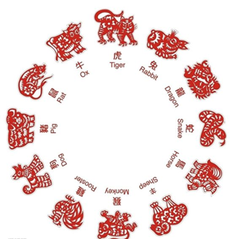

```java
/**
 * @author 尚硅谷-宋红康
 * @create 18:55
 */
public class SwitchCaseExer4 {
    public static void main(String[] args){
        //从键盘输入一个年份
        Scanner input = new Scanner(System.in);
        System.out.print("请输入年份：");
        int year = input.nextInt();
        input.close();

        //判断
        switch(year % 12){
            case 0:
                System.out.println(year + "是猴年");
                break;
            case 1:
                System.out.println(year + "是鸡年");
                break;
            case 2:
                System.out.println(year + "是狗年");
                break;
            case 3:
                System.out.println(year + "是猪年");
                break;
            case 4:
                System.out.println(year + "是鼠年");
                break;
            case 5:
                System.out.println(year + "是牛年");
                break;
            case 6:
                System.out.println(year + "是虎年");
                break;
            case 7:
                System.out.println(year + "是兔年");
                break;
            case 8:
                System.out.println(year + "是龙年");
                break;
            case 9:
                System.out.println(year + "是蛇年");
                break;
            case 10:
                System.out.println(year + "是马年");
                break;
            case 11:
                System.out.println(year + "是羊年");
                break;
            default:
                System.out.println(year + "输入错误");
        }
    }
}
```

**练习5：押宝游戏**

```
随机产生3个1-6的整数，如果三个数相等，那么称为“豹子”，如果三个数之和大于9，称为“大”，如果三个数之和小于等于9，称为“小”，用户从键盘输入押的是“豹子”、“大”、“小”，并判断是否猜对了

提示：随机数  Math.random()产生 [0,1)范围内的小数
     如何获取[a,b]范围内的随机整数呢？(int)(Math.random() * (b - a + 1)) + a
```

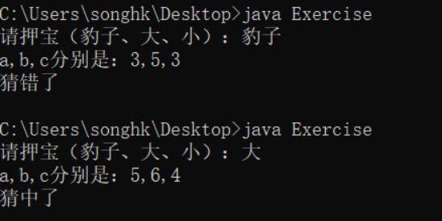

```java
import java.util.Scanner;

public class SwitchCaseExer5 {
    public static void main(String[] args) {
        //1、随机产生3个1-6的整数
        int a = (int)(Math.random()*6 + 1);
        int b = (int)(Math.random()*6 + 1);
        int c = (int)(Math.random()*6 + 1);

        //2、押宝
        Scanner input = new Scanner(System.in);
        System.out.print("请押宝（豹子、大、小）：");
        String ya = input.next();
        input.close();

        //3、判断结果
        boolean result = false;
        //switch支持String类型
        switch (ya){
            case "豹子": result = a == b && b == c; break;
            case "大": result = a + b + c > 9; break;
            case "小": result = a + b + c <= 9; break;
            default:System.out.println("输入有误！");
        }

        System.out.println("a,b,c分别是：" + a +"," + b +"," + c );
        System.out.println(result ? "猜中了" : "猜错了");
    }
}
```

**练习6：**

```java
使用switch语句改写下列if语句：

int a = 3;
int x = 100;
if(a==1)
	x+=5;
else if(a==2)
	x+=10;
else if(a==3)
	x+=16;
else
	x+=34;
```

```java
int a = 3;
int x = 100;

switch(a){
    case 1:
        x += 5;
        break;
    case 2:
        x += 10;
        break;
    case 3:
        x += 16;
        break;
    default :
        x += 34;

}
```

## 3. 循环语句

- 理解：循环语句具有在`某些条件`满足的情况下，`反复执行`特定代码的功能。

- 循环结构分类：
  - for 循环
  - while 循环
  - do-while 循环 

- 循环结构`四要素`：

  - 初始化部分
  - 循环条件部分
  - 循环体部分
  - 迭代部分


### 3.1  for循环

#### 3.1.1 基本语法

**语法格式：**


```java
for (①初始化部分; ②循环条件部分; ④迭代部分)｛
         	③循环体部分;
｝
```

**执行过程：**①-②-③-④-②-③-④-②-③-④-.....-②

**图示：**

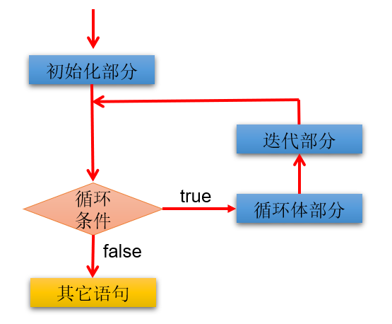

**说明：**

- for(;;)中的两个；不能多也不能少
- ①初始化部分可以声明多个变量，但必须是同一个类型，用逗号分隔
- ②循环条件部分为boolean类型表达式，当值为false时，退出循环
- ④可以有多个变量更新，用逗号分隔

#### 3.1.2 应用举例

**案例1：使用for循环重复执行某些语句**

题目：输出5行HelloWorld

```java
public class ForTest1 {
    public static void main(String[] args) {
        //需求1：控制台输出5行Hello World!
		//写法1：
		//System.out.println("Hello World!");
		//System.out.println("Hello World!");
		//System.out.println("Hello World!");
		//System.out.println("Hello World!");
		//System.out.println("Hello World!");

		//写法2：
		for(int i = 1;i <= 5;i++){
			System.out.println("Hello World!");
		}
    }
}
```

**案例2：格式的多样性**

题目：写出输出的结果

```java
public class ForTest2 {
	public static void main(String[] args) {
        int num = 1;
        for(System.out.print("a");num < 3;System.out.print("c"),num++){
            System.out.print("b");

        }
    }
}
```

**案例3：累加的思想**

题目：遍历1-100以内的偶数，并获取偶数的个数，获取所有的偶数的和

```java
public class ForTest3 {
	public static void main(String[] args) {
        int count = 0;//记录偶数的个数
        int sum = 0;//记录偶数的和

        for(int i = 1;i <= 100;i++){

            if(i % 2 == 0){
                System.out.println(i);
                count++;
                sum += i;
            }	

            //System.out.println("偶数的个数为：" + count);
        }

        System.out.println("偶数的个数为：" + count);	
        System.out.println("偶数的总和为：" + sum);
    }
}
```

**案例4：结合分支结构使用**

题目：输出所有的水仙花数，所谓水仙花数是指一个3位数，其各个位上数字立方和等于其本身。例如： `153 = 1*1*1 + 3*3*3 + 5*5*5`

```java
public class ForTest4 {
	public static void main(String[] args) {
		//定义统计变量，初始化值是0
		int count = 0;
		
		//获取三位数，用for循环实现
		for(int x = 100; x < 1000; x++) {
			//获取三位数的个位，十位，百位
			int ge = x % 10;
			int shi = x / 10 % 10;
			int bai = x / 100;
			
			//判断这个三位数是否是水仙花数，如果是，统计变量++
			if((ge*ge*ge+shi*shi*shi+bai*bai*bai) == x) {
                System.out.println("水仙花数：" + x);
				count++;
			}
		}
		
		//输出统计结果就可以了
		System.out.println("水仙花数共有"+count+"个");
	}
}
```

拓展：

```
打印出四位数字中“个位+百位”等于“十位+千位”并且个位数为偶数，千位数为奇数的数字，并打印符合条件的数字的个数。
```

**案例5：结合break的使用**

说明：输入两个正整数m和n，求其最大公约数和最小公倍数。

比如：12和20的最大公约数是4，最小公倍数是60。

```java
/**
 * @author 尚硅谷-宋红康
 * @create 17:43
 */
public class ForTest5 {
    public static void main(String[] args) {
        //需求1：最大公约数
        int m = 12, n = 20;
        //取出两个数中的较小值
        int min = (m < n) ? m : n;

        for (int i = min; i >= 1; i--) {//for(int i = 1;i <= min;i++){

            if (m % i == 0 && n % i == 0) {
                System.out.println("最大公约数是：" + i); //公约数

                break; //跳出当前循环结构
            }
        }


        //需求2：最小公倍数
        //取出两个数中的较大值
        int max = (m > n) ? m : n;

        for (int i = max; i <= m * n; i++) {

            if (i % m == 0 && i % n == 0) {

                System.out.println("最小公倍数是：" + i);//公倍数

                break;
            }
        }

    }
}
```

> 说明：
>
> 1、我们可以在循环中使用break。一旦执行break，就跳出当前循环结构。
>
> 2、小结：如何结束一个循环结构？
>
> ​      结束情况1：循环结构中的循环条件部分返回false
>
> ​      结束情况2：循环结构中执行了break。
>
> 3、如果一个循环结构不能结束，那就是一个死循环！我们开发中要避免出现死循环。

#### 3.1.3 练习

**练习1：**打印1~100之间所有奇数的和

```java
public class ForExer1 {

    public static void main(String[] args) {

        int sum = 0;//记录奇数的和
        for (int i = 1; i < 100; i++) {
            if(i % 2 != 0){
                sum += i;
            }
        }
        System.out.println("奇数总和为：" + sum);
    }
}
```

**练习2：**打印1~100之间所有是7的倍数的整数的个数及总和（体会设置计数器的思想）

```java
public class ForExer2 {

    public static void main(String[] args) {

        int sum = 0;//记录总和
        int count = 0;//记录个数
        for (int i = 1; i < 100; i++) {
            if(i % 7 == 0){
                sum += i;
                count++;
            }
        }
        System.out.println("1~100之间所有是7的倍数的整数的和为：" + sum);
        System.out.println("1~100之间所有是7的倍数的整数的个数为：" + count);
    }
}
```

**练习3：**

编写程序从1循环到150，并在每行打印一个值，另外在每个3的倍数行上打印出“foo”,在每个5的倍数行上打印“biz”,在每个7的倍数行上打印输出“baz”。

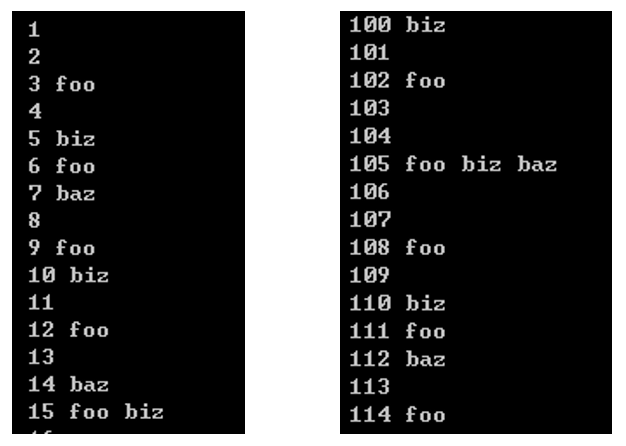

```java
public class ForExer3 {

    public static void main(String[] args) {

        for (int i = 1; i < 150; i++) {
            System.out.print(i + "\t");
            if(i % 3 == 0){
                System.out.print("foo\t");
            }
            if(i % 5 == 0){
                System.out.print("biz\t");
            }
            if(i % 7 == 0){
                System.out.print("baz\t");
            }

            System.out.println();
        }
    }
}
```

### 3.2 while循环

#### 3.2.1 基本语法

**语法格式：**

```java
①初始化部分
while(②循环条件部分)｛
    ③循环体部分;
    ④迭代部分;
}
```

**执行过程：**①-②-③-④-②-③-④-②-③-④-...-②

**图示：**


**说明：**

- while(循环条件)中循环条件必须是boolean类型。
- 注意不要忘记声明④迭代部分。否则，循环将不能结束，变成死循环。
- for循环和while循环可以相互转换。二者没有性能上的差别。实际开发中，根据具体结构的情况，选择哪个格式更合适、美观。
- for循环与while循环的区别：初始化条件部分的作用域不同。

#### 3.2.2 应用举例

**案例1：**输出5行HelloWorld!

```java
class WhileTest1 {
	public static void main(String[] args) {
		
		int i = 1;
		while(i <= 5){
			System.out.println("Hello World!");
			i++;
		}
	}
}
```

**案例2：**遍历1-100的偶数，并计算所有偶数的和、偶数的个数（累加的思想）

```java
class WhileTest2 {
	public static void main(String[] args) {
		//遍历1-100的偶数，并计算所有偶数的和、偶数的个数（累加的思想）
		int num = 1;

		int sum = 0;//记录1-100所有的偶数的和
		int count = 0;//记录1-100之间偶数的个数

		while(num <= 100){
			
			if(num % 2 == 0){
				System.out.println(num);
				sum += num;
				count++;
			}
			
			//迭代条件
			num++;
		}
	
		System.out.println("偶数的总和为：" + sum);
		System.out.println("偶数的个数为：" + count);
	}
}
```

**案例3：**猜数字游戏

```
随机生成一个100以内的数，猜这个随机数是多少？

从键盘输入数，如果大了，提示大了；如果小了，提示小了；如果对了，就不再猜了，并统计一共猜了多少次。

提示：生成一个[a,b] 范围的随机数的方式：(int)(Math.random() * (b - a + 1) + a)
```

```java
/**
 * @author 尚硅谷-宋红康
 * @create 16:42
 */
public class GuessNumber {
    public static void main(String[] args) {
        //获取一个随机数
        int random = (int) (Math.random() * 100) + 1;

        //记录猜的次数
        int count = 1;

        //实例化Scanner
        Scanner scan = new Scanner(System.in);
        System.out.println("请输入一个整数(1-100):");
        int guess = scan.nextInt();

        while (guess != random) {

            if (guess > random) {
                System.out.println("猜大了");
            } else if (guess < random) {
                System.out.println("猜小了");
            }

            System.out.println("请输入一个整数(1-100):");
            guess = scan.nextInt();
			//累加猜的次数
            count++;

        }

        System.out.println("猜中了！");
        System.out.println("一共猜了" + count + "次");
    }
}
```

**案例4：折纸珠穆朗玛峰**

```
世界最高山峰是珠穆朗玛峰，它的高度是8848.86米，假如我有一张足够大的纸，它的厚度是0.1毫米。
请问，我折叠多少次，可以折成珠穆朗玛峰的高度?
```

```java
/**
 * @author 尚硅谷-宋红康
 * @create 19:08
 */
public class ZFTest {
    public static void main(String[] args) {
        //定义一个计数器，初始值为0
        int count = 0;

        //定义珠穆朗玛峰的高度
        int zf = 8848860;//单位：毫米

        double paper = 0.1;//单位：毫米

        while(paper < zf){
            //在循环中执行累加，对应折叠了多少次
            count++;
            paper *= 2;//循环的执行过程中每次纸张折叠，纸张的厚度要加倍
        }

        //打印计数器的值
        System.out.println("需要折叠：" + count + "次");
        System.out.println("折纸的高度为" + paper/1000 + "米，超过了珠峰的高度");
    }
}
```

#### 3.2.3 练习

**练习：**从键盘输入整数，输入0结束，统计输入的正数、负数的个数。

```java
import java.util.Scanner;

public class Test05While {
    public static void main(String[] args) {
        Scanner input = new Scanner(System.in);

        int positive = 0; //记录正数的个数
        int negative = 0;  //记录负数的个数
        int num = 1; //初始化为特殊值，使得第一次循环条件成立
        while(num != 0){
            System.out.print("请输入整数（0表示结束）：");
            num = input.nextInt();

            if(num > 0){
                positive++;
            }else if(num < 0){
                negative++;
            }
        }
        System.out.println("正数个数：" + positive);
        System.out.println("负数个数：" + negative);

        input.close();
    }
}

```

### 3.3 do-while循环

#### 3.3.1 基本语法

**语法格式：**

```java
①初始化部分;
do{
	③循环体部分
	④迭代部分
}while(②循环条件部分); 
```

**执行过程：**①-③-④-②-③-④-②-③-④-...-②

**图示：**

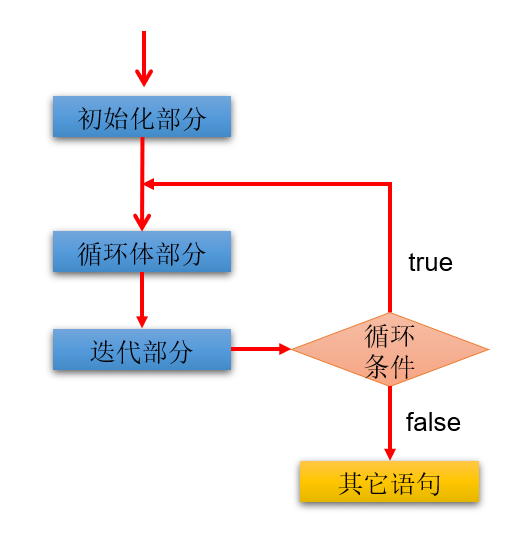

**说明：**

- 结尾while(循环条件)中循环条件必须是boolean类型
- do{}while();最后有一个分号
- do-while结构的循环体语句是至少会执行一次，这个和for和while是不一样的
- 循环的三个结构for、while、do-while三者是可以相互转换的。

#### 3.3.2 应用举例

**案例1：**遍历1-100的偶数，并计算所有偶数的和、偶数的个数（累加的思想）

```java
class DoWhileTest1 {
	public static void main(String[] args) {

		//遍历1-100的偶数，并计算所有偶数的和、偶数的个数（累加的思想）
		//初始化部分
		int num = 1;
		
		int sum = 0;//记录1-100所有的偶数的和
		int count = 0;//记录1-100之间偶数的个数

		do{
			//循环体部分
			if(num % 2 == 0){
				System.out.println(num);
				sum += num;
				count++;
			}
			
			num++;//迭代部分


		}while(num <= 100); //循环条件部分


		System.out.println("偶数的总和为：" + sum);
		System.out.println("偶数的个数为：" + count);
	}
}

```

**案例2：**体会do-while至少会执行一次循环体

```java
class DoWhileTest2 {
	public static void main(String[] args) {
        //while循环:
		int num1 = 10;
		while(num1 > 10){
			System.out.println("hello:while");
			num1--;
		}

		//do-while循环:
		int num2 = 10;
		do{
			System.out.println("hello:do-while");
			num2--;
		}while(num2 > 10);

	}
}
```

**案例3：ATM取款**

```
声明变量balance并初始化为0，用以表示银行账户的余额，下面通过ATM机程序实现存款，取款等功能。

=========ATM========
   1、存款
   2、取款
   3、显示余额
   4、退出
请选择(1-4)：
```

```java
import java.util.Scanner;

/**
 * @author 尚硅谷-宋红康
 * @create 19:12
 */
public class ATM {
	public static void main(String[] args) {

		//初始化条件
		double balance = 0.0;//表示银行账户的余额
		Scanner scan = new Scanner(System.in);
		boolean isFlag = true;//用于控制循环的结束

		do{
			System.out.println("=========ATM========");
			System.out.println("\t1、存款");
			System.out.println("\t2、取款");
			System.out.println("\t3、显示余额");
			System.out.println("\t4、退出");
			System.out.print("请选择(1-4)：");

			int selection = scan.nextInt();
			
			switch(selection){
				case 1:
					System.out.print("要存款的额度为：");
					double addMoney = scan.nextDouble();
					if(addMoney > 0){
						balance += addMoney;
					}
					break;
				case 2:
					System.out.print("要取款的额度为：");
					double minusMoney = scan.nextDouble();
					if(minusMoney > 0 && balance >= minusMoney){
						balance -= minusMoney;
					}else{
						System.out.println("您输入的数据非法或余额不足");
					}
					break;
				case 3:
					System.out.println("当前的余额为：" + balance);
					break;
				case 4:
					System.out.println("欢迎下次进入此系统。^_^");
					isFlag = false;
					break;
				default:
					System.out.println("请重新选择！");
					break;	
			}
		
		}while(isFlag);

		//资源关闭
		scan.close();
		
	}
}
```

#### 3.3.3 练习

**练习1：**随机生成一个100以内的数，猜这个随机数是多少？

从键盘输入数，如果大了提示，大了；如果小了，提示小了；如果对了，就不再猜了，并统计一共猜了多少次。

```java
import java.util.Scanner;

public class DoWhileExer {
    public static void main(String[] args) {
        //随机生成一个100以内的整数
		/*
		Math.random() ==> [0,1)的小数
		Math.random()* 100 ==> [0,100)的小数
		(int)(Math.random()* 100) ==> [0,100)的整数
		*/
        int num = (int)(Math.random()* 100);
        //System.out.println(num);

        //声明一个变量，用来存储猜的次数
        int count = 0;

        Scanner input = new Scanner(System.in);
        int guess;//提升作用域
        do{
            System.out.print("请输入100以内的整数：");
            guess = input.nextInt();

            //输入一次，就表示猜了一次
            count++;

            if(guess > num){
                System.out.println("大了");
            }else if(guess < num){
                System.out.println("小了");
            }
        }while(num != guess);

        System.out.println("一共猜了：" + count+"次");

        input.close();
    }
}
```

### 3.4 对比三种循环结构

- **三种循环结构都具有四个要素：**
  - 循环变量的初始化条件
  - 循环条件
  - 循环体语句块
  - 循环变量的修改的迭代表达式

* **从循环次数角度分析**
  * do-while循环至少执行一次循环体语句。
  * for和while循环先判断循环条件语句是否成立，然后决定是否执行循环体。
* **如何选择**
  * 遍历有明显的循环次数（范围）的需求，选择for循环
  * 遍历没有明显的循环次数（范围）的需求，选择while循环
  * 如果循环体语句块至少执行一次，可以考虑使用do-while循环
  * 本质上：三种循环之间完全可以互相转换，都能实现循环的功能

### 3.5 "无限"循环


#### 3.5.1 基本语法

**语法格式：**

- 最简单"无限"循环格式：`while(true)` , `for(;;)` 

**适用场景：**

- 开发中，有时并不确定需要循环多少次，需要根据循环体内部某些条件，来控制循环的结束（使用break）。
- 如果此循环结构不能终止，则构成了死循环！开发中要避免出现死循环。

#### 3.5.2 应用举例

**案例1：**实现爱你到永远...

```java
public class EndlessFor1 {
    public static void main(String[] args) {
        for (;;){
            System.out.println("我爱你！");
        }
//        System.out.println("end");//永远无法到达的语句，编译报错
    }
}
```

```java
public class EndlessFor2 {
    public static void main(String[] args) {
        for (; true;){ //条件永远成立，死循环
            System.out.println("我爱你！");
        }
    }
}
```

```java
public class EndlessFor3 {
    public static void main(String[] args) {
        for (int i=1; i<=10; ){ //循环变量没有修改，条件永远成立，死循环
            System.out.println("我爱你！");
        }
    }
}
```

思考：如下代码执行效果

```java
public class EndlessFor4 {
    public static void main(String[] args) {
        for (int i=1; i>=10; ){ //一次都不执行
            System.out.println("我爱你！");
        }
    }
}
```

**案例2：**从键盘读入个数不确定的整数，并判断读入的正数和负数的个数，输入为0时结束程序。

```java
import java.util.Scanner;

class PositiveNegative {
	public static void main(String[] args) {
		Scanner scanner = new Scanner(System.in);
        
		int positiveNumber = 0;//统计正数的个数
		int negativeNumber = 0;//统计负数的个数
		for(;;){  //while(true){
			System.out.println("请输入一个整数：(输入为0时结束程序)");
			int num = scanner.nextInt();
			if(num > 0){
				 positiveNumber++;
            }else if(num < 0){
				 negativeNumber++;
        	}else{
                System.out.println("程序结束");
				break; 
            }
         }
		 System.out.println("正数的个数为："+ positiveNumber);
		 System.out.println("负数的个数为："+ negativeNumber);  
        
         scanner.close();
	} 
}

```

### 3.6 嵌套循环（或多重循环）

#### 3.6.1 使用说明

- **所谓嵌套循环**，是指一个循环结构A的循环体是另一个循环结构B。比如，for循环里面还有一个for循环，就是嵌套循环。其中，for ,while ,do-while均可以作为外层循环或内层循环。
  - 外层循环：循环结构A
  - 内层循环：循环结构B
- 实质上，`嵌套循环就是把内层循环当成外层循环的循环体`。只有当内层循环的循环条件为false时，才会完全跳出内层循环，才可结束外层的当次循环，开始下一次的外层循环。
- 设外层循环次数为`m`次，内层为`n`次，则内层循环体实际上需要执行`m*n`次。
- **技巧：**从二维图形的角度看，外层循环控制`行数`，内层循环控制`列数`。
- **开发经验：**实际开发中，我们最多见到的嵌套循环是两层。一般不会出现超过三层的嵌套循环。如果将要出现，一定要停下来重新梳理业务逻辑，重新思考算法的实现，控制在三层以内。否则，可读性会很差。

例如：两个for嵌套循环格式	

```java
for(初始化语句①; 循环条件语句②; 迭代语句⑦) {
    for(初始化语句③; 循环条件语句④; 迭代语句⑥) {
      	循环体语句⑤;
    }
}

//执行过程：① - ② - ③ - ④ - ⑤ - ⑥ - ④ - ⑤ - ⑥ - ... - ④ - ⑦ - ② - ③ - ④ - ⑤ - ⑥ - ④..
```

**执行特点：**外层循环执行一次，内层循环执行一轮。

#### 3.6.2 应用举例

**案例1：**打印5行6个*

```java
class ForForTest1 {
	public static void main(String[] args) {
		/*
		
		******
		******
		******
		******
		******
		
		*/
		
		for(int j = 1;j <= 5;j++){

			for(int i = 1;i <= 6;i++){
				System.out.print("*");
			}
			
			System.out.println();
		}
    }
}
```

**案例2：**打印5行直角三角形

```
*
**
***
****
*****
```

```java
public class ForForTest2 {
    public static void main(String[] args){
        for (int i = 1; i <= 5; i++) {
            for (int j = 1; j <= i; j++) {
                System.out.print("*");
            }
            System.out.println();
        }
    }
}	
```

**案例3：**打印5行倒直角三角形

```
*****
****
***
**
*
```

```java
public class ForForTest3 {
    public static void main(String[] args){
        for(int i = 1;i <= 5;i++){
			for(int j = 1;j <= 6 - i;j++){
				System.out.print("*");
			
			}
			System.out.println();
		
		}
    }
}
```

**案例4：打印"菱形"形状的图案**

```
        * 
      * * * 
    * * * * * 
  * * * * * * * 
* * * * * * * * * 
  * * * * * * * 
    * * * * * 
      * * * 
        * 	
```

```java
public class ForForTest4 {

    public static void main(String[] args) {
    /*
        上半部分		i		m(表示-的个数)    n(表示*的个数)关系式：2*i + m = 10 --> m = 10 - 2*i
    --------*		   1	   8			   1							n = 2 * i - 1
    ------* * *		   2	   6			   3
    ----* * * * *	   3	   4			   5
    --* * * * * * *	   4	   2		       7
    * * * * * * * * *  5	   0			   9

        下半部分         i      m                n              关系式： m = 2 * i
    --* * * * * * *    1       2                7                     n = 9 - 2 * i
    ----* * * * *      2       4                5
    ------* * *        3       6                3
    --------*          4       8                1

            */
        //上半部分
        for (int i = 1; i <= 5; i++) {
            //-
            for (int j = 1; j <= 10 - 2 * i; j++) {
                System.out.print(" ");
            }
            //*
            for (int k = 1; k <= 2 * i - 1; k++) {
                System.out.print("* ");
            }
            System.out.println();
        }
        //下半部分
        for (int i = 1; i <= 4; i++) {
            //-
            for (int j = 1; j <= 2 * i; j++) {
                System.out.print(" ");
            }

            //*
            for (int k = 1; k <= 9 - 2 * i; k++) {
                System.out.print("* ");
            }
            System.out.println();
        }
    }

}
```

**案例5：九九乘法表**

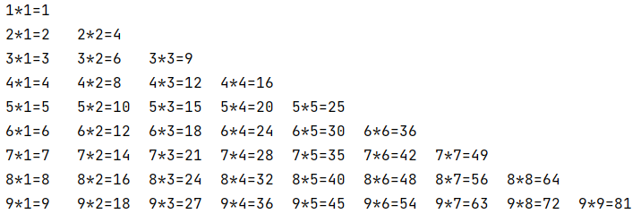

```java
public class ForForTest5 {
    public static void main(String[] args) {
        for (int i = 1; i <= 9; i++) {
            for (int j = 1; j <= i; j++) {
                System.out.print(i + "*" + j + "=" + (i * j) + "\t");
            }
            System.out.println();
        }
    }
}
```

#### 3.6.3 练习

**练习1：**将一天中的时间打印到控制台

```java
public class ForForDemo {
	public static void main (String[] args) {
		for (int hour = 0;hour < 24 ;hour++ ) {
			for (int min = 0; min < 60 ; min++) {
				System.out.println(hour + "时" + min +"分");
			}
		}	
	}
}
```

## 4. 关键字break和continue的使用

### 4.1 break和continue的说明

```
			适用范围			在循环结构中使用的作用						相同点

break		switch-case
			循环结构			一旦执行，就结束(或跳出)当前循环结构		    此关键字的后面，不能声明语句

continue	循环结构			一旦执行，就结束(或跳出)当次循环结构		    此关键字的后面，不能声明语句
```

此外，很多语言都有goto语句，goto语句可以随意将控制转移到程序中的任意一条语句上，然后执行它，但使程序容易出错。Java中的break和continue是不同于goto的。

### 4.2 应用举例

```java
class BreakContinueTest1 {
	public static void main(String[] args) {
	
		for(int i = 1;i <= 10;i++){
			
			if(i % 4 == 0){
				//break;//123
				continue;//123567910
				//如下的语句不可能被执行，编译不通过
				//System.out.println("今晚迪丽热巴要约我吃饭");
			}

			System.out.print(i);
		}

		System.out.println("####");

		//嵌套循环中的使用
		for(int i = 1;i <= 4;i++){
		
			for(int j = 1;j <= 10;j++){
				if(j % 4 == 0){
					//break; //结束的是包裹break关键字的最近的一层循环！
					continue;//结束的是包裹break关键字的最近的一层循环的当次！
				}
				System.out.print(j);
			}
			System.out.println();
		}

	}
}
```

### 4.3 带标签的使用

```java
break语句用于终止某个语句块的执行
{    ……	 
	break;
	 ……
}

break语句出现在多层嵌套的语句块中时，可以通过标签指明要终止的是哪一层语句块 
	label1: {   ……        
	label2:	     {   ……
	label3:			 {   ……
				           break label2;
				           ……
					 }
			     }
			} 

```

- continue语句出现在多层嵌套的循环语句体中时，也可以通过标签指明要跳过的是哪一层循环。
- 标号语句必须紧接在循环的头部。标号语句不能用在非循环语句的前面。

- 举例：


```java
class BreakContinueTest2 {
	public static void main(String[] args) {
		l:for(int i = 1;i <= 4;i++){
		
			for(int j = 1;j <= 10;j++){
				if(j % 4 == 0){
					//break l;
					continue l;
				}
				System.out.print(j);
			}
			System.out.println();
		}
	}
}
```

### 4.4 经典案例

**题目：找出100以内所有的素数（质数）？100000以内的呢？**

目的：不同的代码的实现方式，可以效率差别很大。

分析：素数（质数）：只能被1和它本身整除的自然数。  ---> 从2开始，到这个数-1为止，此范围内没有这个数的约数。则此数是一个质数。
比如：2、3、5、7、11、13、17、19、23、...

**实现方式1：**

```java
class PrimeNumberTest {
	public static void main(String[] args) {
		
		
		//boolean isFlag = true; //用于标识i是否被除尽过

		long start = System.currentTimeMillis(); //记录当前时间距离1970-1-1 00:00:00的毫秒数
			
		int count = 0;//记录质数的个数


		for(int i = 2;i <= 100000;i++){  //i

			boolean isFlag = true; //用于标识i是否被除尽过
		
			for(int j = 2;j <= i - 1;j++){
				
				if(i % j == 0){ //表明i有约数
					isFlag = false;
				}
			
			}

			//判断i是否是质数
			if(isFlag){ //如果isFlag变量没有给修改过值，就意味着i没有被j除尽过。则i是一个质数
				//System.out.println(i);
				count++;
			}

			//重置isFlag
			//isFlag = true;
		
		}

		long end = System.currentTimeMillis();
		System.out.println("质数的个数为：" + count);
		System.out.println("执行此程序花费的毫秒数为：" + (end - start)); //16628

	}
}
```

**实现方式2：**针对实现方式1进行优化

```java
class PrimeNumberTest1 {
	public static void main(String[] args) {
		
		long start = System.currentTimeMillis(); //记录当前时间距离1970-1-1 00:00:00的毫秒数

		int count = 0;//记录质数的个数

		for(int i = 2;i <= 100000;i++){  //i

			boolean isFlag = true; //用于标识i是否被除尽过
		
			for(int j = 2;j <= Math.sqrt(i);j++){ //优化2：将循环条件中的i改为Math.sqrt(i)
				
				if(i % j == 0){ //表明i有约数
					isFlag = false;
					break;//优化1：主要针对非质数起作用
				}
			
			}

			//判断i是否是质数
			if(isFlag){ //如果isFlag变量没有给修改过值，就意味着i没有被j除尽过。则i是一个质数
				//System.out.println(i);
				count++;
			}
		
		}

		long end = System.currentTimeMillis();
		System.out.println("质数的个数为：" + count);
		System.out.println("执行此程序花费的毫秒数为：" + (end - start));//1062

	}
}
```

**实现方式3（选做）：**使用continue + 标签

```java
class PrimeNumberTest2 {
	public static void main(String[] args) {
		
		long start = System.currentTimeMillis(); //记录当前时间距离1970-1-1 00:00:00的毫秒数

		int count = 0;//记录质数的个数

		label:for(int i = 2;i <= 100000;i++){  //i
		
			for(int j = 2;j <= Math.sqrt(i);j++){ //优化2：将循环条件中的i改为Math.sqrt(i)
				
				if(i % j == 0){ //表明i有约数
					continue label;
				}
			
			}
			//一旦程序能执行到此位置，说明i就是一个质数
			System.out.println(i);
			count++;
		}
		

		long end = System.currentTimeMillis();
		System.out.println("质数的个数为：" + count);
		System.out.println("执行此程序花费的毫秒数为：" + (end - start));//1062

	}
}
```

### 4.5 练习

**练习1：**

```
生成 1-100 之间的随机数，直到生成了 97 这个数，看看一共用了几次？

提示：使用 (int)(Math.random() * 100) + 1
```

```java
public class NumberGuessTest {
    public static void main(String[] args) {
        int count = 0;//记录循环的次数（或生成随机数进行比较的次数）
        while(true){
            int random = (int)(Math.random() * 100) + 1;
            count++;
            if(random == 97){
                break;
            }
        }

        System.out.println("直到生成随机数97，一共比较了" + count + "次");

    }
}
```

## 5. Scanner：键盘输入功能的实现

- 如何从键盘获取不同类型（基本数据类型、String类型）的变量：使用Scanner类。

- 键盘输入代码的四个步骤：
  1. 导包：`import java.util.Scanner;`
  2. 创建Scanner类型的对象：`Scanner scan = new Scanner(System.in);`
  3. 调用Scanner类的相关方法（`next() / nextXxx()`），来获取指定类型的变量
  4. 释放资源：`scan.close();`
- 注意：需要根据相应的方法，来输入指定类型的值。如果输入的数据类型与要求的类型不匹配时，会报异常 导致程序终止。

### 5.1 各种类型的数据输入

**案例：**小明注册某交友网站，要求录入个人相关信息。如下：

请输入你的网名、你的年龄、你的体重、你是否单身、你的性别等情况。

```java
//① 导包
import java.util.Scanner;

public class ScannerTest1 {

    public static void main(String[] args) {
        //② 创建Scanner的对象
        //Scanner是一个引用数据类型，它的全名称是java.util.Scanner
        //scanner就是一个引用数据类型的变量了，赋给它的值是一个对象（对象的概念我们后面学习，暂时先这么叫）
        //new Scanner(System.in)是一个new表达式，该表达式的结果是一个对象
        //引用数据类型  变量 = 对象;
        //这个等式的意思可以理解为用一个引用数据类型的变量代表一个对象，所以这个变量的名称又称为对象名
        //我们也把scanner变量叫做scanner对象
        Scanner scanner = new Scanner(System.in);//System.in默认代表键盘输入
        
        //③根据提示，调用Scanner的方法，获取不同类型的变量
        System.out.println("欢迎光临你好我好交友网站！");
        System.out.print("请输入你的网名：");
        String name = scanner.next();

        System.out.print("请输入你的年龄：");
        int age = scanner.nextInt();

        System.out.print("请输入你的体重：");
        double weight = scanner.nextDouble();

        System.out.print("你是否单身（true/false)：");
        boolean isSingle = scanner.nextBoolean();

        System.out.print("请输入你的性别：");
        char gender = scanner.next().charAt(0);//先按照字符串接收，然后再取字符串的第一个字符（下标为0）

        System.out.println("你的基本情况如下：");
        System.out.println("网名：" + name + "\n年龄：" + age + "\n体重：" + weight + 
                           "\n单身：" + isSingle + "\n性别：" + gender);
        
        //④ 关闭资源
        scanner.close();
    }
}
```

### 5.2 练习

**练习1：**

```
大家都知道，男大当婚，女大当嫁。那么女方家长要嫁女儿，当然要提出一定的条件：高：180cm以上；富：财富1千万以上；帅：是。

如果这三个条件同时满足，则：“我一定要嫁给他!!!”
如果三个条件有为真的情况，则：“嫁吧，比上不足，比下有余。”
如果三个条件都不满足，则：“不嫁！”

提示：
System.out.println(“身高: (cm));
scanner.nextInt();

System.out.println(“财富: (千万));
scanner.nextDouble();

System.out.println(“帅否: (true/false));   
scanner.nextBoolean();  


System.out.println(“帅否: (是/否));
scanner.next();   "是".equals(str)  
```

```java
import java.util.Scanner;

class ScannerExer1 {
	public static void main(String[] args) {
		
		Scanner scan = new Scanner(System.in);

		System.out.println("请输入你的身高：(cm)");
		int height = scan.nextInt();

		System.out.println("请输入你的财富：(以千万为单位)");
		double wealth = scan.nextDouble();

		/*
		
		方式1：关于是否帅问题，我们使用boolean类型接收

		System.out.println("帅否？(true/false)");
		boolean isHandsome = scan.nextBoolean();

		//判断
		if(height >= 180 && wealth >= 1.0 && isHandsome){ //不建议isHandsome == true
			System.out.println("我一定要嫁给他!!!");
		}else if(height >= 180 || wealth >= 1.0 || isHandsome){
			System.out.println("嫁吧，比上不足，比下有余。");
		}else{
			System.out.println("不嫁");
		}

		*/

		//方式2：关于是否帅问题，我们使用String类型接收
		System.out.println("帅否？(是/否)");
		String isHandsome = scan.next();
		
		//判断
		if(height >= 180 && wealth >= 1.0 && isHandsome == "是"){  //知识点：判断两个字符串是否相等，使用String的equals()
			System.out.println("我一定要嫁给他!!!");
		}else if(height >= 180 || wealth >= 1.0 || isHandsome == "是"){
			System.out.println("嫁吧，比上不足，比下有余。");
		}else{
			System.out.println("不嫁");
		}

		//关闭资源
		scan.close();
	}
}
```

**练习2：**

```
我家的狗5岁了，5岁的狗相当于人类多大呢？其实，狗的前两年每一年相当于人类的10.5岁，之后每增加一年就增加四岁。那么5岁的狗相当于人类多少年龄呢？应该是：10.5 + 10.5 + 4 + 4 + 4 = 33岁。

编写一个程序，获取用户输入的狗的年龄，通过程序显示其相当于人类的年龄。如果用户输入负数，请显示一个提示信息。

```

```java
import java.util.Scanner;

class ScannerExer2 {
	public static void main(String[] args) {
		
		Scanner scan = new Scanner(System.in);

		System.out.println("请输入狗狗的年龄：");
		int dogAge = scan.nextInt();

		//通过分支语句，判断狗狗相当于人的年龄
		if(dogAge < 0){
			System.out.println("你输入的狗狗的年龄不合法");
		}else if(dogAge <= 2){
			System.out.println("相当于人的年龄：" + (dogAge * 10.5));
		}else{
			System.out.println("相当于人的年龄：" + (2 * 10.5 + (dogAge - 2) * 4));
		}

		//关闭资源
		scan.close();

	}
}
```

## 6. 如何获取一个随机数

如何产生一个指定范围的随机整数？

1、Math类的random()的调用，会返回一个[0,1)范围的一个double型值

2、Math.random() * 100  --->  [0,100)
      (int)(Math.random() * 100)	---> [0,99]
      (int)(Math.random() * 100) + 5  ----> [5,104]

3、如何获取`[a,b]`范围内的随机整数呢？`(int)(Math.random() * (b - a + 1)) + a`

4、举例

```java
class MathRandomTest {
	public static void main(String[] args) {
		double value = Math.random();
		System.out.println(value);

		//[1,6]
		int number = (int)(Math.random() * 6) + 1; //
		System.out.println(number);
	}
}

```

