# 第04章_IDEA的安装与使用（下）

讲师：尚硅谷-宋红康（江湖人称：康师傅）

官网：[http://www.atguigu.com](http://www.atguigu.com/)

***

## 8. 快捷键的使用

### 8.1 常用快捷键

见《`尚硅谷_宋红康_IntelliJ IDEA 常用快捷键一览表.md`》

### 8.2 查看快捷键

#### 1、已知快捷键操作名，未知快捷键

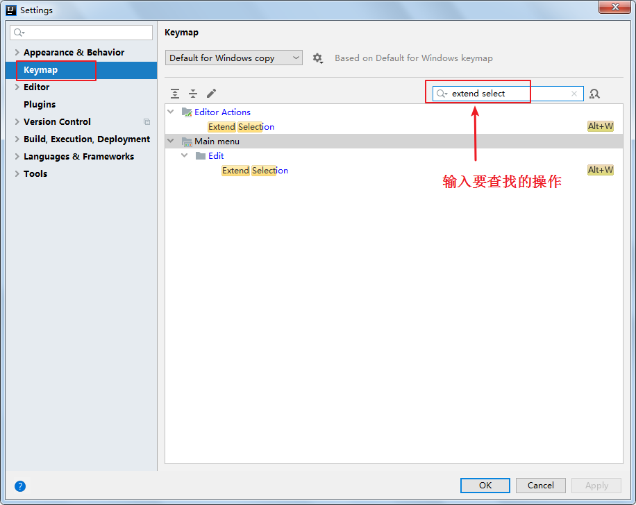

#### 2、已知快捷键，不知道对应的操作名

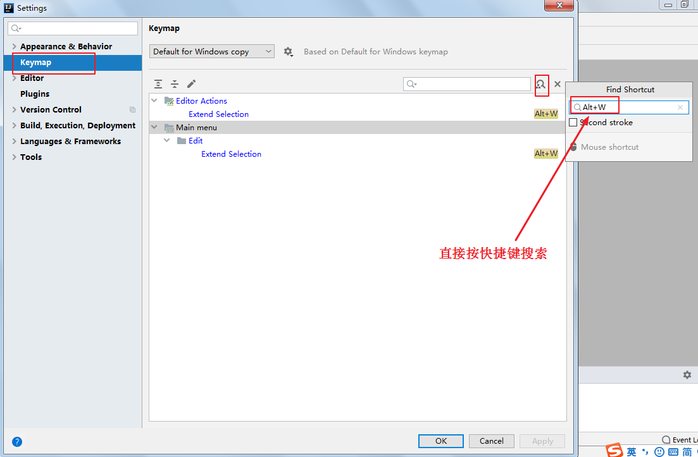

### 8.3 自定义快捷键

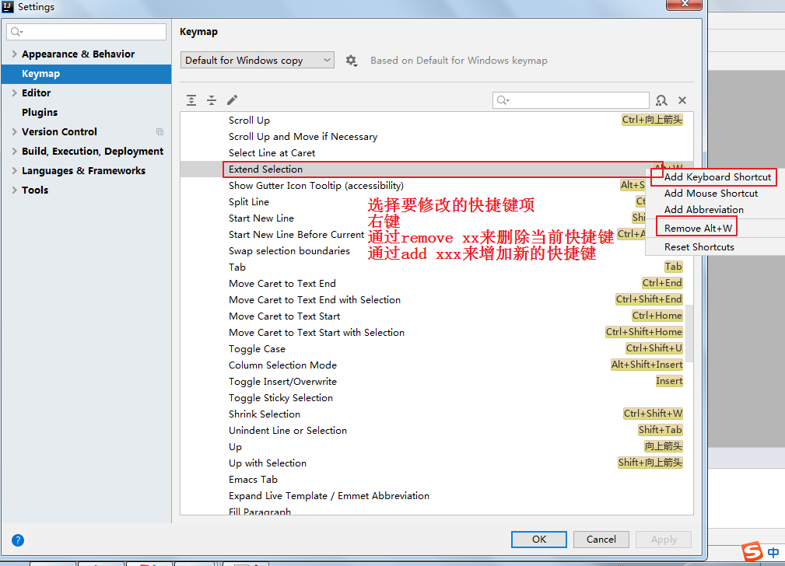

### 8.4 使用其它平台快捷键

苹果电脑或者是用惯Eclipse快捷的，可以选择其他快捷键插件。

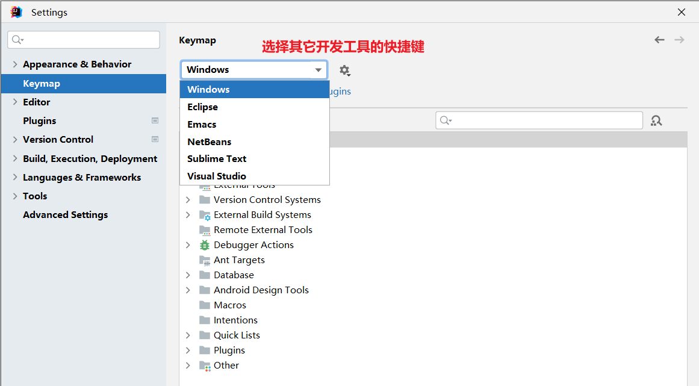

## 9. IDEA断点调试(Debug)

### 9.1 为什么需要Debug

编好的程序在执行过程中如果出现错误，该如何查找或定位错误呢？简单的代码直接就可以看出来，但如果代码比较复杂，就需要借助程序调试工具（Debug）来查找错误了。

```
运行编写好的程序时，可能出现的几种情况：
> 情况1：没有任何bug,程序执行正确！

====================如果出现如下的三种情况，都又必要使用debug=============================
> 情况2：运行以后，出现了错误或异常信息。但是通过日志文件或控制台，显示了异常信息的位置。
> 情况3：运行以后，得到了结果，但是结果不是我们想要的。
> 情况4：运行以后，得到了结果，结果大概率是我们想要的。但是多次运行的话，可能会出现不是我们想要的情况。
        比如：多线程情况下，处理线程安全问题。
        
```

### 9.2 Debug的步骤

Debug(调试)程序步骤如下：

1、添加断点

2、启动调试

3、单步执行

4、观察变量和执行流程，找到并解决问题

#### 1、添加断点

在源代码文件中，在想要设置断点的代码行的前面的标记行处，单击鼠标左键就可以设置断点，在相同位置再次单击即可取消断点。

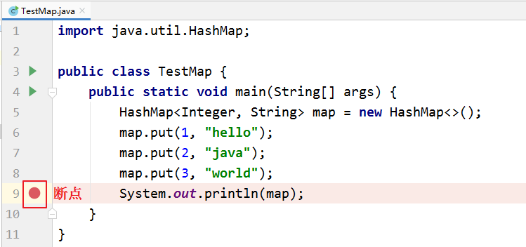

#### 2、启动调试

IDEA提供多种方式来启动程序(Launch)的调试，分别是通过菜单(Run –> Debug)、图标(“绿色臭虫”等等

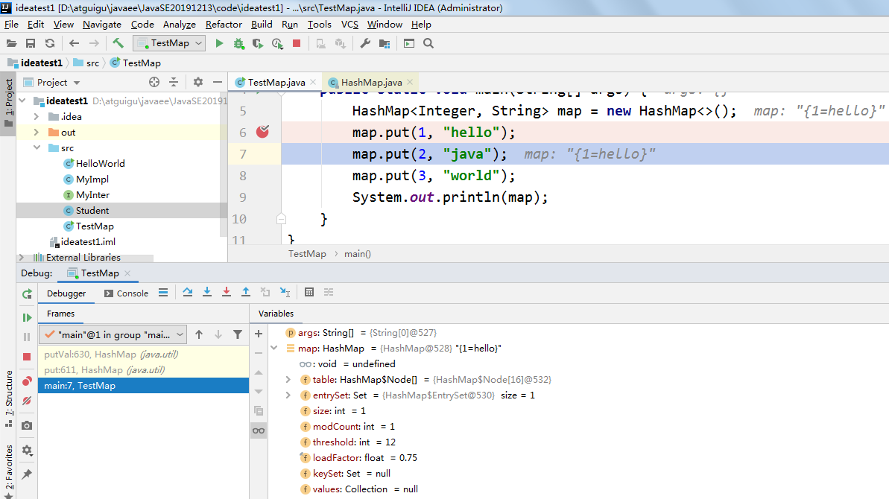

#### 3、单步调试工具介绍

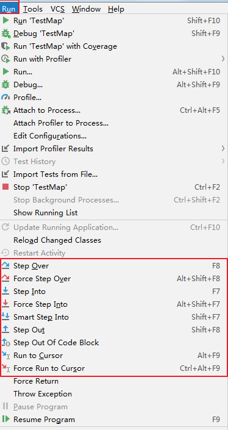

或

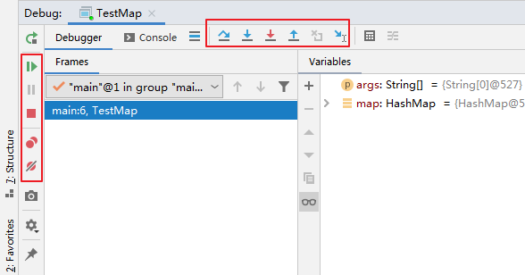

：Step Over（F8）：进入下一步，如果当前行断点是调用一个方法，则不进入当前方法体内

：Step Into（F7）：进入下一步，如果当前行断点是调用一个自定义方法，则进入该方法体内

：Force Step Into（Alt +Shift  + F7）：进入下一步，如果当前行断点是调用一个核心类库方法，则进入该方法体内

：Step Out（Shift  + F8）：跳出当前方法体

：Run to Cursor（Alt + F9）：直接跳到光标处继续调试

：Resume Program（F9）：恢复程序运行，但如果该断点下面代码还有断点则停在下一个断点上

：Stop（Ctrl + F2）：结束调试

：View Breakpoints（Ctrl + Shift  + F8）：查看所有断点

：Mute Breakpoints：使得当前代码后面所有的断点失效， 一下执行到底 

> 说明：在Debug过程中，可以动态的下断点。

### 9.3 多种Debug情况介绍

#### 9.3.1 行断点

- 断点打在代码所在的行上。执行到此行时，会停下来。

```java
package com.atguigu.debug;

/**
 * ClassName: Debug01
 * Package: com.atguigu.debug
 * Description: 演示1：行断点  &  测试debug各个常见操作按钮
 *
 * @Author: 尚硅谷-宋红康
 * @Create: 2022/10/20 18:44
 * @Version 1.0
 */
public class Debug01 {
    public static void main(String[] args) {
        //1.
        int m = 10;
        int n = 20;
        System.out.println("m = " + m + ",n = " + n);
        swap(m, n);
        System.out.println("m = " + m + ",n = " + n);

        //2.
        int[] arr = new int[] {1,2,3,4,5};
        System.out.println(arr);//地址值

        char[] arr1 = new char[] {'a','b','c'};
        System.out.println(arr1);//abc
    }

    public static void swap(int m,int n){
        int temp = m;
        m = n;
        n = temp;
    }

}

```

#### 9.3.2 方法断点

- 断点设置在方法的签名上，默认当进入时，断点可以被唤醒。
- 也可以设置在方法退出时，断点也被唤醒

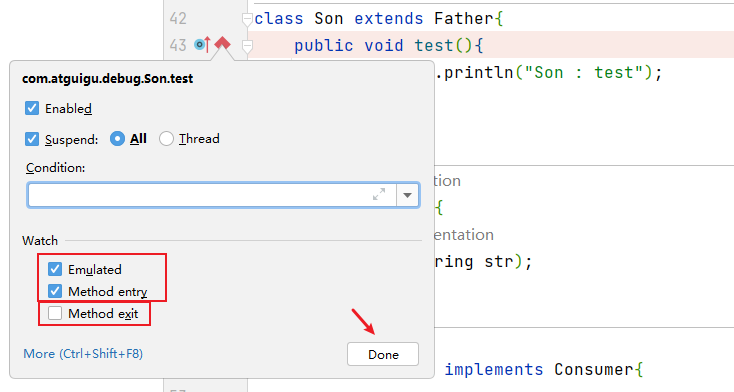

- 在多态的场景下，在父类或接口的方法上打断点，会自动调入到子类或实现类的方法

```java
package com.atguigu.debug;

import java.util.HashMap;

/**
 * ClassName: Debug02
 * Package: com.atguigu.debug
 * Description: 演示2： 方法断点
 *
 * @Author: 尚硅谷-宋红康
 * @Create: 2022/10/20 21:15
 * @Version 1.0
 */
public class Debug02 {
    public static void main(String[] args) {

        //1.
        Son instance = new Son();
        instance.test();
        //2.
        Father instance1 = new Son();
        instance1.test();

        //3.
        Consumer con = new ConsumerImpl();
        con.accept("atguigu");

        //4.
        HashMap map = new HashMap();
        map.put("Tom",12);
        map.put("Jerry",11);
        map.put("Tony",20);
    }
}

class Father{
    public void test(){
        System.out.println("Father : test");
    }
}

class Son extends Father{
    public void test(){
        System.out.println("Son : test");
    }
}

interface Consumer{
    void accept(String str);
}

class ConsumerImpl implements Consumer{

    @Override
    public void accept(String str) {
        System.out.println("ConsumerImple:" + str);
    }
}


```

#### 9.3.3 字段断点

- 在类的属性声明上打断点，默认对属性的修改操作进行监控

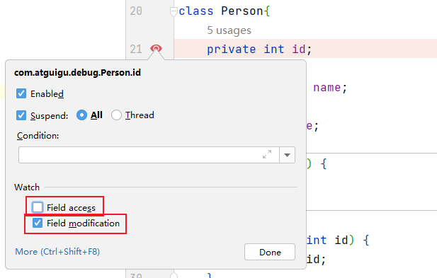

```java
package com.atguigu.debug;

/**
 * ClassName: Debug03
 * Package: com.atguigu.debug
 * Description: 演示3：字段断点
 *
 * @Author: 尚硅谷-宋红康
 * @Create: 2022/10/20 21:34
 * @Version 1.0
 */
public class Debug03 {
    public static void main(String[] args) {
        Person p1 = new Person(3);

        System.out.println(p1);
    }
}

class Person{
    private int id = 1;
    private String name;
    private int age;

    public Person() {
    }
    {
        id = 2;
    }
    public Person(int id) {
        this.id = id;
    }


    public Person(int id, String name, int age) {
        this.id = id;
        this.name = name;
        this.age = age;
    }

    public int getId() {
        return id;
    }

    public void setId(int id) {
        this.id = id;
    }

    public String getName() {
        return name;
    }

    public void setName(String name) {
        this.name = name;
    }

    public int getAge() {
        return age;
    }

    public void setAge(int age) {
        this.age = age;
    }

    @Override
    public String toString() {
        return "Person{" +
                "id=" + id +
                ", name='" + name + '\'' +
                ", age=" + age +
                '}';
    }
}

```

#### 9.3.4 条件断点

```java
package com.atguigu.debug;

/**
 * ClassName: Debug04
 * Package: com.atguigu.debug
 * Description: 演示4：条件断点
 *
 * @Author: 尚硅谷-宋红康
 * @Create: 2022/10/20 21:49
 * @Version 1.0
 */
public class Debug04 {
    public static void main(String[] args) {
        int[] arr = new int[]{1,2,3,4,5,6,7,8,9,10,11,12};

        for (int i = 0; i < arr.length; i++) {
            int target = arr[i];
            System.out.println(target);
        }
    }
}
```

针对上述代码，在满足arr[i] % 3 == 0的条件下，执行断点。

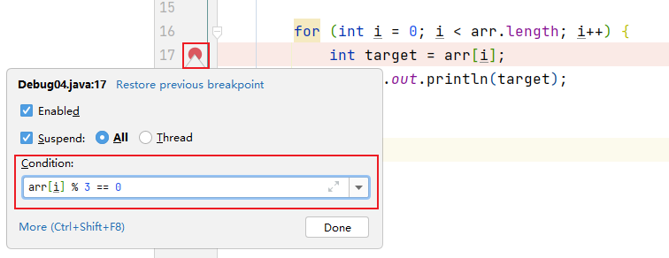

#### 9.3.5 异常断点（暂略）

- 对异常进行跟踪。如果程序出现指定异常，程序就会执行断点，自动停住。

```java
package com.atguigu.debug;

import java.util.Date;

/**
 * ClassName: Debug05
 * Package: com.atguigu.debug
 * Description: 演示5：异常断点
 *
 * @Author: 尚硅谷-宋红康
 * @Create: 2022/10/20 22:01
 * @Version 1.0
 */
public class Debug05 {
    public static void main(String[] args) {

        int m = 10;
        int n = 0;
        int result = m / n;
        System.out.println(result);


//        Person p1 = new Person(1001);
//        System.out.println(p1.getName().toUpperCase());


    }
}

```

通过下图的方式，对指定的异常进行监控：

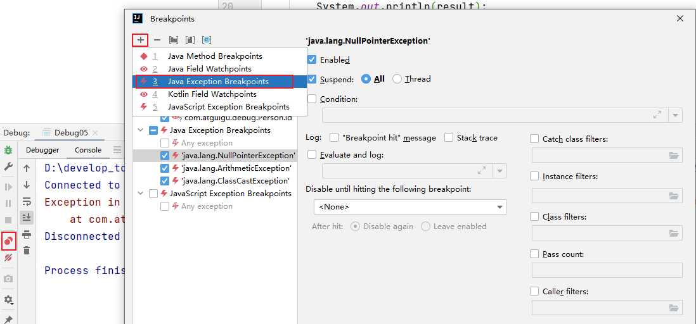

#### 9.3.6 线程调试（暂略）

```java
package com.atguigu.debug;

/**
 * ClassName: Debug06
 * Package: com.atguigu.debug
 * Description: 演示6：线程调试
 *
 * @Author: 尚硅谷-宋红康
 * @Create: 2022/10/20 22:46
 * @Version 1.0
 */
public class Debug06 {

    public static void main(String[] args) {

        test("Thread1");
        test("Thread2");


    }

    public static void test(String threadName) {
        new Thread(
                () -> System.out.println(Thread.currentThread().getName()),
                threadName
        ).start();
    }

}

```

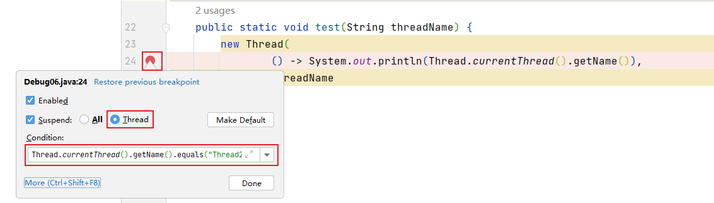

#### 9.3.7 强制结束

```java
package com.atguigu.debug;

/**
 * ClassName: Debug07
 * Package: com.atguigu.debug
 * Description: 演示7：强制结束
 *
 * @Author: 尚硅谷-宋红康
 * @Create: 2022/10/20 23:15
 * @Version 1.0
 */
public class Debug07 {
    public static void main(String[] args) {
        System.out.println("获取请求的数据");
        System.out.println("调用写入数据库的方法");
        insert();
        System.out.println("程序结束");
    }

    private static void insert() {
        System.out.println("进入insert()方法");
        System.out.println("获取数据库连接");
        System.out.println("将数据写入数据表中");
        System.out.println("写出操作完成");
        System.out.println("断开连接");
    }
}

```

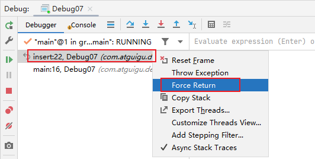

### 9.4 自定义调试数据视图（暂略）

```java
package com.atguigu.debug;

import java.util.HashMap;

/**
 * ClassName: Debug08
 * Package: com.atguigu.debug
 * Description: 演示8：用户自定义数据视图
 *
 * @Author: 尚硅谷-宋红康
 * @Create: 2022/10/20 23:21
 * @Version 1.0
 */
public class Debug08 {
    public static void main(String[] args) {
        HashMap<Integer,String> map = new HashMap<>();
        map.put(1,"高铁");
        map.put(2,"网购");
        map.put(3,"支付宝");
        map.put(4,"共享单车");

        System.out.println(map);
    }
}

```

设置如下：

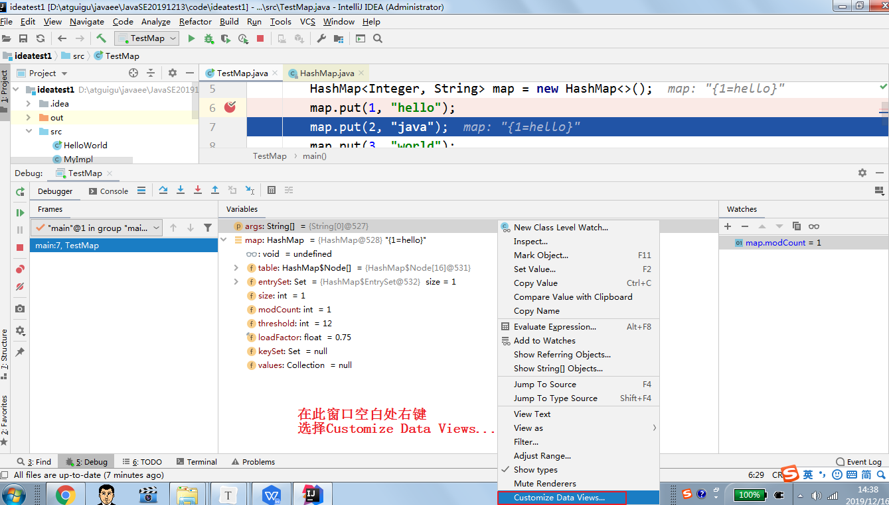

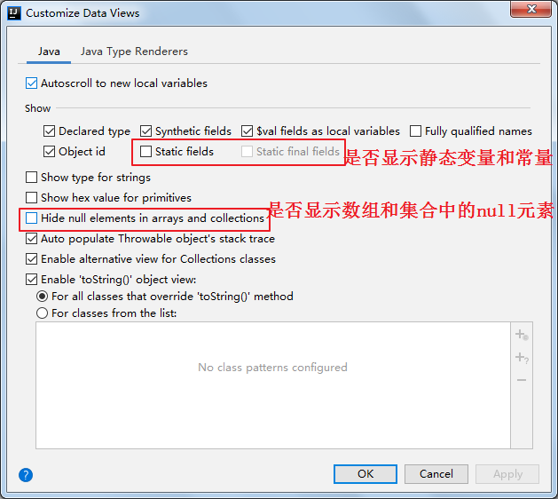

### 9.5 常见问题

问题：使用Step Into时，会出现无法进入源码的情况。如何解决？

方案1：使用 force step into 即可

方案2：点击Setting -> Build,Execution,Deployment -> Debugger -> Stepping

把Do not step into the classess中的`java.*`、`javax.*` 取消勾选即可。

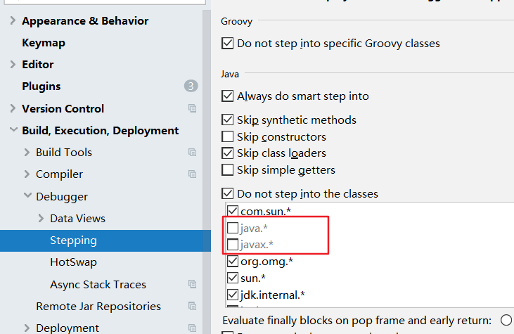

小结：

> 经验：初学者对于在哪里加断点，缺乏经验，这也是调试程序最麻烦的地方，需要一定的经验。
>
> 简单来说，在可能发生错误的代码的前面加断点。如果不会判断，就在程序执行的起点处加断点。

## 10. IDEA常用插件

### 推荐1：Alibaba Java Coding Guidelines

 

阿里巴巴Java编码规范检查插件，检测代码是否存在问题，以及是否符合规范。

使用：在类中，右键，选择编码规约扫描，在下方显示扫描规约和提示。根据提示规范代码，提高代码质量。

### 推荐2：jclasslib bytecode viewer

 

可视化的字节码查看器。

使用：

1. 在 IDEA 打开想研究的类。
2. 编译该类或者直接编译整个项目（ 如果想研究的类在 jar 包中，此步可略过）。
3. 打开“view” 菜单，选择“Show Bytecode With jclasslib” 选项。
4. 选择上述菜单项后 IDEA 中会弹出 jclasslib 工具窗口。


英文设置：

在 Help -> Edit Custom VM Options …，加上

```
-Duser.language=en
```

### 推荐3：Translation

 

注册翻译服务（有道智云、百度翻译开放平台、阿里云机器翻译）帐号，开通翻译服务并获取其应用ID和密钥
绑定应用ID和密钥：偏好设置（设置） > 工具 > 翻译 > 常规 > 翻译引擎 > 配置…

使用：鼠标选中文本，点击右键即可自动翻译成多国语言。

注：请注意保管好你的应用密钥，防止其泄露。

### 推荐4：GenerateAllSetter

 

实际开发中还有一个非常常见的场景： 我们创建一个对象后，想依次调用 Setter 函数对属性赋值，如果属性较多很容易遗漏或者重复。

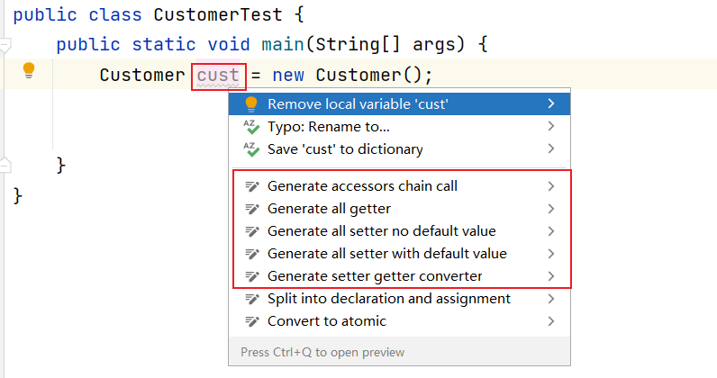

可以使用这 GenerateAllSetter 提供的功能，快速生成对象的所有 Setter 函数（可填充默认值），然后自己再跟进实际需求设置属性值。

### 插件5：Rainbow Brackets

 

给括号添加彩虹色，使开发者通过颜色区分括号嵌套层级，便于阅读

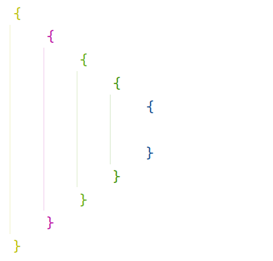

### 推荐6：CodeGlance Pro

 

在编辑器右侧生成代码小地图，可以拖拽小地图光标快速定位代码，阅读行数很多的代码文件时非常实用。

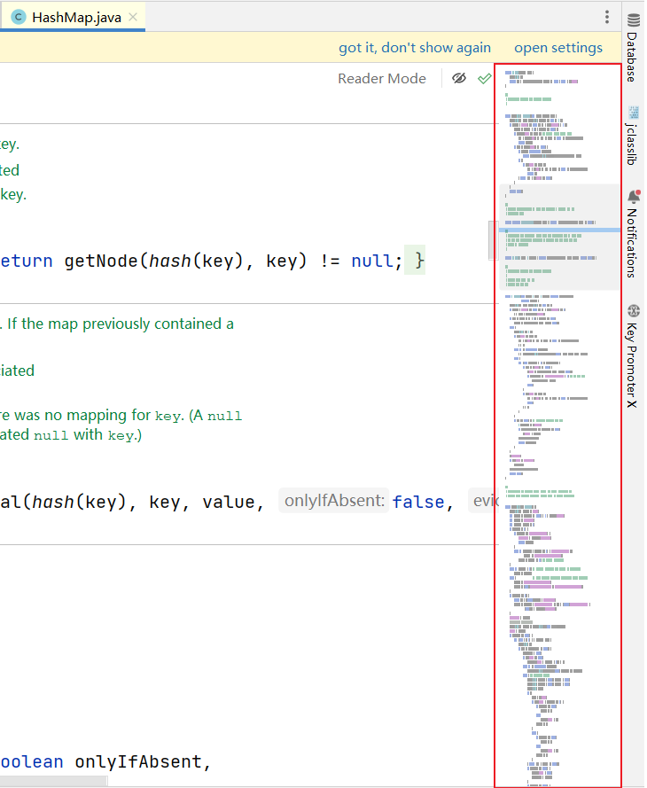

### 推荐7：Statistic

 

代码统计工具。

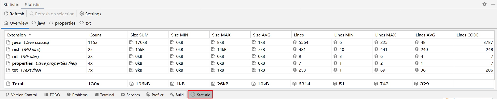

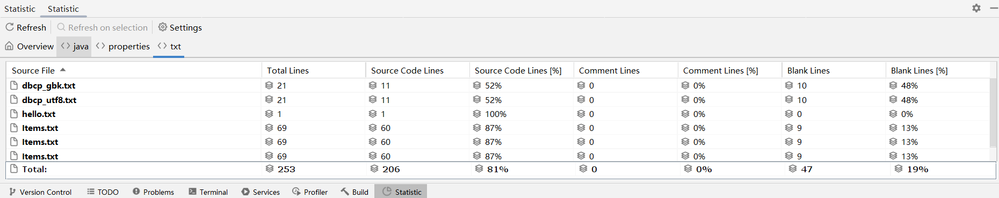

### 推荐8：Presentation Assistant

 

显示快捷键操作的按键

### 推荐9：Key Promoter X

 

快捷键提示插件。当你执行鼠标操作时，如果该操作可被快捷键代替，会给出提示，帮助你自然形成使用快捷键的习惯，告别死记硬背。

### 推荐10：JavaDoc

 

按`alt+insert`，执行操作：

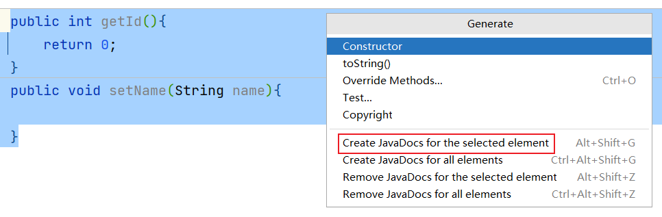

### 推荐11： LeetCode Editor

 

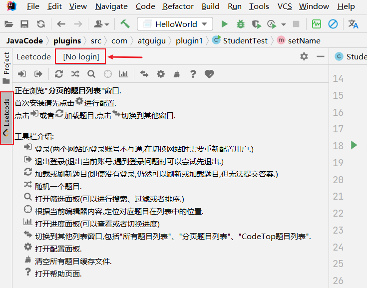

在 IDEA 里刷力扣算法题

### 推荐12：GsonFormatPlus

 

根据 json 生成对象。

使用：使用alt + s 或 alt + insert调取。


举例：

```json
{
    "name": "tom",
    "age": "18",
    "gender": "man",
    "hometown": {
        "province": "河北省",
        "city": "石家庄市",
        "county": "正定县"
    }
}
```

### 插件13：Material Theme UI

 

对于很多人而言，写代码时略显枯燥的，如果能够安装自己喜欢的主题将为开发工作带来些许乐趣。

IDEA 支持各种主题插件，其中最出名的当属 Material Theme UI。

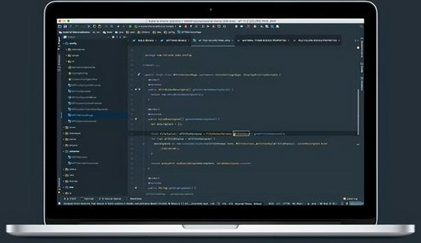

安装后，可以从该插件内置的各种风格个选择自己最喜欢的一种。
