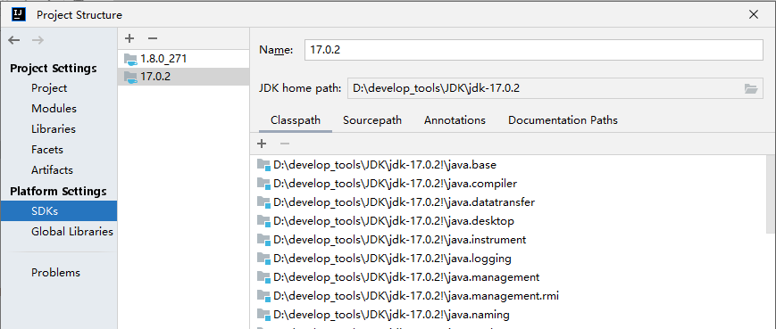
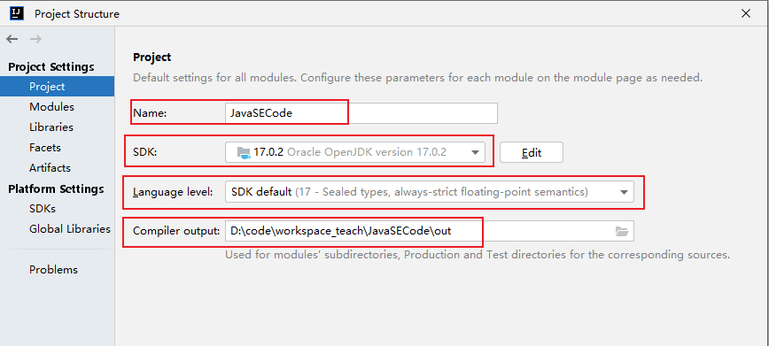
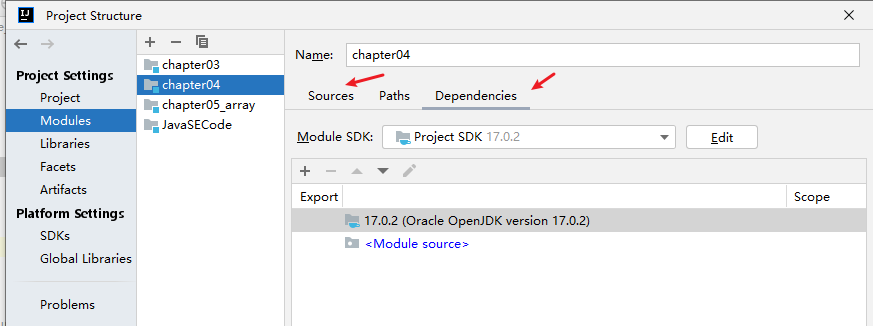

# 第04章：随堂复习与企业真题（IDEA安装与使用）

***

## 一、随堂复习

### 1. IDEA的认识

- IDEA(集成功能强大、符合人体工程学（设置人性化）)
- Eclipse

### 2. IDEA的下载、安装、卸载

- 卸载：使用控制面板进行卸载，注意删除c盘指定目录下的两个文件目录：jetbrains
- 下载：从官网进行下载：旗舰版（收费版）
- 安装：傻瓜式的安装-->注册

### 3. 工程等结构

- 工程、模块、包、类等概念。
- 掌握：如何创建工程、如何创建模块、如何导入其他项目中的模块、如何创建包、如何创建类、如何运行
- 了解：如何删除模块

### 4. 熟悉JDK的结构

### 5. 详细的设置

略

### 6. 代码模板、快捷键、调试程序（debug）

后续讲解。

## 二、企业真题

### 1. 开发中你接触过的开发工具都有哪些？

IDEA

### 2. 谈谈你对Eclipse和IDEA使用上的感受？

Eclipse不够人性化。

