# 第10章_多线程

讲师：尚硅谷-宋红康（江湖人称：康师傅）

官网：[http://www.atguigu.com](http://www.atguigu.com/)

***

## 本章专题与脉络

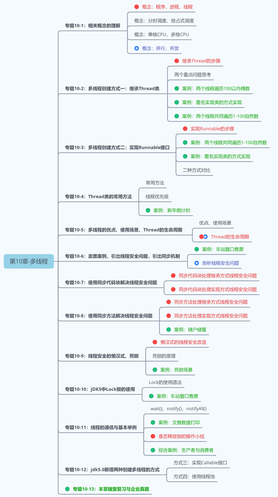

***

我们之前学习的程序在没有跳转语句的情况下，都是由上至下沿着一条路径依次执行。现在想要设计一个程序，可以同时有多条执行路径同时执行。比如，`一边游戏，一边qq聊天，一边听歌`，怎么设计？


要解决上述问题，需要使用`多进程`或者`多线程`来解决。

## 1. 相关概念

### 1.1 程序、进程与线程

* **程序（program）**：为完成特定任务，用某种语言编写的`一组指令的集合`。即指`一段静态的代码`，静态对象。

* **进程（process）**：程序的一次执行过程，或是正在内存中运行的应用程序。如：运行中的QQ，运行中的网易音乐播放器。
  * 每个进程都有一个独立的内存空间，系统运行一个程序即是一个进程从创建、运行到消亡的过程。（生命周期）
  * 程序是静态的，进程是动态的
  * 进程作为`操作系统调度和分配资源的最小单位`（亦是系统运行程序的基本单位），系统在运行时会为每个进程分配不同的内存区域。
  * 现代的操作系统，大都是支持多进程的，支持同时运行多个程序。比如：现在我们上课一边使用编辑器，一边使用录屏软件，同时还开着画图板，dos窗口等软件。
* **线程（thread）**：进程可进一步细化为线程，是程序内部的`一条执行路径`。一个进程中至少有一个线程。

  - 一个进程同一时间若`并行`执行多个线程，就是支持多线程的。

    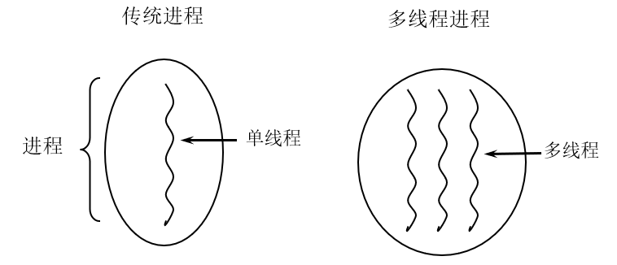

  - 线程作为`CPU调度和执行的最小单位`。

  - 一个进程中的多个线程共享相同的内存单元，它们从同一个堆中分配对象，可以访问相同的变量和对象。这就使得线程间通信更简便、高效。但多个线程操作共享的系统资源可能就会带来`安全的隐患`。
  - 下图中，红框的蓝色区域为线程独享，黄色区域为线程共享。

  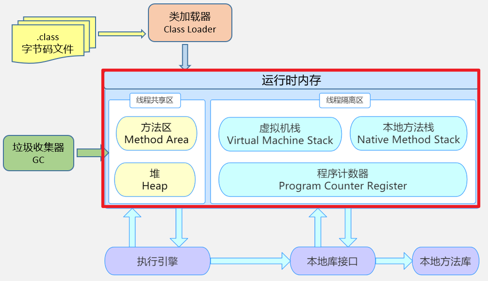

  > 注意：
  >
  > 不同的进程之间是不共享内存的。
  >
  > 进程之间的数据交换和通信的成本很高。
### 1.2 查看进程和线程

我们可以在电脑底部任务栏，右键----->打开任务管理器，可以查看当前任务的进程：

1、每个应用程序的运行都是一个进程


2、一个应用程序的多次运行，就是多个进程

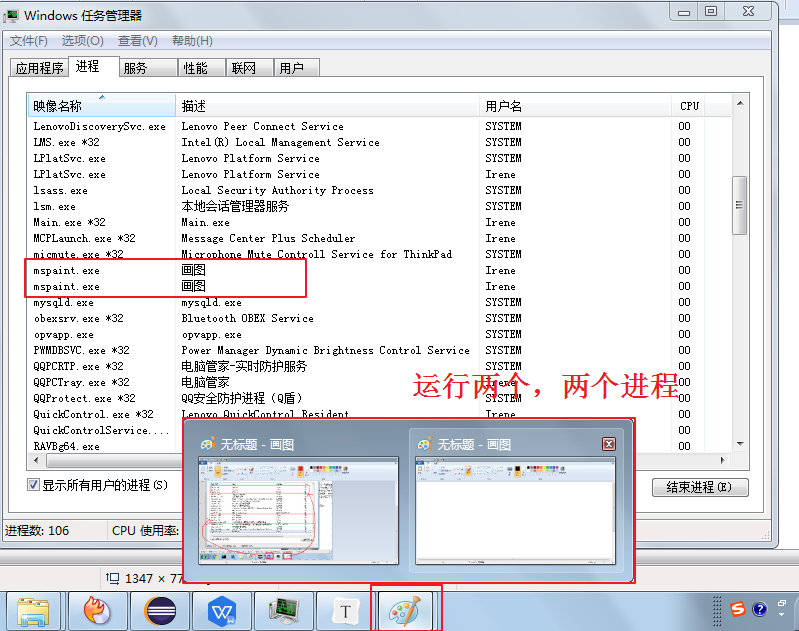

3、一个进程中包含多个线程


### 1.3 线程调度

- **分时调度**

  所有线程`轮流使用` CPU 的使用权，并且平均分配每个线程占用 CPU 的时间。

- **抢占式调度**

  让`优先级高`的线程以`较大的概率`优先使用 CPU。如果线程的优先级相同，那么会随机选择一个(线程随机性)，Java使用的为抢占式调度。

  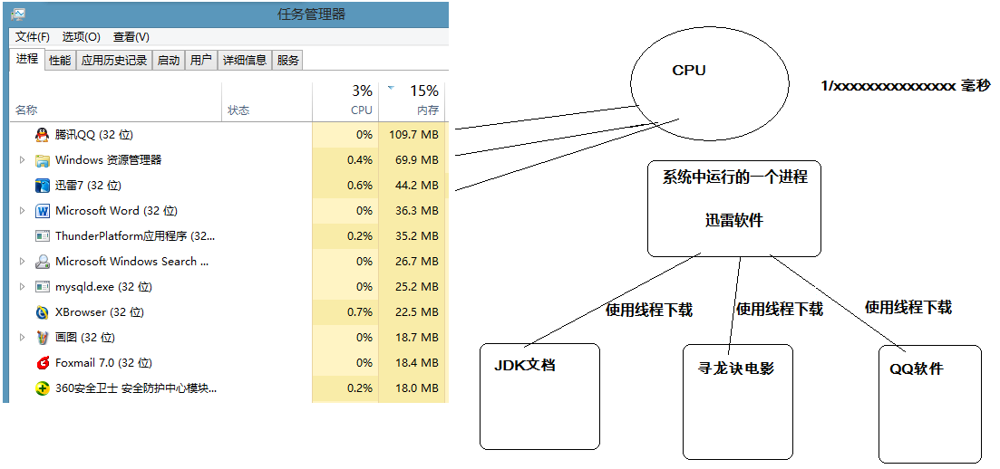

### 1.4 多线程程序的优点

**背景：**以单核CPU为例，只使用单个线程先后完成多个任务（调用多个方法），肯定比用多个线程来完成用的时间更短，为何仍需多线程呢？

**多线程程序的优点：**

1. 提高应用程序的响应。对图形化界面更有意义，可增强用户体验。

2. 提高计算机系统CPU的利用率

3. 改善程序结构。将既长又复杂的进程分为多个线程，独立运行，利于理解和修改

### 1.5 补充概念

#### 1.5.1 单核CPU和多核CPU

单核CPU，在一个时间单元内，只能执行一个线程的任务。例如，可以把CPU看成是医院的医生诊室，在一定时间内只能给一个病人诊断治疗。所以单核CPU就是，代码经过前面一系列的前导操作（类似于医院挂号，比如有10个窗口挂号），然后到cpu处执行时发现，就只有一个CPU（对应一个医生），大家排队执行。

这时候想要提升系统性能，只有两个办法，要么提升CPU性能（让医生看病快点），要么多加几个CPU（多整几个医生），即为多核的CPU。

`问题：多核的效率是单核的倍数吗？`譬如4核A53的cpu，性能是单核A53的4倍吗？理论上是，但是实际不可能，至少有两方面的损耗。

- `一个是多个核心的其他共用资源限制`。譬如，4核CPU对应的内存、cache、寄存器并没有同步扩充4倍。这就好像医院一样，1个医生换4个医生，但是做B超检查的还是一台机器，性能瓶颈就从医生转到B超检查了。
- `另一个是多核CPU之间的协调管理损耗`。譬如多个核心同时运行两个相关的任务，需要考虑任务同步，这也需要消耗额外性能。好比公司工作，一个人的时候至少不用开会浪费时间，自己跟自己商量就行了。两个人就要开会同步工作，协调分配，所以工作效率绝对不可能达到2倍。

#### 1.5.2 并行与并发

* **并行（parallel）**：指两个或多个事件在`同一时刻`发生（同时发生）。指在同一时刻，有`多条指令`在`多个CPU`上`同时`执行。比如：多个人同时做不同的事。

  

  

* **并发（concurrency）**：指两个或多个事件在`同一个时间段内`发生。即在一段时间内，有`多条指令`在`单个CPU`上`快速轮换、交替`执行，使得在宏观上具有多个进程同时执行的效果。

  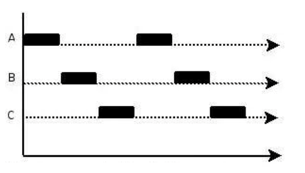
  
  


在操作系统中，启动了多个程序，`并发`指的是在一段时间内宏观上有多个程序同时运行，这在单核 CPU 系统中，每一时刻只能有一个程序执行，即微观上这些程序是分时的交替运行，只不过是给人的感觉是同时运行，那是因为分时交替运行的时间是非常短的。

而在多核 CPU 系统中，则这些可以`并发`执行的程序便可以分配到多个CPU上，实现多任务并行执行，即利用每个处理器来处理一个可以并发执行的程序，这样多个程序便可以同时执行。目前电脑市场上说的多核 CPU，便是多核处理器，核越多，`并行`处理的程序越多，能大大的提高电脑运行的效率。

## 2.创建和启动线程

### 2.1 概述

- Java语言的JVM允许程序运行多个线程，使用`java.lang.Thread`类代表**线程**，所有的线程对象都必须是Thread类或其子类的实例。

- Thread类的特性
  - 每个线程都是通过某个特定Thread对象的run()方法来完成操作的，因此把run()方法体称为`线程执行体`。
  - 通过该Thread对象的start()方法来启动这个线程，而非直接调用run()
  - 要想实现多线程，必须在主线程中创建新的线程对象。

### 2.2 方式1：继承Thread类

Java通过继承Thread类来**创建**并**启动多线程**的步骤如下：

1. 定义Thread类的子类，并重写该类的run()方法，该run()方法的方法体就代表了线程需要完成的任务
2. 创建Thread子类的实例，即创建了线程对象
3. 调用线程对象的start()方法来启动该线程

代码如下：

~~~java
package com.atguigu.thread;
//自定义线程类
public class MyThread extends Thread {
    //定义指定线程名称的构造方法
    public MyThread(String name) {
        //调用父类的String参数的构造方法，指定线程的名称
        super(name);
    }
    /**
     * 重写run方法，完成该线程执行的逻辑
     */
    @Override
    public void run() {
        for (int i = 0; i < 10; i++) {
            System.out.println(getName()+"：正在执行！"+i);
        }
    }
}
~~~

测试类：

~~~java
package com.atguigu.thread;

public class TestMyThread {
    public static void main(String[] args) {
        //创建自定义线程对象1
        MyThread mt1 = new MyThread("子线程1");
        //开启子线程1
        mt1.start();
        
        //创建自定义线程对象2
        MyThread mt2 = new MyThread("子线程2");
        //开启子线程2
        mt2.start();
        
        //在主方法中执行for循环
        for (int i = 0; i < 10; i++) {
            System.out.println("main线程！"+i);
        }
    }
}

~~~

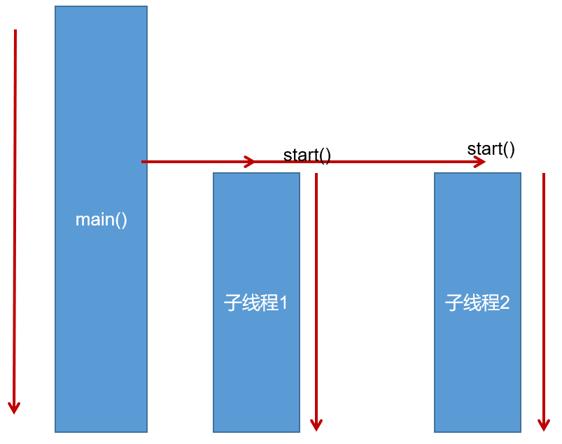

> 注意：
>
> 1. 如果自己手动调用run()方法，那么就只是普通方法，没有启动多线程模式。
>
> 2. run()方法由JVM调用，什么时候调用，执行的过程控制都有操作系统的CPU调度决定。
>
> 3. 想要启动多线程，必须调用start方法。
>
> 4. 一个线程对象只能调用一次start()方法启动，如果重复调用了，则将抛出以上的异常“`IllegalThreadStateException`”。

### 2.3 方式2：实现Runnable接口

Java有单继承的限制，当我们无法继承Thread类时，那么该如何做呢？在核心类库中提供了Runnable接口，我们可以实现Runnable接口，重写run()方法，然后再通过Thread类的对象代理启动和执行我们的线程体run()方法

步骤如下：

1. 定义Runnable接口的实现类，并重写该接口的run()方法，该run()方法的方法体同样是该线程的线程执行体。
2. 创建Runnable实现类的实例，并以此实例作为Thread的target参数来创建Thread对象，该Thread对象才是真正
   的线程对象。

3. 调用线程对象的start()方法，启动线程。调用Runnable接口实现类的run方法。

代码如下：

```java
package com.atguigu.thread;

public class MyRunnable implements Runnable {
    @Override
    public void run() {
        for (int i = 0; i < 20; i++) {
            System.out.println(Thread.currentThread().getName() + " " + i);
        }
    }
}
```

测试类：

```java
package com.atguigu.thread;

public class TestMyRunnable {
    public static void main(String[] args) {
        //创建自定义类对象  线程任务对象
        MyRunnable mr = new MyRunnable();
        //创建线程对象
        Thread t = new Thread(mr, "长江");
        t.start();
        for (int i = 0; i < 20; i++) {
            System.out.println("黄河 " + i);
        }
    }
}
```

 通过实现Runnable接口，使得该类有了多线程类的特征。所有的分线程要执行的代码都在run方法里面。

在启动的多线程的时候，需要先通过Thread类的构造方法Thread(Runnable target) 构造出对象，然后调用Thread对象的start()方法来运行多线程代码。

实际上，所有的多线程代码都是通过运行Thread的start()方法来运行的。因此，不管是继承Thread类还是实现
Runnable接口来实现多线程，最终还是通过Thread的对象的API来控制线程的，熟悉Thread类的API是进行多线程编程的基础。

说明：Runnable对象仅仅作为Thread对象的target，Runnable实现类里包含的run()方法仅作为线程执行体。
而实际的线程对象依然是Thread实例，只是该Thread线程负责执行其target的run()方法。

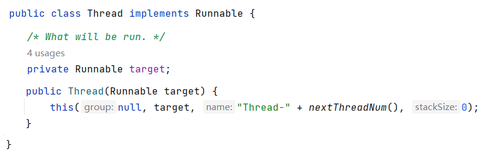

### 2.4 变形写法

**使用匿名内部类对象来实现线程的创建和启动**

```java
new Thread("新的线程！"){
	@Override
	public void run() {
		for (int i = 0; i < 10; i++) {
			System.out.println(getName()+"：正在执行！"+i);
		}
	}
}.start();
```

```java
new Thread(new Runnable(){
	@Override
	public void run() {
		for (int i = 0; i < 10; i++) {
			System.out.println(Thread.currentThread().getName()+"：" + i);
		}
	}
}).start();
```

### 2.5 对比两种方式

**联系**

Thread类实际上也是实现了Runnable接口的类。即：

```java
public class Thread extends Object implements Runnable
```

**区别**

- 继承Thread：线程代码存放Thread子类run方法中。

- 实现Runnable：线程代码存在接口的子类的run方法。

**实现Runnable接口比继承Thread类所具有的优势**

- 避免了单继承的局限性
- 多个线程可以共享同一个接口实现类的对象，非常适合多个相同线程来处理同一份资源。
- 增加程序的健壮性，实现解耦操作，代码可以被多个线程共享，代码和线程独立。

### 2.6 练习

创建两个分线程，让其中一个线程输出1-100之间的偶数，另一个线程输出1-100之间的奇数。

## 3. Thread类的常用结构

### 3.1 构造器

- public Thread() :分配一个新的线程对象。
- public Thread(String name) :分配一个指定名字的新的线程对象。
- public Thread(Runnable target) :指定创建线程的目标对象，它实现了Runnable接口中的run方法
- public Thread(Runnable target,String name) :分配一个带有指定目标新的线程对象并指定名字。

### 3.2 常用方法系列1

* public void run() :此线程要执行的任务在此处定义代码。
* public void start() :导致此线程开始执行; Java虚拟机调用此线程的run方法。
* public String getName() :获取当前线程名称。
* public void setName(String name)：设置该线程名称。
* public static Thread currentThread() :返回对当前正在执行的线程对象的引用。在Thread子类中就是this，通常用于主线程和Runnable实现类
* public static void sleep(long millis) :使当前正在执行的线程以指定的毫秒数暂停（暂时停止执行）。
* public static void yield()：yield只是让当前线程暂停一下，让系统的线程调度器重新调度一次，希望优先级与当前线程相同或更高的其他线程能够获得执行机会，但是这个不能保证，完全有可能的情况是，当某个线程调用了yield方法暂停之后，线程调度器又将其调度出来重新执行。

### 3.3 常用方法系列2

* public final boolean isAlive()：测试线程是否处于活动状态。如果线程已经启动且尚未终止，则为活动状态。 

* void join() ：等待该线程终止。 

  void join(long millis) ：等待该线程终止的时间最长为 millis 毫秒。如果millis时间到，将不再等待。 

  void join(long millis, int nanos) ：等待该线程终止的时间最长为 millis 毫秒 + nanos 纳秒。 
  
* public final void stop()：`已过时`，不建议使用。强行结束一个线程的执行，直接进入死亡状态。run()即刻停止，可能会导致一些清理性的工作得不到完成，如文件，数据库等的关闭。同时，会立即释放该线程所持有的所有的锁，导致数据得不到同步的处理，出现数据不一致的问题。

* void suspend() / void resume() : 这两个操作就好比播放器的暂停和恢复。二者必须成对出现，否则非常容易发生死锁。suspend()调用会导致线程暂停，但不会释放任何锁资源，导致其它线程都无法访问被它占用的锁，直到调用resume()。`已过时`，不建议使用。

### 3.4 常用方法系列3

每个线程都有一定的优先级，同优先级线程组成先进先出队列（先到先服务），使用分时调度策略。优先级高的线程采用抢占式策略，获得较多的执行机会。每个线程默认的优先级都与创建它的父线程具有相同的优先级。

- Thread类的三个优先级常量：
  - MAX_PRIORITY（10）：最高优先级 
  - MIN _PRIORITY （1）：最低优先级
  - NORM_PRIORITY （5）：普通优先级，默认情况下main线程具有普通优先级。

* public final int getPriority() ：返回线程优先级 
* public final void setPriority(int newPriority) ：改变线程的优先级，范围在[1,10]之间。


练习：获取main线程对象的名称和优先级。

声明一个匿名内部类继承Thread类，重写run方法，在run方法中获取线程名称和优先级。设置该线程优先级为最高优先级并启动该线程。

```java
	public static void main(String[] args) {
		Thread t = new Thread(){
			public void run(){
				System.out.println(getName() + "的优先级：" + getPriority());
			}
		};
		t.setPriority(Thread.MAX_PRIORITY);
		t.start();
		
		System.out.println(Thread.currentThread().getName() +"的优先级：" + 		                                          Thread.currentThread().getPriority());
	}
```

案例：

- 声明一个匿名内部类继承Thread类，重写run方法，实现打印[1,100]之间的偶数，要求每隔1秒打印1个偶数。

- 声明一个匿名内部类继承Thread类，重写run方法，实现打印[1,100]之间的奇数，
  - 当打印到5时，让奇数线程暂停一下，再继续。
  - 当打印到5时，让奇数线程停下来，让偶数线程执行完再打印。


```java
package com.atguigu.api;

public class TestThreadStateChange {
    public static void main(String[] args) {
        Thread te = new Thread() {
            @Override
            public void run() {
                for (int i = 2; i <= 100; i += 2) {
                    System.out.println("偶数线程：" + i);
                    try {
                        Thread.sleep(1000);
                    } catch (InterruptedException e) {
                        e.printStackTrace();
                    }
                }
            }
        };
        te.start();

        Thread to = new Thread() {
            @Override
            public void run() {
                for (int i = 1; i <= 100; i += 2) {
                    System.out.println("奇数线程：" + i);
                    if (i == 5) {
//                        Thread.yield();
                        try {
                            te.join();
                        } catch (InterruptedException e) {
                            e.printStackTrace();
                        }
                    }

                }
            }
        };
        to.start();
    }
}
```

生产实践中的趣事：

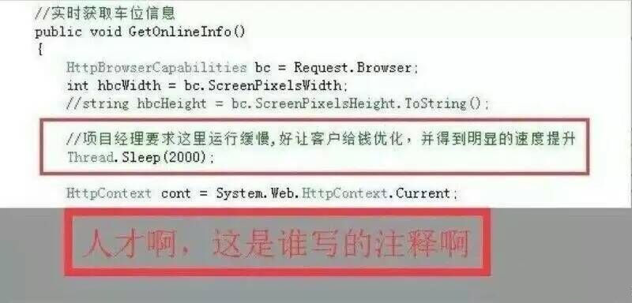

### 3.5 守护线程（了解）

有一种线程，它是在后台运行的，它的任务是为其他线程提供服务的，这种线程被称为“守护线程”。JVM的垃圾回收线程就是典型的守护线程。

守护线程有个特点，就是如果所有非守护线程都死亡，那么守护线程自动死亡。形象理解：`兔死狗烹`，`鸟尽弓藏`

调用setDaemon(true)方法可将指定线程设置为守护线程。必须在线程启动之前设置，否则会报IllegalThreadStateException异常。

调用isDaemon()可以判断线程是否是守护线程。

```java
public class TestThread {
	public static void main(String[] args) {
		MyDaemon m = new MyDaemon();
		m.setDaemon(true);
		m.start();

		for (int i = 1; i <= 100; i++) {
			System.out.println("main:" + i);
		}
	}
}

class MyDaemon extends Thread {
	public void run() {
		while (true) {
			System.out.println("我一直守护者你...");
			try {
				Thread.sleep(1);
			} catch (InterruptedException e) {
				e.printStackTrace();
			}
		}
	}
}
```

## 4. 多线程的生命周期

Java语言使用Thread类及其子类的对象来表示线程，在它的一个完整的生命周期中通常要经历如下一些状态：

### 4.1 JDK1.5之前：5种状态

线程的生命周期有五种状态：新建（New）、就绪（Runnable）、运行（Running）、阻塞（Blocked）、死亡（Dead）。CPU需要在多条线程之间切换，于是线程状态会多次在运行、阻塞、就绪之间切换。


**1.新建**

当一个Thread类或其子类的对象被声明并创建时，新生的线程对象处于新建状态。此时它和其他Java对象一样，仅仅由JVM为其分配了内存，并初始化了实例变量的值。此时的线程对象并没有任何线程的动态特征，程序也不会执行它的线程体run()。

**2.就绪**

但是当线程对象调用了start()方法之后，就不一样了，线程就从新建状态转为就绪状态。JVM会为其创建方法调用栈和程序计数器，当然，处于这个状态中的线程并没有开始运行，只是表示已具备了运行的条件，随时可以被调度。至于什么时候被调度，取决于JVM里线程调度器的调度。

> 注意：
>
> 程序只能对新建状态的线程调用start()，并且只能调用一次，如果对非新建状态的线程，如已启动的线程或已死亡的线程调用start()都会报错IllegalThreadStateException异常。

**3.运行**

如果处于就绪状态的线程获得了CPU资源时，开始执行run()方法的线程体代码，则该线程处于运行状态。如果计算机只有一个CPU核心，在任何时刻只有一个线程处于运行状态，如果计算机有多个核心，将会有多个线程并行(Parallel)执行。

当然，美好的时光总是短暂的，而且CPU讲究雨露均沾。对于抢占式策略的系统而言，系统会给每个可执行的线程一个小时间段来处理任务，当该时间用完，系统会剥夺该线程所占用的资源，让其回到就绪状态等待下一次被调度。此时其他线程将获得执行机会，而在选择下一个线程时，系统会适当考虑线程的优先级。

**4.阻塞**

当在运行过程中的线程遇到如下情况时，会让出 CPU 并临时中止自己的执行，进入阻塞状态：

* 线程调用了sleep()方法，主动放弃所占用的CPU资源；
* 线程试图获取一个同步监视器，但该同步监视器正被其他线程持有；
* 线程执行过程中，同步监视器调用了wait()，让它等待某个通知（notify）；
* 线程执行过程中，同步监视器调用了wait(time)
* 线程执行过程中，遇到了其他线程对象的加塞（join）；
* 线程被调用suspend方法被挂起（已过时，因为容易发生死锁）；

当前正在执行的线程被阻塞后，其他线程就有机会执行了。针对如上情况，当发生如下情况时会解除阻塞，让该线程重新进入就绪状态，等待线程调度器再次调度它：

* 线程的sleep()时间到；
* 线程成功获得了同步监视器；
* 线程等到了通知(notify)；
* 线程wait的时间到了
* 加塞的线程结束了；
* 被挂起的线程又被调用了resume恢复方法（已过时，因为容易发生死锁）；

**5.死亡**

线程会以以下三种方式之一结束，结束后的线程就处于死亡状态：

* run()方法执行完成，线程正常结束
* 线程执行过程中抛出了一个未捕获的异常（Exception）或错误（Error）
* 直接调用该线程的stop()来结束该线程（已过时）

### 4.2 JDK1.5及之后：6种状态


在java.lang.Thread.State的枚举类中这样定义：

```java
public enum State {
	NEW,
	RUNNABLE,
	BLOCKED,
	WAITING,
	TIMED_WAITING,
	TERMINATED;
}
```

- `NEW（新建）`：线程刚被创建，但是并未启动。还没调用start方法。

- `RUNNABLE（可运行）`：这里没有区分就绪和运行状态。因为对于Java对象来说，只能标记为可运行，至于什么时候运行，不是JVM来控制的了，是OS来进行调度的，而且时间非常短暂，因此对于Java对象的状态来说，无法区分。

- `Teminated（被终止）`：表明此线程已经结束生命周期，终止运行。

- 重点说明，根据Thread.State的定义，**阻塞状态分为三种**：`BLOCKED`、`WAITING`、`TIMED_WAITING`。
  - `BLOCKED（锁阻塞）`：在API中的介绍为：一个正在阻塞、等待一个监视器锁（锁对象）的线程处于这一状态。只有获得锁对象的线程才能有执行机会。
    - 比如，线程A与线程B代码中使用同一锁，如果线程A获取到锁，线程A进入到Runnable状态，那么线程B就进入到Blocked锁阻塞状态。
  - `TIMED_WAITING（计时等待）`：在API中的介绍为：一个正在限时等待另一个线程执行一个（唤醒）动作的线程处于这一状态。
    - 当前线程执行过程中遇到Thread类的`sleep`或`join`，Object类的`wait`，LockSupport类的`park`方法，并且在调用这些方法时，`设置了时间`，那么当前线程会进入TIMED_WAITING，直到时间到，或被中断。
  - `WAITING（无限等待）`：在API中介绍为：一个正在无限期等待另一个线程执行一个特别的（唤醒）动作的线程处于这一状态。
    - 当前线程执行过程中遇到遇到Object类的`wait`，Thread类的`join`，LockSupport类的`park`方法，并且在调用这些方法时，`没有指定时间`，那么当前线程会进入WAITING状态，直到被唤醒。
      - 通过Object类的wait进入WAITING状态的要有Object的notify/notifyAll唤醒；
      - 通过Condition的await进入WAITING状态的要有Condition的signal方法唤醒；
      - 通过LockSupport类的park方法进入WAITING状态的要有LockSupport类的unpark方法唤醒
      - 通过Thread类的join进入WAITING状态，只有调用join方法的线程对象结束才能让当前线程恢复；

说明：当从WAITING或TIMED_WAITING恢复到Runnable状态时，如果发现当前线程没有得到监视器锁，那么会立刻转入BLOCKED状态。

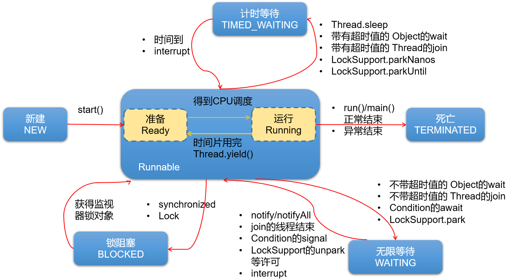

或

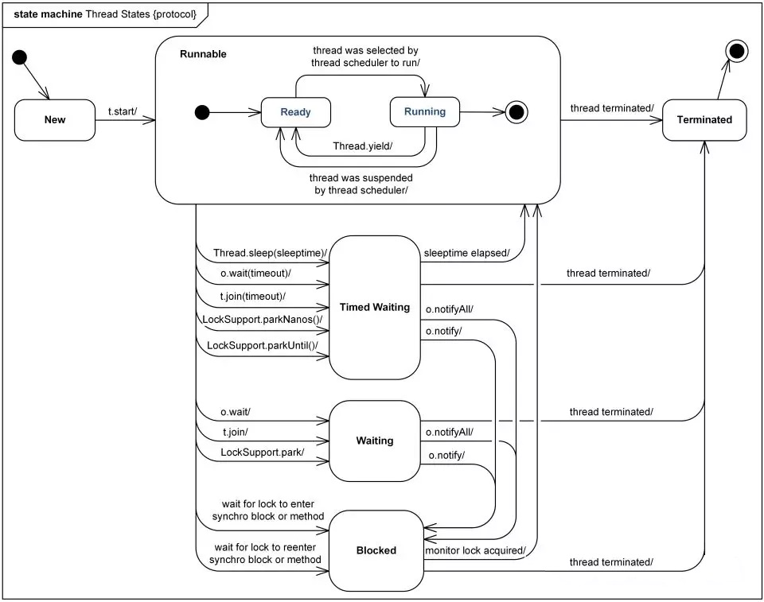

> 我们在翻阅API的时候会发现Timed Waiting（计时等待） 与 Waiting（无限等待） 状态联系还是很紧密的，
> 比如Waiting（无限等待） 状态中wait方法是空参的，而timed waiting（计时等待） 中wait方法是带参的。
> 这种带参的方法，其实是一种倒计时操作，相当于我们生活中的小闹钟，我们设定好时间，到时通知，可是
> 如果提前得到（唤醒）通知，那么设定好时间在通知也就显得多此一举了，那么这种设计方案其实是一举两
> 得。如果没有得到（唤醒）通知，那么线程就处于Timed Waiting状态，直到倒计时完毕自动醒来；如果在倒
> 计时期间得到（唤醒）通知，那么线程从Timed Waiting状态立刻唤醒。

举例：

```java
/**
 * @author 尚硅谷-宋红康
 * @create 22:15
 */
public class ThreadStateTest {
    public static void main(String[] args) throws InterruptedException {
        SubThread t = new SubThread();
        System.out.println(t.getName() + " 状态 " + t.getState());
        t.start();

        while (Thread.State.TERMINATED != t.getState()) {
            System.out.println(t.getName() + " 状态 " + t.getState());
            Thread.sleep(500);
        }
        System.out.println(t.getName() + " 状态 " + t.getState());
    }
}

class SubThread extends Thread {
    @Override
    public void run() {
        while (true) {
            for (int i = 0; i < 10; i++) {
                System.out.println("打印：" + i);
                try {
                    Thread.sleep(1000);
                } catch (InterruptedException e) {
                    e.printStackTrace();
                }
            }
            break;
        }
    }
}

```

命令行演示：

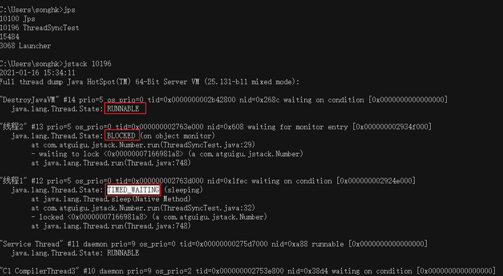

## 5. 线程安全问题及解决

当我们使用多个线程访问**同一资源**（可以是同一个变量、同一个文件、同一条记录等）的时候，若多个线程`只有读操作`，那么不会发生线程安全问题。但是如果多个线程中对资源有`读和写`的操作，就容易出现线程安全问题。

举例：

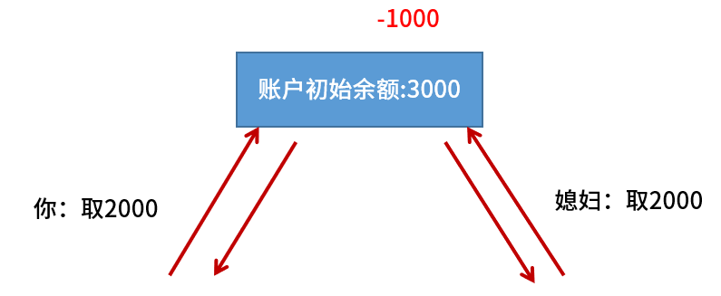


类比：


### 5.1 同一个资源问题和线程安全问题

案例：

火车站要卖票，我们模拟火车站的卖票过程。因为疫情期间，本次列车的座位共100个（即，只能出售100张火车票）。我们来模拟车站的售票窗口，实现多个窗口同时售票的过程。注意：不能出现错票、重票。

#### 5.1.1 局部变量不能共享

示例代码：

```javascript
package com.atguigu.unsafe;

class Window extends Thread {
    public void run() {
        int ticket = 100;
        while (ticket > 0) {
            System.out.println(getName() + "卖出一张票，票号:" + ticket);
            ticket--;
        }
    }
}

public class SaleTicketDemo1 {
    public static void main(String[] args) {
        Window w1 = new Window();
        Window w2 = new Window();
        Window w3 = new Window();

        w1.setName("窗口1");
        w2.setName("窗口2");
        w3.setName("窗口3");

        w1.start();
        w2.start();
        w3.start();
    }
}
```

结果：发现卖出300张票。

问题：局部变量是每次调用方法都是独立的，那么每个线程的run()的ticket是独立的，不是共享数据。

#### 5.1.2 不同对象的实例变量不共享

```java
package com.atguigu.unsafe;

class TicketWindow extends Thread {
    private int ticket = 100;

    public void run() {
        while (ticket > 0) {
            System.out.println(getName() + "卖出一张票，票号:" + ticket);
            ticket--;
        }
    }
}

public class SaleTicketDemo2 {
    public static void main(String[] args) {
        TicketWindow w1 = new TicketWindow();
        TicketWindow w2 = new TicketWindow();
        TicketWindow w3 = new TicketWindow();

        w1.setName("窗口1");
        w2.setName("窗口2");
        w3.setName("窗口3");

        w1.start();
        w2.start();
        w3.start();
    }
}


```

结果：发现卖出300张票。

问题：不同的实例对象的实例变量是独立的。

#### 5.1.3 静态变量是共享的

示例代码：

```java
package com.atguigu.unsafe;

class TicketSaleThread extends Thread {
    private static int ticket = 100;

    public void run() {
        while (ticket > 0) {
            try {
                Thread.sleep(10);//加入这个，使得问题暴露的更明显
            } catch (InterruptedException e) {
                e.printStackTrace();
            }
            System.out.println(getName() + "卖出一张票，票号:" + ticket);
            ticket--;
        }
    }
}

public class SaleTicketDemo3 {
    public static void main(String[] args) {
        TicketSaleThread t1 = new TicketSaleThread();
        TicketSaleThread t2 = new TicketSaleThread();
        TicketSaleThread t3 = new TicketSaleThread();

        t1.setName("窗口1");
        t2.setName("窗口2");
        t3.setName("窗口3");

        t1.start();
        t2.start();
        t3.start();
    }
}
```

运行结果：

```java
窗口1卖出一张票，票号:100
窗口2卖出一张票，票号:100
窗口3卖出一张票，票号:100
窗口3卖出一张票，票号:97
窗口1卖出一张票，票号:97
窗口2卖出一张票，票号:97
窗口1卖出一张票，票号:94
窗口3卖出一张票，票号:94
窗口2卖出一张票，票号:94
窗口2卖出一张票，票号:91
窗口1卖出一张票，票号:91
窗口3卖出一张票，票号:91
窗口3卖出一张票，票号:88
窗口1卖出一张票，票号:88
窗口2卖出一张票，票号:88
窗口3卖出一张票，票号:85
窗口1卖出一张票，票号:85
窗口2卖出一张票，票号:85
窗口3卖出一张票，票号:82
窗口1卖出一张票，票号:82
窗口2卖出一张票，票号:82
窗口2卖出一张票，票号:79
窗口3卖出一张票，票号:79
窗口1卖出一张票，票号:79
窗口3卖出一张票，票号:76
窗口1卖出一张票，票号:76
窗口2卖出一张票，票号:76
窗口1卖出一张票，票号:73
窗口2卖出一张票，票号:73
窗口3卖出一张票，票号:73
窗口2卖出一张票，票号:70
窗口1卖出一张票，票号:70
窗口3卖出一张票，票号:70
窗口2卖出一张票，票号:67
窗口3卖出一张票，票号:67
窗口1卖出一张票，票号:67
窗口1卖出一张票，票号:64
窗口3卖出一张票，票号:64
窗口2卖出一张票，票号:64
窗口2卖出一张票，票号:61
窗口3卖出一张票，票号:61
窗口1卖出一张票，票号:61
窗口1卖出一张票，票号:58
窗口2卖出一张票，票号:58
窗口3卖出一张票，票号:58
窗口2卖出一张票，票号:55
窗口1卖出一张票，票号:55
窗口3卖出一张票，票号:55
窗口3卖出一张票，票号:52
窗口1卖出一张票，票号:52
窗口2卖出一张票，票号:52
窗口2卖出一张票，票号:49
窗口1卖出一张票，票号:49
窗口3卖出一张票，票号:49
窗口2卖出一张票，票号:46
窗口3卖出一张票，票号:46
窗口1卖出一张票，票号:46
窗口2卖出一张票，票号:43
窗口3卖出一张票，票号:43
窗口1卖出一张票，票号:43
窗口3卖出一张票，票号:40
窗口1卖出一张票，票号:40
窗口2卖出一张票，票号:40
窗口2卖出一张票，票号:37
窗口3卖出一张票，票号:37
窗口1卖出一张票，票号:37
窗口2卖出一张票，票号:34
窗口1卖出一张票，票号:34
窗口3卖出一张票，票号:34
窗口3卖出一张票，票号:31
窗口2卖出一张票，票号:31
窗口1卖出一张票，票号:31
窗口1卖出一张票，票号:28
窗口2卖出一张票，票号:28
窗口3卖出一张票，票号:28
窗口2卖出一张票，票号:25
窗口1卖出一张票，票号:25
窗口3卖出一张票，票号:25
窗口2卖出一张票，票号:22
窗口3卖出一张票，票号:22
窗口1卖出一张票，票号:22
窗口3卖出一张票，票号:19
窗口1卖出一张票，票号:19
窗口2卖出一张票，票号:19
窗口2卖出一张票，票号:16
窗口3卖出一张票，票号:16
窗口1卖出一张票，票号:16
窗口2卖出一张票，票号:13
窗口1卖出一张票，票号:13
窗口3卖出一张票，票号:13
窗口2卖出一张票，票号:10
窗口1卖出一张票，票号:10
窗口3卖出一张票，票号:10
窗口3卖出一张票，票号:7
窗口1卖出一张票，票号:7
窗口2卖出一张票，票号:7
窗口3卖出一张票，票号:4
窗口1卖出一张票，票号:4
窗口2卖出一张票，票号:4
窗口3卖出一张票，票号:1
窗口2卖出一张票，票号:1
窗口1卖出一张票，票号:1
```

结果：发现卖出近100张票。

问题1：但是有重复票或负数票问题。

原因：线程安全问题

问题2：如果要考虑有两场电影，各卖100张票等

原因：TicketThread类的静态变量，是所有TicketThread类的对象共享

#### 5.1.4 同一个对象的实例变量共享

示例代码：多个Thread线程使用同一个Runnable对象

```java
package com.atguigu.safe;

class TicketSaleRunnable implements Runnable {
    private int ticket = 100;

    public void run() {
        while (ticket > 0) {
            try {
                Thread.sleep(10);//加入这个，使得问题暴露的更明显
            } catch (InterruptedException e) {
                e.printStackTrace();
            }
            System.out.println(Thread.currentThread().getName() + "卖出一张票，票号:" + ticket);
            ticket--;
        }
    }
}

public class SaleTicketDemo4 {
    public static void main(String[] args) {
        TicketSaleRunnable tr = new TicketSaleRunnable();
        Thread t1 = new Thread(tr, "窗口一");
        Thread t2 = new Thread(tr, "窗口二");
        Thread t3 = new Thread(tr, "窗口三");

        t1.start();
        t2.start();
        t3.start();
    }
}

```

结果：发现卖出近100张票。

问题：但是有重复票或负数票问题。

原因：线程安全问题

#### 5.1.5 抽取资源类，共享同一个资源对象

示例代码：

```java
package com.atguigu.unsafe;

//1、编写资源类
class Ticket {
    private int ticket = 100;

    public void sale() {
        if (ticket > 0) {
            try {
                Thread.sleep(10);//加入这个，使得问题暴露的更明显
            } catch (InterruptedException e) {
                e.printStackTrace();
            }
            System.out.println(Thread.currentThread().getName() + "卖出一张票，票号:" + ticket);
            ticket--;
        } else {
            throw new RuntimeException("没有票了");
        }
    }

    public int getTicket() {
        return ticket;
    }
}

public class SaleTicketDemo5 {
    public static void main(String[] args) {
        //2、创建资源对象
        Ticket ticket = new Ticket();

        //3、启动多个线程操作资源类的对象
        Thread t1 = new Thread("窗口一") {
            public void run() {
                while (true) {
                    ticket.sale();
                }
            }
        };
        Thread t2 = new Thread("窗口二") {
            public void run() {
                while (true) {
                    ticket.sale();
                }
            }
        };
        Thread t3 = new Thread(new Runnable() {
            public void run() {
                ticket.sale();
            }
        }, "窗口三");


        t1.start();
        t2.start();
        t3.start();
    }
}
```

结果：发现卖出近100张票。

问题：但是有重复票或负数票问题。

原因：线程安全问题

### 5.2 同步机制解决线程安全问题

要解决上述多线程并发访问一个资源的安全性问题:也就是解决重复票与不存在票问题，Java中提供了同步机制
(synchronized)来解决。

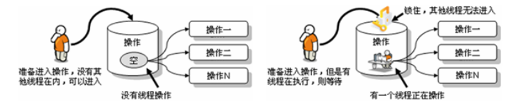

根据案例简述：

窗口1线程进入操作的时候，窗口2和窗口3线程只能在外等着，窗口1操作结束，窗口1和窗口2和窗口3才有机会进入代码去执行。也就是说在某个线程修改共享资源的时候，其他线程不能修改该资源，等待修改完毕同步之后，才能去抢夺CPU资源，完成对应的操作，保证了数据的同步性，解决了线程不安全的现象。

为了保证每个线程都能正常执行原子操作，Java引入了线程同步机制。注意:在任何时候,最多允许一个线程拥有同步锁，谁拿到锁就进入代码块，其他的线程只能在外等着(BLOCKED)。

#### 5.2.1 同步机制解决线程安全问题的原理

同步机制的原理，其实就相当于给某段代码加“锁”，任何线程想要执行这段代码，都要先获得“锁”，我们称它为同步锁。因为Java对象在堆中的数据分为分为对象头、实例变量、空白的填充。而对象头中包含：

- Mark Word：记录了和当前对象有关的GC、锁标记等信息。
- 指向类的指针：每一个对象需要记录它是由哪个类创建出来的。
- 数组长度（只有数组对象才有）

哪个线程获得了“同步锁”对象之后，”同步锁“对象就会记录这个线程的ID，这样其他线程就只能等待了，除非这个线程”释放“了锁对象，其他线程才能重新获得/占用”同步锁“对象。

#### 5.2.2 同步代码块和同步方法

**同步代码块**：synchronized 关键字可以用于某个区块前面，表示只对这个区块的资源实行互斥访问。
格式:

```java
synchronized(同步锁){
     需要同步操作的代码
}
```


**同步方法：**synchronized 关键字直接修饰方法，表示同一时刻只有一个线程能进入这个方法，其他线程在外面等着。

```java
public synchronized void method(){
    可能会产生线程安全问题的代码
}
```


#### 5.2.3 同步锁机制

在《Thinking in Java》中，是这么说的：对于并发工作，你需要某种方式来防止两个任务访问相同的资源（其实就是共享资源竞争）。 防止这种冲突的方法就是当资源被一个任务使用时，在其上加锁。第一个访问某项资源的任务必须锁定这项资源，使其他任务在其被解锁之前，就无法访问它了，而在其被解锁之时，另一个任务就可以锁定并使用它了。

#### 5.2.4 synchronized的锁是什么

同步锁对象可以是任意类型，但是必须保证竞争“同一个共享资源”的多个线程必须使用同一个“同步锁对象”。

对于同步代码块来说，同步锁对象是由程序员手动指定的（很多时候也是指定为this或类名.class），但是对于同步方法来说，同步锁对象只能是默认的：

- 静态方法：当前类的Class对象（类名.class）

- 非静态方法：this

#### 5.2.5 同步操作的思考顺序

1、如何找问题，即代码是否存在线程安全？（非常重要）
（1）明确哪些代码是多线程运行的代码
（2）明确多个线程是否有共享数据
（3）明确多线程运行代码中是否有多条语句操作共享数据

2、如何解决呢？（非常重要）
对多条操作共享数据的语句，只能让一个线程都执行完，在执行过程中，其他线程不可以参与执行。
即所有操作共享数据的这些语句都要放在同步范围中

3、切记：

范围太小：不能解决安全问题

范围太大：因为一旦某个线程抢到锁，其他线程就只能等待，所以范围太大，效率会降低，不能合理利用CPU资源。

#### 5.2.6 代码演示

##### 示例一：静态方法加锁

```java
package com.atguigu.safe;

class TicketSaleThread extends Thread{
    private static int ticket = 100;
    public void run(){//直接锁这里，肯定不行，会导致，只有一个窗口卖票
        while (ticket > 0) {
            saleOneTicket();
        }
    }

    public synchronized static void saleOneTicket(){//锁对象是TicketSaleThread类的Class对象，而一个类的Class对象在内存中肯定只有一个
        if(ticket > 0) {//不加条件，相当于条件判断没有进入锁管控，线程安全问题就没有解决
            System.out.println(Thread.currentThread().getName() + "卖出一张票，票号:" + ticket);
            ticket--;
        }
    }
}
public class SaleTicketDemo3 {
    public static void main(String[] args) {
        TicketSaleThread t1 = new TicketSaleThread();
        TicketSaleThread t2 = new TicketSaleThread();
        TicketSaleThread t3 = new TicketSaleThread();

        t1.setName("窗口1");
        t2.setName("窗口2");
        t3.setName("窗口3");

        t1.start();
        t2.start();
        t3.start();
    }
}

```

##### 示例二：非静态方法加锁

```java
package com.atguigu.safe;


public class SaleTicketDemo4 {
    public static void main(String[] args) {
        TicketSaleRunnable tr = new TicketSaleRunnable();
        Thread t1 = new Thread(tr, "窗口一");
        Thread t2 = new Thread(tr, "窗口二");
        Thread t3 = new Thread(tr, "窗口三");

        t1.start();
        t2.start();
        t3.start();
    }
}

class TicketSaleRunnable implements Runnable {
    private int ticket = 100;

    public void run() {//直接锁这里，肯定不行，会导致，只有一个窗口卖票
        while (ticket > 0) {
            saleOneTicket();
        }
    }

    public synchronized void saleOneTicket() {//锁对象是this，这里就是TicketSaleRunnable对象，因为上面3个线程使用同一个TicketSaleRunnable对象，所以可以
        if (ticket > 0) {//不加条件，相当于条件判断没有进入锁管控，线程安全问题就没有解决
            System.out.println(Thread.currentThread().getName() + "卖出一张票，票号:" + ticket);
            ticket--;
        }
    }
}
```

##### 示例三：同步代码块

```java
package com.atguigu.safe;


public class SaleTicketDemo5 {
    public static void main(String[] args) {
        //2、创建资源对象
        Ticket ticket = new Ticket();

        //3、启动多个线程操作资源类的对象
        Thread t1 = new Thread("窗口一") {
            public void run() {//不能给run()直接加锁，因为t1,t2,t3的三个run方法分别属于三个Thread类对象，
                // run方法是非静态方法，那么锁对象默认选this，那么锁对象根本不是同一个
                while (true) {
                    synchronized (ticket) {
                        ticket.sale();
                    }
                }
            }
        };
        Thread t2 = new Thread("窗口二") {
            public void run() {
                while (true) {
                    synchronized (ticket) {
                        ticket.sale();
                    }
                }
            }
        };
        Thread t3 = new Thread(new Runnable() {
            public void run() {
                while (true) {
                    synchronized (ticket) {
                        ticket.sale();
                    }
                }
            }
        }, "窗口三");


        t1.start();
        t2.start();
        t3.start();
    }
}

//1、编写资源类
class Ticket {
    private int ticket = 1000;

    public void sale() {//也可以直接给这个方法加锁，锁对象是this，这里就是Ticket对象
        if (ticket > 0) {
            System.out.println(Thread.currentThread().getName() + "卖出一张票，票号:" + ticket);
            ticket--;
        } else {
            throw new RuntimeException("没有票了");
        }
    }

    public int getTicket() {
        return ticket;
    }
}

```

### 5.3 练习

银行有一个账户。
有两个储户分别向同一个账户存3000元，每次存1000，存3次。每次存完打印账户余额。

问题：该程序是否有安全问题，如果有，如何解决？

【提示】
1，明确哪些代码是多线程运行代码，须写入run()方法
2，明确什么是共享数据。
3，明确多线程运行代码中哪些语句是操作共享数据的。

【拓展问题】可否实现两个储户交替存钱的操作

## 6. 再谈同步

### 6.1 单例设计模式的线程安全问题

#### 6.1.1 饿汉式没有线程安全问题

饿汉式：在类初始化时就直接创建单例对象，而类初始化过程是没有线程安全问题的

形式一：

```java
package com.atguigu.single.hungry;

public class HungrySingle {
    private static HungrySingle INSTANCE = new HungrySingle(); //对象是否声明为final 都可以
    
    private HungrySingle(){}
    
    public static HungrySingle getInstance(){
        return INSTANCE;
    }
}
```

形式二：

```java
/*
public class HungryOne{
    public static final HungryOne INSTANCE = new HungryOne();
    private HungryOne(){}
}*/

public enum HungryOne{
    INSTANCE
}
```

测试类：

```java
package com.atguigu.single.hungry;

public class HungrySingleTest {

    static HungrySingle hs1 = null;
    static HungrySingle hs2 = null;

    //演示存在的线程安全问题
    public static void main(String[] args) {

        Thread t1 = new Thread() {
            @Override
            public void run() {
                hs1 = HungrySingle.getInstance();
            }
        };

        Thread t2 = new Thread() {
            @Override
            public void run() {
                hs2 = HungrySingle.getInstance();
            }
        };

        t1.start();
        t2.start();

        try {
            t1.join();
        } catch (InterruptedException e) {
            e.printStackTrace();
        }
        try {
            t2.join();
        } catch (InterruptedException e) {
            e.printStackTrace();
        }

        System.out.println(hs1);
        System.out.println(hs2);
        System.out.println(hs1 == hs2);//true
    }

}
```

#### 6.1.2 懒汉式线程安全问题

懒汉式：延迟创建对象，第一次调用getInstance方法再创建对象

形式一：

```java
package com.atguigu.single.lazy;

public class LazyOne {
    private static LazyOne instance;

    private LazyOne(){}

    //方式1：
    public static synchronized LazyOne getInstance1(){
        if(instance == null){
            instance = new LazyOne();
        }
        return instance;
    }
    //方式2：
    public static LazyOne getInstance2(){
        synchronized(LazyOne.class) {
            if (instance == null) {
                instance = new LazyOne();
            }
            return instance;
        }
    }
    //方式3：
    public static LazyOne getInstance3(){
        if(instance == null){
            synchronized (LazyOne.class) {
                try {
                    Thread.sleep(10);//加这个代码，暴露问题
                } catch (InterruptedException e) {
                    e.printStackTrace();
                }
                if(instance == null){
                    instance = new LazyOne();
                }
            }
        }

        return instance;
    }
    /*
    注意：上述方式3中，有指令重排问题
    mem = allocate(); 为单例对象分配内存空间
    instance = mem;   instance引用现在非空，但还未初始化
    ctorSingleton(instance); 为单例对象通过instance调用构造器
    从JDK2开始，分配空间、初始化、调用构造器会在线程的工作存储区一次性完成，然后复制到主存储区。但是需要   
    volatile关键字，避免指令重排。
    */
    
}

```

形式二：使用内部类

```java
package com.atguigu.single.lazy;

public class LazySingle {
    private LazySingle(){}
    
    public static LazySingle getInstance(){
        return Inner.INSTANCE;
    }
    
    private static class Inner{
        static final LazySingle INSTANCE = new LazySingle();
    }
    
}
```

> 内部类只有在外部类被调用才加载，产生INSTANCE实例；又不用加锁。
>
> 此模式具有之前两个模式的优点，同时屏蔽了它们的缺点，是最好的单例模式。
>
> 此时的内部类，使用enum进行定义，也是可以的。

测试类：

```java
package com.atguigu.single.lazy;

import org.junit.Test;

public class TestLazy {
    @Test
    public void test01(){
        LazyOne s1 = LazyOne.getInstance();
        LazyOne s2 = LazyOne.getInstance();

        System.out.println(s1);
        System.out.println(s2);
        System.out.println(s1 == s2);
    }

    //把s1和s2声明在外面，是想要在线程的匿名内部类中为s1和s2赋值
    LazyOne s1;
    LazyOne s2;
    @Test
    public void test02(){
        Thread t1 = new Thread(){
            public void run(){
                s1 = LazyOne.getInstance();
            }
        };
        Thread t2 = new Thread(){
            public void run(){
                s2 = LazyOne.getInstance();
            }
        };

        t1.start();
        t2.start();

        try {
            t1.join();
            t2.join();
        } catch (InterruptedException e) {
            e.printStackTrace();
        }

        System.out.println(s1);
        System.out.println(s2);
        System.out.println(s1 == s2);
    }


    LazySingle obj1;
    LazySingle obj2;
    @Test
    public void test03(){
        Thread t1 = new Thread(){
            public void run(){
                obj1 = LazySingle.getInstance();
            }
        };
        Thread t2 = new Thread(){
            public void run(){
                obj2 = LazySingle.getInstance();
            }
        };

        t1.start();
        t2.start();

        try {
            t1.join();
            t2.join();
        } catch (InterruptedException e) {
            e.printStackTrace();
        }

        System.out.println(obj1);
        System.out.println(obj2);
        System.out.println(obj1 == obj2);
    }
}

```

### 6.2 死锁

不同的线程分别占用对方需要的同步资源不放弃，都在等待对方放弃自己需要的同步资源，就形成了线程的死锁。

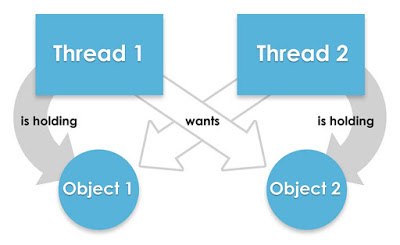

> 【小故事】
>
> 面试官：你能解释清楚什么是死锁，我就录取你！
> 面试者：你录取我，我就告诉你什么是死锁！
> ….
> 恭喜你，面试通过了

一旦出现死锁，整个程序既不会发生异常，也不会给出任何提示，只是所有线程处于阻塞状态，无法继续。

举例1：

```java
public class DeadLockTest {
	public static void main(String[] args) {

		StringBuilder s1 = new StringBuilder();
		StringBuilder s2 = new StringBuilder();

		new Thread() {
			public void run() {
				synchronized (s1) {
					s1.append("a");
					s2.append("1");
					
					try {
						Thread.sleep(10);
					} catch (InterruptedException e) {
						e.printStackTrace();
					}

					synchronized (s2) {
						s1.append("b");
						s2.append("2");

						System.out.println(s1);
						System.out.println(s2);

					}
				}
			}
		}.start();

		new Thread() {
			public void run() {
				synchronized (s2) {
					s1.append("c");
					s2.append("3");

					try {
						Thread.sleep(10);
					} catch (InterruptedException e) {
						e.printStackTrace();
					}
					
					synchronized (s1) {
						s1.append("d");
						s2.append("4");

						System.out.println(s1);
						System.out.println(s2);

					}

				}
			}
		}.start();

	}
}
```

举例2：

```java

class A {
	public synchronized void foo(B b) {
		System.out.println("当前线程名: " + Thread.currentThread().getName()
				+ " 进入了A实例的foo方法"); // ①
		try {
			Thread.sleep(200);
		} catch (InterruptedException ex) {
			ex.printStackTrace();
		}
		System.out.println("当前线程名: " + Thread.currentThread().getName()
				+ " 企图调用B实例的last方法"); // ③
		b.last();
	}

	public synchronized void last() {
		System.out.println("进入了A类的last方法内部");
	}
}

class B {
	public synchronized void bar(A a) {
		System.out.println("当前线程名: " + Thread.currentThread().getName()
				+ " 进入了B实例的bar方法"); // ②
		try {
			Thread.sleep(200);
		} catch (InterruptedException ex) {
			ex.printStackTrace();
		}
		System.out.println("当前线程名: " + Thread.currentThread().getName()
				+ " 企图调用A实例的last方法"); // ④
		a.last();
	}

	public synchronized void last() {
		System.out.println("进入了B类的last方法内部");
	}
}

public class DeadLock implements Runnable {
	A a = new A();
	B b = new B();

	public void init() {
		Thread.currentThread().setName("主线程");
		// 调用a对象的foo方法
		a.foo(b);
		System.out.println("进入了主线程之后");
	}

	public void run() {
		Thread.currentThread().setName("副线程");
		// 调用b对象的bar方法
		b.bar(a);
		System.out.println("进入了副线程之后");
	}

	public static void main(String[] args) {
		DeadLock dl = new DeadLock();
		new Thread(dl).start();
		dl.init();
	}
}
```

举例3：

```java
public class TestDeadLock {
	public static void main(String[] args) {
		Object g = new Object();
		Object m = new Object();
		Owner s = new Owner(g,m);
		Customer c = new Customer(g,m);
		new Thread(s).start();
		new Thread(c).start();
	}
}
class Owner implements Runnable{
	private Object goods;
	private Object money;

	public Owner(Object goods, Object money) {
		super();
		this.goods = goods;
		this.money = money;
	}

	@Override
	public void run() {
		synchronized (goods) {
			System.out.println("先给钱");
			synchronized (money) {
				System.out.println("发货");
			}
		}
	}
}
class Customer implements Runnable{
	private Object goods;
	private Object money;

	public Customer(Object goods, Object money) {
		super();
		this.goods = goods;
		this.money = money;
	}

	@Override
	public void run() {
		synchronized (money) {
			System.out.println("先发货");
			synchronized (goods) {
				System.out.println("再给钱");
			}
		}
	}
}
```

**诱发死锁的原因：**

- 互斥条件
- 占用且等待
- 不可抢夺（或不可抢占）
- 循环等待

以上4个条件，同时出现就会触发死锁。

**解决死锁：**

死锁一旦出现，基本很难人为干预，只能尽量规避。可以考虑打破上面的诱发条件。

针对条件1：互斥条件基本上无法被破坏。因为线程需要通过互斥解决安全问题。

针对条件2：可以考虑一次性申请所有所需的资源，这样就不存在等待的问题。

针对条件3：占用部分资源的线程在进一步申请其他资源时，如果申请不到，就主动释放掉已经占用的资源。

针对条件4：可以将资源改为线性顺序。申请资源时，先申请序号较小的，这样避免循环等待问题。

### 6.3 JDK5.0新特性：Lock(锁)

- JDK5.0的新增功能，保证线程的安全。与采用synchronized相比，Lock可提供多种锁方案，更灵活、更强大。Lock通过显式定义同步锁对象来实现同步。同步锁使用Lock对象充当。
- java.util.concurrent.locks.Lock接口是控制多个线程对共享资源进行访问的工具。锁提供了对共享资源的独占访问，每次只能有一个线程对Lock对象加锁，线程开始访问共享资源之前应先获得Lock对象。
- 在实现线程安全的控制中，比较常用的是`ReentrantLock`，可以显式加锁、释放锁。
  - ReentrantLock类实现了 Lock 接口，它拥有与 synchronized 相同的并发性和内存语义，但是添加了类似锁投票、定时锁等候和可中断锁等候的一些特性。此外，它还提供了在激烈争用情况下更佳的性能。
- Lock锁也称同步锁，加锁与释放锁方法，如下：

  * public void lock() :加同步锁。
  * public void unlock() :释放同步锁。
- 代码结构

```java
class A{
    //1. 创建Lock的实例，必须确保多个线程共享同一个Lock实例
	private final ReentrantLock lock = new ReenTrantLock();
	public void m(){
        //2. 调动lock()，实现需共享的代码的锁定
		lock.lock();
		try{
			//保证线程安全的代码;
		}
		finally{
            //3. 调用unlock()，释放共享代码的锁定
			lock.unlock();  
		}
	}
}

```

> 注意：如果同步代码有异常，要将unlock()写入finally语句块。

举例：

```java
import java.util.concurrent.locks.ReentrantLock;

class Window implements Runnable{
	int ticket = 100;
    //1. 创建Lock的实例，必须确保多个线程共享同一个Lock实例
	private final ReentrantLock lock = new ReentrantLock();
	public void run(){
		
		while(true){
			try{
                //2. 调动lock()，实现需共享的代码的锁定
				lock.lock();
				if(ticket > 0){
					try {
						Thread.sleep(10);
					} catch (InterruptedException e) {
						e.printStackTrace();
					}
					System.out.println(ticket--);
				}else{
					break;
				}
			}finally{
                //3. 调用unlock()，释放共享代码的锁定
				lock.unlock();
			}
		}
	}
}

public class ThreadLock {
	public static void main(String[] args) {
		Window t = new Window();
		Thread t1 = new Thread(t);
		Thread t2 = new Thread(t);
		
		t1.start();
		t2.start();
	}
}
```

**synchronized与Lock的对比**

1. Lock是显式锁（手动开启和关闭锁，别忘记关闭锁），synchronized是隐式锁，出了作用域、遇到异常等自动解锁
2. Lock只有代码块锁，synchronized有代码块锁和方法锁
3. 使用Lock锁，JVM将花费较少的时间来调度线程，性能更好。并且具有更好的扩展性（提供更多的子类），更体现面向对象。
4. （了解）Lock锁可以对读不加锁，对写加锁，synchronized不可以
5. （了解）Lock锁可以有多种获取锁的方式，可以从sleep的线程中抢到锁，synchronized不可以

> 说明：开发建议中处理线程安全问题优先使用顺序为：
>
> •    Lock ----> 同步代码块 ----> 同步方法

## 7. 线程的通信

### 7.1 线程间通信

**为什么要处理线程间通信：**

当我们`需要多个线程`来共同完成一件任务，并且我们希望他们`有规律的执行`，那么多线程之间需要一些通信机制，可以协调它们的工作，以此实现多线程共同操作一份数据。

比如：线程A用来生产包子的，线程B用来吃包子的，包子可以理解为同一资源，线程A与线程B处理的动作，一个是生产，一个是消费，此时B线程必须等到A线程完成后才能执行，那么线程A与线程B之间就需要线程通信，即—— **等待唤醒机制。**

### 7.2 等待唤醒机制

这是多个线程间的一种`协作机制`。谈到线程我们经常想到的是线程间的`竞争（race）`，比如去争夺锁，但这并不是故事的全部，线程间也会有协作机制。

在一个线程满足某个条件时，就进入等待状态（`wait() / wait(time)`）， 等待其他线程执行完他们的指定代码过后再将其唤醒（`notify()`）;或可以指定wait的时间，等时间到了自动唤醒；在有多个线程进行等待时，如果需要，可以使用 `notifyAll()`来唤醒所有的等待线程。wait/notify 就是线程间的一种协作机制。

1. wait：线程不再活动，不再参与调度，进入 `wait set` 中，因此不会浪费 CPU 资源，也不会去竞争锁了，这时的线程状态是 WAITING 或 TIMED_WAITING。它还要等着别的线程执行一个`特别的动作`，也即“`通知（notify）`”或者等待时间到，在这个对象上等待的线程从wait set 中释放出来，重新进入到调度队列（`ready queue`）中
2. notify：则选取所通知对象的 wait set 中的一个线程释放；
3. notifyAll：则释放所通知对象的 wait set 上的全部线程。

> 注意：
>
> 被通知的线程被唤醒后也不一定能立即恢复执行，因为它当初中断的地方是在同步块内，而此刻它已经不持有锁，所以它需要再次尝试去获取锁（很可能面临其它线程的竞争），成功后才能在当初调用 wait 方法之后的地方恢复执行。
>
> 总结如下：
>
> - 如果能获取锁，线程就从 WAITING 状态变成 RUNNABLE（可运行） 状态；
> - 否则，线程就从 WAITING 状态又变成 BLOCKED（等待锁） 状态

### 7.3 举例

例题：使用两个线程打印 1-100。线程1, 线程2 交替打印

```java
class Communication implements Runnable {
    int i = 1;
    public void run() {
        while (true) {
            synchronized (this) {
                notify();
                if (i <= 100) {
                    System.out.println(Thread.currentThread().getName() + ":" + i++);
                } else
                    break;
                try {
                    wait();
                } catch (InterruptedException e) {
                    e.printStackTrace();
                }
            }
        }
    }
}
```

### 7.4 调用wait和notify需注意的细节

1. wait方法与notify方法必须要由`同一个锁对象调用`。因为：对应的锁对象可以通过notify唤醒使用同一个锁对象调用的wait方法后的线程。
2. wait方法与notify方法是属于Object类的方法的。因为：锁对象可以是任意对象，而任意对象的所属类都是继承了Object类的。
3. wait方法与notify方法必须要在`同步代码块`或者是`同步函数`中使用。因为：必须要`通过锁对象`调用这2个方法。否则会报java.lang.IllegalMonitorStateException异常。

### 7.5 生产者与消费者问题

等待唤醒机制可以解决经典的“生产者与消费者”的问题。生产者与消费者问题（英语：Producer-consumer problem），也称有限缓冲问题（英语：Bounded-buffer problem），是一个多线程同步问题的经典案例。该问题描述了两个（多个）`共享固定大小缓冲区的线程`——即所谓的“生产者”和“消费者”——在实际运行时会发生的问题。

生产者的主要作用是生成一定量的数据放到缓冲区中，然后重复此过程。与此同时，消费者也在缓冲区消耗这些数据。**该问题的关键就是要保证生产者不会在缓冲区满时加入数据，消费者也不会在缓冲区中空时消耗数据。**

**举例：**

生产者(Productor)将产品交给店员(Clerk)，而消费者(Customer)从店员处取走产品，店员一次只能持有固定数量的产品(比如:20），如果生产者试图生产更多的产品，店员会叫生产者停一下，如果店中有空位放产品了再通知生产者继续生产；如果店中没有产品了，店员会告诉消费者等一下，如果店中有产品了再通知消费者来取走产品。

类似的场景，比如厨师和服务员等。

**生产者与消费者问题中其实隐含了两个问题：**

* 线程安全问题：因为生产者与消费者共享数据缓冲区，产生安全问题。不过这个问题可以使用同步解决。
* 线程的协调工作问题：
  * 要解决该问题，就必须让生产者线程在缓冲区满时等待(wait)，暂停进入阻塞状态，等到下次消费者消耗了缓冲区中的数据的时候，通知(notify)正在等待的线程恢复到就绪状态，重新开始往缓冲区添加数据。同样，也可以让消费者线程在缓冲区空时进入等待(wait)，暂停进入阻塞状态，等到生产者往缓冲区添加数据之后，再通知(notify)正在等待的线程恢复到就绪状态。通过这样的通信机制来解决此类问题。

**代码实现：**

```java
public class ConsumerProducerTest {
	public static void main(String[] args) {
		Clerk clerk = new Clerk();
		Producer p1 = new Producer(clerk);
		
		Consumer c1 = new Consumer(clerk);
		Consumer c2 = new Consumer(clerk);
		
		p1.setName("生产者1");
		c1.setName("消费者1");
		c2.setName("消费者2");
		
		p1.start();
		c1.start();
		c2.start();
	}
}

//生产者
class Producer extends Thread{
	private Clerk clerk;
	
	public Producer(Clerk clerk){
		this.clerk = clerk;
	}
	
	@Override
	public void run() {
		
		System.out.println("=========生产者开始生产产品========");
		while(true){
			
			try {
				Thread.sleep(40);
			} catch (InterruptedException e) {
				e.printStackTrace();
			}
			
			//要求clerk去增加产品
			clerk.addProduct();
		}
	}
}

//消费者
class Consumer extends Thread{
	private Clerk clerk;
	
	public Consumer(Clerk clerk){
		this.clerk = clerk;
	}
	@Override
	public void run() {
		System.out.println("=========消费者开始消费产品========");
		while(true){
			
			try {
				Thread.sleep(90);
			} catch (InterruptedException e) {
				e.printStackTrace();
			}
			
			//要求clerk去减少产品
			clerk.minusProduct();
		}
	}
}

//资源类
class Clerk {
	private int productNum = 0;//产品数量
	private static final int MAX_PRODUCT = 20;
	private static final int MIN_PRODUCT = 1;
	
	//增加产品
	public synchronized void addProduct() {
		if(productNum < MAX_PRODUCT){
			productNum++;
			System.out.println(Thread.currentThread().getName() + 
					"生产了第" + productNum + "个产品");
			//唤醒消费者
			this.notifyAll();
		}else{
			
			try {
				this.wait();
			} catch (InterruptedException e) {
				e.printStackTrace();
			}
		}
	}

	//减少产品
	public synchronized void minusProduct() {
		if(productNum >= MIN_PRODUCT){
			System.out.println(Thread.currentThread().getName() + 
					"消费了第" + productNum + "个产品");
			productNum--;
			
			//唤醒生产者
			this.notifyAll();
		}else{
			
			try {
				this.wait();
			} catch (InterruptedException e) {
				e.printStackTrace();
			}
		}
	}
	
}
```


### 7.6 面试题：区分sleep()和wait()

相同点：一旦执行，都会使得当前线程结束执行状态，进入阻塞状态。

不同点：

 ① 定义方法所属的类：sleep():Thread中定义。  wait():Object中定义

② 使用范围的不同：sleep()可以在任何需要使用的位置被调用； wait():必须使用在同步代码块或同步方法中

③ 都在同步结构中使用的时候，是否释放同步监视器的操作不同：sleep():不会释放同步监视器 ;wait():会释放同步监视器

④ 结束等待的方式不同：sleep()：指定时间一到就结束阻塞。 wait():可以指定时间也可以无限等待直到notify或notifyAll。

### 7.7 是否释放锁的操作

任何线程进入同步代码块、同步方法之前，必须先获得对同步监视器的锁定，那么何时会释放对同步监视器的锁定呢？

#### 7.7.1 释放锁的操作

当前线程的同步方法、同步代码块执行结束。

当前线程在同步代码块、同步方法中遇到break、return终止了该代码块、该方法的继续执行。

当前线程在同步代码块、同步方法中出现了未处理的Error或Exception，导致当前线程异常结束。

当前线程在同步代码块、同步方法中执行了锁对象的wait()方法，当前线程被挂起，并释放锁。

#### 7.7.2 不会释放锁的操作

线程执行同步代码块或同步方法时，程序调用Thread.sleep()、Thread.yield()方法暂停当前线程的执行。

线程执行同步代码块时，其他线程调用了该线程的suspend()方法将该该线程挂起，该线程不会释放锁（同步监视器）。

- 应尽量避免使用suspend()和resume()这样的过时来控制线程。

## 8. JDK5.0新增线程创建方式

### 8.1 新增方式一：实现Callable接口

- 与使用Runnable相比， Callable功能更强大些
  - 相比run()方法，可以有返回值
  - 方法可以抛出异常
  - 支持泛型的返回值（需要借助FutureTask类，获取返回结果）
- Future接口（了解）
  - 可以对具体Runnable、Callable任务的执行结果进行取消、查询是否完成、获取结果等。
  - FutureTask是Futrue接口的唯一的实现类
  - FutureTask 同时实现了Runnable, Future接口。它既可以作为Runnable被线程执行，又可以作为Future得到Callable的返回值
- 缺点：在获取分线程执行结果的时候，当前线程（或是主线程）受阻塞，效率较低。
- 代码举例

```java
/*
 * 创建多线程的方式三：实现Callable （jdk5.0新增的）
 */
//1.创建一个实现Callable的实现类
class NumThread implements Callable {
    //2.实现call方法，将此线程需要执行的操作声明在call()中
    @Override
    public Object call() throws Exception {
        int sum = 0;
        for (int i = 1; i <= 100; i++) {
            if (i % 2 == 0) {
                System.out.println(i);
                sum += i;
            }
        }
        return sum;
    }
}


public class CallableTest {
    public static void main(String[] args) {
        //3.创建Callable接口实现类的对象
        NumThread numThread = new NumThread();

        //4.将此Callable接口实现类的对象作为传递到FutureTask构造器中，创建FutureTask的对象
        FutureTask futureTask = new FutureTask(numThread);
        //5.将FutureTask的对象作为参数传递到Thread类的构造器中，创建Thread对象，并调用start()
        new Thread(futureTask).start();


//      接收返回值
        try {
            //6.获取Callable中call方法的返回值
            //get()返回值即为FutureTask构造器参数Callable实现类重写的call()的返回值。
            Object sum = futureTask.get();
            System.out.println("总和为：" + sum);
        } catch (InterruptedException e) {
            e.printStackTrace();
        } catch (ExecutionException e) {
            e.printStackTrace();
        }
    }

}
```

### 8.2 新增方式二：使用线程池

**现有问题：**

如果并发的线程数量很多，并且每个线程都是执行一个时间很短的任务就结束了，这样频繁创建线程就会大大降低系统的效率，因为频繁创建线程和销毁线程需要时间。

那么有没有一种办法使得线程可以复用，即执行完一个任务，并不被销毁，而是可以继续执行其他的任务？

**思路：**提前创建好多个线程，放入线程池中，使用时直接获取，使用完放回池中。可以避免频繁创建销毁、实现重复利用。类似生活中的公共交通工具。

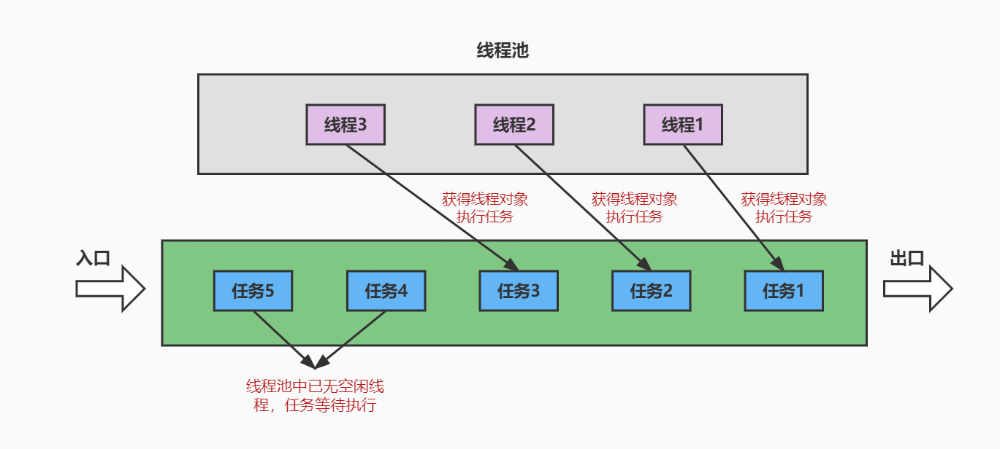

**好处：**

- 提高响应速度（减少了创建新线程的时间）

- 降低资源消耗（重复利用线程池中线程，不需要每次都创建）

- 便于线程管理
  - corePoolSize：核心池的大小
  - maximumPoolSize：最大线程数
  - keepAliveTime：线程没有任务时最多保持多长时间后会终止
  - …

**线程池相关API**

- JDK5.0之前，我们必须手动自定义线程池。从JDK5.0开始，Java内置线程池相关的API。在java.util.concurrent包下提供了线程池相关API：`ExecutorService` 和 `Executors`。
- `ExecutorService`：真正的线程池接口。常见子类ThreadPoolExecutor
  - `void execute(Runnable command)` ：执行任务/命令，没有返回值，一般用来执行Runnable
  - `<T> Future<T> submit(Callable<T> task)`：执行任务，有返回值，一般又来执行Callable
  - `void shutdown()` ：关闭连接池
- `Executors`：一个线程池的工厂类，通过此类的静态工厂方法可以创建多种类型的线程池对象。
  - `Executors.newCachedThreadPool()`：创建一个可根据需要创建新线程的线程池
  - `Executors.newFixedThreadPool(int nThreads)`; 创建一个可重用固定线程数的线程池
  - `Executors.newSingleThreadExecutor()` ：创建一个只有一个线程的线程池
  - `Executors.newScheduledThreadPool(int corePoolSize)`：创建一个线程池，它可安排在给定延迟后运行命令或者定期地执行。

**代码举例：**

```java
class NumberThread implements Runnable{

    @Override
    public void run() {
        for(int i = 0;i <= 100;i++){
            if(i % 2 == 0){
                System.out.println(Thread.currentThread().getName() + ": " + i);
            }
        }
    }
}

class NumberThread1 implements Runnable{

    @Override
    public void run() {
        for(int i = 0;i <= 100;i++){
            if(i % 2 != 0){
                System.out.println(Thread.currentThread().getName() + ": " + i);
            }
        }
    }
}

class NumberThread2 implements Callable {
    @Override
    public Object call() throws Exception {
        int evenSum = 0;//记录偶数的和
        for(int i = 0;i <= 100;i++){
            if(i % 2 == 0){
                evenSum += i;
            }
        }
        return evenSum;
    }

}

public class ThreadPoolTest {

    public static void main(String[] args) {
        //1. 提供指定线程数量的线程池
        ExecutorService service = Executors.newFixedThreadPool(10);
        ThreadPoolExecutor service1 = (ThreadPoolExecutor) service;
//        //设置线程池的属性
//        System.out.println(service.getClass());//ThreadPoolExecutor
        service1.setMaximumPoolSize(50); //设置线程池中线程数的上限

        //2.执行指定的线程的操作。需要提供实现Runnable接口或Callable接口实现类的对象
        service.execute(new NumberThread());//适合适用于Runnable
        service.execute(new NumberThread1());//适合适用于Runnable

        try {
            Future future = service.submit(new NumberThread2());//适合使用于Callable
            System.out.println("总和为：" + future.get());
        } catch (Exception e) {
            e.printStackTrace();
        }
        //3.关闭连接池
        service.shutdown();
    }

}
```

