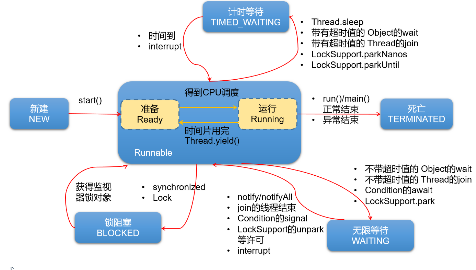

# 第10章：随堂复习与企业真题（多线程）

***

## 一、随堂复习

### 1. 几个概念

```
程序(program)：为完成特定任务，用某种语言编写的`一组指令的集合`。即指一段静态的代码。

进程(process)：程序的一次执行过程，或是正在内存中运行的应用程序。程序是静态的，进程是动态的。
              进程作为操作系统调度和分配资源的最小单位。

线程(thread)：进程可进一步细化为线程，是程序内部的一条执行路径。
             线程作为CPU调度和执行的最小单位
```

```
线程调度策略
分时调度：所有线程`轮流使用` CPU 的使用权，并且平均分配每个线程占用 CPU 的时间。

抢占式调度：让`优先级高`的线程以`较大的概率`优先使用 CPU。如果线程的优先级相同，那么会随机选择一个(线程随机性)，Java使用的为抢占式调度。
```

```
> 单核CPU与多核CPU
> 并行与并发
```

### 2. 如何创建多线程（重点）

- 方式1：继承Thread类
- 方式2：实现Runnable接口
- 方式3：实现Callable接口 （jdk5.0新增）
- 方式4：使用线程池（jdk5.0新增）

### 3. Thread类的常用方法、线程的生命周期

```
熟悉常用的构造器和方法：
1. 线程中的构造器
- public Thread() :分配一个新的线程对象。
- public Thread(String name) :分配一个指定名字的新的线程对象。
- public Thread(Runnable target) :指定创建线程的目标对象，它实现了Runnable接口中的run方法
- public Thread(Runnable target,String name) :分配一个带有指定目标新的线程对象并指定名字。

2.线程中的常用方法：
> start():①启动线程 ②调用线程的run()
> run():将线程要执行的操作，声明在run()中。
> currentThread():获取当前执行代码对应的线程
> getName(): 获取线程名
> setName(): 设置线程名
> sleep(long millis):静态方法，调用时，可以使得当前线程睡眠指定的毫秒数
> yield():静态方法，一旦执行此方法，就释放CPU的执行权
> join(): 在线程a中通过线程b调用join()，意味着线程a进入阻塞状态，直到线程b执行结束，线程a才结束阻塞状态，继续执行。
> isAlive():判断当前线程是否存活

3. 线程的优先级：
getPriority():获取线程的优先级
setPriority():设置线程的优先级。范围[1,10]


Thread类内部声明的三个常量：
- MAX_PRIORITY（10）：最高优先级
- MIN _PRIORITY （1）：最低优先级
- NORM_PRIORITY （5）：普通优先级，默认情况下main线程具有普通优先级。
```

线程的生命周期：

jdk5.0之前：


jdk5.0及之后：Thread类中定义了一个内部类State

```java
public enum State {
        
        NEW,
    
        RUNNABLE,

        BLOCKED,

        WAITING,

        TIMED_WAITING,
 
        TERMINATED;
}
```



### 4. 如何解决线程安全问题(重点、难点)

- 什么是线程的安全问题？多个线程操作共享数据，就有可能出现安全问题。

- 如何解决线程的安全问题？有几种方式？

  - 同步机制：① 同步代码块 ② 同步方法

    - 重点关注两个事：共享数据及操作共享数据的代码；同步监视器（保证唯一性）

    ```
    在实现Runnable接口的方式中，同步监视器可以考虑使用：this。
    在继承Thread类的方式中，同步监视器要慎用this，可以考虑使用：当前类.class。
    ```

    ```
    非静态的同步方法，默认同步监视器是this
    静态的同步方法，默认同步监视器是当前类本身。
    ```

  - jdk5.0新增：Lock接口及其实现类。（保证多个线程共用同一个Lock的实例）

### 5. 同步机制相关的问题

- 懒汉式的线程安全的写法
- 同步机制会带来的问题：死锁
  - 死锁产生的条件及规避方式

### 6. 线程间的通信

- 在同步机制下，考虑线程间的通信
- wait() 、notify() 、notifyAll() 都需要使用在同步代码块或同步方法中。

- 高频笔试题：wait() / sleep()


## 二、企业真题

### 2.1 线程概述

#### 1. 什么是线程(*云网络)

略

#### 2. 线程和进程有什么区别(*团、腾\*、\*云网络、神**岳、言\*有物、直\*科技)

进程：对应一个运行中的程序。

线程：运行中的进程的一条或多条执行路径。

#### 3. 多线程使用场景（嘉*医疗）

- 手机app应用的图片的下载
- 迅雷的下载
- Tomcat服务器上web应用，多个客户端发起请求，Tomcat针对多个请求开辟多个线程处理

### 2.2 如何实现多线程

#### 1. 如何在Java中出实现多线程？(阿\*校招、当\*置业、鸿\*网络、奥\*医药、\*科软、慧\*、上海驿\*软件、海\*科)

```
类似问题：
> 创建多线程用Runnable还是Thread(北京中*瑞飞)
> 多线程有几种实现方法，都是什么？（锐*（上海）企业管理咨询）
```

四种。

#### 2. Thread类中的start()和run()有什么区别？(北京中油\*\*、爱\*信、神\*泰岳、直\*科技，\*软国际，上海\*学网络)

start()：① 开启线程 ② 调用线程的run()

#### 3. 启动一个线程是用run()还是start()?（*度）

start()

#### 4. Java中Runnable和Callable有什么不同？(平\*金服、银\*数据、好\*在、亿\*征信、花儿**网络)

```
与之前的方式的对比：与Runnable方式的对比的好处
> call()可以有返回值，更灵活
> call()可以使用throws的方式处理异常，更灵活
> Callable使用了泛型参数，可以指明具体的call()的返回值类型，更灵活

有缺点吗？如果在主线程中需要获取分线程call()的返回值，则此时的主线程是阻塞状态的。
```

#### 5. 什么是线程池，为什么要使用它？(上海明*物联网科技)

```
此方式的好处：
> 提高了程序执行的效率。（因为线程已经提前创建好了）
> 提高了资源的复用率。（因为执行完的线程并未销毁，而是可以继续执行其他的任务）
> 可以设置相关的参数，对线程池中的线程的使用进行管理
```

### 2.3 常用方法、生命周期

#### 1. sleep() 和 yield()区别？(神*泰岳)

sleep()：一旦调用，就进入“阻塞”（或TIMED_WAITING状态）

yield():释放cpu的执行权，处在RUNNABLE的状态

#### 2. 线程创建的中的方法、属性情况？(招通**、数\*互融)

略

#### 3. 线程的生命周期？(中国**电子商务中心、\*科软、慧\*)

略

#### 4. 线程的基本状态以及状态之间的关系？(直*科技)

```
类似问题：
> 线程有哪些状态？如何让线程进入阻塞？（华*中*，*兴）
> 线程有几个状态，就绪和阻塞有什么不同。（美*）
> Java的线程都有哪几种状态（字*跳动、*东、*手）
```

略

#### 5. stop()和suspend()方法为何不推荐使用？（上海驿*软件）

stop()：一旦执行，线程就结束了，导致run()有未执行结束的代码。stop()会导致释放同步监视器，导致线程安全问题。

suspend()：与resume()搭配使用，导致死锁。

#### 6. Java 线程优先级是怎么定义的？（软*动力）

三个常量。[1,10]

### 2.4 线程安全与同步机制

#### 1. 你如何理解线程安全的？线程安全问题是如何造成的？（*软国际）

```
类似问题：
> 线程安全说一下？（奥*医药）
> 对线程安全的理解（*度校招）
> 什么是线程安全？(银*数据)
```

略

#### 2. 多线程共用一个数据变量需要注意什么？（史*夫软件）

线程安全问题

#### 3. 多线程保证线程安全一般有几种方式？（来*科技、北京\*信天\*）

```
类似问题：
> 如何解决其线程安全问题，并且说明为什么这样子去解决？（北京联合**）
> 请说出你所知道的线程同步的方法。（天*伟业）
> 哪些方法实现线程安全？（阿*）   
> 同步有几种实现方法，都是什么? （锐*企业管理咨询）
> 你在实际编码过程中如何避免线程安全问题？（*软国际）
> 如何让线程同步?（*手）
> 多线程下有什么同步措施（阿*校招）
> 同步有几种实现方法，都是什么？（海*科）
```

- 同步机制
- Lock接口

#### 4. 用什么关键字修饰同步方法?（上海驿*软件） 

synchronized

#### 5. synchronized加在静态方法和普通方法区别（来*科技）

同步监视器不同。静态：当前类本身   非静态：this

#### 6. Java中synchronized和ReentrantLock有什么不同(三*重工)

```
类似问题：
> 多线程安全机制中 synchronized和lock的区别（中*国际、*美、鸿*网络）
> 怎么实现线程安全，各个实现方法有什么区别？（美*、字*跳动）
> synchronized 和 lock 区别（阿*、*壳）
```

```
synchronized不管是同步代码块还是同步方法，都需要在结束一对{}之后，释放对同步监视器的调用。
Lock是通过两个方法控制需要被同步的代码，更灵活一些。
Lock作为接口，提供了多种实现类，适合更多更复杂的场景，效率更高。
```


#### 7. 当一个线程进入一个对象的一个synchronized方法后，其它线程是否可进入此对象的其它方法?（鸿*网络）

需要看其他方法是否使用synchronized修饰，同步监视器的this是否是同一个。

只有当使用了synchronized，且this是同一个的情况下，就不能访问了。


#### 8. 线程同步与阻塞的关系？同步一定阻塞吗？阻塞一定同步吗？（阿*校招、西安\*创佳\*）

同步一定阻塞；阻塞不一定同步。

### 2.5 死锁

#### 1. 什么是死锁，产生死锁的原因及必要条件（腾*、阿\*）

```
1. 如何看待死锁？
不同的线程分别占用对方需要的同步资源不放弃，都在等待对方放弃自己需要的同步资源，就形成了线程的死锁。
我们编写程序时，要避免出现死锁。

2. 诱发死锁的原因？
- 互斥条件
- 占用且等待
- 不可抢夺（或不可抢占）
- 循环等待

以上4个条件，同时出现就会触发死锁。


3. 如何避免死锁？
针对条件1：互斥条件基本上无法被破坏。因为线程需要通过互斥解决安全问题。
针对条件2：可以考虑一次性申请所有所需的资源，这样就不存在等待的问题。
针对条件3：占用部分资源的线程在进一步申请其他资源时，如果申请不到，就主动释放掉已经占用的资源。
针对条件4：可以将资源改为线性顺序。申请资源时，先申请序号较小的，这样避免循环等待问题。
```

#### 2. 如何避免死锁？(阿\*、北京\*蓝、*手)

见上。

### 2.6 线程通信

#### 1. Java中notify()和notifyAll()有什么区别(汇*天下)

```
notify():一旦执行此方法，就会唤醒被wait()的线程中优先级最高的那一个线程。（如果被wait()的多个线程的优先级相同，则
         随机唤醒一个）。被唤醒的线程从当初被wait的位置继续执行。
notifyAll():一旦执行此方法，就会唤醒所有被wait的线程。
```

#### 2. 为什么wait()和notify()方法要在同步块中调用(北京*智)

因为调用者必须是同步监视器。

#### 3. 多线程：生产者，消费者代码（同步、wait、notifly编程）（猫*娱乐）

```
类似问题：
> 如何写代码来解决生产者消费者问题(上海明*物联网)
> 多线程中生产者和消费者如何保证同步（*为）
> 消费者生产者，写写伪代码（字*）
```

略

#### 4. wait()和sleep()有什么区别？调用这两个函数后，线程状态分别作何改变？（字\*、*东）

```
类似问题：
> 线程中sleep()和wait()有什么区别？（外派*度）
> Java线程阻塞调用 wait 函数和 sleep 区别和联系（阿*）
> wait和sleep的区别，他们两个谁会释放锁（软*动力、*创）
```

```
相同点：一旦执行，当前线程都会进入阻塞状态

不同点：
> 声明的位置：wait():声明在Object类中
            sleep():声明在Thread类中，静态的
> 使用的场景不同：wait():只能使用在同步代码块或同步方法中
               sleep():可以在任何需要使用的场景
> 使用在同步代码块或同步方法中：wait():一旦执行，会释放同步监视器
                          sleep():一旦执行，不会释放同步监视器
> 结束阻塞的方式：wait(): 到达指定时间自动结束阻塞 或 通过被notify唤醒，结束阻塞
               sleep(): 到达指定时间自动结束阻塞
```


### 2.7 单例模式（线程安全）

#### 1. 手写一个单例模式(Singleton)，还要安全的（\*通快递、君*科技）

饿汉式；安全的懒汉式；内部类；

#### 2. 手写一个懒汉式的单例模式&解决其线程安全问题，并且说明为什么这样子去解决（5*）

```
类似问题：
> 手写一个懒汉式的单例模式（北京联合**）
```

同上。