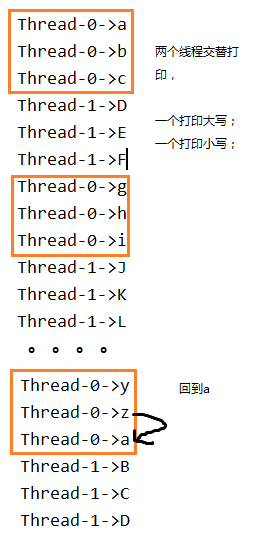

# 第10章_多线程扩展练习

讲师：尚硅谷-宋红康

网址：www.atguigu.com

***

## Thread类中的方法

### 1、新年倒计时

模拟新年倒计时，每隔1秒输出一个数字，依次输出10,9,8......1，最后输出：新年快乐！

```java

public class Exercise1 {
    public static void main(String[] args) {
        for (int i = 10; i>=0; i--) {
            System.out.println(i);
            try {
                Thread.sleep(1000);
            } catch (InterruptedException e) {
                e.printStackTrace();
            }
        }
        System.out.println("新年快乐！");
    }
}

```

## 线程创建

### 2、奇偶数输出

案例：在子线程中输出1-100之间的偶数，主线程输出1-100之间的奇数。

效果如下：


```java
public class Exercise2 {
	public static void main(String[] args) {
		new Thread("子线程"){
			public void run(){
				for (int i = 0; i <= 100; i+=2) {
					System.out.println(getName() + "-->" + i);
				}
			}
		}.start();
		
		for (int i = 1; i <= 100; i+=2) {
			System.out.println("main主线程 -->" + i);
		}
	}
}

```

### 3、强行加塞

自定义线程类ChatThread：问是否结束（输入Y/y结束），如果输入的不是y，继续问是否结束，直到输入y才结束。

打印[1,10]，每隔10毫秒打印一个数字，现在当主线程打印完5之后，就让自定义线程类加塞，直到自定义线程类结束，主线程再继续。

```java

public class ChatThread extends Thread{
    public void run(){
        Scanner input = new Scanner(System.in);
        while(true){
            System.out.print("是否结束（Y、N）：");
            String answer = input.nextLine();
            if(!"".equals(answer) && Character.toUpperCase(answer.charAt(0))=='Y'){
                break;
            }
        }
        input.close();
    }
}
```

```java

public class Exercise3 {
	public static void main(String[] args) {
		for (int i = 1; i <= 10; i++) {
			System.out.println("main:" + i);
			try {
				Thread.sleep(10);
			} catch (InterruptedException e) {
				e.printStackTrace();
			}
         //当main打印到5之后，需要等join进来的线程停止后才会继续了。
			if(i==5){
                ChatThread t = new ChatThread();
				t.start();
				try {
					t.join();
				} catch (InterruptedException e) {
					e.printStackTrace();
				}
			}
		}
	}
}

```

### 4、奇偶数打印

声明一个PrintEvenThread线程类，继承Thread类，重写run方法，实现打印[1,100]之间的偶数，要求每隔1毫秒打印1个偶数。

声明一个PrintOddThread线程类，继承Thread类，重写run方法，实现打印[1,100]之间的奇数。

在main线程中：

（1）创建两个线程对象，并启动两个线程

（2）当打印奇数的线程结束了，让偶数的线程也停下来，就算偶数线程没有全部打印完[1,100]之间的偶数。

```java
public class PrintEvenThread extends Thread{
    private boolean flag = true;
    @Override
    public void run() {
        for (int i = 2; i <= 100 && flag; i += 2) {
            System.out.println("偶数线程：" + i);
            try {
                Thread.sleep(1);
            } catch (InterruptedException e) {
                e.printStackTrace();
            }
        }
    }

    public void setFlag(boolean flag) {
        this.flag = flag;
    }
}
```

```java
public class PrintOddThread extends Thread {
    @Override
    public void run() {
        for (int i = 1; i <= 100; i += 2) {
            System.out.println("奇数线程：" + i);
        }
    }
}
```

```java
public class Exercise4 {
    public static void main(String[] args) {
        PrintEvenThread pe = new PrintEvenThread();
        PrintOddThread po = new PrintOddThread();
        pe.start();
        po.start();

        try {
            po.join();
        } catch (InterruptedException e) {
            e.printStackTrace();
        }
        pe.setFlag(false);
    }
}
```

### 5、龟兔赛跑友谊赛

案例：编写龟兔赛跑多线程程序，设赛跑长度为30米

兔子的速度是10米每秒，兔子每跑完10米休眠的时间10秒

乌龟的速度是1米每秒，乌龟每跑完10米的休眠时间是1秒

要求：要等兔子和乌龟的线程结束，主线程（裁判）才能公布最后的结果。

```java
//提示：System.currentTimeMillis()方法可以返回当前时间的毫秒值(long类型)
long start = System.currentTimeMillis();

//中间代码
     
long end = System.currentTimeMillis();
System.out.println("中间代码运行耗时：" + (end - start) +"毫秒")
```

```java
public class Racer extends Thread{
    private long meterTime;//跑1米的时间
    private long restTime;//跑完10米休息时间
    private long time; //记录总用时

    //有参构造
    public Racer(String name, long meterTime, long restTime) {
        super(name);
        this.meterTime = meterTime;
        this.restTime = restTime;
    }

    public void run(){
        long start = System.currentTimeMillis(); //获取时间值，现在距离1970-1-1 0.0.0 0的毫秒值
        for (int i=1; i<=30; i++){//i单位是米
            try {
                Thread.sleep(meterTime);
                System.out.println(getName() + "已经跑了" + i + "米");
            } catch (InterruptedException e) {
                e.printStackTrace();
            }
            try {
                if(i==10 || i==20){
                    System.out.println(getName() +"正在休息....");
                    Thread.sleep(restTime);
                }
            } catch (InterruptedException e) {
                e.printStackTrace();
            }
        }
        System.out.println(getName() + "到达终点.");
        long end = System.currentTimeMillis(); //获取时间值，现在距离1970-1-1 0.0.0 0的毫秒值
        time =  end - start;
    }

    public long getTime() {
        return time;
    }
}

```

```java
public class Exercise5 {
    public static void main(String[] args) {
        //裁判线程执行（main线程）
        Racer r = new Racer("兔子",100,10000);
        Racer t = new Racer("乌龟",1000,1000);

        r.start();
        t.start();

        //让r和t线程都结束了，才能继续main
        try {
            r.join();
        } catch (InterruptedException e) {
            e.printStackTrace();
        }
        try {
            t.join();
        } catch (InterruptedException e) {
            e.printStackTrace();
        }

        System.out.println("兔子用时：" + r.getTime());
        System.out.println("乌龟用时：" + t.getTime());
        if(r.getTime() < t.getTime()){
            System.out.println("兔子赢");
        }else if(r.getTime() > t.getTime()){
            System.out.println("乌龟赢");
        }else{
            System.out.println("平局");
        }
    }
}
```

### 6、龟兔赛跑冠军赛

案例：编写龟兔赛跑多线程程序，设赛跑长度为30米

兔子的速度是10米每秒，兔子每跑完10米休眠的时间10秒

乌龟的速度是1米每秒，乌龟每跑完10米的休眠时间是1秒

要求：只要兔子和乌龟中有人到达终点，就宣布比赛结束，没到达终点的选手也要停下来。

```java
public class Sporter extends Thread {
    private long meterTime;//跑每米用时
    private long restTime;//跑完10米休息的时间
    private long time;//从跑到停的时间
    private int distance;//当前运动员一共跑了几米
    private final int MAX_DISTANCE = 30;
    private static boolean flag = true;//true表示跑

    //有参构造
    public Sporter(String name, long meterTime, long restTime) {
        super(name);
        this.meterTime = meterTime;
        this.restTime = restTime;
    }

    public void run() {
        long start = System.currentTimeMillis(); //获取时间值，现在距离1970-1-1 0.0.0 0的毫秒值
        while(distance < MAX_DISTANCE && flag){
            try {
                Thread.sleep(meterTime);
                distance++;
                System.out.println(getName() + "已经跑了" + distance + "米");
            } catch (InterruptedException e) {
                e.printStackTrace();
            }
            try {
                if (distance == 10 || distance == 20) {
                    System.out.println(getName() + "正在休息....");
                    Thread.sleep(restTime);
                }
            } catch (InterruptedException e) {
                e.printStackTrace();
            }
        }

        if(distance == MAX_DISTANCE){
            flag = false;
            System.out.println(getName() + "到达终点.");
        }

        long end = System.currentTimeMillis(); //获取时间值，现在距离1970-1-1 0.0.0 0的毫秒值
        time = end - start;
        System.out.println(getName() + "停止跑");
    }

    public long getTime() {
        return time;
    }

    public static boolean isFlag() {
        return flag;
    }

    public int getDistance() {
        return distance;
    }
}
```

```java
public class Exercise6 {
    public static void main(String[] args) {
        Sporter s1 = new Sporter("兔子",100,10000);
        Sporter s2 = new Sporter("乌龟",1000,1000);

        s1.start();
        s2.start();

        try {
            s1.join();
        } catch (InterruptedException e) {
            e.printStackTrace();
        }
        try {
            s2.join();
        } catch (InterruptedException e) {
            e.printStackTrace();
        }

        //宣布结果
        if(s1.getDistance() > s2.getDistance()){
            System.out.println("兔子赢");
        }else if(s1.getDistance() <s2.getDistance()){
            System.out.println("乌龟赢");
        }else{
            //距离一样
			//System.out.println("平局");
			//如果要再严格一点
            if(s1.getTime() < s2.getTime()){
                System.out.println("兔子赢");
            }else if(s1.getTime() > s2.getTime()){
                System.out.println("乌龟赢");
            }else{
                System.out.println("平局");
            }
        }
    }
}
```

### 7、多人过山洞

案例：请按要求编写多线程应用程序，模拟多个人通过一个山洞：

​	1、这个山洞每次只能通过一个人，每个人通过山洞的时间为5秒；

​	2、随机生成10个人，同时准备过此山洞

​	3、定义一个变量用于记录通过隧道的人数

​	4、显示每次通过山洞人的姓名，和通过顺序；

案例运行效果如下：


开发提示：

（1）定义一个隧道类，例如Tunnel，实现Runnable接口：

- 定义一个int类型的变量crossNum，用来记录通过隧道的人数；

- 重写Runnable的run方法，调用通过隧道的方法cross()
- 定义通过隧道的方法void cross()，模拟每个人通过隧道需要5秒钟
  - 打印“xx开始通过隧道...”
  - 线程睡眠5秒钟，模拟每个人通过隧道需要5秒钟；
  - 改变通过的人次；
  - 打印线程名称及其通过隧道的顺序，模拟人通过隧道及其顺序；

（2）定义测试类

- 在main方法中创建一个隧道类对象；

- 在main方法中，循环创建10个子线程对象，通过构造方法把隧道对象和线程名（作为人的姓名）传递进去，并开启子线程；

```java
public class Tunnel implements Runnable {
	// 1.1 定义一个变量，用来记录通过隧道的人数
	private int crossNum = 0;

	/*
	 * 1.2 重写Runnable的run方法
	 */
	@Override
	public void run() {
		// 1.4 调用通过隧道的方法
		cross();
	}

	/*
	 * 1.3 定义一个同步方法，模拟每个人通过隧道需要5秒钟
	 */
	public synchronized void cross() {
		//1.3.1 打印 xx开始通过隧道...
		System.out.println(Thread.currentThread().getName() + "开始通过隧道...");
		// 1.3.2 子线程睡眠5秒钟，模拟每个人通过隧道需要5秒钟
		try {
			Thread.sleep(5000);
		} catch (InterruptedException e) {
			e.printStackTrace();
		}
		// 1.3.3 改变通过的人次
		crossNum++;
		// 1.3.4 打印线程名称及其通过隧道的顺序，模拟人通过隧道及其顺序
		System.out.println(Thread.currentThread().getName() + "已经通过隧道，TA是第" + crossNum + "通过的！");
	}
}

```

```java
public class Exercise7 {
	public static void main(String[] args) {
		// 2.1 在main方法中创建一个隧道类对象
		Tunnel tul = new Tunnel();

		// 2.2 在main方法中，循环创建10个子线程对象，通过构造方法把隧道对象和// 线程名（作为人的姓名）传递进去，并开启子线程
		for (int i = 1; i <= 10; i++) {
			Thread t = new Thread(tul, "p" + i);
			t.start();
		}
	}
}

```

### 8、奇偶数连续打印

案例：创建和启动2个子线程，一个打印100以内的奇数，一个打印100以内的偶数，

（1）要求每个线程要么不打印，要么就连续打印5个数，每个数打印间隔50毫秒

（2）但两个线程不要求交替打印。

效果如下：


```java
//方式1
public class Exercise8 {
    public static void main(String[] args) {
        new PrintEven().start();
        new PrintOdd().start();
    }
}
class PrintEven extends Thread {
    private int num = 2;

    public void run() {
        while (num <= 100) {
            synchronized (Thread.class) {
                for (int i = 1; i <= 5; i++) {
                    System.out.println("偶数线程，第" + i + "个：" + num);
                    num += 2;
                    try {
                        Thread.sleep(50);
                    } catch (InterruptedException e) {
                        e.printStackTrace();
                    }
                }
            }

        }
    }
}

class PrintOdd extends Thread {
    private int num = 1;

    public void run() {
        while (num <= 100) {
            synchronized (Thread.class) {
                for (int i = 1; i <= 5; i++) {
                    System.out.println("奇数线程，第" + i + "个：" + num);
                    num += 2;
                    try {
                        Thread.sleep(50);
                    } catch (InterruptedException e) {
                        e.printStackTrace();
                    }
                }
            }
        }
    }
}

```

```java
//方式2
/*
（1）声明一个资源类，例如PrintNumber，

- 包含一个int类型的变量even，初始化为2
- 包含一个int类型的变量odd，初始化为1
- 包含void printEven()方法，循环输出5个偶数
- 包含void printOdd()方法，循环输出5个奇数

（2）在测试类中

- 创建资源类PrintNumber的对象
- 启动一个偶数线程，调用PrintNumber的对象printEven()方法
- 启动一个奇数数线程，调用printOdd的对象printEven()方法

*/

class PrintNumber {
    private int even = 2;
    private int odd = 1;

    public synchronized void printEven(){
        for (int i = 1; i <=5 ; i++,even += 2) {
            System.out.println(Thread.currentThread().getName()+"本轮打印的第" + i + "个数字：" + even);
        }
    }

    public synchronized void printOdd(){
        for (int i = 1; i <=5 ; i++,odd+=2) {
            System.out.println(Thread.currentThread().getName()+"本轮打印的第" + i + "个数字：" + odd);
        }
    }

}

public class Exercise8 {
    public static void main(String[] args) {
        PrintNumber p = new PrintNumber();

        new Thread("偶数线程"){
            @Override
            public void run(){
                while(true){
                    p.printEven();
                    try {
                        Thread.sleep(500);
                    } catch (InterruptedException e) {
                        e.printStackTrace();
                    }
                }
            }
        }.start();

        new Thread("奇数线程"){
            @Override
            public void run(){
                while(true){
                    p.printOdd();
                    try {
                        Thread.sleep(500);
                    } catch (InterruptedException e) {
                        e.printStackTrace();
                    }
                }
            }
        }.start();
    }
}
```

### 9、字母连续打印

案例需求：

要求两个线程，同时打印字母，每个线程都能连续打印3个字母。两个线程交替打印，一个线程打印字母的小写形式，一个线程打印字母的大写形式，但是字母是连续的。当字母循环到z之后，回到a。

案例运行效果如下：



开发提示：

（1）声明一个资源类，例如：PrintLetter

- 包含一个char类型的成员变量letter，初始化为'a'，
- 包含void printLower() 负责打印小写字母，使用循环连续打印3个字母，如果letter的值已经是'z'里，重新赋值为'a'。唤醒其他线程，当前线程等待。
- 包含printUpper()负责打印大写字母，使用循环连续打印3个字母，并把letter中的字母转换为大写形式输出。唤醒其他线程，当前线程等待。

（2）在测试类中

- 创建资源类PrintLetter对象
- 创建并启动一个线程，负责调用资源类PrintLetter对象的printLower()
- 创建并启动另一个线程，负责调用资源类PrintLetter对象的printUpper()

```java
public class PrintLetter {
    private char letter = 'a';

    public synchronized void printLower() {
        for (int i = 1; i <= 3; i++) {
            System.out.println(Thread.currentThread().getName() + "->" + letter);
            letter++;
            if (letter > 'z') {
                letter = 'a';
            }
        }
        this.notify();
        try {
            this.wait();
        } catch (InterruptedException e) {
            e.printStackTrace();
        }
    }

    public synchronized void printUpper() {
        for (int i = 1; i <= 3; i++) {
            System.out.println(Thread.currentThread().getName() + "->" + (char) (letter - 32));
            letter++;
            if (letter > 'z') {
                letter = 'a';
            }
        }
        this.notify();
        try {
            this.wait();
        } catch (InterruptedException e) {
            e.printStackTrace();
        }
    }
}

```

```java
public class Exercise9 {
    public static void main(String[] args) {
        // 创建资源对象
        PrintLetter p = new PrintLetter();

        // 创建两个线程打印
        new Thread("小写字母") {
            public void run() {
                while (true) {
                    p.printLower();
                    try {
                        Thread.sleep(1000);// 控制节奏
                    } catch (InterruptedException e) {
                        e.printStackTrace();
                    }
                }
            }
        }.start();

        new Thread("大写字母") {
            public void run() {
                while (true) {
                    p.printUpper();
                    try {
                        Thread.sleep(1000);// 控制节奏
                    } catch (InterruptedException e) {
                        e.printStackTrace();
                    }
                }
            }
        }.start();
    }
}

```

## 线程通信

### 10、奇偶数交替打印

案例：创建和启动2个子线程，一个打印奇数，一个打印偶数，

（1）要求实现交替打印。

（2）每个数打印间隔1秒

效果如下：


```java
//方式1
public class Exercise10 {
	public static void main(String[] args) {
		new PrintNumber().start();
		new PrintNumber().start();
	}
}
class PrintNumber extends Thread{
	private static int num;
	public void run(){
		while(true){
			synchronized (PrintNumber.class) {
				try {
					PrintNumber.class.notify();
					Thread.sleep(1000);
					System.out.println(getName() + ":" + ++num); 
					PrintNumber.class.wait();
				} catch (InterruptedException e) {
					e.printStackTrace();
				}
			}
		}
	}
}
```

```java
//方式2
/*
（1）编写一个资源类，例如：Number类，

- 包含1个int类型的num，用来记录线程要打印的数字，初始值为1。
- 包含1个boolean类型的odd，用来标记是奇数线程打印还是偶数线程打印，true表示奇数线程打印，false表示偶数线程打印。初始化为true。
- 包含void printOddNum()方法，判断odd为true，就打印num，之后修改odd为false，然后唤醒偶数线程，之后自己wait。
- 包含void printEvenNum()方法，判断odd为false，就打印num，之后修改odd为true，然后唤醒奇数线程，之后自己wait。

（2）在测试类中

- 创建Number类对象
- 创建一个奇数线程，并启动，重写run方法，循环调用Number类对象的printOddNum()方法。
- 创建一个偶数线程，并启动，重写run方法，循环调用Number类对象的printEvenNum()方法。

*/
class Number {
    private int num = 1;
    private boolean odd = true;

    public synchronized void printOddNum(){
        if(odd){
            System.out.println(Thread.currentThread().getName() + "：" + num++);
        }
        odd = false;
        this.notify();
        try {
            this.wait();
        } catch (InterruptedException e) {
            e.printStackTrace();
        }
    }

    public synchronized void printEvenNum(){
        if(!odd){
            System.out.println(Thread.currentThread().getName() + "：" + num++);
        }
        odd = true;
        this.notify();
        try {
            this.wait();
        } catch (InterruptedException e) {
            e.printStackTrace();
        }
    }

    public int getNum() {
        return num;
    }
}

public class Exercise10 {
    public static void main(String[] args) {
        Number number = new Number();

        new Thread(){
            public void run(){
                while(true){
                    number.printOddNum();
                    try {
                        Thread.sleep(1000);
                    } catch (InterruptedException e) {
                        e.printStackTrace();
                    }
                }
            }
        }.start();

        new Thread(){
            public void run(){
                while(true){
                    number.printEvenNum();
                }
            }
        }.start();
    }
}
```

### 11、银行账户-1

案例：

​	1、创建一个银行账户类，

​	（1）属性：账号，余额

​	（2）get/set方法

​	（3）toString()：返回：账户：xxx，余额：xxx

​	2、创建一个丈夫类

​		负责往里存钱，每次存款[0,10000)以内不等

​	3、创建一个妻子类

​		负责取钱，每次取款[0,10000)以内不等，如果余额不足，要等丈夫存够了才能取


```java
public class Exercise11 {
	public static void main(String[] args) {
		Account a = new Account("1122",0);
		
		new Wife(a).start();
		new Husband(a).start();
	}
}
class Account{
	private String id;
	private double balance;
	public Account(String id, double balance) {
		super();
		this.id = id;
		this.balance = balance;
	}
	public String getId() {
		return id;
	}
	public void setId(String id) {
		this.id = id;
	}
	public double getBalance() {
		return balance;
	}
	public void setBalance(double balance) {
		this.balance = balance;
	}
	@Override
	public String toString() {
		return "账户：" + id + ",余额：" + balance ;
	}
}
class Wife extends Thread{
	private Account account;
	
	public Wife(Account account) {
		super();
		this.account = account;
	}

	public void run(){
		while(true){
			synchronized (Thread.class) {
				double money = Math.random() * 10000;
				while(money > account.getBalance()){
					System.out.println("本次妻子想取钱：" + money +"，但是余额不足，等待...");
					try {
						Thread.class.wait();
					} catch (InterruptedException e) {
						e.printStackTrace();
					}
				}
				System.out.println("妻子开始取钱，目前账户状态：" + account);
				System.out.println("本次妻子取钱：" + money);
				account.setBalance(account.getBalance() - money);
				System.out.println("妻子取钱结束，目前账户状态：" + account);
				System.out.println();
				try {
					Thread.sleep(1000);
				} catch (InterruptedException e) {
					e.printStackTrace();
				}
			}
			
		}
	}
}
class Husband extends Thread{
	private Account account;
	
	public Husband(Account account) {
		super();
		this.account = account;
	}

	public void run(){
		while(true){
			synchronized (Thread.class) {
				double money = Math.random() * 10000;
				System.out.println("丈夫开始存钱，目前账户状态：" + account);
				System.out.println("本次丈夫存钱：" + money);
				account.setBalance(account.getBalance() + money);
				System.out.println("丈夫开始结束，目前账户状态：" + account);
				System.out.println();
				try {
					Thread.sleep(1000);
				} catch (InterruptedException e) {
					e.printStackTrace();
				}
				Thread.class.notify();
			}
			
		}
	}
}
```

### 12、银行账户-2

（1）创建一个银行账户类Account

- 属性私有化：账号（声明为final的），余额
- 两个属性都只提供get方法
- 有参构造public Account(String id, double balance)
- toString()：返回：账户：xxx，余额：xxx
- 提供存钱方法 public void save(double money)
- 提供取钱方法public void withdraw(double money)，余额不足要等待

（2）创建一个丈夫线程类Husband

- 包含Account成员变量
- 包含public Husband(String name, Account account)构造器
- 重写run方法，调用Account对象的save方法，负责往里存钱，每次存款[100,10000)以内不等金额

（3）创建一个妻子线程类Wife

- 包含Account成员变量
- 包含public Wife(String name, Account account)构造器
- 重写run方法，调用Account对象的withdraw方法，负责取钱，每次取款[1000,20000)以内不等，如果余额不足，要等丈夫存够了才能取


```java
public class Account {
    private String id;
    private double balance;

    public Account(String id, double balance) {
        this.id = id;
        this.balance = balance;
    }

    public synchronized void save(double money){
        if(money > 0){
            balance += money;
            System.out.println("丈夫" + Thread.currentThread().getName() +"本次存钱" + money +"元，" + this );
        }
        this.notify();
    }
    public synchronized void withdraw(double money){
        while(money > balance){
            System.out.println("妻子" + Thread.currentThread().getName() +"本次想取钱" + money +"元，余额不足，等待...");
            try {
                this.wait();
            } catch (InterruptedException e) {
                e.printStackTrace();
            }
        }
        if(money > 0){
            balance -= money;
            System.out.println("妻子" + Thread.currentThread().getName() +"本次取钱" + money +"元，" + this );
        }
    }

    @Override
    public String toString() {
        return "账号：" + id +",余额：" + balance;
    }
}

```

```java
public class Husband extends Thread {
    private Account account;

    public Husband(String name, Account account) {
        super(name);
        this.account = account;
    }

    @Override
    public void run(){
        while(true){
            account.save(Math.random()*9900+100);
            try {
                Thread.sleep(1000);
            } catch (InterruptedException e) {
                e.printStackTrace();
            }
        }
    }
}

```

```java
public class Wife extends Thread {
    private Account account;

    public Wife(String name, Account account) {
        super(name);
        this.account = account;
    }

    @Override
    public void run() {
        while(true){
            account.withdraw(Math.random()*19000+1000);
            try {
                Thread.sleep(1000);
            } catch (InterruptedException e) {
                e.printStackTrace();
            }
        }
    }
}

```

```java
public class Exercise12 {
    public static void main(String[] args) {
        Account a = new Account("1122",0);
        Husband h = new Husband("老王",a);
        Wife w = new Wife("花花",a);
        h.start();
        w.start();
    }
}

```


