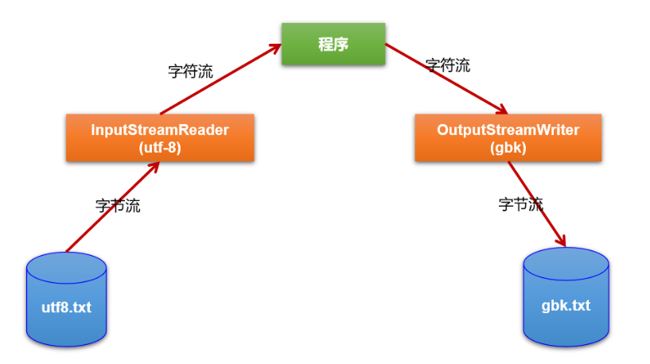

# 第15章：随堂复习与企业真题（File类与IO流）

***

## 一、随堂复习

### 1. File类的使用

- File类的一个实例对应着磁盘上的一个文件或文件目录。  ----> “万事万物皆对象”
- （熟悉）File的实例化、常用的方法
- File类中只有新建、删除、获取路径等方法，不包含读写文件的方法。此时需要使用IO流

### 2. IO流的概述

- IO流的分类
  - 流向：输入流、输出流
  - 处理数据单位：字节流、字符流
  - 流的角色：节点流、处理流
- IO的4个抽象基类：InputStream \ OutputStream \ Reader \ Writer

### 3. 节点流之：文件流

- FileInputStream \ FileOutputStream \ FileReader \ FileWriter
- （掌握）读写数据的过程。
  - 步骤1：创建File类的对象，作为读取或写出数据的端点
  - 步骤2：创建相关的流的对象
  - 步骤3：读取、写出数据的过程
  - 步骤4：关闭流资源

### 4. 处理流之一：缓冲流

- BufferedInputStream \ BufferedOutputStream \ BufferedReader \ BufferedWriter
- 作用：实现更高效的读写数据的操作

### 5. 处理流之二：转换流

- 层次1：熟悉转换流的使用
  - InputStreamReader、OutputStreamWriter
- 层次2：（掌握）字符的编码和解码的过程、常用的字符集
  - 解决相关的问题：读写字符出现乱码！本质问题：使用的解码集与编码集不一致。

### 6. 处理流之三：对象流

- 层次1：熟悉对象流的使用
  - ObjectInputStream:反序列化时需要使用的api
  - ObjectOutputStream:序列化时需要使用的api
- 层次2：对象的序列化机制
  - 使用场景：不同的进程之间通信、客户端（或浏览器端）与服务器端传输数据
  - 自定义类要想实现序列化机制需要满足的要求及注意点。

### 7. 其它流的使用

- 了解：数据流：DataInputStream 、DataOutputStream
- 了解：标准的输入流、标准的输出流：System.in 、System.out
- 了解：打印流：PrintStream、PrintWriter

## 二、企业真题

### 2.1 IO流概述

#### 1. 谈谈Java IO里面的常用类，字节流，字符流(银*数据)

略

#### 2. Java 中有几种类型的流？JDK为每种类型的流提供一些抽象类以供继承，请说出他们分别是哪些类？（上海*厦\*联网、极\*科技）

InputStream \ OutputStream \ Reader \ Writer

#### 3. 流一般需不需要关闭？如果关闭的话用什么方法？处理流是怎么关闭的？(银*数据)

需要。close()

处理流在关闭过程中，也会关闭内部的流。

#### 4. OutputStream里面的write()是什么意思?(君*科技)

数据写出的意思。

### 2.2 缓冲流

#### 1. BufferedReader属于哪种流？他主要是用来做什么的？(国*电网)

略

#### 2. 什么是缓冲区？有什么作用？(北京中油**)

内部提供了一个数组，将读取或要写出的数据，现在此数组中缓存。达到一定程度时，集中性的写出。

作用：减少与磁盘的交互，进而提升读写效率。

### 2.3 转换流

#### 1. 字节流和字符流是什么？怎么转换？(北京蓝\*、\*海*供应链管理）




### 2.4 序列化

#### 1. 什么是Java序列化，如何实现(君*科技、上海\*厦物联网)

```
对象序列化机制允许把内存中的Java对象转换成平台无关的二进制流，从而允许把这种二进制流持久地保存在磁盘上，
或通过网络将这种二进制流传输到另一个网络节点。//当其它程序获取了这种二进制流，就可以恢复成原来的Java对象。
```

#### 2. Java有些类中为什么需要实现Serializable接口？（阿*校招）

便于此类的对象实现序列化操作。