# 第16章_网络编程

讲师：尚硅谷-宋红康（江湖人称：康师傅）

官网：[http://www.atguigu.com](http://www.atguigu.com/)

***

## 本章专题与脉络

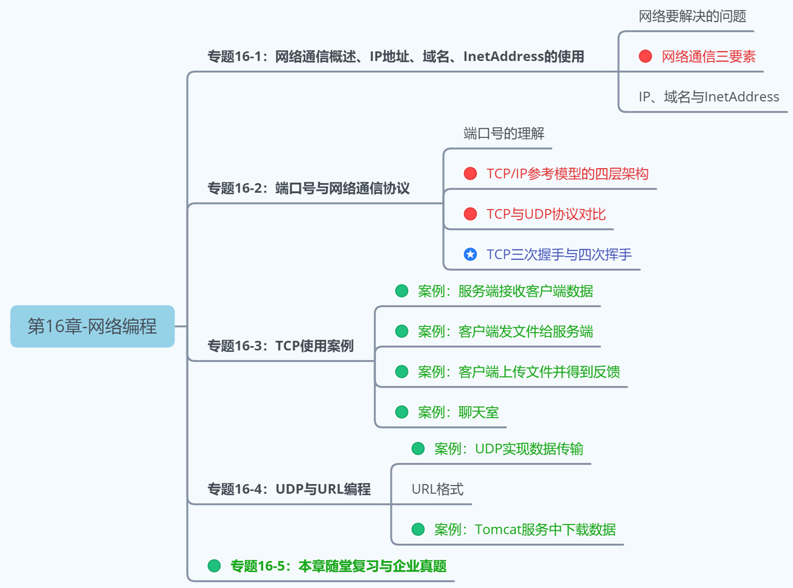

***

## 1. 网络编程概述

Java是 Internet 上的语言，它从语言级上提供了对网络应用程序的支持，程序员能够很容易开发常见的网络应用程序。

Java提供的网络类库，可以实现无痛的网络连接，联网的底层细节被隐藏在 Java 的本机安装系统里，由 JVM 进行控制。并且 Java 实现了一个跨平台的网络库，`程序员面对的是一个统一的网络编程环境`。

### 1.1 软件架构

- **C/S架构** ：全称为Client/Server结构，是指客户端和服务器结构。常见程序有QQ、美团app、360安全卫士等软件。

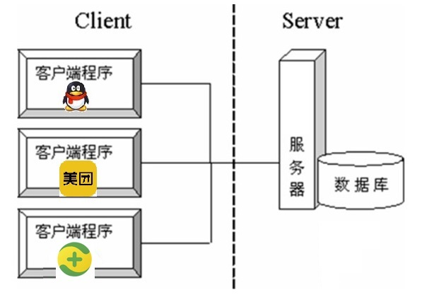

**B/S架构** ：全称为Browser/Server结构，是指浏览器和服务器结构。常见浏览器有IE、谷歌、火狐等。

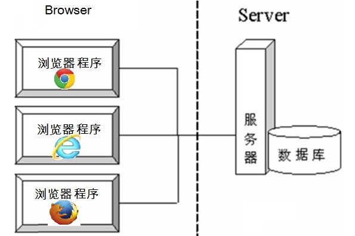

两种架构各有优势，但是无论哪种架构，都离不开网络的支持。**网络编程**，就是在一定的协议下，实现两台计算机的通信的程序。

### 1.2 网络基础

- **计算机网络：**
  把分布在不同地理区域的计算机与专门的外部设备用通信线路互连成一个规模大、功能强的网络系统，从而使众多的计算机可以方便地互相传递信息、共享硬件、软件、数据信息等资源。

- **网络编程的目的：**直接或间接地通过网络协议与其它计算机实现数据交换，进行通讯。

- **网络编程中有三个主要的问题：**
  - 问题1：如何准确地定位网络上一台或多台主机
  - 问题2：如何定位主机上的特定的应用
  - 问题3：找到主机后，如何可靠、高效地进行数据传输


## 2. 网络通信要素

### 2.1 如何实现网络中的主机互相通信

- 通信双方地址
  - IP
  - 端口号
- 一定的规则：不同的硬件、操作系统之间的通信，所有的这一切都需要一种规则。而我们就把这种规则称为协议，即网络通信协议。

**生活类比：**


### 2.2 通信要素一：IP地址和域名

#### 2.2.1 IP地址

**IP地址：指互联网协议地址（Internet Protocol Address）**，俗称IP。IP地址用来给网络中的一台计算机设备做唯一的编号。假如我们把“个人电脑”比作“一台电话”的话，那么“IP地址”就相当于“电话号码”。

**IP地址分类方式一：**

- `IPv4`：是一个32位的二进制数，通常被分为4个字节，表示成`a.b.c.d` 的形式，以点分`十进制`表示，例如`192.168.65.100` 。其中a、b、c、d都是0~255之间的十进制整数。

  - 

  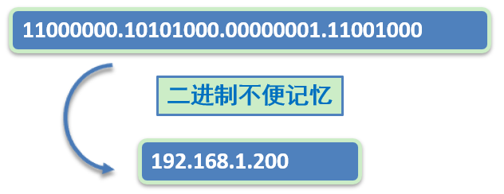

  - 这种方式最多可以表示42亿个。其中，30亿都在北美，亚洲4亿，中国2.9亿。2011年初已经用尽。

  - IP地址 = 网络地址 +主机地址
    - 网络地址：标识计算机或网络设备所在的网段
    - 主机地址：标识特定主机或网络设备
    
    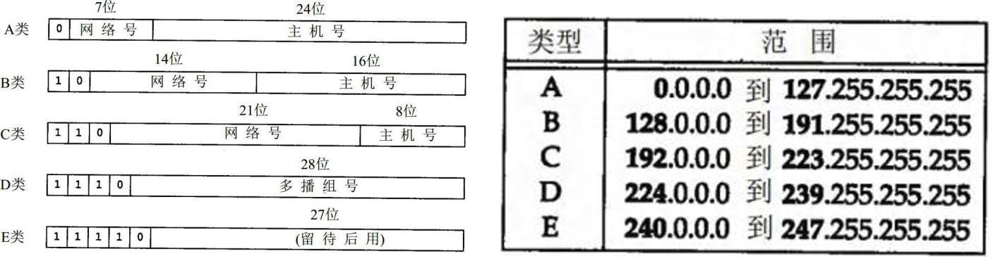
    
    其中，E类用于科研。

- `IPv6`：由于互联网的蓬勃发展，IP地址的需求量愈来愈大，但是网络地址资源有限，使得IP的分配越发紧张。

  为了扩大地址空间，拟通过IPv6重新定义地址空间，采用128位地址长度，共16个字节，写成8个无符号整数，每个整数用四个十六进制位表示，数之间用冒号（：）分开。比如：`ABCD:EF01:2345:6789:ABCD:EF01:2345:6789`，按保守方法估算IPv6实际可分配的地址，整个地球的每平方米面积上仍可分配1000多个地址，这样就解决了网络地址资源数量不够的问题。2012年6月6日，国际互联网协会举行了世界IPv6启动纪念日，这一天，全球IPv6网络正式启动。多家知名网站，如Google、Facebook和Yahoo等，于当天全球标准时间0点（北京时间8点整）开始永久性支持IPv6访问。2018年6月，三大运营商联合阿里云宣布，将全面对外提供IPv6服务，并计划在2025年前助推中国互联网真正实现“IPv6 Only”。
  
  在IPv6的设计过程中除了一劳永逸地解决了地址短缺问题以外，还考虑了在IPv4中解决不好的其它问题，主要有端到端IP连接、服务质量（QoS）、安全性、多播、移动性、即插即用等。

**IP地址分类方式二：**

公网地址( 万维网使用）和 私有地址( 局域网使用）。192.168.开头的就是私有地址，范围即为192.168.0.0--192.168.255.255，专门为组织机构内部使用。

**常用命令：**

- 查看本机IP地址，在控制台输入：

```java
ipconfig
```

- 检查网络是否连通，在控制台输入：

```java
ping 空格 IP地址
ping 220.181.57.216
```

**特殊的IP地址：**

- 本地回环地址(hostAddress)：`127.0.0.1`  
- 主机名(hostName)：`localhost`

#### 2.2.2 域名

Internet上的主机有两种方式表示地址：

- 域名(hostName)：www.atguigu.com
- IP 地址(hostAddress)：202.108.35.210

**域名解析：**因为IP地址数字不便于记忆，因此出现了域名。域名容易记忆，当在连接网络时输入一个主机的域名后，域名服务器(DNS，Domain Name System，域名系统)负责将域名转化成IP地址，这样才能和主机建立连接。 

简单理解：

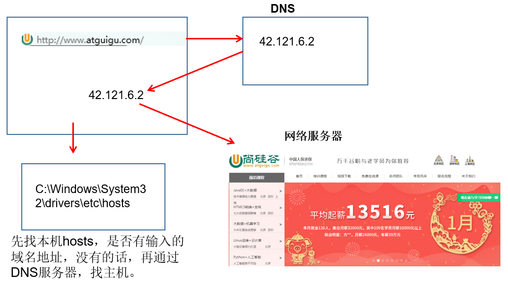

详细理解：

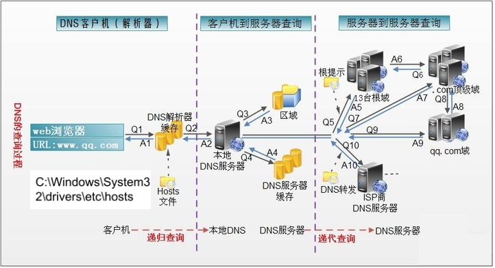

1. 在浏览器中输入www . qq .com 域名，操作系统会先检查自己本地的`hosts文件`是否有这个网址映射关系，如果有，就先调用这个IP地址映射，完成域名解析。
2. 如果hosts里没有这个域名的映射，则查找`本地DNS解析器缓存`，是否有这个网址映射关系，如果有，直接返回，完成域名解析。
3. 如果hosts与本地DNS解析器缓存都没有相应的网址映射关系，首先会找TCP/IP参数中设置的首选DNS服务器，在此我们叫它`本地DNS服务器`，此服务器收到查询时，如果要查询的域名，包含在本地配置区域资源中，则返回解析结果给客户机，完成域名解析，此解析具有权威性。
4. 如果要查询的域名，不由本地DNS服务器区域解析，但该服务器已`缓存`了此网址映射关系，则调用这个IP地址映射，完成域名解析，此解析不具有权威性。
5. 如果本地DNS服务器本地区域文件与缓存解析都失效，则根据本地DNS服务器的设置（是否设置转发器）进行查询，如果未用转发模式，本地DNS就把请求发至13台根DNS，根DNS服务器收到请求后会判断这个域名(.com)是谁来授权管理，并会返回一个负责该顶级域名服务器的一个IP。本地DNS服务器收到IP信息后，将会联系负责.com域的这台服务器。这台负责.com域的服务器收到请求后，如果自己无法解析，它就会找一个管理.com域的下一级DNS服务器地址(http://qq.com)给本地DNS服务器。当本地DNS服务器收到这个地址后，就会找（http://qq.com)域服务器，重复上面的动作，进行查询，直至找到www.qq.com主机。
6. 如果用的是转发模式，此DNS服务器就会把请求转发至上一级DNS服务器，由上一级服务器进行解析，上一级服务器如果不能解析，或找根DNS或把转请求转至上上级，以此循环。不管是本地DNS服务器用是是转发，还是根提示，最后都是把结果返回给本地DNS服务器，由此DNS服务器再返回给客户机。

### 2.3 通信要素二：端口号

网络的通信，本质上是两个进程（应用程序）的通信。每台计算机都有很多的进程，那么在网络通信时，如何区分这些进程呢？

如果说**IP地址**可以唯一标识网络中的设备，那么**端口号**就可以唯一标识设备中的进程（应用程序）。

不同的进程，设置不同的端口号。

- **端口号：用两个字节表示的整数，它的取值范围是0~65535**。
  - 公认端口：0~1023。被预先定义的服务通信占用，如：HTTP（80），FTP（21），Telnet（23）
  - 注册端口：1024~49151。分配给用户进程或应用程序。如：Tomcat（8080），MySQL（3306），Oracle（1521）。
  - 动态/ 私有端口：49152~65535。

如果端口号被另外一个服务或应用所占用，会导致当前程序启动失败。


### 2.4 通信要素三：网络通信协议

通过计算机网络可以使多台计算机实现连接，位于同一个网络中的计算机在进行连接和通信时需要遵守一定的规则，这就好比在道路中行驶的汽车一定要遵守交通规则一样。

- `网络通信协议`：在计算机网络中，这些连接和通信的规则被称为网络通信协议，它对数据的传输格式、传输速率、传输步骤、出错控制等做了统一规定，通信双方必须同时遵守才能完成数据交换。

**新的问题：网络协议涉及内容太多、太复杂。如何解决？**

计算机网络通信涉及内容很多，比如指定源地址和目标地址，加密解密，压缩解压缩，差错控制，流量控制，路由控制，如何实现如此复杂的网络协议呢？`通信协议分层思想`。

在制定协议时，把复杂成份分解成一些简单的成份，再将它们复合起来。最常用的复合方式是层次方式，即`同层间可以通信、上一层可以调用下一层，而与再下一层不发生关系`。各层互不影响，利于系统的开发和扩展。

这里有两套参考模型

- OSI参考模型：模型过于理想化，未能在因特网上进行广泛推广
- TCP/IP参考模型(或TCP/IP协议)：事实上的国际标准。

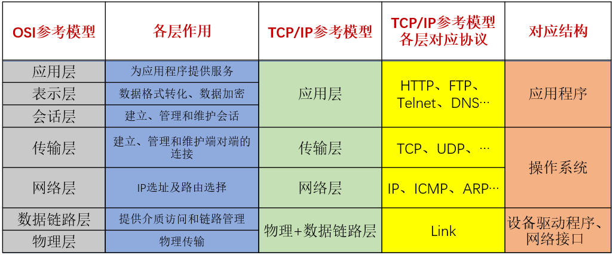

上图中，OSI参考模型：模型`过于理想化`，未能在因特网上进行广泛推广。 TCP/IP参考模型(或TCP/IP协议)：事实上的`国际标准`。

- **TCP/IP协议：** 传输控制协议/因特网互联协议( Transmission Control Protocol/Internet Protocol)，TCP/IP 以其两个主要协议：传输控制协议(TCP)和网络互联协议(IP)而得名，实际上是一组协议，包括多个具有不同功能且互为关联的协议。是Internet最基本、最广泛的协议。

  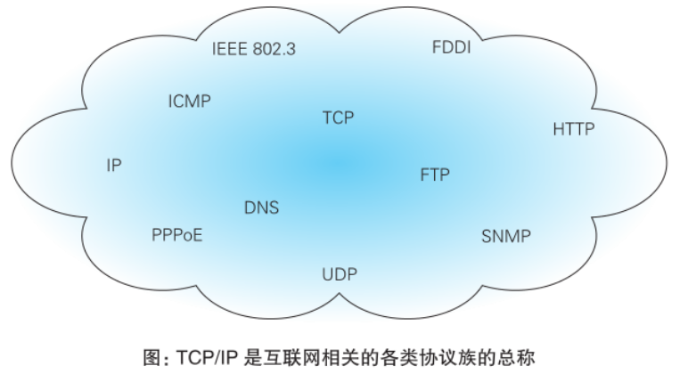

**TCP/IP协议中的四层介绍：**

- `应用层`：应用层决定了向用户提供应用服务时通信的活动。主要协议有：HTTP协议、FTP协议、SNMP（简单网络管理协议）、SMTP（简单邮件传输协议）和POP3（Post Office Protocol 3的简称,即邮局协议的第3个版）等。
- `传输层`：主要使网络程序进行通信，在进行网络通信时，可以采用TCP协议，也可以采用UDP协议。TCP（Transmission Control Protocol）协议，即传输控制协议，是一种面向连接的、可靠的、基于字节流的传输层通信协议。UDP(User Datagram Protocol，用户数据报协议)：是一个无连接的传输层协议、提供面向事务的简单不可靠的信息传送服务。
- `网络层`：网络层是整个TCP/IP协议的核心，支持网间互连的数据通信。它主要用于将传输的数据进行分组，将分组数据发送到目标计算机或者网络。而IP协议是一种非常重要的协议。IP（internet protocal）又称为互联网协议。IP的责任就是把数据从源传送到目的地。它在源地址和目的地址之间传送一种称之为数据包的东西，它还提供对数据大小的重新组装功能，以适应不同网络对包大小的要求。

* `物理+数据链路层`：链路层是用于定义物理传输通道，通常是对某些网络连接设备的驱动协议，例如针对光纤、网线提供的驱动。

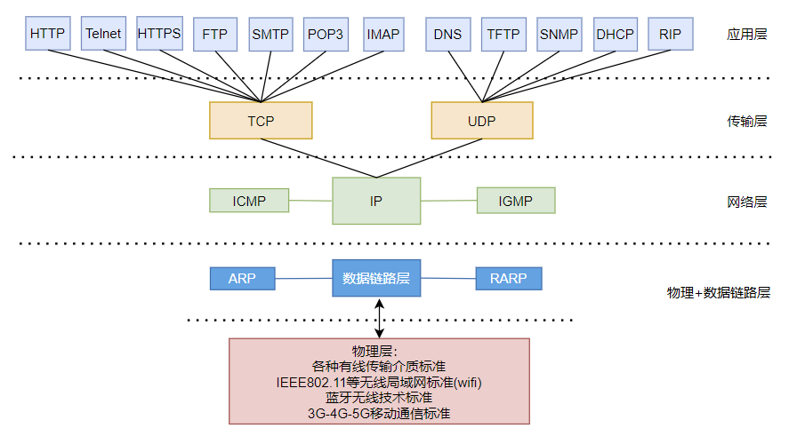

## 2. 谈传输层协议：TCP与UDP协议

通信的协议还是比较复杂的，`java.net` 包中包含的类和接口，它们提供低层次的通信细节。我们可以直接使用这些类和接口，来专注于网络程序开发，而不用考虑通信的细节。

`java.net` 包中提供了两种常见的网络协议的支持：

- **UDP**：用户数据报协议(User Datagram Protocol)。
- **TCP**：传输控制协议 (Transmission Control Protocol)。

### 2.1 TCP协议与UDP协议

**TCP协议：**

- TCP协议进行通信的两个应用进程：客户端、服务端。
- 使用TCP协议前，须先`建立TCP连接`，形成基于字节流的传输数据通道
- 传输前，采用“三次握手”方式，点对点通信，是`可靠的`
  - TCP协议使用`重发机制`，当一个通信实体发送一个消息给另一个通信实体后，需要收到另一个通信实体确认信息，如果没有收到另一个通信实体确认信息，则会再次重复刚才发送的消息。
- 在连接中可进行`大数据量的传输`
- 传输完毕，需`释放已建立的连接，效率低`

**UDP协议：**

- UDP协议进行通信的两个应用进程：发送端、接收端。
- 将数据、源、目的封装成数据包（传输的基本单位），`不需要建立连接`
- 发送不管对方是否准备好，接收方收到也不确认，不能保证数据的完整性，故是`不可靠的`
- 每个数据报的大小限制在`64K`内
- 发送数据结束时`无需释放资源，开销小，通信效率高`
- 适用场景：音频、视频和普通数据的传输。例如视频会议

> TCP生活案例：打电话
>
> UDP生活案例：发送短信、发电报

### 2.2 三次握手

TCP协议中，在发送数据的准备阶段，客户端与服务器之间的三次交互，以保证连接的可靠。

- 第一次握手，客户端向服务器端发起TCP连接的请求
- 第二次握手，服务器端发送针对客户端TCP连接请求的确认
- 第三次握手，客户端发送确认的确认

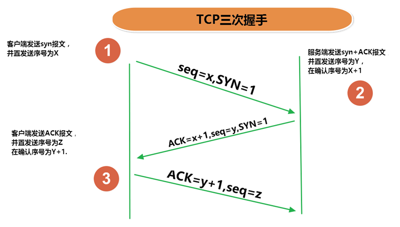

> 1、客户端会随机一个初始序列号seq=x，设置SYN=1 ，表示这是SYN握手报文。然后就可以把这个 SYN 报文发送给服务端了，表示向服务端发起连接，之后客户端处于`同步已发送`状态。
>
> 2、服务端收到客户端的 SYN 报文后，也随机一个初始序列号(seq=y)，设置ack=x+1，表示收到了客户端的x之前的数据，希望客户端下次发送的数据从x+1开始。
> 设置 SYN=1 和 ACK=1。表示这是一个SYN握手和ACK确认应答报文。最后把该报文发给客户端，该报文也不包含应用层数据，之后服务端处于`同步已接收`状态。
>
> 3、客户端收到服务端报文后，还要向服务端回应最后一个应答报文，将ACK置为 1 ，表示这是一个应答报文
> ack=y+1 ，表示收到了服务器的y之前的数据，希望服务器下次发送的数据从y+1开始。
> 最后把报文发送给服务端，这次报文可以携带数据，之后客户端处于 连接已建立 状态。服务器收到客户端的应答报文后，也进入`连接已建立`状态。

完成三次握手，连接建立后，客户端和服务器就可以开始进行数据传输了。由于这种面向连接的特性，TCP协议可以保证传输数据的安全，所以应用十分广泛，例如下载文件、浏览网页等。

### 2.3 四次挥手

TCP协议中，在发送数据结束后，释放连接时需要经过四次挥手。

* 第一次挥手：客户端向服务器端提出结束连接，`让服务器做最后的准备工作`。此时，客户端处于半关闭状态，即表示不再向服务器发送数据了，但是还可以接受数据。
* 第二次挥手：服务器接收到客户端释放连接的请求后，`会将最后的数据发给客户端`。并告知上层的应用进程不再接收数据。
* 第三次挥手：服务器发送完数据后，会给客户端`发送一个释放连接的报文`。那么客户端接收后就知道可以正式释放连接了。
* 第四次挥手：客户端接收到服务器最后的释放连接报文后，要`回复一个彻底断开的报文`。这样服务器收到后才会彻底释放连接。这里客户端，发送完最后的报文后，会等待2MSL，因为有可能服务器没有收到最后的报文，那么服务器迟迟没收到，就会再次给客户端发送释放连接的报文，此时客户端在等待时间范围内接收到，会重新发送最后的报文，并重新计时。如果等待2MSL后，没有收到，那么彻底断开。

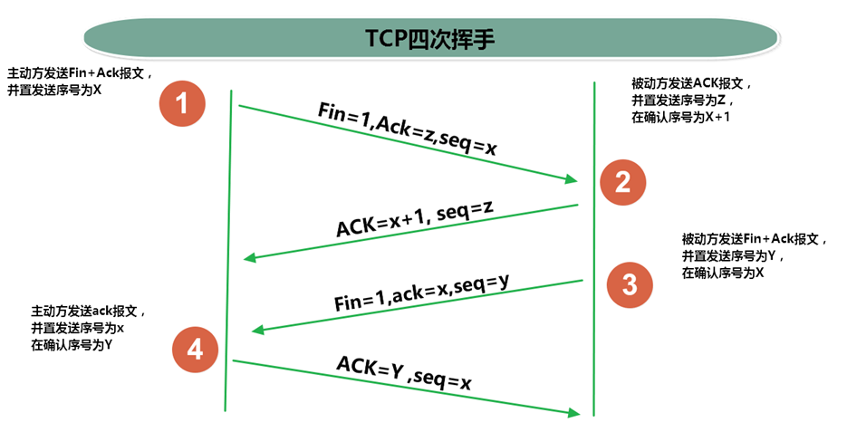

> 1、客户端打算断开连接，向服务器发送FIN报文(FIN标记位被设置为1，1表示为FIN，0表示不是)，FIN报文中会指定一个序列号，之后客户端进入FIN_WAIT_1状态。也就是客户端发出连接释放报文段(FIN报文)，指定序列号seq = u，主动关闭TCP连接，等待服务器的确认。
>
> 2、服务器收到连接释放报文段(FIN报文)后，就向客户端发送ACK应答报文，以客户端的FIN报文的序列号 seq+1 作为ACK应答报文段的确认序列号ack = seq+1 = u + 1。接着服务器进入CLOSE_WAIT(等待关闭)状态，此时的TCP处于半关闭状态(下面会说什么是半关闭状态)，客户端到服务器的连接释放。客户端收到来自服务器的ACK应答报文段后，进入FIN_WAIT_2状态。
>
> 3、服务器也打算断开连接，向客户端发送连接释放(FIN)报文段，之后服务器进入LASK_ACK(最后确认)状态，等待客户端的确认。服务器的连接释放(FIN)报文段的FIN=1，ACK=1，序列号seq=m，确认序列号ack=u+1。
>
> 4、客户端收到来自服务器的连接释放(FIN)报文段后，会向服务器发送一个ACK应答报文段，以连接释放(FIN)报文段的确认序号 ack 作为ACK应答报文段的序列号 seq，以连接释放(FIN)报文段的序列号 seq+1作为确认序号ack。
>
> 之后客户端进入TIME_WAIT(时间等待)状态，服务器收到ACK应答报文段后，服务器就进入CLOSE(关闭)状态，到此服务器的连接已经完成关闭。客户端处于TIME_WAIT状态时，此时的TCP还未释放掉，需要等待2MSL后，客户端才进入CLOSE状态。
>

## 3. 网络编程API

### 3.1 InetAddress类

InetAddress类主要表示IP地址，两个子类：Inet4Address、Inet6Address。

InetAddress 类没有提供公共的构造器，而是提供 了 如下几个 静态方法来获取InetAddress 实例

* public static InetAddress getLocalHost()
* public static InetAddress getByName(String host)
* public static InetAddress getByAddress(byte[] addr)

InetAddress 提供了如下几个常用的方法

* public String getHostAddress() ：返回 IP 地址字符串（以文本表现形式）
* public String getHostName() ：获取此 IP 地址的主机名
* public boolean isReachable(int timeout)：测试是否可以达到该地址

```java
package com.atguigu.ip;

import java.net.InetAddress;
import java.net.UnknownHostException;

import org.junit.Test;

public class TestInetAddress {
    @Test
    public void test01() throws UnknownHostException{
        InetAddress localHost = InetAddress.getLocalHost();
        System.out.println(localHost);
    }

    @Test
    public void test02()throws UnknownHostException{
        InetAddress atguigu = InetAddress.getByName("www.atguigu.com");
        System.out.println(atguigu);
    }

    @Test
    public void test03()throws UnknownHostException{
//		byte[] addr = {112,54,108,98};
        byte[] addr = {(byte)192,(byte)168,24,56};
        InetAddress atguigu = InetAddress.getByAddress(addr);
        System.out.println(atguigu);
    }
}
```

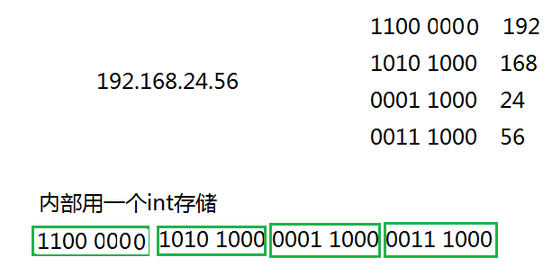

### 3.2 Socket类

-  网络上具有唯一标识的IP地址和端口号组合在一起构成唯一能识别的标识符套接字（Socket）。
-  利用套接字(Socket)开发网络应用程序早已被广泛的采用，以至于成为事实上的标准。网络通信其实就是Socket间的通信。


- 通信的两端都要有Socket，是两台机器间通信的端点。

- Socket允许程序把网络连接当成一个流，数据在两个Socket间通过IO传输。

- 一般主动发起通信的应用程序属客户端，等待通信请求的为服务端。

- Socket分类：
  - 流套接字（stream socket）：使用TCP提供可依赖的字节流服务
    - ServerSocket：此类实现TCP服务器套接字。服务器套接字等待请求通过网络传入。
    - Socket：此类实现客户端套接字（也可以就叫“套接字”）。套接字是两台机器间通信的端点。
  - 数据报套接字（datagram socket）：使用UDP提供“尽力而为”的数据报服务
    - DatagramSocket：此类表示用来发送和接收UDP数据报包的套接字。 

### 3.3 Socket相关类API

#### 3.3.1 ServerSocket类

**ServerSocket类的构造方法：**

* ServerSocket(int port) ：创建绑定到特定端口的服务器套接字。

**ServerSocket类的常用方法：**

* Socket accept()：侦听并接受到此套接字的连接。 

#### 3.3.2 Socket类

**Socket类的常用构造方法**：

* public Socket(InetAddress address,int port)：创建一个流套接字并将其连接到指定 IP 地址的指定端口号。
* public Socket(String host,int port)：创建一个流套接字并将其连接到指定主机上的指定端口号。

**Socket类的常用方法**：

* public InputStream getInputStream()：返回此套接字的输入流，可以用于接收消息
* public OutputStream getOutputStream()：返回此套接字的输出流，可以用于发送消息
* public InetAddress getInetAddress()：此套接字连接到的远程 IP 地址；如果套接字是未连接的，则返回 null。
* public InetAddress getLocalAddress()：获取套接字绑定的本地地址。
* public int getPort()：此套接字连接到的远程端口号；如果尚未连接套接字，则返回 0。
* public int getLocalPort()：返回此套接字绑定到的本地端口。如果尚未绑定套接字，则返回 -1。
* public void close()：关闭此套接字。套接字被关闭后，便不可在以后的网络连接中使用（即无法重新连接或重新绑定）。需要创建新的套接字对象。 关闭此套接字也将会关闭该套接字的 InputStream 和 OutputStream。 
* public void shutdownInput()：如果在套接字上调用 shutdownInput() 后从套接字输入流读取内容，则流将返回 EOF（文件结束符）。 即不能在从此套接字的输入流中接收任何数据。
* public void shutdownOutput()：禁用此套接字的输出流。对于 TCP 套接字，任何以前写入的数据都将被发送，并且后跟 TCP 的正常连接终止序列。 如果在套接字上调用 shutdownOutput() 后写入套接字输出流，则该流将抛出 IOException。 即不能通过此套接字的输出流发送任何数据。

**注意：**先后调用Socket的shutdownInput()和shutdownOutput()方法，仅仅关闭了输入流和输出流，并不等于调用Socket的close()方法。在通信结束后，仍然要调用Scoket的close()方法，因为只有该方法才会释放Socket占用的资源，比如占用的本地端口号等。

#### 3.3.3 DatagramSocket类

**DatagramSocket 类的常用方法：**

* public DatagramSocket(int port)创建数据报套接字并将其绑定到本地主机上的指定端口。套接字将被绑定到通配符地址，IP 地址由内核来选择。
* public DatagramSocket(int port,InetAddress laddr)创建数据报套接字，将其绑定到指定的本地地址。本地端口必须在 0 到 65535 之间（包括两者）。如果 IP 地址为 0.0.0.0，套接字将被绑定到通配符地址，IP 地址由内核选择。 
* public void close()关闭此数据报套接字。 
* public void send(DatagramPacket p)从此套接字发送数据报包。DatagramPacket 包含的信息指示：将要发送的数据、其长度、远程主机的 IP 地址和远程主机的端口号。 
* public void receive(DatagramPacket p)从此套接字接收数据报包。当此方法返回时，DatagramPacket 的缓冲区填充了接收的数据。数据报包也包含发送方的 IP 地址和发送方机器上的端口号。 此方法在接收到数据报前一直阻塞。数据报包对象的 length 字段包含所接收信息的长度。如果信息比包的长度长，该信息将被截短。 
* public InetAddress getLocalAddress()获取套接字绑定的本地地址。
* public int getLocalPort()返回此套接字绑定的本地主机上的端口号。 
* public InetAddress getInetAddress()返回此套接字连接的地址。如果套接字未连接，则返回 null。
* public int getPort()返回此套接字的端口。如果套接字未连接，则返回 -1。

#### 3.3.4 DatagramPacket类

**DatagramPacket类的常用方法：**

* public DatagramPacket(byte[] buf,int length)构造 DatagramPacket，用来接收长度为 length 的数据包。 length 参数必须小于等于 buf.length。
* public DatagramPacket(byte[] buf,int length,InetAddress address,int port)构造数据报包，用来将长度为 length 的包发送到指定主机上的指定端口号。length 参数必须小于等于 buf.length。
* public InetAddress getAddress()返回某台机器的 IP 地址，此数据报将要发往该机器或者是从该机器接收到的。
* public int getPort()返回某台远程主机的端口号，此数据报将要发往该主机或者是从该主机接收到的。
* `public byte[] getData()`返回数据缓冲区。接收到的或将要发送的数据从缓冲区中的偏移量 offset 处开始，持续 length 长度。
* `public int getLength()`返回将要发送或接收到的数据的长度。

## 4. TCP网络编程

### 4.1 通信模型

Java语言的基于套接字TCP编程分为服务端编程和客户端编程，其通信模型如图所示：

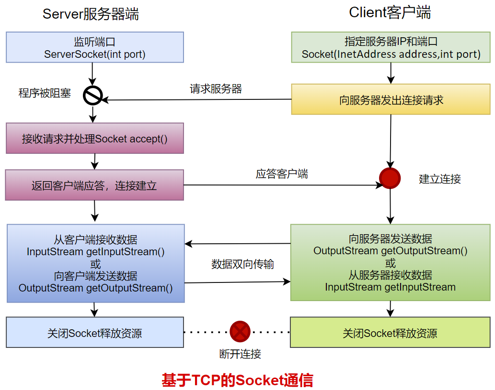

### 4.2 开发步骤

**客户端程序包含以下四个基本的步骤 ：**

* 创建 Socket ：根据指定服务端的 IP 地址或端口号构造 Socket 类对象。若服务器端响应，则建立客户端到服务器的通信线路。若连接失败，会出现异常。
* 打开连接到 Socket  的输入/ 出流： 使用 getInputStream()方法获得输入流，使用getOutputStream()方法获得输出流，进行数据传输
* 按照一定的协议对 Socket 进行读/ 写操作：通过输入流读取服务器放入线路的信息（但不能读取自己放入线路的信息），通过输出流将信息写入线路。
* 关闭 Socket ：断开客户端到服务器的连接，释放线路

**服务器端程序包含以下四个基本的 步骤：**

* 调用 ServerSocket(int port)  ：创建一个服务器端套接字，并绑定到指定端口上。用于监听客户端的请求。
* 调用 accept() ：监听连接请求，如果客户端请求连接，则接受连接，返回通信套接字对象。
* 调用  该Socket 类对象的 getOutputStream()  和 getInputStream () ：获取输出流和输入流，开始网络数据的发送和接收。
* 关闭Socket 对象：客户端访问结束，关闭通信套接字。

### 4.3 例题与练习

> 例题1：客户端发送内容给服务端，服务端将内容打印到控制台上。
>
> 例题2：客户端发送文件给服务端，服务端将文件保存在本地。
>
> 例题3：从客户端发送文件给服务端，服务端保存到本地。并返回“发送成功”给客户端。并关闭相应的连接。
>

练习1：服务端读取图片并发送给客户端，客户端保存图片到本地

练习2：客户端给服务端发送文本，服务端会将文本转成大写在返回给客户端。

**演示单个客户端与服务器单次通信：**

需求：客户端连接服务器，连接成功后给服务发送“lalala”，服务器收到消息后，给客户端返回“欢迎登录”，客户端接收消息后，断开连接

**1、服务器端示例代码**

```java
package com.atguigu.tcp.one;

import java.io.InputStream;
import java.io.OutputStream;
import java.net.InetAddress;
import java.net.ServerSocket;
import java.net.Socket;

public class Server {

    public static void main(String[] args)throws Exception {
        //1、准备一个ServerSocket对象，并绑定8888端口
        ServerSocket server =  new ServerSocket(8888);
        System.out.println("等待连接....");

        //2、在8888端口监听客户端的连接，该方法是个阻塞的方法，如果没有客户端连接，将一直等待
        Socket socket = server.accept();
        InetAddress inetAddress = socket.getInetAddress();
        System.out.println(inetAddress.getHostAddress() + "客户端连接成功！！");

        //3、获取输入流，用来接收该客户端发送给服务器的数据
        InputStream input = socket.getInputStream();
        //接收数据
        byte[] data = new byte[1024];
        StringBuilder s = new StringBuilder();
        int len;
        while ((len = input.read(data)) != -1) {
            s.append(new String(data, 0, len));
        }
        System.out.println(inetAddress.getHostAddress() + "客户端发送的消息是：" + s);

        //4、获取输出流，用来发送数据给该客户端
        OutputStream out = socket.getOutputStream();
        //发送数据
        out.write("欢迎登录".getBytes());
        out.flush();

        //5、关闭socket，不再与该客户端通信
        //socket关闭，意味着InputStream和OutputStream也关闭了
        socket.close();

        //6、如果不再接收任何客户端通信，可以关闭ServerSocket
        server.close();
    }
}

```

**2、客户端示例代码**

```java
package com.atguigu.tcp.one;

import java.io.InputStream;
import java.io.OutputStream;
import java.net.Socket;

public class Client {

    public static void main(String[] args) throws Exception {
        // 1、准备Socket，连接服务器，需要指定服务器的IP地址和端口号
        Socket socket = new Socket("127.0.0.1", 8888);

        // 2、获取输出流，用来发送数据给服务器
        OutputStream out = socket.getOutputStream();
        // 发送数据
        out.write("lalala".getBytes());
        //会在流末尾写入一个“流的末尾”标记，对方才能读到-1，否则对方的读取方法会一致阻塞
        socket.shutdownOutput();

        //3、获取输入流，用来接收服务器发送给该客户端的数据
        InputStream input = socket.getInputStream();
        // 接收数据
        byte[] data = new byte[1024];
        StringBuilder s = new StringBuilder();
        int len;
        while ((len = input.read(data)) != -1) {
            s.append(new String(data, 0, len));
        }
        System.out.println("服务器返回的消息是：" + s);

        //4、关闭socket，不再与服务器通信，即断开与服务器的连接
        //socket关闭，意味着InputStream和OutputStream也关闭了
        socket.close();
    }
}

```


**演示多个客户端与服务器之间的多次通信：**

通常情况下，服务器不应该只接受一个客户端请求，而应该不断地接受来自客户端的所有请求，所以Java程序通常会通过循环，不断地调用ServerSocket的accept()方法。

如果服务器端要“同时”处理多个客户端的请求，因此服务器端需要为**每一个客户端单独分配一个线程**来处理，否则无法实现“同时”。

咱们之前学习IO流的时候，提到过装饰者设计模式，该设计使得不管底层IO流是怎样的节点流：文件流也好，网络Socket产生的流也好，程序都可以将其包装成处理流，甚至可以多层包装，从而提供更多方便的处理。

案例需求：多个客户端连接服务器，并进行多次通信

* 每一个客户端连接成功后，从键盘输入英文单词或中国成语，并发送给服务器
* 服务器收到客户端的消息后，把词语“反转”后返回给客户端
* 客户端接收服务器返回的“词语”，打印显示
* 当客户端输入“stop”时断开与服务器的连接
* 多个客户端可以同时给服务器发送“词语”，服务器可以“同时”处理多个客户端的请求

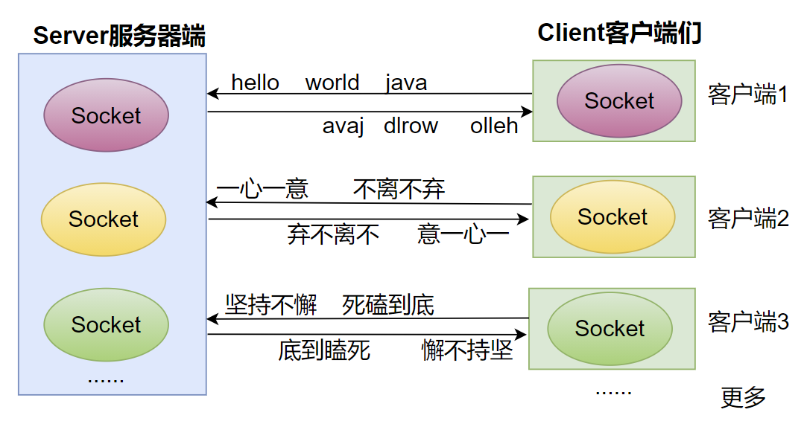

**1、服务器端示例代码**

```java
package com.atguigu.tcp.many;

import java.io.BufferedReader;
import java.io.IOException;
import java.io.InputStreamReader;
import java.io.PrintStream;
import java.net.ServerSocket;
import java.net.Socket;

public class Server {
    public static void main(String[] args) throws IOException {
        // 1、准备一个ServerSocket
        ServerSocket server = new ServerSocket(8888);
        System.out.println("等待连接...");

        int count = 0;
        while(true){
            // 2、监听一个客户端的连接
            Socket socket = server.accept();
            System.out.println("第" + ++count + "个客户端"+socket.getInetAddress().getHostAddress()+"连接成功！！");

            ClientHandlerThread ct = new ClientHandlerThread(socket);
            ct.start();
        }

        //这里没有关闭server，永远监听
    }
    static class ClientHandlerThread extends Thread{
        private Socket socket;
        private String ip;

        public ClientHandlerThread(Socket socket) {
            super();
            this.socket = socket;
            ip = socket.getInetAddress().getHostAddress();
        }

        public void run(){
            try{
                //（1）获取输入流，用来接收该客户端发送给服务器的数据
                BufferedReader br = new BufferedReader(new InputStreamReader(socket.getInputStream()));
                //（2）获取输出流，用来发送数据给该客户端
                PrintStream ps = new PrintStream(socket.getOutputStream());
                String str;
                // （3）接收数据
                while ((str = br.readLine()) != null) {
                    //（4）反转
                    StringBuilder word = new StringBuilder(str);
                    word.reverse();

                    //（5）返回给客户端
                    ps.println(word);
                }
                System.out.println("客户端" + ip+"正常退出");
            }catch(Exception  e){
                System.out.println("客户端" + ip+"意外退出");
            }finally{
                try {
                    //（6）断开连接
                    socket.close();
                } catch (IOException e) {
                    e.printStackTrace();
                }
            }
        }
    }
}

```

**2、客户端示例代码**

```java
package com.atguigu.tcp.many;

import java.io.BufferedReader;
import java.io.InputStream;
import java.io.InputStreamReader;
import java.io.OutputStream;
import java.io.PrintStream;
import java.net.Socket;
import java.util.Scanner;

public class Client {
    public static void main(String[] args) throws Exception {
        // 1、准备Socket，连接服务器，需要指定服务器的IP地址和端口号
        Socket socket = new Socket("127.0.0.1", 8888);

        // 2、获取输出流，用来发送数据给服务器
        OutputStream out = socket.getOutputStream();
        PrintStream ps = new PrintStream(out);

        // 3、获取输入流，用来接收服务器发送给该客户端的数据
        InputStream input = socket.getInputStream();
        BufferedReader br;
        if(args!= null && args.length>0) {
            String encoding = args[0];
            br = new BufferedReader(new InputStreamReader(input,encoding));
        }else{
            br = new BufferedReader(new InputStreamReader(input));
        }

        Scanner scanner = new Scanner(System.in);
        while(true){
            System.out.println("输入发送给服务器的单词或成语：");
            String message = scanner.nextLine();
            if(message.equals("stop")){
                socket.shutdownOutput();
                break;
            }

            // 4、 发送数据
            ps.println(message);
            // 接收数据
            String feedback  = br.readLine();
            System.out.println("从服务器收到的反馈是：" + feedback);
        }

        //5、关闭socket，断开与服务器的连接
        scanner.close();
        socket.close();
    }
}
```

### 4.4 案例：聊天室

服务端：

```java
package com.atguigu.tcp;

import java.io.BufferedReader;
import java.io.IOException;
import java.io.InputStream;
import java.io.InputStreamReader;
import java.io.OutputStream;
import java.io.PrintStream;
import java.net.ServerSocket;
import java.net.Socket;
import java.util.ArrayList;

public class TestChatServer {
	//这个集合用来存储所有在线的客户端
	static ArrayList<Socket> online = new  ArrayList<Socket>();
	
	public static void main(String[] args)throws Exception {
		//1、启动服务器，绑定端口号
		ServerSocket server = new ServerSocket(8989);
		
		//2、接收n多的客户端同时连接
		while(true){
			Socket accept = server.accept();
			
			online.add(accept);//把新连接的客户端添加到online列表中
			
			MessageHandler mh = new MessageHandler(accept);
			mh.start();//
		}
	}
	
	static class MessageHandler extends Thread{
		private Socket socket;
		private String ip;
		
		public MessageHandler(Socket socket) {
			super();
			this.socket = socket;
		}

		public void run(){
			try {
				ip = socket.getInetAddress().getHostAddress();
				
				//插入：给其他客户端转发“我上线了”
				sendToOther(ip+"上线了");
				
				//(1)接收该客户端的发送的消息
				InputStream input = socket.getInputStream();
				InputStreamReader reader = new InputStreamReader(input);
				BufferedReader br = new BufferedReader(reader);
				
				String str;
				while((str = br.readLine())!=null){
					//(2)给其他在线客户端转发
					sendToOther(ip+":"+str);
				}
				
				sendToOther(ip+"下线了");
			} catch (IOException e) {
				try {
					sendToOther(ip+"掉线了");
				} catch (IOException e1) {
					e1.printStackTrace();
				}
			}finally{
				//从在线人员中移除我
				online.remove(socket);
			}
		}
		
		//封装一个方法：给其他客户端转发xxx消息
		public void sendToOther(String message) throws IOException{
			//遍历所有的在线客户端，一一转发
			for (Socket on : online) {
				OutputStream every = on.getOutputStream();
				//为什么用PrintStream？目的用它的println方法，按行打印
				PrintStream ps = new PrintStream(every);
				
				ps.println(message);
			}
		}
	}
}


```

客户端：

```java
package com.atguigu.tcp;

import java.io.IOException;
import java.io.InputStream;
import java.io.OutputStream;
import java.io.PrintStream;
import java.net.Socket;
import java.util.Scanner;

public class TestChatClient {
	public static void main(String[] args)throws Exception {
		//1、连接服务器
		Socket socket = new Socket("127.0.0.1",8989);
		
		//2、开启两个线程
		//(1)一个线程负责看别人聊，即接收服务器转发的消息
		Receive receive = new Receive(socket);
		receive.start();
		
		//(2)一个线程负责发送自己的话
		Send send = new Send(socket);
		send.start();
		
		send.join();//等我发送线程结束了，才结束整个程序
		
		socket.close();
	}
}
class Send extends Thread{
	private Socket socket;
	
	public Send(Socket socket) {
		super();
		this.socket = socket;
	}

	public void run(){
		try {
			OutputStream outputStream = socket.getOutputStream();
			//按行打印
			PrintStream ps = new PrintStream(outputStream);
			
			Scanner input = new Scanner(System.in);
			
			//从键盘不断的输入自己的话，给服务器发送，由服务器给其他人转发
			while(true){
				System.out.print("自己的话：");
				String str = input.nextLine();
				if("bye".equals(str)){
					break;
				}
				ps.println(str);
			}
			
			input.close();
		} catch (IOException e) {
			e.printStackTrace();
		}
	}
	
}
class Receive extends Thread{
	private Socket socket;
	
	public Receive(Socket socket) {
		super();
		this.socket = socket;
	}
	
	public void run(){
		try {
			InputStream inputStream = socket.getInputStream();
			Scanner input = new Scanner(inputStream);
			
			while(input.hasNextLine()){
				String line = input.nextLine();
				System.out.println(line);
			}
		} catch (IOException e) {
			e.printStackTrace();
		}
	}
}
```


### 4.5 理解客户端、服务端

- 客户端：
  - 自定义
  - 浏览器(browser --- server)

- 服务端：
  - 自定义
  - Tomcat服务器

## 5. UDP网络编程

UDP(User Datagram Protocol，用户数据报协议)：是一个无连接的传输层协议、提供面向事务的简单不可靠的信息传送服务，类似于短信。

### 5.1 通信模型

UDP协议是一种**面向非连接**的协议，面向非连接指的是在正式通信前不必与对方先建立连接，不管对方状态就直接发送，至于对方是否可以接收到这些数据内容，UDP协议无法控制，因此说，UDP协议是一种**不可靠的**协议。无连接的好处就是快，省内存空间和流量，因为维护连接需要创建大量的数据结构。UDP会尽最大努力交付数据，但不保证可靠交付，没有TCP的确认机制、重传机制，如果因为网络原因没有传送到对端，UDP也不会给应用层返回错误信息。

UDP协议是面向数据报文的信息传送服务。UDP在发送端没有缓冲区，对于应用层交付下来的报文在添加了首部之后就直接交付于ip层，不会进行合并，也不会进行拆分，而是一次交付一个完整的报文。比如我们要发送100个字节的报文，我们调用一次send()方法就会发送100字节，接收方也需要用receive()方法一次性接收100字节，不能使用循环每次获取10个字节，获取十次这样的做法。

UDP协议没有拥塞控制，所以当网络出现的拥塞不会导致主机发送数据的速率降低。虽然UDP的接收端有缓冲区，但是这个缓冲区只负责接收，并不会保证UDP报文的到达顺序是否和发送的顺序一致。因为网络传输的时候，由于网络拥塞的存在是很大的可能导致先发的报文比后发的报文晚到达。如果此时缓冲区满了，后面到达的报文将直接被丢弃。这个对实时应用来说很重要，比如：视频通话、直播等应用。

因此UDP适用于一次只传送少量数据、对可靠性要求不高的应用环境，数据报大小限制在64K以下。

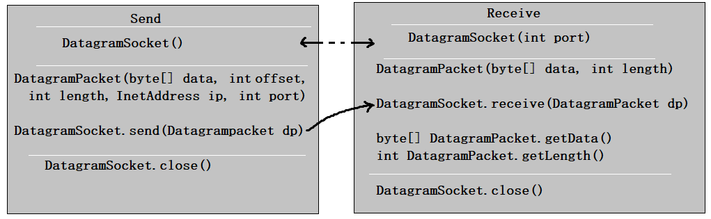

类 DatagramSocket 和 DatagramPacket 实现了基于 UDP 协议网络程序。

 UDP数据报通过数据报套接字 DatagramSocket 发送和接收，系统不保证  UDP数据报一定能够安全送到目的地，也不能确定什么时候可以抵达。

 DatagramPacket 对象封装了UDP数据报，在数据报中包含了发送端的IP地址和端口号以及接收端的IP地址和端口号。

 UDP协议中每个数据报都给出了完整的地址信息，因此无须建立发送方和接收方的连接。如同发快递包裹一样。

### 5.2 开发步骤

**发送端程序包含以下四个基本的步骤：**

* 创建DatagramSocket ：默认使用系统随机分配端口号。
* 创建DatagramPacket：将要发送的数据用字节数组表示，并指定要发送的数据长度，接收方的IP地址和端口号。
* 调用  该DatagramSocket 类对象的 send方法 ：发送数据报DatagramPacket对象。
* 关闭DatagramSocket 对象：发送端程序结束，关闭通信套接字。

**接收端程序包含以下四个基本的步骤 ：**

* 创建DatagramSocket ：指定监听的端口号。
* 创建DatagramPacket：指定接收数据用的字节数组，起到临时数据缓冲区的效果，并指定最大可以接收的数据长度。
* 调用  该DatagramSocket 类对象的receive方法 ：接收数据报DatagramPacket对象。。
* 关闭DatagramSocket ：接收端程序结束，关闭通信套接字。

### 5.3 演示发送和接收消息

基于UDP协议的网络编程仍然需要在通信实例的两端各建立一个Socket，但这两个Socket之间并没有虚拟链路，这两个Socket只是发送、接收数据报的对象，Java提供了DatagramSocket对象作为基于UDP协议的Socket，使用DatagramPacket代表DatagramSocket发送、接收的数据报。

#### 举例1：

发送端：

```java
DatagramSocket ds = null;
try {
    ds = new DatagramSocket();
    byte[] by = "hello,atguigu.com".getBytes();
    DatagramPacket dp = new DatagramPacket(by, 0, by.length,     InetAddress.getByName("127.0.0.1"), 10000);
    ds.send(dp);
} catch (Exception e) {
    e.printStackTrace();
} finally {
    if (ds != null)
        ds.close();
}

```

接收端：

```java
DatagramSocket ds = null;
try {
    ds = new DatagramSocket(10000);
    byte[] by = new byte[1024*64];
    DatagramPacket dp = new DatagramPacket(by, by.length);
    ds.receive(dp);
    String str = new String(dp.getData(), 0, dp.getLength());
    System.out.println(str + "--" + dp.getAddress());
} catch (Exception e) {
    e.printStackTrace();
} finally {
    if (ds != null)
        ds.close();
}

```

#### 举例2：

**发送端：**

```java
package com.atguigu.udp;

import java.net.DatagramPacket;
import java.net.DatagramSocket;
import java.net.InetAddress;
import java.util.ArrayList;

public class Send {

    public static void main(String[] args)throws Exception {
//		1、建立发送端的DatagramSocket
        DatagramSocket ds = new DatagramSocket();

        //要发送的数据
        ArrayList<String> all = new ArrayList<String>();
        all.add("尚硅谷让天下没有难学的技术！");
        all.add("学高端前沿的IT技术来尚硅谷！");
        all.add("尚硅谷让你的梦想变得更具体！");
        all.add("尚硅谷让你的努力更有价值！");

        //接收方的IP地址
        InetAddress ip = InetAddress.getByName("127.0.0.1");
        //接收方的监听端口号
        int port = 9999;
        //发送多个数据报
        for (int i = 0; i < all.size(); i++) {
//			2、建立数据包DatagramPacket
            byte[] data = all.get(i).getBytes();
            DatagramPacket dp = new DatagramPacket(data, 0, data.length, ip, port);
//			3、调用Socket的发送方法
            ds.send(dp);
        }

//		4、关闭Socket
        ds.close();
    }
}
```

**接收端：**

```java
package com.atguigu.udp;

import java.net.DatagramPacket;
import java.net.DatagramSocket;

public class Receive {

    public static void main(String[] args) throws Exception {
//		1、建立接收端的DatagramSocket，需要指定本端的监听端口号
        DatagramSocket ds = new DatagramSocket(9999);

        //一直监听数据
        while(true){
            //2、建立数据包DatagramPacket
            byte[] buffer = new byte[1024*64];
            DatagramPacket dp = new DatagramPacket(buffer,buffer.length);

            //3、调用Socket的接收方法
            ds.receive(dp);

            //4、拆封数据
            String str = new String(dp.getData(),0,dp.getLength());
            System.out.println(str);
        }

//        ds.close();
    }
}
```

## 6. URL编程

### 6.1 URL类

- URL(Uniform Resource Locator)：统一资源定位符，它表示 Internet 上某一资源的地址。

- 通过 URL 我们可以访问 Internet 上的各种网络资源，比如最常见的 www，ftp 站点。浏览器通过解析给定的 URL 可以在网络上查找相应的文件或其他资源。 

- URL的基本结构由5部分组成：

```http
<传输协议>://<主机名>:<端口号>/<文件名>#片段名?参数列表
```

- 例如: http://192.168.1.100:8080/helloworld/index.jsp#a?username=shkstart&password=123
  - 片段名：即锚点，例如看小说，直接定位到章节
  - 参数列表格式：参数名=参数值&参数名=参数值....

- 为了表示URL，java.net 中实现了类 URL。我们可以通过下面的构造器来初始化一个 URL 对象：

  - public URL (String spec)：通过一个表示URL地址的字符串可以构造一个URL对象。例如：

    ```http
    URL url = new URL("http://www. atguigu.com/"); 
    ```

  - public URL(URL context, String spec)：通过基 URL 和相对 URL 构造一个 URL 对象。例如：

    ```http
    URL downloadUrl = new URL(url, “download.html")
    ```

    public URL(String protocol, String host, String file); 例如：

    ```http
    URL url = new URL("http", "www.atguigu.com", “download. html");
    ```

  - public URL(String protocol, String host, int port, String file); 例如: 

    ```java
    URL gamelan = new URL("http", "www.atguigu.com", 80, “download.html");
    ```

- URL类的构造器都声明抛出非运行时异常，必须要对这一异常进行处理，通常是用 try-catch 语句进行捕获。

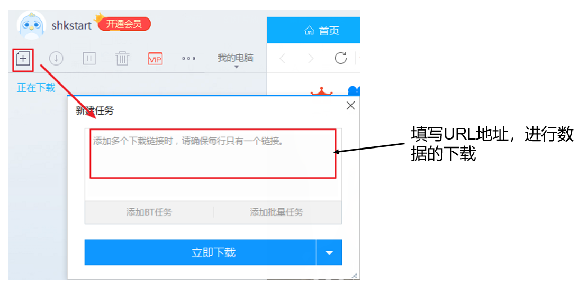

### 6.2 URL类常用方法

一个URL对象生成后，其属性是不能被改变的，但可以通过它给定的方法来获取这些属性：

- public String getProtocol( )   获取该URL的协议名

- public String getHost( )      获取该URL的主机名

- public String getPort( )      获取该URL的端口号

- public String getPath( )      获取该URL的文件路径

- public String getFile( )       获取该URL的文件名

- public String getQuery(  )    获取该URL的查询名

```java
URL url = new URL("http://localhost:8080/examples/myTest.txt");
System.out.println("getProtocol() :"+url.getProtocol());
System.out.println("getHost() :"+url.getHost());
System.out.println("getPort() :"+url.getPort());
System.out.println("getPath() :"+url.getPath());
System.out.println("getFile() :"+url.getFile());
System.out.println("getQuery() :"+url.getQuery());
```

###  6.3 针对HTTP协议的URLConnection类

- URL的方法 openStream()：能从网络上读取数据
- 若希望输出数据，例如向服务器端的 CGI （公共网关接口-Common Gateway Interface-的简称，是用户浏览器和服务器端的应用程序进行连接的接口）程序发送一些数据，则必须先与URL建立连接，然后才能对其进行读写，此时需要使用 URLConnection 。
- URLConnection：表示到URL所引用的远程对象的连接。当与一个URL建立连接时，首先要在一个 URL 对象上通过方法 openConnection() 生成对应的 URLConnection 对象。如果连接过程失败，将产生IOException. 
  - URL netchinaren = new URL ("http://www.atguigu.com/index.shtml"); 
  - URLConnectonn u = netchinaren.openConnection( ); 

- 通过URLConnection对象获取的输入流和输出流，即可以与现有的CGI程序进行交互。
  - public Object getContent( ) throws IOException

  - public int getContentLength( )
  - public String getContentType( )
  - public long getDate( )
  - public long getLastModified( )
  - **public InputStream getInputStream ( ) throws IOException**
  - public OutputSteram getOutputStream( )throws IOException

### 6.4 小结

- 位于网络中的计算机具有唯一的IP地址，这样不同的主机可以互相区分。

- 客户端－服务器是一种最常见的网络应用程序模型。服务器是一个为其客户端提供某种特定服务的硬件或软件。客户机是一个用户应用程序，用于访问某台服务器提供的服务。端口号是对一个服务的访问场所，它用于区分同一物理计算机上的多个服务。套接字用于连接客户端和服务器，客户端和服务器之间的每个通信会话使用一个不同的套接字。TCP协议用于实现面向连接的会话。

- Java 中有关网络方面的功能都定义在 java.net 程序包中。Java 用 InetAddress 对象表示 IP 地址，该对象里有两个字段：主机名(String) 和 IP 地址(int)。

- 类 Socket 和 ServerSocket 实现了基于TCP协议的客户端－服务器程序。Socket是客户端和服务器之间的一个连接，连接创建的细节被隐藏了。这个连接提供了一个安全的数据传输通道，这是因为 TCP 协议可以解决数据在传送过程中的丢失、损坏、重复、乱序以及网络拥挤等问题，它保证数据可靠的传送。

- 类 URL 和 URLConnection 提供了最高级网络应用。URL 的网络资源的位置来同一表示 Internet 上各种网络资源。通过URL对象可以创建当前应用程序和 URL 表示的网络资源之间的连接，这样当前程序就可以读取网络资源数据，或者把自己的数据传送到网络上去。