# 第18章_JDK8-17新特性（下）

讲师：尚硅谷-宋红康（江湖人称：康师傅）

官网：[http://www.atguigu.com](http://www.atguigu.com/)

***

## 6. 新语法结构

新的语法结构，为我们勾勒出了 Java 语法进化的一个趋势，将开发者从`复杂、繁琐`的低层次抽象中逐渐解放出来，以更高层次、更优雅的抽象，既`降低代码量`，又避免意外编程错误的出现，进而提高代码质量和开发效率。

### 6.1 Java的REPL工具： jShell命令

**JDK9的新特性**

Java 终于拥有了像Python 和 Scala 之类语言的REPL工具（交互式编程环境，read - evaluate - print - loop）：`jShell`。以交互式的方式对语句和表达式进行求值。`即写即得`、`快速运行`。

利用jShell在没有创建类的情况下，在命令行里直接声明变量，计算表达式，执行语句。无需跟人解释”public static void main(String[] args)”这句"废话"。

**使用举例**

- 调出jShell


 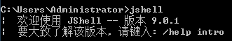

- 获取帮助


 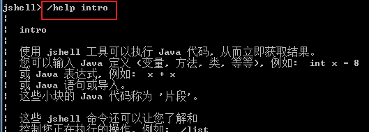

- 基本使用


 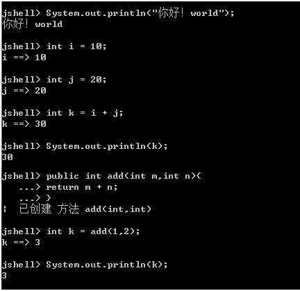

- 导入指定的包


 

- 默认已经导入如下的所有包：（包含java.lang包）


 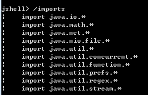

- 只需按下 Tab 键，就能自动补全代码


 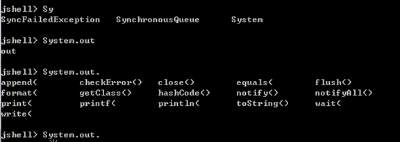

- 列出当前 session 里所有有效的代码片段


 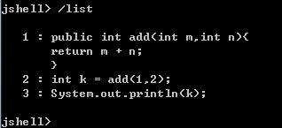

- 查看当前 session 下所有创建过的变量


 

- 查看当前 session 下所有创建过的方法


 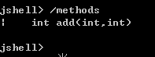

> Tips：我们还可以重新定义相同方法名和参数列表的方法，即对现有方法的修改（或覆盖）。

- 使用外部代码编辑器来编写 Java 代码


 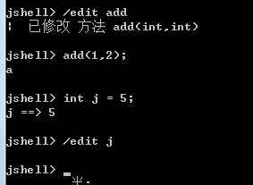

从外部文件加载源代码【HelloWorld.java】

```java
/**
 * Created by songhongkang
 */
public void printHello() {
    System.out.println("马上2023年了，尚硅谷祝所有的谷粉元旦快乐！");
}
printHello();

```

- 使用/open命令调用


 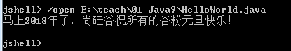

- 退出jShell


 

### 6.2 异常处理之try-catch资源关闭

在JDK7 之前，我们这样处理资源的关闭：

```java
@Test
public void test01() {
    FileWriter fw = null;
    BufferedWriter bw = null;
    try {
        fw = new FileWriter("d:/1.txt");
        bw = new BufferedWriter(fw);

        bw.write("hello");
    } catch (IOException e) {
        e.printStackTrace();
    } finally {
        try {
            if (bw != null) {
                bw.close();
            }
        } catch (IOException e) {
            e.printStackTrace();
        }
        try {
            if (fw != null) {
                fw.close();
            }
        } catch (IOException e) {
            e.printStackTrace();
        }

    }
}
```

**JDK7的新特性**

在try的后面可以增加一个()，在括号中可以声明流对象并初始化。try中的代码执行完毕，会自动把流对象释放，就不用写finally了。

格式：

```java
try(资源对象的声明和初始化){
    业务逻辑代码,可能会产生异常
}catch(异常类型1 e){
    处理异常代码
}catch(异常类型2 e){
    处理异常代码
}
```

说明：

1、在try()中声明的资源，无论是否发生异常，无论是否处理异常，都会自动关闭资源对象，不用手动关闭了。

2、这些资源实现类必须实现AutoCloseable或Closeable接口，实现其中的close()方法。Closeable是AutoCloseable的子接口。Java7几乎把所有的“资源类”（包括文件IO的各种类、JDBC编程的Connection、Statement等接口…）都进行了改写，改写后资源类都实现了AutoCloseable或Closeable接口，并实现了close()方法。

3、写到try()中的资源类的变量默认是final声明的，不能修改。

举例：

```java
//举例1
@Test
public void test02() {
    try (
        FileWriter fw = new FileWriter("d:/1.txt");
        BufferedWriter bw = new BufferedWriter(fw);
    ) {
        bw.write("hello");
    } catch (IOException e) {
        e.printStackTrace();
    }
}

//举例2
@Test
public void test03() {
    //从d:/1.txt(utf-8)文件中，读取内容，写到项目根目录下1.txt(gbk)文件中
    try (
        FileInputStream fis = new FileInputStream("d:/1.txt");
        InputStreamReader isr = new InputStreamReader(fis, "utf-8");
        BufferedReader br = new BufferedReader(isr);

        FileOutputStream fos = new FileOutputStream("1.txt");
        OutputStreamWriter osw = new OutputStreamWriter(fos, "gbk");
        BufferedWriter bw = new BufferedWriter(osw);
    ) {
        String str;
        while ((str = br.readLine()) != null) {
            bw.write(str);
            bw.newLine();
        }
    } catch (FileNotFoundException e) {
        e.printStackTrace();
    } catch (IOException e) {
        e.printStackTrace();
    }
}
```

**JDK9的新特性**

try的前面可以定义流对象，try后面的()中可以直接引用流对象的名称。在try代码执行完毕后，流对象也可以释放掉，也不用写finally了。

格式：

```java
A a = new A();
B b = new B();
try(a;b){
    可能产生的异常代码
}catch(异常类名 变量名){
    异常处理的逻辑
}
```

举例：

```java
@Test
public void test04() {
    InputStreamReader reader = new InputStreamReader(System.in);
    OutputStreamWriter writer = new OutputStreamWriter(System.out);
    try (reader; writer) {
        //reader是final的，不可再被赋值
        //   reader = null;

    } catch (IOException e) {
        e.printStackTrace();
    }
}
```

### 6.3 局部变量类型推断

**JDK 10的新特性**

局部变量的显示类型声明，常常被认为是不必须的，给一个好听的名字反而可以很清楚的表达出下面应该怎样继续。本新特性允许开发人员省略通常不必要的局部变量类型声明，以增强Java语言的体验性、可读性。

- 使用举例


```java
//1.局部变量的实例化
var list = new ArrayList<String>();

var set = new LinkedHashSet<Integer>();

//2.增强for循环中的索引
for (var v : list) {
    System.out.println(v);
}

//3.传统for循环中
for (var i = 0; i < 100; i++) {
    System.out.println(i);
}

//4. 返回值类型含复杂泛型结构
var iterator = set.iterator();
//Iterator<Map.Entry<Integer, Student>> iterator = set.iterator();

```

- 不适用场景
  - 声明一个成员变量
  - 声明一个数组变量，并为数组静态初始化（省略new的情况下）
  - 方法的返回值类型
  - 方法的参数类型
  - 没有初始化的方法内的局部变量声明
  - 作为catch块中异常类型
  - Lambda表达式中函数式接口的类型
  - 方法引用中函数式接口的类型

代码举例：

声明一个成员变量，并初始化值为null

 

声明一个数组变量，并为数组静态初始化（省略new的情况下）

 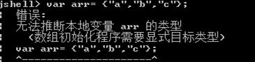

没有初始化的方法内的局部变量声明

 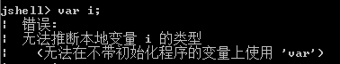

方法的返回值类型

 

方法的参数类型

 

构造器的参数类型

 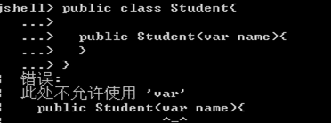

作为catch块中异常类型

 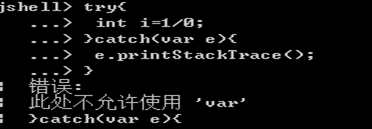

Lambda表达式中函数式接口的类型

 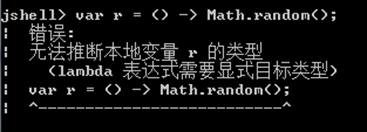

方法引用中函数式接口的类型

 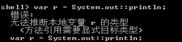

**注意：**

- var不是一个关键字，而是一个类型名，将它作为变量的类型。不能使用var作为类名。

- 这不是JavaScript。var并不会改变 Java是一门静态类型语言的事实。编译器负责推断出类型，并把结果写入字节码文件，就好像是开发人员自己敲入类型一样。

### 6.4 instanceof的模式匹配

**JDK14中预览特性：**

instanceof 模式匹配通过提供更为简便的语法，来提高生产力。有了该功能，可以减少Java程序中显式强制转换的数量，实现更精确、简洁的类型安全的代码。

Java 14之前旧写法：

```java
if(obj instanceof String){
    String str = (String)obj; //需要强转
    .. str.contains(..)..
}else{
    ...
}
```

Java 14新特性写法：

```java
if(obj instanceof String str){
    .. str.contains(..)..
}else{
    ...
}
```

举例：

```java
/**
 * instanceof的模式匹配（预览）
 *
 * @author shkstart
 * @create 上午 11:32
 */
public class Feature01 {
    @Test
    public void test1(){

        Object obj = new String("hello,Java14");
        obj = null;//在使用null 匹配instanceof 时，返回都是false.
        if(obj instanceof String){
            String str = (String) obj;
            System.out.println(str.contains("Java"));
        }else{
            System.out.println("非String类型");
        }

        //举例1：
        if(obj instanceof String str){ //新特性：省去了强制类型转换的过程
            System.out.println(str.contains("Java"));
        }else{
            System.out.println("非String类型");
        }
    }
}

// 举例2
class InstanceOf{

    String str = "abc";

    public void test(Object obj){

        if(obj instanceof String str){//此时的str的作用域仅限于if结构内。
            System.out.println(str.toUpperCase());
        }else{
            System.out.println(str.toLowerCase());
        }

    }

}

//举例3：
class Monitor{
    private String model;
    private double price;

//    public boolean equals(Object o){
//        if(o instanceof Monitor other){
//            if(model.equals(other.model) && price == other.price){
//                return true;
//            }
//        }
//        return false;
//    }


    public boolean equals(Object o){
        return o instanceof Monitor other && model.equals(other.model) && price == other.price;
    }

}
```

**JDK15中第二次预览：**

没有任何更改。

**JDK16中转正特性：**

在Java16中转正。

### 6.5 switch表达式

传统switch声明语句的弊端：

- 匹配是自上而下的，如果忘记写break，后面的case语句不论匹配与否都会执行； --->case穿透
- 所有的case语句共用一个块范围，在不同的case语句定义的变量名不能重复；
- 不能在一个case里写多个执行结果一致的条件；
- 整个switch不能作为表达式返回值；

```java
//常见错误实现
switch(month){
    case 3|4|5://3|4|5 用了位运算符，11 | 100 | 101结果是 111是7
        System.out.println("春季");
        break;
    case 6|7|8://6|7|8用了位运算符，110 | 111 | 1000结果是1111是15
        System.out.println("夏季");
        break;
    case 9|10|11://9|10|11用了位运算符，1001 | 1010 | 1011结果是1011是11
        System.out.println("秋季");
        break;
    case 12|1|2://12|1|2 用了位运算符，1100 | 1 | 10 结果是1111，是15
        System.out.println("冬季");
        break;
    default:
        System.out.println("输入有误");
}
```

**JDK12中预览特性：**

- Java 12将会对switch声明语句进行扩展，使用`case L ->`来替代以前的`break;`，省去了 break 语句，避免了因少写 break 而出错。

- 同时将多个 case 合并到一行，显得简洁、清晰，也更加优雅的表达逻辑分支。

- 为了保持兼容性，case 条件语句中依然可以使用字符` :` ，但是同一个 switch 结构里不能混用` ->` 和` :` ，否则编译错误。


举例：

Java 12之前

```java
/**
 * @author shkstart
 * @create 下午 4:47
 */
public class SwitchTest {
    public static void main(String[] args) {
        int numberOfLetters;
        Fruit fruit = Fruit.APPLE;
        switch (fruit) {
            case PEAR:
                numberOfLetters = 4;
                break;
            case APPLE:
            case GRAPE:
            case MANGO:
                numberOfLetters = 5;
                break;
            case ORANGE:
            case PAPAYA:
                numberOfLetters = 6;
                break;
            default:
                throw new IllegalStateException("No Such Fruit:" + fruit);
        }
        System.out.println(numberOfLetters);

    }
}
enum Fruit {
    PEAR, APPLE, GRAPE, MANGO, ORANGE, PAPAYA;
}
```

switch 语句如果漏写了一个 break，那么逻辑往往就跑偏了，这种方式既繁琐，又容易出错。

Java 12中：

```java
/**
 * @author shkstart
 * @create 下午 10:38
 */
public class SwitchTest1 {
    public static void main(String[] args) {
        Fruit fruit = Fruit.GRAPE;
        switch(fruit){
            case PEAR -> System.out.println(4);
            case APPLE,MANGO,GRAPE -> System.out.println(5);
            case ORANGE,PAPAYA -> System.out.println(6);
            default -> throw new IllegalStateException("No Such Fruit:" + fruit);
        };
    }
}
```

更进一步：

```java
/**
 * @author shkstart
 * @create 2019 下午 10:44
 */
public class SwitchTest2 {
    public static void main(String[] args) {
        Fruit fruit = Fruit.GRAPE;
        int numberOfLetters = switch(fruit){
            case PEAR -> 4;
            case APPLE,MANGO,GRAPE -> 5;
            case ORANGE,PAPAYA -> 6;
            default -> throw new IllegalStateException("No Such Fruit:" + fruit);
        };
        System.out.println(numberOfLetters);
    }
}
```

**JDK13中二次预览特性：**

JDK13中引入了yield语句，用于返回值。这意味着，switch表达式(返回值)应该使用yield，switch语句(不返回值)应该使用break。

yield和return的区别在于：return会直接跳出当前循环或者方法，而yield只会跳出当前switch块。

在以前：

```java
@Test
public void testSwitch1(){
    String x = "3";
    int i;
    switch (x) {
        case "1":
            i=1;
            break;
        case "2":
            i=2;
            break;
        default:
            i = x.length();
            break;
    }
    System.out.println(i);
}
```

在JDK13中：

```java
@Test
public void testSwitch2(){
    String x = "3";
    int i = switch (x) {
        case "1" -> 1;
        case "2" -> 2;
        default -> {
            yield 3;
        }
    };
    System.out.println(i);
}
```

或者

```java
@Test
public void testSwitch3() {
    String x = "3";
    int i = switch (x) {
        case "1":
            yield 1;
        case "2":
            yield 2;
        default:
            yield 3;
    };
    System.out.println(i);
}
```

**JDK14中转正特性：**

这是JDK 12和JDK 13中的预览特性，现在是正式特性了。

**JDK17的预览特性：switch的模式匹配**

旧写法：

```java
static String formatter(Object o) {
    String formatted = "unknown";
    if (o instanceof Integer i) {
        formatted = String.format("int %d", i);
    } else if (o instanceof Long l) {
        formatted = String.format("long %d", l);
    } else if (o instanceof Double d) {
        formatted = String.format("double %f", d);
    } else if (o instanceof String s) {
        formatted = String.format("String %s", s);
    }
    return formatted;
}
```

模式匹配新写法：

```java
static String formatterPatternSwitch(Object o) {
    return switch (o) {
        case Integer i -> String.format("int %d", i);
        case Long l    -> String.format("long %d", l);
        case Double d  -> String.format("double %f", d);
        case String s  -> String.format("String %s", s);
        default        -> o.toString();
    };
}
```

直接在 switch 上支持 Object 类型，这就等于同时支持多种类型，使用模式匹配得到具体类型，大大简化了语法量，这个功能很实用。

### 6.6 文本块

现实问题：

在Java中，通常需要使用String类型表达HTML，XML，SQL或JSON等格式的字符串，在进行字符串赋值时需要进行转义和连接操作，然后才能编译该代码，这种表达方式难以阅读并且难以维护。

**JDK13的新特性**

使用"""作为文本块的开始符和结束符，在其中就可以放置多行的字符串，不需要进行任何转义。因此，文本块将提高Java程序的可读性和可写性。

基本使用：

```java
"""
line1
line2
line3
"""
```

相当于：

```java
"line1\nline2\nline3\n"
```

或者一个连接的字符串：

```java
"line1\n" +
"line2\n" +
"line3\n"
```

如果字符串末尾不需要行终止符，则结束分隔符可以放在最后一行内容上。例如：

```java
"""
line1
line2
line3"""
```

相当于

```java
"line1\nline2\nline3"
```

文本块可以表示空字符串，但不建议这样做，因为它需要两行源代码：

```java
String empty = """
""";
```

举例1：普通文本

原有写法：

```java
 String text1 = "The Sound of silence\n" +
                "Hello darkness, my old friend\n" +
                "I've come to talk with you again\n" +
                "Because a vision softly creeping\n" +
                "Left its seeds while I was sleeping\n" +
                "And the vision that was planted in my brain\n" +
                "Still remains\n" +
                "Within the sound of silence";

System.out.println(text1);
```

使用新特性：

```java
String text2 = """
                The Sound of silence
                Hello darkness, my old friend
                I've come to talk with you again
                Because a vision softly creeping
                Left its seeds while I was sleeping
                And the vision that was planted in my brain
                Still remains
                Within the sound of silence
                """;
System.out.println(text2);
```

举例2：HTML语句

```html
<html>
  <body>
      <p>Hello, 尚硅谷</p>
  </body>
</html>
```

将其复制到Java的字符串中，会展示成以下内容：

```java
"<html>\n" +
"    <body>\n" +
"        <p>Hello, 尚硅谷</p>\n" +
"    </body>\n" +
"</html>\n";
```

即被自动进行了转义，这样的字符串看起来不是很直观，在JDK 13中：

```java
"""
<html>
  <body>
      <p>Hello, world</p>
  </body>
</html>
""";
```

举例3：SQL语句

```sql
select employee_id,last_name,salary,department_id
from employees
where department_id in (40,50,60)
order by department_id asc
```

原有方式：

```java
String sql = "SELECT id,NAME,email\n" +
                "FROM customers\n" +
                "WHERE id > 4\n" +
                "ORDER BY email DESC";
```

使用新特性：

```java
String sql1 = """
                SELECT id,NAME,email
                FROM customers
                WHERE id > 4
                ORDER BY email DESC
                """;
```

举例4：JSON字符串

原有方式：

```java
String myJson = "{\n" +
                "    \"name\":\"Song Hongkang\",\n" +
                "     \"address\":\"www.atguigu.com\",\n" +
                "    \"email\":\"shkstart@126.com\"\n" +
                "}";
System.out.println(myJson);
```

使用新特性：

```java
String myJson1 = """
                {
                    "name":"Song Hongkang",
                     "address":"www.atguigu.com",
                    "email":"shkstart@126.com"
                }""";
System.out.println(myJson1);
```

**JDK14中二次预览特性**

JDK14的版本主要增加了两个escape sequences，分别是` \ <line-terminator>`与`\s  escape sequence`。

举例：

```java
/**
 * @author shkstart
 * @create 下午 7:13
 */
public class Feature05 {
    //jdk14新特性
    @Test
    public void test5(){
        String sql1 = """
                SELECT id,NAME,email
                FROM customers
                WHERE id > 4
                ORDER BY email DESC
                """;
        System.out.println(sql1);

        // \:取消换行操作
        // \s:表示一个空格
        String sql2 = """
                SELECT id,NAME,email \
                FROM customers\s\
                WHERE id > 4 \
                ORDER BY email DESC
                """;
        System.out.println(sql2);
    }
}
```

**JDK15中功能转正**

### 6.7 Record

`背景`

早在2019年2月份，Java 语言架构师 Brian Goetz，曾写文抱怨“`Java太啰嗦`”或有太多的“繁文缛节”。他提到：开发人员想要创建纯数据载体类（plain data carriers）通常都必须编写大量低价值、重复的、容易出错的代码。如：构造函数、getter/setter、equals()、hashCode()以及toString()等。

以至于很多人选择使用IDE的功能来自动生成这些代码。还有一些开发会选择使用一些第三方类库，如Lombok等来生成这些方法。

**JDK14中预览特性：神说要用record，于是就有了。**实现一个简单的数据载体类，为了避免编写：构造函数，访问器，equals()，hashCode () ，toString ()等，Java 14推出record。

`record` 是一种全新的类型，它本质上是一个 `final` 类，同时所有的属性都是 `final` 修饰，它会自动编译出 `public get` 、`hashcode` 、`equals`、`toString`、构造器等结构，减少了代码编写量。

具体来说：当你用`record` 声明一个类时，该类将自动拥有以下功能：
- 获取成员变量的简单方法，比如例题中的 name() 和 partner() 。注意区别于我们平常getter()的写法。
- 一个 equals 方法的实现，执行比较时会比较该类的所有成员属性。
- 重写 hashCode() 方法。
- 一个可以打印该类所有成员属性的 toString() 方法。
- 只有一个构造方法。

此外：

- 还可以在record声明的类中定义静态字段、静态方法、构造器或实例方法。

- 不能在record声明的类中定义实例字段；类不能声明为abstract；不能声明显式的父类等。


举例1（旧写法）：

```java
class Point {
    private final int x;
    private final int y;

    Point(int x, int y) {
        this.x = x;
        this.y = y;
    }

    int x() {
        return x;
    }

    int y() {
        return y;
    }

    public boolean equals(Object o) {
        if (!(o instanceof Point)) return false;
        Point other = (Point) o;
        return other.x == x && other.y == y;
    }

    public int hashCode() {
        return Objects.hash(x, y);
    }

    @Override
    public String toString() {
        return "Point{" +
                "x=" + x +
                ", y=" + y +
                '}';
    }
}
```

举例1（新写法）：

```java
record Point(int x, int y) { }
```

举例1：

```java
public record Dog(String name, Integer age) {
}
```

```java
public class Java14Record {

    public static void main(String[] args) {
        Dog dog1 = new Dog("牧羊犬", 1);
        Dog dog2 = new Dog("田园犬", 2);
        Dog dog3 = new Dog("哈士奇", 3);
        System.out.println(dog1);
        System.out.println(dog2);
        System.out.println(dog3);
    }
}
```

举例2：

```java
/**
 *  Record类型的演示
 *
 * @author shkstart
 * @create 下午 6:13
 */
public class Feature07 {
    @Test
    public void test1(){
        //测试构造器
        Person p1 = new Person("罗密欧",new Person("zhuliye",null));
        //测试toString()
        System.out.println(p1);
        //测试equals():
        Person p2 = new Person("罗密欧",new Person("zhuliye",null));
        System.out.println(p1.equals(p2));

        //测试hashCode()和equals()
        HashSet<Person> set = new HashSet<>();
        set.add(p1);
        set.add(p2);

        for (Person person : set) {
            System.out.println(person);
        }

        //测试name()和partner():类似于getName()和getPartner()
        System.out.println(p1.name());
        System.out.println(p1.partner());

    }

    @Test
    public void test2(){
        Person p1 = new Person("zhuyingtai");

        System.out.println(p1.getNameInUpperCase());

        Person.nation = "CHN";
        System.out.println(Person.showNation());

    }
}
```

```java
/**
 * @author shkstart
 * @create 下午 6:20
 */
public record Person(String name,Person partner) {

    //还可以声明静态的属性、静态的方法、构造器、实例方法

    public static String nation;

    public static String showNation(){
        return nation;
    }

    public Person(String name){
        this(name,null);
    }

    public String getNameInUpperCase(){
        return name.toUpperCase();
    }
    //不可以声明非静态的属性
//    private int id;//报错
}

//不可以将record定义的类声明为abstract的
//abstract record Order(){
//
//}

//不可以给record定义的类声明显式的父类（非Record类）
//record Order() extends Thread{
//
//}
```

**JDK15中第二次预览特性**

**JDK16中转正特性**

最终到JDK16中转正。

`记录不适合哪些场景`

record的设计目标是提供一种将数据建模为数据的好方法。它也不是 JavaBeans 的直接替代品，因为record的方法不符合 JavaBeans 的 get 标准。另外 JavaBeans 通常是可变的，而记录是不可变的。尽管它们的用途有点像，但记录并不会以某种方式取代 JavaBean。

### 6.8 密封类

背景：

在 Java 中如果想让一个类不能被继承和修改，这时我们应该使用 `final` 关键字对类进行修饰。不过这种要么可以继承，要么不能继承的机制不够灵活，有些时候我们可能想让某个类可以被某些类型继承，但是又不能随意继承，是做不到的。Java 15 尝试解决这个问题，引入了 `sealed` 类，被 `sealed` 修饰的类可以指定子类。这样这个类就只能被指定的类继承。

**JDK15的预览特性：**

通过密封的类和接口来限制超类的使用，密封的类和接口限制其它可能继承或实现它们的其它类或接口。

具体使用：

- 使用修饰符`sealed`，可以将一个类声明为密封类。密封的类使用保留关键字`permits`列出可以直接扩展（即extends）它的类。


-  `sealed` 修饰的类的机制具有传递性，它的子类必须使用指定的关键字进行修饰，且只能是 `final`、`sealed`、`non-sealed` 三者之一。


举例：

```java
package com.atguigu.java;
public abstract sealed class Shape permits Circle, Rectangle, Square {...}

public final class Circle extends Shape {...} //final表示Circle不能再被继承了

public sealed class Rectangle extends Shape permits TransparentRectangle, FilledRectangle {...}

public final class TransparentRectangle extends Rectangle {...}

public final class FilledRectangle extends Rectangle {...}

public non-sealed class Square extends Shape {...} //non-sealed表示可以允许任何类继承
```

**JDK16二次预览特性**

**JDK17中转正特性**

## 7. API的变化

### 7.1 Optional类

**JDK8的新特性**

到目前为止，臭名昭著的空指针异常是导致Java应用程序失败的最常见原因。以前，为了解决空指针异常，Google在著名的Guava项目引入了Optional类，通过检查空值的方式避免空指针异常。受到Google的启发，Optional类已经成为Java 8类库的一部分。

`Optional<T>` 类(java.util.Optional) 是一个容器类，它可以保存类型T的值，代表这个值存在。或者仅仅保存null，表示这个值不存在。如果值存在，则isPresent()方法会返回true，调用get()方法会返回该对象。

Optional提供很多有用的方法，这样我们就不用显式进行空值检测。

- `创建Optional类对象的方法：`
- static <T> Optional<T> empty() ：用来创建一个空的Optional实例
  - static <T> Optional<T> of(T value) ：用来创建一个Optional实例，value必须非空
  - `static <T> Optional<T> ofNullable(T value)` ：用来创建一个Optional实例，value可能是空，也可能非空
  
- `判断Optional容器中是否包含对象：`

  - boolean isPresent() : 判断Optional容器中的值是否存在
  - void ifPresent(Consumer<? super T> consumer) ：判断Optional容器中的值是否存在，如果存在，就对它进行Consumer指定的操作，如果不存在就不做

- `获取Optional容器的对象：`
- T get(): 如果调用对象包含值，返回该值。否则抛异常。T get()与of(T value)配合使用
  
- `T orElse(T other) `：orElse(T other) 与ofNullable(T value)配合使用，如果Optional容器中非空，就返回所包装值，如果为空，就用orElse(T other)other指定的默认值（备胎）代替
  
- T orElseGet(Supplier<? extends T> other) ：如果Optional容器中非空，就返回所包装值，如果为空，就用Supplier接口的Lambda表达式提供的值代替
  
- T orElseThrow(Supplier<? extends X> exceptionSupplier) ：如果Optional容器中非空，就返回所包装值，如果为空，就抛出你指定的异常类型代替原来的NoSuchElementException

举例：

```java
package com.atguigu.optional;

import java.util.Optional;

import org.junit.Test;

public class TestOptional {
	@Test
    public void test1(){
        String str = "hello";
        Optional<String> opt = Optional.of(str);
        System.out.println(opt);
    }
    @Test
    public void test2(){
        Optional<String> opt = Optional.empty();
        System.out.println(opt);
    }
    @Test
    public void test3(){
        String str = null;
        Optional<String> opt = Optional.ofNullable(str);
        System.out.println(opt);
    }
    @Test
    public void test4(){
        String str = "hello";
        Optional<String> opt = Optional.of(str);

        String string = opt.get();
        System.out.println(string);
    }
    @Test
    public void test5(){
        String str = null;
        Optional<String> opt = Optional.ofNullable(str);
//		System.out.println(opt.get());//java.util.NoSuchElementException: No value present
    }
    @Test
    public void test6(){
        String str = "hello";
        Optional<String> opt = Optional.ofNullable(str);
        String string = opt.orElse("atguigu");
        System.out.println(string);
    }
    @Test
    public void test7(){
        String str = null;
        Optional<String> opt = Optional.ofNullable(str);
        String string = opt.orElseGet(String::new);
        System.out.println(string);
    }
    @Test
    public void test8(){
        String str = null;
        Optional<String> opt = Optional.ofNullable(str);
        String string = opt.orElseThrow(()->new RuntimeException("值不存在"));
        System.out.println(string);
    }
    @Test
    public void test9(){
        String str = "Hello1";
        Optional<String> opt = Optional.ofNullable(str);
        //判断是否是纯字母单词，如果是，转为大写，否则保持不变
        String result = opt.filter(s->s.matches("[a-zA-Z]+"))
                .map(s -> s.toUpperCase()).orElse(str);
        System.out.println(result);
    }
}

```

**这是JDK9-11的新特性**

| **新增方法**                                                 | **描述**                                                     | **新增的版本** |
| ------------------------------------------------------------ | ------------------------------------------------------------ | -------------- |
| boolean isEmpty()                                            | 判断value是否为空                                            | JDK  11        |
| ifPresentOrElse(Consumer<? super T> action, Runnable emptyAction) | value非空，执行参数1功能；如果value为空，执行参数2功能       | JDK  9         |
| Optional<T> or(Supplier<? extends Optional<? extends T>> supplier) | value非空，返回对应的Optional；value为空，返回形参封装的Optional | JDK  9         |
| Stream<T> stream()                                           | value非空，返回仅包含此value的Stream；否则，返回一个空的Stream | JDK  9         |
| T orElseThrow()                                              | value非空，返回value；否则抛异常NoSuchElementException       | JDK  10        |

### 7.2 String存储结构和API变更

**这是JDK9的新特性。**

产生背景：

> Motivation
> The current implementation of the String class stores characters in a char array, using two bytes (sixteen bits) for each character. Data gathered from many different applications indicates that strings are a major component of heap usage and, moreover, that most String objects contain only Latin-1 characters. Such characters require only one byte of storage, hence half of the space in the internal char arrays of such String objects is going unused.

使用说明：

> ## Description
>
> We propose to change the internal representation of the String class from a UTF-16 char array to a byte array plus an encoding-flag field. The new String class will store characters encoded either as ISO-8859-1/Latin-1 (one byte per character), or as UTF-16 (two bytes per character), based upon the contents of the string. The encoding flag will indicate which encoding is used.

结论：String 再也不用 char[] 来存储啦，改成了 byte[] 加上编码标记，节约了一些空间。

```java
public final class String
    implements java.io.Serializable, Comparable<String>, CharSequence {
    @Stable
    private final byte[] value;
	...
}
```

拓展：StringBuffer 与 StringBuilder

那StringBuffer 和 StringBuilder 是否仍无动于衷呢？

> String-related classes such as AbstractStringBuilder, StringBuilder, and StringBuffer will be updated to use the same representation, as will the HotSpot VM's intrinsic string operations.

**JDK11新特性：新增了一系列字符串处理方法**

| **描述**             | **举例**                                        |
| -------------------- | ----------------------------------------------- |
| 判断字符串是否为空白 | "  ".isBlank(); // true                         |
| 去除首尾空白         | "  Javastack ".strip(); // "Javastack"          |
| 去除尾部空格         | "  Javastack ".stripTrailing(); // " Javastack" |
| 去除首部空格         | "  Javastack ".stripLeading(); // "Javastack "  |
| 复制字符串           | "Java".repeat(3);//  "JavaJavaJava"             |
| 行数统计             | "A\nB\nC".lines().count();  // 3                |

**JDK12新特性：String 实现了 Constable 接口**

String源码：

```java
public final class String implements java.io.Serializable, Comparable<String>, CharSequence,Constable, ConstantDesc {
```

java.lang.constant.Constable接口定义了抽象方法：

```java
public interface Constable {
	Optional<? extends ConstantDesc> describeConstable();
}
```

Java 12 String 的实现源码：

```java
/**
 * Returns an {@link Optional} containing the nominal descriptor for this
 * instance, which is the instance itself.
 *
 * @return an {@link Optional} describing the {@linkplain String} instance
 * @since 12
 */
@Override
public Optional<String> describeConstable() {
	return Optional.of(this);
}
```

很简单，其实就是调用 Optional.of 方法返回一个 Optional 类型。

举例：

```java
private static void testDescribeConstable() {
	String name = "尚硅谷Java高级工程师";
	Optional<String> optional = name.describeConstable();
	System.out.println(optional.get());
}
```

结果输出：

```
尚硅谷Java高级工程师
```

**JDK12新特性：String新增方法**

String的transform(Function)

```java
var result = "foo".transform(input -> input + " bar");
System.out.println(result); //foo bar
```

或者

```java
var result = "foo".transform(input -> input + " bar").transform(String::toUpperCase)
System.out.println(result); //FOO BAR
```

对应的源码：

```java
/**
* This method allows the application of a function to {@code this}
* string. The function should expect a single String argument
* and produce an {@code R} result.
* @since 12
*/
public <R> R transform(Function<? super String, ? extends R> f) {
 return f.apply(this);
}
```

在某种情况下，该方法应该被称为map()。

举例：

```java
private static void testTransform() {
	System.out.println("======test java 12 transform======");
	List<String> list1 = List.of("Java", " Python", " C++ ");
	List<String> list2 = new ArrayList<>();
	list1.forEach(element -> list2.add(element.transform(String::strip)
								  .transform(String::toUpperCase)
								  .transform((e) -> "Hi," + e))
				 );
	list2.forEach(System.out::println);
}
```

结果输出：

```java
======test java 12 transform======
Hi,JAVA
Hi,PYTHON
Hi,C++
```

如果使用Java 8的Stream特性，可以如下实现：

```java
private static void testTransform1() {
        System.out.println("======test before java 12 ======");
        List<String> list1 = List.of("Java  ", " Python", " C++ ");

        Stream<String> stringStream = list1.stream().map(element -> element.strip()).map(String::toUpperCase).map(element -> "Hello," + element);
        List<String> list2 = stringStream.collect(Collectors.toList());
        list2.forEach(System.out::println);
    }
```

### 7.3 JDK17：标记删除Applet API

Applet API 提供了一种将 Java AWT/Swing 控件嵌入到浏览器网页中的方法。不过，目前 Applet 已经被淘汰。大部分人可能压根就没有用过 Applet。

Applet API 实际上是无用的，因为所有 Web 浏览器供应商都已删除或透露计划放弃对 Java 浏览器插件的支持。Java 9 的时候，Applet API 已经被标记为过时，Java 17 的时候终于标记为删除了。

具体如下：

```java
java.applet.Applet
java.applet.AppletStub
java.applet.AppletContext
java.applet.AudioClip
javax.swing.JApplet
java.beans.AppletInitializer
```

## 8.  其它结构变化

### 8.1 JDK9：UnderScore(下划线)使用的限制

在java 8 中，标识符可以独立使用“_”来命名：

```java
String _ = "hello";
System.out.println(_);
```

但是，在java 9 中规定“_”不再可以单独命名标识符了，如果使用，会报错：

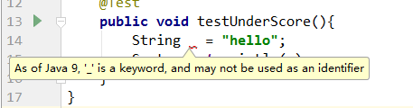


### 8.2 JDK11：更简化的编译运行程序

看下面的代码。

```java
// 编译
javac JavaStack.java

// 运行
java JavaStack
```

我们的认知里，要运行一个 Java 源代码必须先编译，再运行。而在 Java 11 版本中，通过一个 java 命令就直接搞定了，如下所示：

```
java JavaStack.java
```

注意点：

- 执行源文件中的第一个类，第一个类必须包含主方法。


### 8.3 GC方面新特性

GC是Java主要优势之一。 然而，当GC停顿太长，就会开始影响应用的响应时间。随着现代系统中内存不断增长，用户和程序员希望JVM能够以高效的方式充分利用这些内存， 并且无需长时间的GC暂停时间。

#### 8.3.1 G1 GC

JDK9以后默认的垃圾回收器是G1GC。

**JDK10 : 为G1提供并行的Full GC**

G1最大的亮点就是可以尽量的避免full gc。但毕竟是“尽量”，在有些情况下，G1就要进行full gc了，比如如果它无法足够快的回收内存的时候，它就会强制停止所有的应用线程然后清理。

在Java10之前，一个单线程版的标记-清除-压缩算法被用于full gc。为了尽量减少full gc带来的影响，在Java10中，就把之前的那个单线程版的标记-清除-压缩的full gc算法改成了支持多个线程同时full gc。这样也算是减少了full gc所带来的停顿，从而提高性能。

你可以通过`-XX:ParallelGCThreads`参数来指定用于并行GC的线程数。

**JDK12：可中断的 G1 Mixed GC**

**JDK12：增强G1，自动返回未用堆内存给操作系统**

#### 8.3.2 Shenandoah GC

**JDK12：Shenandoah GC：低停顿时间的GC**


Shenandoah 垃圾回收器是 Red Hat 在 2014 年宣布进行的一项垃圾收集器研究项目 Pauseless GC 的实现，旨在**针对 JVM 上的内存收回实现低停顿的需求**。

据 Red Hat 研发 Shenandoah 团队对外宣称，Shenandoah 垃圾回收器的暂停时间与堆大小无关，这意味着无论将堆设置为 200 MB 还是 200 GB，都将拥有一致的系统暂停时间，不过实际使用性能将取决于实际工作堆的大小和工作负载。

Shenandoah GC 主要目标是 99.9% 的暂停小于 10ms，暂停与堆大小无关等。

这是一个实验性功能，不包含在默认（Oracle）的OpenJDK版本中。

Shenandoah开发团队在实际应用中的测试数据：

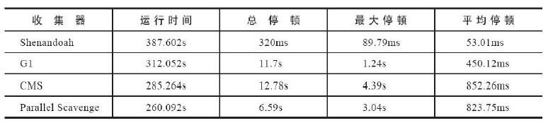

**JDK15：Shenandoah垃圾回收算法转正**

Shenandoah垃圾回收算法终于从实验特性转变为产品特性，这是一个从 JDK 12 引入的回收算法，该算法通过与正在运行的 Java 线程同时进行疏散工作来减少 GC 暂停时间。Shenandoah 的暂停时间与堆大小无关，无论堆栈是 200 MB 还是 200 GB，都具有相同的一致暂停时间。

Shenandoah在JDK12被作为experimental引入，在JDK15变为Production；之前需要通过`-XX:+UnlockExperimentalVMOptions` `-XX:+UseShenandoahGC`来启用，现在只需要`-XX:+UseShenandoahGC`即可启用

#### 8.3.3 革命性的 ZGC

**JDK11：引入革命性的 ZGC**

ZGC，这应该是JDK11最为瞩目的特性，没有之一。 

ZGC是一个并发、基于region、压缩型的垃圾收集器。

ZGC的设计目标是：支持TB级内存容量，暂停时间低（<10ms），对整个程序吞吐量的影响小于15%。 将来还可以扩展实现机制，以支持不少令人兴奋的功能，例如多层堆（即热对象置于DRAM和冷对象置于NVMe闪存），或压缩堆。

**JDK13：ZGC:将未使用的堆内存归还给操作系统**

**JDK14：ZGC on macOS和windows**

- JDK14之前，ZGC仅Linux才支持。现在mac或Windows上也能使用ZGC了，示例如下：

  ```
  -XX:+UnlockExperimentalVMOptions -XX:+UseZGC
  ```

- ZGC与Shenandoah目标高度相似，在尽可能对吞吐量影响不大的前提下，实现在任意堆内存大小下都可以把垃圾收集的停顿时间限制在`十毫秒以内`的低延迟。


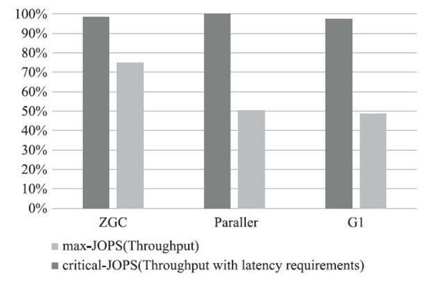

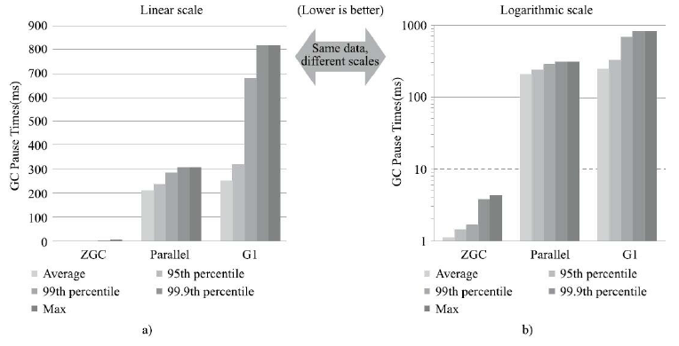

**JDK15：ZGC 功能转正**

ZGC是Java 11引入的新的垃圾收集器，经过了多个实验阶段，自此终于成为正式特性。

但是这并不是替换默认的GC，默认的GC仍然还是G1；之前需要通过`-XX:+UnlockExperimentalVMOptions`、` -XX:+UseZGC`来启用ZGC，现在只需要`-XX:+UseZGC`就可以。相信不久的将来它必将成为默认的垃圾回收器。

> ZGC的性能已经相当亮眼，用“令人震惊、革命性”来形容，不为过。未来将成为服务端、大内存、低延迟应用的首选垃圾收集器。

怎么形容Shenandoah和ZGC的关系呢？异同点大概如下：

- 相同点：性能几乎可认为是相同的
- 不同点：ZGC是Oracle JDK的，根正苗红。而Shenandoah只存在于OpenJDK中，因此使用时需注意你的JDK版本

**JDK16：ZGC 并发线程处理**

在线程的堆栈处理过程中，总有一个制约因素就是safepoints。在safepoints这个点，Java的线程是要暂停执行的，从而限制了GC的效率。

> 回顾：
>
> 我们都知道，在之前，需要 GC 的时候，为了进行垃圾回收，需要所有的线程都暂停下来，这个暂停的时间我们称为 **Stop The World**。
>
> 而为了实现 STW 这个操作， JVM 需要为每个线程选择一个点停止运行，这个点就叫做**安全点（Safepoints）**。

而ZGC的并发线程堆栈处理可以保证Java线程可以在GC safepoints的同时可以并发执行。它有助于提高所开发的Java软件应用程序的性能和效率。

## 9. 小结与展望

随着云计算和 AI 等技术浪潮，当前的计算模式和场景正在发生翻天覆地的变化，不仅对 Java 的发展速度提出了更高要求，也深刻影响着 Java 技术的发展方向。**传统的大型企业或互联网应用，正在被云端、容器化应用、模块化的微服务甚至是函数(FaaS， Function-as-a-Service)所替代。**

**Java 需要在新的计算场景下，改进开发效率。**比如，Java 代码虽然进行了一些类型推断等改进，更易用的集合 API 等，但仍然给开发者留下了过于刻板、形式主义的印象，这是一个长期的改进方向。

Java虽然标榜面向对象编程，却毫不顾忌的加入`面向接口编程思想`，又扯出`匿名对象`的概念，每增加一个新的东西，对Java的根本（面向对象思想）的一次冲击。

> 士，不可不弘毅，任重而道远。
